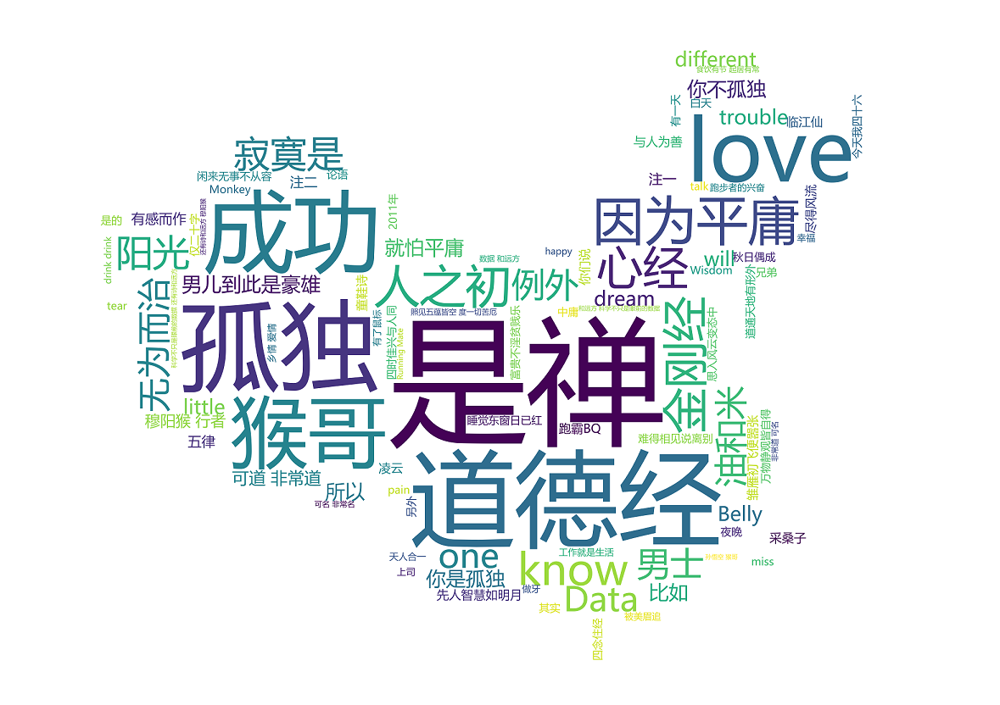

# 【词云图】

词云（Word Cloud）是数据科学中常用的一种算法和工具，它把文档的词汇进行分类汇总并做成直观易懂的信息图 (Infographic)。
文档中出现频率高的词汇在词云图里显示的字体就大，颜色也深。词云图能大致体现文档的主题。本图用派森（Python）软件将诗文作品输入处理而生成。
我特地把词云图做成中国地图的形状以表达对祖国河山之眷恋，对中华文化之热爱。

\newpage

