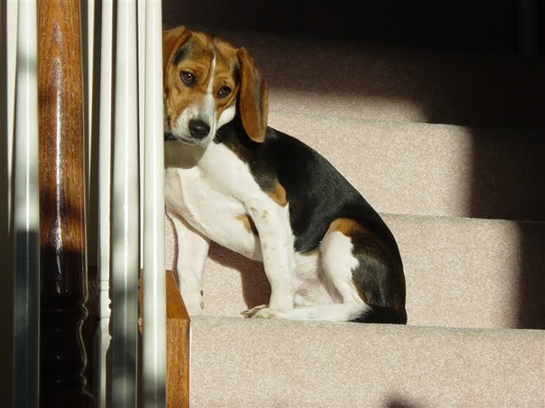
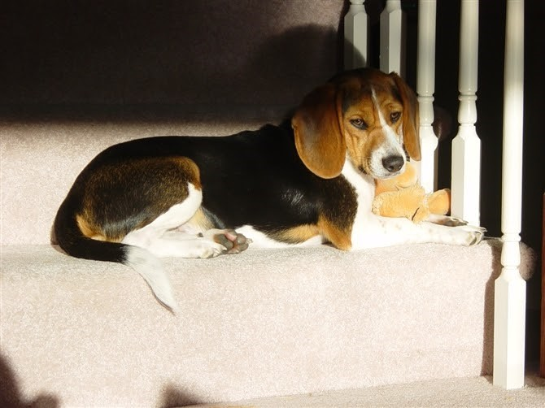
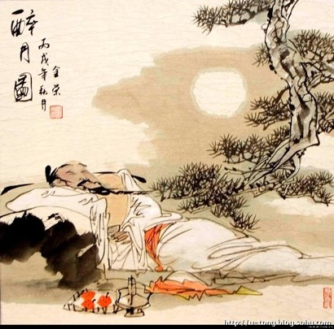
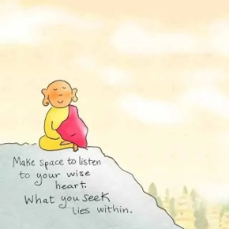
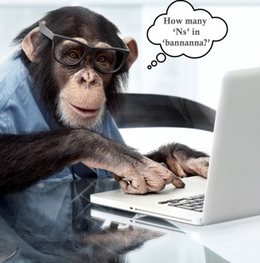
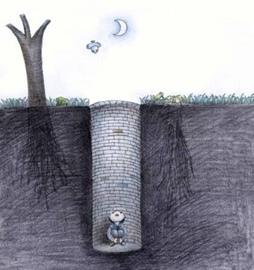
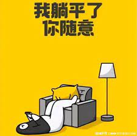
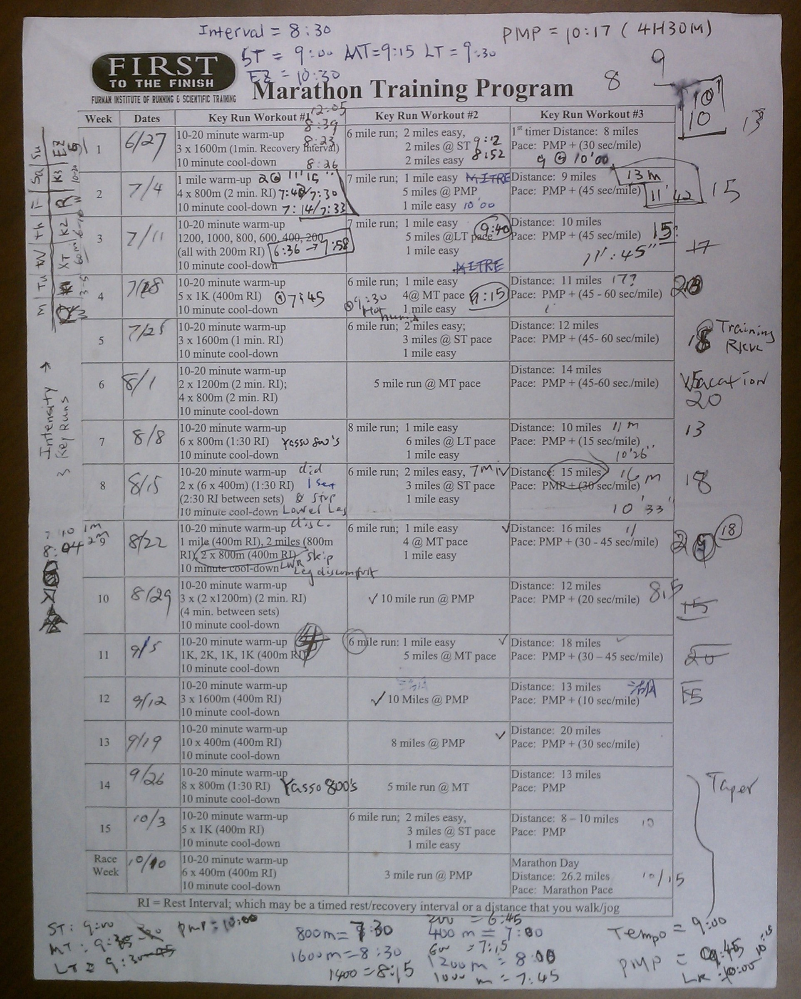

# 自娱

## 【孤独之美】

孤帆远影  
李太白长江别友

独立寒秋  
毛泽东湘江抒怀

滕王阁上  
落霞与孤鹜齐飞

汨罗江边  
众人皆醉我独醒

寂寞是瞬间的愁  
孤独是永恒的美

注：

- “孤帆远影碧空尽，唯见长江天际流”，出自李白的《送孟浩然之广陵》
- “落霞与孤鹜齐飞，秋水共长天一色”，出自王勃的《滕王阁序》
- “独立寒秋，湘江北去，橘子洲头”，出自毛泽东的《沁园春 ● 长沙》
- “举世皆浊我独清，众人皆醉我独醒”，出自屈原的《楚辞 ● 渔父》

\newpage

## 【寂寞】

寂寞是  
孤独找不到人同情

寂寞是  
快乐而没有人分享

寂寞是  
成功见不到人妒忌

寂寞是  
月色朦胧想念太阳

寂寞是  
阳光明媚思念月亮

寂寞是  
可遇不可求的禅机

偶尔得之  
只能窃喜无法张扬

 

\newpage

## 【孤独 （一）】

当你驱车  
在拥挤的高速公路上  
想着家乡的山青水秀人杰地灵  
你不孤独

而当你上班  
看着那些不学无术狗屁不通的洋人  
在会议上张牙舞爪胡说八道的时侯  
你是孤独

当你为了一张绿卡  
不得不夹着尾巴当孙子的时候  
你不孤独

而当你兜里揣着洋护照  
心里却想着叶落归根的时候  
你是孤独

当你用带有乡音的洋文  
同老板讨价还价谈工薪的时候  
你不孤独

而当你用夹着英语的普通话  
训斥你不听话的孩子的时候  
你是孤独

当众人皆醒  
唯你独醉的时候  
你不孤独

当众人皆醉  
唯你独醒的时候  
你是孤独

\newpage

## 【孤独 （二）】

孤独  
是一首写不完的情诗  
平常尘封在抽屉里  
偶尔伤感才打开

孤独  
是一部读不完的巨著  
平常搁置在枕头边  
偶尔梦醒才翻开

孤独  
是一枚精确的针灸针  
轻轻的一下  
扎到的准是旧时伤痕

孤独  
是一种不治的慢性病  
任平时百般调养  
总逃不了偶然的急性发作

\newpage

## 【酒】

它无事不登门  
它从来不客套

它桃李不言下自成蹊  
它点点滴滴润物细无声

它不纠缠  
它不罗嗦

你不需要它的时候  
它默默在角落等待

你需要它的时候  
它也不会过分热忱

它不问你怎么回事  
心事能说的清楚吗？

它不会劝你想开点  
想开了还需要它吗？

它只是静静陪伴你

时而一点一滴安抚你  
时而一杯一盅疏通你

此时无声胜有声

直到你感叹  
“但愿人常酒”  
那是它触及你心灵深处

直到你吟唱  
“酒酒那个艳阳天”  
那是它带给你阳光明媚

直到你高歌  
“酒有凌云志”  
那是它激发你豪情满怀

直到你找到了自己  
“酒违了，兄弟”

它才和你告辞  
“祝你们天长地酒”

哥俩齐声说  
“再会，在不酒的将来”

\newpage

## 【无聊】

我肚子不饿  
因为我刚刚吃饱  
我没有食欲  
因为我刚刚吃腻  
天上下着雨  
所以地上都是水

你说我无聊  
其实我在和自己玩笑  
都怪这是一个无所事事的星期天  
更何况天那么阴，雨又那么绵  
白天见不到太阳  
夜晚估计也没有月亮

昨天我跑了一万五  
大吃大喝现在肚子还鼓  
他们为了瘦身  
又节食又锻炼真是何苦

我身上没有肥肉  
碰一下全是硬骨  
我刚刚吃了广东早茶  
星巴克的咖啡我嫌苦

你开你的车  
我打我的呼噜

迷迷糊糊  
我想起小时家里养的猪  
饲料虽少  
日子却过得很自如  
还有邻居那只狗  
整天流浪在街头

活着其实很简单  
活着其实很实在

别以为我傻  
其实我心里有数  
别以为我呆  
其实我并不糊涂

都怪这阴雨绵绵的星期天  
我的脑袋在车座上一时靠不住

\newpage

## 【空间】

给自己  
找一个角落躲藏  
一个没有喧嚣的地方
 
象蚂蚁  
在地面奔走之后  
钻进洞穴，无人扰乱
 
给自己  
留一个片刻踹息  
一段属于自己的时光
 
象飞鸟  
在天际周旋之后  
驻足枝头，叶绿花香
 
每一天  
都找一个机会  
为自己搭建一个空间
 
在那里  
从容地小憩  
再把得失是非盘点

\newpage

## 【无】

把  
所有的有  
浓缩成  
一切的一  
再把这  
所有的一切  
和  
一切的所有  
融入酒杯  
一饮而尽  
一醉方休  
一无所有

\newpage

## 【写博为己】

写博其实为自己

闲着和自己聊天  
烦时给自己解闷  
乐则和自己幽默  
苦则给自己安慰  

自己有多美丽  
有多成熟  
有多智慧  
不写不知道  
一写吓一跳

更不用说天外有天  
那么多博主  
每一个都是独一无二  
不读不知道  
一读吓一跳

\newpage

## 【俺是博主】

不求良田万顷  
只需荒地半亩

开博就如开荒  
写博好比耕作

每个字  
都是一粒种子

每一篇  
都有几颗汗珠

乐在其中  
不知寒暑

上班  
老板做主

回家  
老婆做主

闲暇  
孩子做主

这里  
俺是博主！

\newpage

## 【我的世界】

我的世界没有门  
你不知不觉走了进来

等你醒悟已太晚  
围墙已经悄悄筑起来

\newpage

## 【平庸是一口温柔的陷阱】

不怕辛苦  
就怕平庸

不怕挫折  
就怕平庸

不怕冒险  
就怕平庸

不怕失败  
就怕平庸

平庸太有魅力

见到平庸  
我心动

见到平庸  
我腿软

平庸是一口温柔的陷阱

掉进去容易  
逃出来难

我喊救命  
没人听见

只有遥远的星星  
从那狭小的高空  
向我眨眼

还有那逍遥的行云  
朝我招手  
匆匆飘过
 

\newpage

## 【我是】

 我是一叶孤帆。   
 海阔无边，回首无岸。   
 漂荡，漂荡。  
 
 我是一朵浪花。   
 想亲沙滩，总难靠岸。   
 向往，向往。  
 
 我是一只海鸥。   
 觅食浅滩，志在天上。   
 徜徉，徜徉。  
 
 我是一片汪洋。   
 与云比深，与地比宽。   
 包含，包含。 

\newpage

## 【躺平】

夜半尿急梦醒  
发现自己躺平

原来躺平是生存必须  
因为日夜交替乃天道之行

阳光不会二十四小时普照  
明月也有圆缺阴晴

柴米油盐酱醋  
衣食住行站躺  
人之常情

心有日月常明  
趴着躺着都行

朋友回应，共同创作:

- 站如松，坐如钟，卧如弓，躺平五蕴皆空!
- 修齐治平 - 修身，齐家，治国，躺平天下。
- 尿急方知有尿，平躺应对不平。

\newpage

## 【懒人有福】

懒得看电视  
伤眼

懒得上网  
伤腰

懒得吃肉  
伤胃

懒得喝酒  
伤肝

懒得争吵  
伤情

懒得发财  
伤神

懒得忧愁  
伤脑

懒得寂寞  
伤心

懒人无病  
懒人有福

Learn How to Live  
懒猴土哩

Learn How to Love  
懒猴土啦

Learn How to Live a Simple Life  
学会过简单生活

Learn How to Love the Natural Self  
学会爱天然自我

\newpage

##  【我是猴子】

你快乐吗?  
快乐。

你苦恼吗?  
苦恼。

你满足吗?  
满足。

你遗憾吗?  
遗憾。

你得到了吗?  
得到了。

你失去了吗?  
失去了。

你成功了吗?  
成功了。

你失败了吗?  
失败了。

你聪明吗?  
聪明。

你愚蠢吗?  
愚蠢。

你TM是什么东西?  

我不是东西。  
我是猴子。

\newpage

## 【猴拉松宣言 】

不能飞天揽月  
无法入海捉鳖  
只好脚踏实地

斗不过天地  
斗不过别人  
那就斗自己

何须征服世界  
只要战胜自己

猴 猴 猴  
走 走 走

好 好 好  
跑 跑 跑

图：猴哥马拉松训练计划

\newpage

## 【朦胧诗】

朦胧是你的身影  
朦胧是我的梦境  
朦胧是你的容貌  
朦胧是我的追寻

朦胧是你的幽怨  
朦胧是我的诗篇  
朦胧是你的心绪  
朦胧是我的寡言

朦胧是树的宁静  
朦胧是花的清香  
朦胧是山的沉默  
朦胧是水的悠长

朦胧是无彩之画  
朦胧是无画之墙  
朦胧是无墙之屋  
朦胧是无屋之人

朦胧是无人之境  
朦胧是境中无人

注： 半夜多梦，凌晨早醒。睡眼朦胧，有感而发。

\newpage

