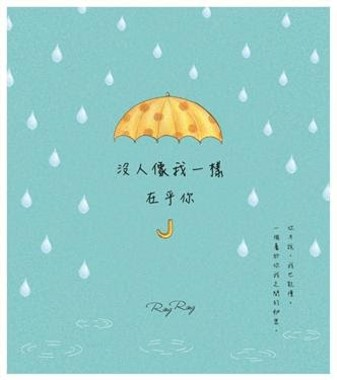
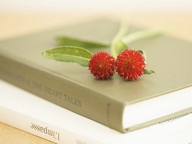

# 爱情

## 【母爱】

母爱是最天然的  
因为孩子来自母亲的身体  
是母亲的骨肉 

母爱是最无私的  
从怀胎到分娩  
从哺乳到抚养  
母亲可以为孩子牺牲自己

母爱是无条件的   
不管孩子乖还是不乖  
有出息还是没有出息 

母亲对孩子是最宽容的  
因为九月怀胎大肚能容 

母亲是最有耐心的  
为了孩子的生命  
她可以忍受分娩的痛苦

没有母亲就没有生命  
没有母爱就没有温馨 
 

有母亲的开朗  
才有孩子的乐观 

有母亲的宠爱  
才有孩子的阳光 

有母亲的辛劳  
才有孩子的踏实 

有母亲的唠叨  
才有孩子的口才 

有母亲的鞭策  
才有孩子的成绩 

有母亲的乐观  
才有孩子的幽默 

有母亲的厨  
才有孩子的健康 

没有母亲   
家庭怎能美满

没有母亲  
人类不可设想 

母亲节，祝所有母亲快乐！  

\newpage

## 【爱】

爱孩子不讲条件，   
爱老婆不讲理由。

爱父母天经地义，  
爱兄弟情同手足。

爱众生慈悲为怀，  
爱自己乐在其中。

宽以待人，  
松以律己。

\newpage

## 【爱是马里兰的春天】

爱是山泉，  
必有源头。
 
爱是溪涧，  
常有曲折。
 
爱是大海，  
时有风浪。
 
爱是木桥，  
偶尔摇晃。
 
爱是路桥，  
难免堵塞。
 
爱是马里兰的春天，  
时热时冷，时晴时雨。

似乎每一天里，  
都有夏暖冬寒。

\newpage

## 【在乎不在乎】

你抱怨我不在乎你在乎的  
我抱怨你不在乎我在乎的 

你说我只在乎你不在乎的  
我说你只在乎我不在乎的
 
其实你不必在乎我不在乎你在乎的  
我也不必在乎你不在乎我在乎的
 
其实你不必在乎我在乎你不在乎的  
我也不必在乎你在乎我不在乎的

在乎不在乎  
呜呼哀哉！

只要你在乎我  
只要我在乎你

注：

- 之所以写这个绕口令，就是想告诉大家在日常生活中，不论是对待恋人还是配偶，亲朋还是好友，领导还是同事，不要总在小事上纠缠不清。
- 要KISS（亲）。
  - KISS是“Keep It Simple and Sweet”（保持简单和甜蜜）的缩写。
  - KISS 也是“Keep It Simple and Stupid”（保持简单合糊涂）的缩写。

\newpage

## 【温Xin】

你是否有这样的体验  
在偶然的一个瞬间  
一丝温Xin闪现在心里
 
好比荷叶上的露珠  
轻轻坠落在平静的湖面  
展开娓娓涟漪  
无声无息
 
如果你不会拼写温Xin  
请不要难为情  
因为这事不全怪你
 
温Xin有太多笔画  
有的人懒得动笔  
有的人一时想不起
 
情急之下  
只好拿快乐冒充  
或者以幸福顶替
 
其实
 
快乐虽然很爽  
那只是感官刺激
 
幸福似乎很美  
却总觉抽象不切实际
 
走运的人  
天天陶醉  
快乐就在花天酒地里
 
不幸的人  
苦苦追求  
幸福到底在哪里?
 
平凡的人  
时时珍惜  
温Xin才是最实际
 
不要投资  
不伤身体
 
一点一滴  
甜在心里 
 
快乐太昂贵  
我怕付不起
 
幸福太深奥  
我没有Ph.D.
 
温馨最简易  
只要我和你

\newpage

## 【冬天的期盼】

我躺在地上，  
阳光透过窗户，  
温暖我的脸庞。

柔软的地毯，  
让我半睡半醒，  
时而打盹，时而打鼾。  

我偶然睁眼，  
看到一朵白云，  
悠悠漫步在天上。

我走了神，  
想起你的模样，  
和你临别时的惆怅。

当我再次睁眼，  
天空依旧蔚蓝，  
行云却变了形状。

我没有失望。  
因为我知道，  
你正匆匆行走，  
在回家的路上。

\newpage

## 【记梦】

梦里的笑脸天真让人陶醉  
梦里的话语无声却也清脆
 
梦里的葡萄不酸不甜不醉  
梦里的你我无怨无恨无悔
 
梦里没有世俗的尘埃累赘  
梦里只有往昔的最真最贵
 
梦醒  
感觉有点不对

\newpage

## 【嫦娥是我好友】

我到了月球，  
和嫦娥叙旧。
 
吴刚亲自下厨，  
蟾蜍边上侍酒。
 
人间虽有桂花树，  
此酿只应天上有。
 
我问怎么不见玉兔，  
娥答刚出去打酱油。
   
娥问怎么姗姗来迟，  
我说顺路拜访网友。
 
娥问网友是谁，家住哪里？  
我答天边祥云离你八千里。
 
娥笑吟“三十功名尘与土”，  
我对答“八千里路云和月”。
 
我与娥异口同声，  
“莫等闲，白了少年头，空悲切。”
 
娥问人间春节依然热闹非凡？  
我答这要看你在哪一个半球。
 
风水总是轮流转，  
东方今比西方牛。
 
我怨全球变暖，环境恶化，  
娥说高处不寒，月宫依旧。
 
人间还有战火硝烟，物欲横流，  
哪像天上男耕女织，别无奢求。
 
娥说人间网络高科神通广大，  
我说总不如你我面对面交流。
 
我问月球什么时候开通互联网？  
娥说吴刚怕网络迷住亲朋好友。
 
大家忙着微信，  
谁来喝桂花酒？ 
 
网络确实不能上瘾，  
腰酸臂疼脖子还扭。

娥问你们写信不用笔和纸？  
我答如今大家都爱用电邮。

娥叹息更喜欢看到我的字迹，  
我戏诡还有信封口我的吻痕。
 
娥与我同声唱起，  
“Sealed with a kiss”。(以吻封缄)
 
临别我依依不舍，  
启程娥一再挽留。
 
娥说88（拜拜）！  
我说99（久久）！
 
注：
- “三十功名尘与土，八千里路云和月。莫等闲，白了少年头，空悲切。” 出自南宋爱国诗人岳飞的《满江红》。
- 【Sealed With A Kiss 以吻封缄】是一首英文老，十分优美动听。
 

\newpage

## 【三八同乐】

三八佳节，大家同乐！  
没有妇女，哪来男人？  
没有男人，女人谁娶？  
没有女人，孩子谁管？  
没有孩子，父母谁养？  
没有父母，天伦怎享？  
没有天伦，人类完蛋！   

\newpage

## 【阿吉塔】

你的眼神忧郁  
似在诉说难言悲伤

你的声音轻柔  
或许发自温热心肠

你的微笑带一丝神秘  
还有几分甜美如蜜糖

你幽静如月牙一弯  
满天繁星因你失去灿烂

\newpage

## 【你和车】

你在驾驶宝座  
戴着墨镜  
搓着方向盘  
很酷

你在前排客座  
指手画脚  
唠唠叨叨  
很烦

你在后排角落  
安安静静  
老老实实  
很乖

\newpage

## 【缘】

缘是微雨中滴落在脸颊的那颗水珠  
缘是清晨醒来为你吟唱的那只小鸟   
缘是不经意从窗前路过的那朵白云  
缘是不邀而至漫步桌面的那只蚂蚁

缘是不期而遇的一双眼睛  
缘是擦肩而过的一丝遐想  
缘是心领神会的一个微笑   
缘是不谋而合的一种理会 

缘是无常中的因果  
缘是无为里的得失

缘是瞬间  
缘是永恒

\newpage

## 【女人爱打扮】

我喜欢爱打扮的女人
 
打扮不仅让女人美丽  
打扮本身就是一种美  
看女人打扮就是一种美的享受
 
再者
 
当女人精心打扮  
就没空纠缠她的男人  
男人得以有一段自由时间
 
女人打扮漂亮  
心情自然欢畅
 
女人好心情  
家庭就温馨
 
女人没心情  
男人孤零零

\newpage

## 【知道不知道】

我不知道你知道不知道   
你也不知道我知道不知道 

但是有一点你我都知道   
就是我不知道你也不知道

知了知了  
没完没了

不知不知  
不如情痴

\newpage

## 【男女有别】

坐在边上  
看你吃饭  
也是一种享受
 
抿着小嘴  
细嚼慢咽  
和你梳妆一样优美
 
女人打扮  
花枝招展  
惟恐别人看不见
 
女人吃饭  
不动声色  
就怕被邻居听见
 
看你吃饭  
好比欣赏  
卓别林无声电影
 
哦 
 
顺便提提   
我的吃相   
你不要总挑剔
 
女人穿衣想迷人  
男人吃喝为悦己
 
叮叮当当   
好莱坞动作片主角   
感谢你这个影迷

\newpage

