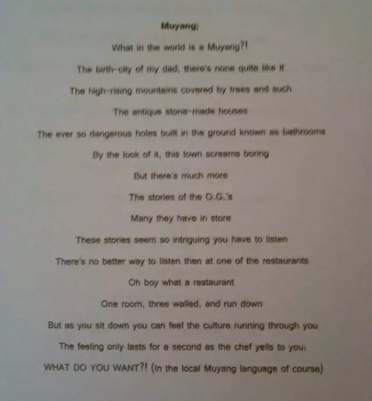

# 英汉

## 【Rain Therapy ● 雨疗】

Listen to the music of the rain,  
I forget all of my pain.    
It pours like tears,  
It brings me cheers.

听着雨声如歌如泣  
我忘记所有的忧郁  
点点滴滴好比眼泪  
它带给我无穷欢愉

注：开车上班路上遇雨，有感而发。

\newpage

## 【You and Me ● 油和米】

You and me  
油和米

You are liquid  
油是溶液

Solid is me  
米乃固体

You are tender  
油很温柔

Strong is me  
米则强力

You are sticky  
油很黏稠

Sweet is me  
米则甜蜜

You and me  
油和米

Family  
一家子

You and me  
油和米

Harmony  
很和气

You are for veggie  
油可炒菜

Stomach loves me  
米能充饥

You and me  
油和米
 

\newpage

## 【To My Friend ● 致友人】

你说  
你没字

我说  
我没志

你我  
都没治

此致!

【英文版】

To My Friend

You said  
You know little

I said  
I want little

We both  
Have little

So, I  
Write little!

\newpage

## 【Smile ● 笑容】

Your smile is a  
WMD 
 
But I have to  
plead
 
To set others  
free
 
Please direct it  
at me

你的笑容  
是  
大规模杀伤性武器

但是  
我求你  
不要把她用在  
人口密集之地

为了保护群众  
我宁愿  
牺牲自己

Note: WMD - Weapon of Mass Destruction 大规模杀伤性武器 

\newpage

## 【Ocean ● 海】

Try not to offer people an ocean.   
They won’t be able to bring it to boil.   
They are more likely to drown. 

Offer people a river,   
So， they can swim safely.  
If you are lucky, they may feel the ocean.

Offer people a lake,  
So， they can fish quietly.  
If you are lucky, they may see the ocean.

Offer people a drop of water.   
So, they won’t be thirsty.  
If you are lucky, they may taste the ocean. 

不要给人大海。  
它广袤无边，汹涌澎拜。  
他很可能被海浪淹没。

给人一条河，  
让他在河里尽情游泳。  
也许他从河水中能感受到大海的宽阔。

给人一个湖，  
让他在湖边悠闲垂钓。  
也许他从湖波里能感应到大海的波涛。

给人一滴水，  
为他解渴。  
也许他从水滴中能感觉到海水的咸涩。

注：好友无痕读我的英文诗, 产生共鸣。他以七言古诗的形式翻译, 不仅韵律美妙, 而且更有意境和深度。在此借花献佛, 与大家分享。

汪洋大海欲献汝，君非如来难装壶；   
未得其利反受害，滔滔海浪费沉浮。           
引君缓至穆溪水，两岸春色美如图；   
波光荡漾洗涤垢，心潮似海忘归途。             

伴尔徜徉西湖畔，杨柳依依倩影妩；   
悠然垂钓学太公，直跨大洋展宏图。                    
而今历尽沧桑故，滴水便知海味殊；   
芥纳须弥一即多，离尘入净烦恼无。 

\newpage

## 【Drunk Poem ● 醉诗】

When the trouble troubles you  
You trouble the trouble

When you drink the drink  
The drink drinks you

When the dark darkens you  
You light the light

When the sadness saddens you  
You tear up the tears

When the silence silences you  
You text the text

When the dream dreams you  
You dream the dream

When the sense senses you  
You feel the feel

When the love loves you  
You love the love

When you miss the miss  
The miss misses you

When the day is day dreaming  
The night becomes nightmare

The beer may be chill  
The heart stays warm

The moon may be nowhere tonight  
The sun will rise tomorrow

当烦事烦你  
你心烦意乱

当你借酒浇愁  
酒亦把你浇透

当黑夜笼罩  
你点亮灯火

当悲哀偷袭  
你以泪还击

当无言  
你写字

当美梦吸引  
你逃入梦乡

当深有感触  
你心随意走

当爱垂青  
你拥抱爱

偶有一种相思  
必是两处闲愁

白日做梦  
半夜惊醒

啤酒虽冰  
热在心头

今夜虽无月明  
明日必有阳光

\newpage

## 【Monkey Mantra ● 猴哥禅语】

See, not seek；  
Live, not believe。

Respect, not expect；  
Walk, not talk。

Be mindful, not mind full；  
Be a human, not a demon；

Love monkey, not money。   
（This one is optional。)

观察，不要寻觅；  
体验，不要盲从。

尊重，不要苛求；  
身传，不要说教。

持正念，不装杂念；  
做常人，不当妖魔。

惜猴子，不惜银子。  
（这个就随喜吧。）

\newpage

## 【Now and Here ● 当下】

The past is over，  
The future is nowhere，  
We all grow older。

Oh, my darling，  
Let's hold each other，  
Tight and forever。

For life is short，  
And love is rare，  
Every moment is ours to cheer。
 
Some may be rich，  
Some may have power，  
Happiness comes from neither。

Love is a true treasure。

Let's keep love，  
Near and dear。

Let's enjoy life，  
Now and here。

过去不可追回，  
未来实在飘渺，  
而你我一天一天变老。

哦，亲爱的，  
就让我们紧紧相拥，  
直到永远。

因为生命苦短，  
爱情难得，  
每一个瞬间都要珍惜。

有的人钱多，  
有的人官大，  
但幸福不靠这两者。

爱才是真正的财富。

让我们保护爱情,  
彼此心心相印。

让我们享受生活，  
就在此时此刻。

注：

**Nowhere or Now and Here**

From time to time we get stuck and our lives seem to go nowhere. 

The word “Nowhere” can be seen as the combination of either “No” and “Where” or “Now” and “Here”. 

There are two options. We can choose one or the other. When we choose Now and Here, we stop whining and start living again. 

This is what Zen calls “Live the life here and now” ( “活在当下“)。

\newpage

##  【Software Development Chaos】

Kiran asked    
"Are we ready      
to integrate the code?"

Anthony replied   
"No"

Ram replied     
"Oh, No"

"No, No"  
We heard Sridevi echo  

Priya replied  
"I can say yes  
If I can catch Venkat by the toe"

She needs help with JBPM    
But Venkat is no show

It took 45 minutes to publish   
RAD 8 is so slow

It should be RAPID   
What a joke

No stable build to validate   
Our testers didn’t sit idle

They wrote test cases   
on specs with too many holes

They feel a little lucky   
"At least we don’t have to code"

Despite the chaos   
We all still have hope

注： 这首诗记录我作软件开发项目经理的经历。SSA DCPS program。

\newpage

## 【RMU Poems]

(1)

The beer jar is empty,  
But my heart is still hungry.  
I can't wait until January,  
To go back to Wheatley,   
And hug my friend Lisa, Brett, and Betty.

I have the same love for Sani,   
But he is too busy,  
Playing with his AI toy.

I know Fred is very funny,   
But he is also a worker bee,  
His passion is study, not me.

Needless to mention Jin and Alvi,  
They smoke cigs like a hippie;  
They rarely think of me,   
Until their stomachs get empty.  

(2) 

RMU classroom is too squeezy,  
Not to mention that annoying Sani,   
Sitting between you and me.

Let's go to Clearwater Beach  
Enjoy the endless sea.

Oops, there comes topless Freddie,  
Spying on you and me.

(3) 

Author - Fred Hoffman

Since that hotel room encounter  
Strange things going on  
No one at conference was calling me Jay  
Instead they all called me John

Unaware of her ploy   
Used in high tourist season  
Jay strove to dismiss her   
Through facts and through reason

“It’s all a case of A-B-C-D-E,” said Jay  
Hoping his theoretical construct  
Would carry the day

What convinced her to exit  
Was not logic or vocabulary  
But rather Jay’s call  
To the local constabulary

(4)

My heart becomes tender,  
When I am not working on a paper。

I am no fan of science,  
But still want to be a doctor。

Just to keep my mind and soul in order。

(5) Thanksgiving 

Your friendship is dear,  
I want to celebrate with beer;  
But before we cheer,  
Let’s finish our paper。

The end may be near,  
But the future is even better。  

Until then,     
Let's fight together。

(6) Fred，The Overachiever 

I published two articles this year  
So they called me an overachiever 

But my appetite is never too big  
And my plate is never too full.

\newpage

##  【Silly Poem]

I don’t know how to make a cake,  
But I sure can crack a joke;

If you ever become broke,  
All I have for you is a coke;

Please don’t giggle,  
I am afraid you may choke.  

Note: 

On the way to work today, I made up this silly poem. 

\newpage

## 【Muyang 穆阳】

三年前偶然发现上初中的猴二崽英文课作业里有一首诗，题目就叫【Muyang】,偷偷拍照下来并翻成中文。
因为是用手机偷拍的, 战战兢兢, 手发抖,所以文字有点模糊。侵犯隐私权是非法行为，在此我向儿子抱歉, 
并以大学四年学费作为赔偿。

这是我的翻译。因为是直译，不够传神。朋友米国皇叔版是意译，效果更好，附在后面。

穆阳？  
这是世界的哪个角落啊?

这是我老爹的故乡  
一个独一无二的地方

高高的山上绿树成荫  
山脚下是砖和土砌成的老房

还有那在地上挖个洞的所谓的卫生间  
又臭又险又脏

乍一看，这个小镇并不好玩  
可是她有着许多故事  
这些故事是那么精彩  
你不得不听一听

听故事的最佳去处当数一家餐馆  
天哪，那算什么餐馆  
就一间屋，三面墙，再加一个门帘  

可是当你一屁股坐下  
乡土文化就如流水穿过你的身体

然而在你刚刚陶醉在这种氛围  
正想尽情享受的那刻  
厨师冲着你大吼  
“你要吃什么？！”  
（当然是用当地的穆阳话）

附： 米国皇叔版

穆阳，啥子个鬼地方？  
那是俺猴爹的故乡

高高的花果山  
绿树成荫，鸟语花香  
还有山脚下  
成片的灰瓦土墙

地上挖个坑就是茅房  
臭气熏天啊苦不堪言  
穷乡僻壤虽然不好玩  
可美丽故事恒古流传  
坐下听听也无妨 

一间小屋三面墙  
加个门帘是餐馆  
想听故事请入座  
乡土文化有气场  

刚刚陶醉此氛围  
享受片刻好时光  
猛然耳边一声响  
惊醒俺这美国狼  
“你吃米诺，尾羊便式汤？”

\newpage

## 【Kiss vs Kick】

if you don't kiss ass  
you must kick ass

如果你不会拍马屁   
你就必须身怀绝技

\newpage

