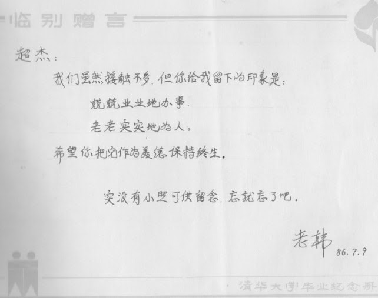

# 人生经历

## 【穆阳猴由来】

作者老家在福建省福安市穆阳镇。

乡亲多务农，晒的黑，长得瘦，城里人戏称穆阳猴。

城里人多上班族，养得白白胖胖，乡亲戏称他们城里猪。

猴居无定所，与树为友，上窜下跳，自由自在。

是故，作者自号穆阳猴，朋友谓之猴哥。

\newpage

## 【我的爱国肚】

其实我是想写我的爱国心，只是没有资格写。我当年留学深造，一是谋生，二是折腾，没有想过报效祖国；几年前给自己找了个借口 - 为了在美工作和生活有更好的保障，我入了美国籍。这离爱国心相差甚远！我至今心里依然不是滋味。国籍非小事，得失寸心知。

但不管怎样，我还是爱国的。不敢写爱国心，就写爱国肚吧。反正心和肚皆属五脏六腑，都是身体的一个重要器官。肚子爱国了，心自然就跟上了。爱国心实际上是看不见摸不着的，必需有实际行动。归纳起来，主要有两种。一是凭口头空谈，二是靠肚子实干。我平时吃喝实干，现在又撰文空谈，爱国之心不可不谓真切之至。

吃是我们中国文化的一个重要部分。俗话说“人生在世，吃喝两字”，“民以食为天”。爱吃的肚子才是爱中国文化，才是爱国的。对我来说，一日三餐，必不可少。在单位里，我看到不少老美午餐很简单，一包瘦瘦干干的土豆片，或一个凉凉嗖嗖的三明治，随便对付。我单位有一个六十多岁快要退休的老同事每天中午就一包爆米花加一瓶可乐。还有一个小伙子每天中午就吃牛奶泡麦片。我的午餐要么是家里自带既有米饭，又有肉菜，要么上街吃餐馆，从不含糊。不吃好喝好，怎能享受生活？怎能有效工作？

老美对吃实在太忽视了。他们甚至中午还安排会议。这是我最恼火的。吃饭是生活的不可或缺的一部分。吃饭是要细嚼慢咽，专心致志地享受的。哪能边吃午餐边开会？更不能为了开会误了午餐。所以大凡安排在中午的会议我都拒绝参加，除非有免费的午餐。有的会议本来安排开到中午十二点结束，可是有的人偏偏喋喋不休，让会议一拖再拖。我这时候就会提醒大家，肚子坐不住了。我的肚子就是我的生物钟。当开始感觉到饿的时候，一定是将近中午了。他们都知道我的口头禅“When I am hungry, I am cranky”。意思是“我肚子饿起来，脾气就上来”。

我的好胃口也是有名的。我曾经换工作去一家公司面试。面试要大半天，要和许多员工面谈。雇人单位买了比萨饼供大家做午餐。我一口气吃了四片，一点都不客气。后来我受雇该公司负责产品开发，我手下的人员从此吃福匪浅。我经常带他们下馆子。有时加班，我就从好餐馆买外卖拿回公司犒劳大家。有酒有菜，皆大欢喜。我定期与每个员工有一对一单独沟通，都是在好餐馆进行午餐交流。沟通就得说话，说话就得张嘴。好菜好饭好张嘴，好吃好喝好谈心。我每个月公司的信用卡上都会有几百甚至 上千美元的餐费。

我的爱国肚还体现在对米饭的依赖上。主餐没有米饭，肚子就不适，总觉得缺了什么似的。有时候和朋友聚餐，菜很丰盛，再加各种面食。但吃完后总觉不过瘾，还得补吃米饭。记得当年在北京上大学，米饭限量供应，一个月只有几斤，其余是面食和粗粮。我吃不惯，常和同学抱怨说好久没吃饭了。北方同学刚开始听不明白，说我早就该饿死了。后来他们才知道我们南方人所谓饭就是指米饭。好久没吃饭了就是好久没吃米饭了。若是没吃米，等于没吃饭。顺便提一下，我常痴迷，大概是吃米过多所致。

前些年我对西餐的快餐很不习惯。可是小孩子爱吃，不得不经常带他们去麦当劳，汉堡王等快餐店。每次吃完回家，我都要吃点中餐弥补一下，否则肚子总不舒服。这些年小孩长大了，吃快餐就少了。谢天谢地。

\newpage

## 【在美国走后门】

我从小家境贫寒，父母既没钱也没背景，只有靠自己勤奋苦读。再加上我性格高傲，一向愤世嫉俗，总认为走后门乃不正之风。当然这里未免有“吃不到葡萄就说葡萄酸”的成份。
大学毕业后，我分配到省城。工作中逐渐认识了一些同事，结交了一些朋友，积累了走后门的基础。那几年，刚好弟妹的上学就业遇到困难，这就有了走后门的需要。托熟人为我妹妹找份零时工，
托朋友为我弟弟找个学校补习，等等。这些都不算什么大事，既没送礼，也不犯规。其实走后门是很正常的社会活动。古今中外皆有。在这里我给大家讲讲我在海外走后门的经历。

我在美国走的第一个后门是给我夫人上学争取奖学金。我1990年底拿全额奖学金来美国，在俄侅俄州的多丽都大学读经济学硕士。多丽都（Toledo)市坐落在北美五大湖之一的伊利湖边上，
离美国汽车城底特律一个小时车程。多丽都曾经是美国工业重镇，世界最大的纤维玻璃（Fiberglass）制造商的总部就在这里。多丽都（Toledo)大学有人翻译成托莱多大学。
托莱多大学和《围城》里面的克莱登大学读音相近，我怕被人误认为是骗子学校，就采用了“多丽都”的译法。“多丽都”听起来也更美一些，有点像。我来美约半年后，我夫人随后跟来陪读。
开始她到中餐馆打工，后来还帮人家看孩子，照顾老人，还当过清洁工，吃了不少苦。打工不是长久之计，她就去考托福（TOFEL）和研究生入学考试（GRE）。GRE也被戏翻为“鸡鸭鱼”，
反映当年我们出国纯粹是为了谋生。她申请我就读的经济系被录取，但奖学金没有着落。如果自己付学费，每年要一万多美金，根本付不起。我就去找了我的研究生辅导老师，陈述情况。
后来系里给了她免学费。这算是小后门，没有送礼，没有违规。我夫人说主要靠她自己考试成绩好，英文口语好，本科专业对口（外贸），没我什么功劳。

说到我的研究生辅导老师，这里顺便讲一个趣事。我刚来美国第一次去见他，他问我叫什么名字。我说我的中文名字叫Chaojie。我知道中文名字老外叫不惯，就补充说你可以叫我George（乔治），
这和我的中文名字读音相似。老师立马反对，说这个名字太陈旧过时了，他的祖父就叫George（乔治）。我只好放弃，并灵机一动另取一个英文名字叫Jay，和我的Jie读音及拼写都相似。
导师这才认同。现在想想导师的话有道理。美国第一 任总统名字叫乔治华盛顿，美国首都华盛顿特区就是以他命名的。第四十一任和第四十三任总统是布什父子，名字都叫乔治。
更重要的是我幸好没有取导师老爷的名字，否则我夫人的奖学金恐怕就没戏了。

走后门最多的时候是我在美国国税局做项目的那几年。我当时是技术骨干，也正好赶上项目需要人。我先后介绍了两个朋友进来。后来我夫人读完计算机硕士后，也加入。
我离开这个项目时，又介绍了另一个中国员工的丈夫进来，并把我的位置安排给他。他们都是很能干，后来都成为项目的骨干力量。这些后门表面看是裙带关系，但都不是坏事，都很合理。

我帮别人忙，而自己吃亏的事也有。几年前，我曾在一个小公司负责产品开发。当时我招了一个中国人。我知道他水平不够，只是想帮助国人。
进来后我还得手把手教他。因为这事公司老板对我意见很大。

我在美国工作十几年，前前后后帮了很多人。我给很多人帮忙改过求职简历，当过他们的推荐人。

最近我帮助一个邻居的孩子在我就职的公司谋到一个暑期实习的机会。邻居是中国人，儿子还在读大学二年级。有了这个机会，将来毕业后进这个公司工作基本就不成问题了。
这个机会得之不易，多亏了一个同事帮忙。这件事情的成功给我很多启迪，也是促成我写这篇文章的起因。

这位邻居跟我提儿子申请暑期实习生的时候，公司候选人名单已经筛选完毕，面试时间地点都已排定。他儿子没有选上。现在职场竞争太激烈，简历投下去如石沉大海。
特别是像我就职的大公司，员工就有十几万人，每个职位收到的应征简历就不计其数。

好在我以前认识的一位经理。她曾经和我同在一个项目，后来调到别的项目。她是非裔，人很好。几年前她有两名实习生在别的组没事干，很无聊，就问我愿不愿意帮忙接收。
我就爽快地收下并安排工作和辅导。两位实习生在我组干的很充实开心。其中一位是非裔，另一位是白裔。前一阵子我又接收了一个从别的项目转来的刚大学毕业不久的非裔员工，
并热心辅导，严加管教。我后来才知道，这位员工刚好认识她。讲述这些背景，只是说明我和这位经理并无特别的交情，无非是在工作中做了该做的事。
然而这些事正是给她留下了深刻印象，为以后的后门铺开了一条路。

这件事的促成还有几个因数。这个小孩自己本身也很优秀，数学很好，中学时还参加过县级和州级竞赛。在大学也几乎是全A。
所以我运用王伯卖水理论（点击阅读），也把他包装吹嘘了一番。另外我这了朋友正好负责面试及推荐。
她知道我在单位经验丰富，管理有方，在推荐的时侯特地把我大名放上，说是由我强力推荐的。经过这样双重包装后，后门就变成正门了。
我们可以堂而皇之地说是为公司挖掘和推荐天才。

不过刚开始还不顺。第一个项目有绝密要求，小孩虽是美国公民，但父母依然是中国公民，不合格。后来幸好找到了一个非绝密项目。

整个过程有很多细节，这里不一一赘述。小孩母亲后来告诉我她儿子说王叔叔很神，每次王叔叔打来电话后，公司随后就有电话来联系事宜。我听了很得意。

顺便提一下这个大学二年级暑期实习职位不仅是将来进公司工作的保票，而且每小时还能挣21美元，相当于四万多美元的年薪。
这比王伯93年硕士毕业拿到的三万二千美元的年薪要高得多。长江后浪推前浪，一代更比一代强啊！

走后门其实不是什么坏事，很多时候并不是歪门邪道，也不必违法乱纪。走后门是要靠自己的信用，人品以及在这基础之上建立的人际关系和人脉资源。

人是群体动物，生活在社会里。事事都要靠别人。即使这件事不靠，那件事还得靠。时时都要靠别人。即使今天不靠，明天必得靠。即使自己不靠别人，为了自己的亲朋好友还得靠别人。
与人为善，助人为乐至关重要。每次我帮别人忙，我夫人就感慨，说你总帮助人，没见到谁帮助你了。我总是说天助我也。老子在《道德经》第七十九章里说的非常好，“天道无亲，常与善人”。
天道不分亲疏，十分公平。善良的人和行善的人总是得道多助。我自己这些年来虽然眼高手低，力不从心，无成就，不得志。但也没有太多挫折。各方面总算还顺利平安。好心已获好报，还有何求？

\newpage

## 【我学英文】

我记忆力差，单词学过就忘。缺乏语言天赋， 口语进展很慢。在中学学英语，到美国过语言关，我费了不少劲，有不少挫折。

学英语的第一步就是学A，B，C，D二十六个字母。我在初一刚开始学英文，首先就遇到记不住二十六个字母的困难。大部分同学都能记住，我则费老大劲。

语言用于交流就是口语。发音的准确和说话的流利都是和个人语言天赋有关。我在北京读大学五年，南方口音没有改变多少，北京话的卷舌音总是发不出来。
我在福州工作五年，福州话没有学到，就会几个简单的单字，诸如“一伯”，“一眉”。可见我语言天赋之差。我夫人是宁德人，中学在福安念，六年下来说着一口地道福安话。
她的英文发音也比我准确，经常纠正我的错误。

我曾经以为自己的健忘是因为小学时的偷懒。那时，小学生学语文都要背诵课文。当时的教室从纵向隔开四排座位，每一排设为一个小组，由一名组长负责。
我当时是班长。每个同学都要到组长那儿背书。我的组长刚好是我的好友，我就经常走后门敷衍了事。可谓“少壮不努力，老大徒伤悲”啊！

后来，我才知道我的健忘是娘胎带来的。我母亲很小的时候，她的姐姐抱着她玩耍，不小心把她摔倒地上。我母亲头部受伤而留下后遗症，经常会头晕头疼。
我们兄弟妹五人，没有一个记忆力好的。语言天赋不好，可能也要怪我妈。天赋吗，就是遗传，就是娘胎带来的。

我在中学英文成绩好，全是苦干出来的。中学时期是我们长身体的高峰期（Growth Spurt）。我每次放学回家，都是饥肠辘辘，可是家里饭还没做好。
我没有办法，就拿了英语课本到就近的小学操场去读。小时候听大人说饿着肚子读书容易记住和消化。效果确实不错！

我中学英文成绩好，还跟我喜欢阅读课外读物有关。记忆差，怕死记硬背，我只好通过增加阅读量以达到融会贯通的效果。
一个单词在不同的文章里见过多次，就容易记住。第一次见到生词记不住，有一种“无可奈何花落去”的惆怅，再一次见到就会有“似曾相识燕归来”的亲切了。
有时还不免特地边读边找刚学会的生词，并从中体会“众里寻他千百度，暮然回首，那人（词）却在灯火阑珊处”的兴奋。
记得我当时还买了一本英文版童话《木偶奇遇记》，百读不厌。后来在美国给我儿子买了《木偶奇遇记》动画片，经常 和他们一起看，特别亲切。

90年底我来美国自费留学，开始了我的长达多年的英文挫折。中学时的好成绩只是反映读写能力。在美国读书生活工作，最重要的是口语。

我遇到的第一关，就是上课听不懂教授说什么，非常痛苦。我为此还特地买了一个袖珍录音器（pocket recorder），把教授的授课录音下来，回家慢慢消化。
不过效果不理想。有的教授不让录音，也许是想保护个人隐私。好在有一个俄罗斯来的女同学，叫凯莉（Kelly），人特别好，课后总是把笔记本借给我复印。
我就靠她的笔记和书本温习。虽然费劲，我还是把课程应付下来，而且成绩很好。咱们中国人就是聪明啊，特别是善于考试。
老美就怕考试，而我们从小就一门一门，一级一级考上来的。一段时间后，上课听力就逐渐好转。

一年多后我拿了经济学硕士就转到数学系读统计学硕士，想以此为跳板到一流学校读经济学博士，因为他们要求很高的数学统计基础。
数学系给我的是教学助理（Teaching Assistant，简称TA）奖学金，除了免交学费，还给一年八千多美元的工资。条件是我得给读工商管理的本科生上数学课。
这也是有一点挑战性的。好在授课内容非常简单，不需要怎么备课。学生基础很差，比如有一个学生就问我五分之三的分数，怎么写？是五在下面还是三在下面？
语言上也简单，数学吗，就是罗马数字和二十六字母，以及加减乘除等，没有太多的学术术语。数学不像经济学，要和现实社会生活联系，用到好多日常口语。
我讲课偶尔也会出点笑话。美国人爱用“so on and so forth ”， 意思是“如此等等”。我有一次东施效颦，结果说成“so forth and so on”（“等等如此”），
下面学生乐的吃吃笑。我确实是“东师”， 从东方来的老师。

我的第二个难关是日常口语。这是我最为头疼的。来美之前口语基本没有训练，一片空白。虽然去了几次英语角，没有什么效果。
到美国后，为了省钱，和中国同学一起合租房子住，一天到晚说的都是中文。即使出去，也没有多少交流的机会。
在超市买东西，都是自助，跟人打交道的机会很少。我曾经想搬出去和老美住，后来没有搬成。看电视听广播到是一个练听力学生词的好途径。
我的室友英文比我好，是北京对外贸易大学毕业的，来美以前还是搞外贸的。同时他学英文也比我认真，每次看电视听广播，听到一个生词，他就想法把它拼写下来，并查字典核实。
我也学他，就是坚持不下来。他有一个五六的女儿特别聪明可爱。他夫人在国内时是护士，很贤惠，做一手好菜，我经常碜他们家的饭吃。
我常边碜饭，边揶揄说 “这道菜可吃性很大啊。”。有一次，他家闺女看到我家桌上的一道菜，也开玩笑说“叔叔这道菜可吃性很小啊！”。
中国同胞住在一起，虽然对提高英语口语不利，但是很有生活情趣。这也是我后来下不了决心搬出去的原因之一。

口语的进展尽管很慢，但在不知不觉几年后感觉就好多了。特别是工作后，在单位里，有了交流的机会。1995年我换工作离开人烟稀少的中西部到了繁华的东部。
在新的单位里结交了两个美国朋友。两个都是年轻小伙子，单身汉。一个叫理查德，一个叫麦克。跟他们的交往使我英文口语提高的更快。
其实我是个能说会道，爱侃大山的人。以前没有机会，现在终于有了两个忠实听众。其中一个对我还特别崇拜，每次都是洗耳恭听。
后来聊天中这个小伙说到他还不知道自己是异性恋还是同性恋。他说他有一个男朋友。另外一个朋友则会聊他交女朋友的事。
他的口头禅是“BTN”，英文“Better Than Nothing” 的缩写。意思是“有总比没有好。”，这里说的是找不到理想的女朋友就随便要一个再说。
他还喜欢一首歌中的一句“All By Myself”。意思是“我独自一人'。

语言的熟练需要时间，开始很困难，但要有耐心和信心。日常生活工作中多听多讲，慢慢就会好起来。我自己现在基本可以应付。
虽然乡音未改，发音不准。有时会有语法错误，有时也结结巴巴。但是，我是没有什么障碍的。心理障碍也没有。
跟老美打交道，我一点都不为语言而自卑。英语不是我们的母语，能有这么高的水平，应该值得骄傲才是。
老美有本事也来两句汉语让俺瞧瞧？我有时在单位还会训人，能用英语训话，不简单啊！前两天患流感，再加上开会多说话，教训人，声音哑了。
第二天开会，他们听我声音沙哑低落，判若两人，都吃吃偷笑，并开玩笑说'we like this Jay better!' (我们更喜欢现在这个Jay!)。 
我则故作正经地回应道“You guys wait a few days!” （你们等着瞧！）

\newpage

## 【父亲这个角色】

母亲节隆重, 父亲节冷落。从微信的帖子数量就可见一斑。

这是很自然的。因为母亲的地位和母爱一样是至高无上的。

做母亲确实辛苦, 好在母亲的所作所为都是出于天然的母爱, 所以苦中有乐。而且母亲的职责不需培训, 女人天生就有母性和为人母的技能。加上女人从做小女孩开始就抱布娃娃, 训练有素。

做父亲就不同。男人没有九月怀胎, 痛苦分娩的经历, 对孩子的感情就没有那么天然无私。所以父亲对孩子的耐心就不足。加上父亲这个职责不是男人天生的禀赋，上岗前又缺乏培训。
所以父亲通常是和孩子一起长大的。边学边干, 难免犯错。

更不巧的是, 初为人父的时期通常是男人事业发展和人格不够成熟的初期。也是婚姻生活的夫妻磨合期。即要攘外又要安内, 既要教子又要修身, 真是充满挑战。

在一个家里, 父亲不是英雄。即使是, 也只是无名英雄。因为在孩子心目中母亲的位置更为重要。而且当母亲在家里 “好雨知时节，润物细无声” 的时候, 父亲一般都在外面 “锄荷日当午, 汗滴荷下土” 。
孩子们一般都看不到父亲辛苦劳作的时候。

父亲节, 没有太多的赞美词, 一方面因为自己是人父, 怕有王伯卖瓜自卖自夸之嫌, 另一方面也是想告诉大家做父亲的难度, 即为自己的不足之处找借口又给后生一点经验教训。

父亲节何必唱赞歌, 要是能和父亲举杯共饮, 借酒牢骚就是很好的庆祝。可惜, 家父滴酒不沾, 而且远在老家, 难得谋面。好在心相通, 愁相同。默默无言, 衷心祝福。

\newpage

## 【读《阳光》说超芳】

读弟弟超芳新作[【阳光生活禅意心态】](https://baike.baidu.com/item/%E9%98%B3%E5%85%89%E7%94%9F%E6%B4%BB%E7%A6%85%E6%84%8F%E5%BF%83%E6%80%81/2527945)，
自然而然想起我们兄弟的往事。

我家兄弟妹五个，我排行老二，上有一个哥哥比我大三岁，下面就是大弟超芳比我小两岁，后面还有一个小弟和一个妹妹是双胞胎比我小五岁。兄弟妹人多，从小打打闹闹，加上家贫，相濡以沫，所以情同手足。

超芳小时候，身上骨头软皮肉嫩，家人给他取了一个雅号叫“嫩畲巴”。这是我们当地方言，我们家乡是畲族乡，畲族人民爱做一种米糕，我们都叫“畲巴”。
放到油锅里煎，又香又嫩。超芳没事就这里蹲蹲，那里赖赖，不是个很好动的小孩。现在想想，估计当时那么小就开始修炼禅了。

上中学时超芳有一阵子迷上气功，经常在家里自己练。我们家有一个走道，连接几个房间，太阳照不进来，黑洞洞的。这里很凉快，是夏天避暑胜地，再加上这里又黑又静，
超芳经常躲在走道角落练气功，好几次都把我奶奶和我妈妈吓着。

上了医科大学，超芳依然着迷气功。有一次跟我说某某气功师做讲座，下面听众不少有感应的，又哭又闹，作出各种怪形怪状。他说想去听，
并特别提醒说亲属一起去更容易感应，效果更佳，要我和他一起去。我忘了后来有没有和他一起去。一张票好几十元，我月薪才百来块，还要支持他读书，
估计没有跟他去。我印象中他是去了。还告诉我气功师给人分发带气的苹果，吃了治病延年。我本想尝尝，结果他也没有拿出来和我分享。
我倒是好奇地问他到底有没有感应，他说没有，并解释并不是每个人都有感应。看来他是属于悟性差的。

毕业工作以后，超芳开始练太极拳，并钻研太极理论。他对禅的学习研究估计要从这时才正式开始。

禅(chan)和常(chang)读音相近，并非巧合。禅本来就是讲平常人抱平常心过平常生活。超芳也不例外。这里我回忆几件他成长中的小事，可以从中看出他的平常。

我在北方读大学时，超芳还在家乡读中学。有一回，他给我写信，抱怨说我妈太节俭，牙膏用到再也挤不出东西了，还不给买新的，还要让他接着挤接着用。
我记不住在回信中说了什么，但还记得在信中塞了两元钱给他。我读大学是由我哥哥负责生活费。所以我其实也是把钱从一个腰包放到另一个腰包。

我大学毕业分配在省城工作，超芳接着也到省城医科大学就读。我们兄弟来往就多起来。我除了提供经济资助，还提供生活咨询。
有一阵子，超芳为自己腿上毛多很苦恼，找我几次说要把毛去掉。每次我都劝说，不赞成他的想法，并提醒他说你自己还是读医的，认识应该比别人更清楚。
反复几次，最后好像不了了之。估计他后来是想通了。

还有一阵子，超芳对自己的名字不满意，说“芳”字是女孩子的名字，要把上面的草字头拿掉。这事后来估计也是不了了之。
我相信他在成长过程，和每一个青少年一样有过迷茫，有过苦恼。最后他还是醒悟过来了。

超芳的【阳光】，不仅是来自他的博览群书，集百家之长，还与他在日常生活中勤于观察，善于思考有密切关系。同时，超芳也在生活中言行一致，
实践禅道。这里仅举一 例。 【阳光】中讲到教育孩子要用爱。超芳知道我对孩子太严格，总跟我说孩子要疼爱。宁可宠爱，不可过严。
超芳对女儿，充满父爱。女儿在父亲的厚爱下，活泼可爱，不仅学习成绩优异，而且还很懂事，当班干部，积极参与学校的课外活动。
女儿对他也是很有感情。我母亲曾经跟我讲这个故事，说有一年春节，超芳一家回老家过年。女儿不喜欢爸爸出去打麻将，总是跟在父亲后面，顶的紧紧的哪怕他溜掉。
有一次，超芳上卫生间，女儿没注意到，不知哪位故意大叫一声说“芳仔，这末葬这么深的臭沟，你怎么跳下去了！”，女儿咋听，悲痛情急中大声哭叫起来，
边上人们大乐。可见女儿对父亲感情有多深。（我老家厨房墙边有一条沟与邻居的房子隔开，由于常年不疏通，又脏又臭。)

\newpage

## 【从故乡的水到老庄的水】

水无处不在，江河湖海，清泉溪涧，水占了地球的将近三分之一。水是生命之本，飞禽走兽，花草树木，还有我们人类，一时一刻都离不开水。

我对水的认识始于井水。那时家乡还没有自来水，人们日常生活，诸如洗菜煮饭，刷牙洗脸都从水井里打水。我家住的是很传统的四合院，有前厅后厅，前后左右共住四户人家。
后厅就有一口井。这口井的水不够干净，一下雨，井水就变浑浊。因此一般只是用来洗刷，不做炊饮用。饮用水要到附近的另一口井去挑。这口井在闲阁岭脚下，是我们闲头阁的风水井。
井很深，井水清澈甘甜。住在闲头阁的家家户户就从那口井里用小桶把水打到大桶里挑回家。我们穆阳人有个风俗，就是每年大年三十夜零点都要挑龙头水，图吉利。我们起初都到这口井挑龙头水。
后来，可能是人口增长，用水量大增，到除夕夜井水就见底了。我们只好走远路到街头的清水沟里挑了。今年除夕晚打电话回家，问我弟有没有去挑龙头水。他说都什么年月了，现在大家都用自来水，
挑龙头水的习俗早已不时兴了。

我对水的喜欢始于溪水。古今中外，人类总是在山脚下，水流处聚居，并逐渐形成市镇。一则水乃生活必需，二则水是交通工具。穆阳亦不例外。
家乡穆阳古镇四面环山，穆阳溪从中间流过，形成依山傍水的美丽景象。穆阳溪有不少可以游泳戏水的地方。最好的是铜印坪。
那里有大坝围着，水面平静，十分安全。同时水边有古老的大榕树既可遮荫又是一个天然跳水台。水边也常有妇女在汲水洗衣。
小学时家长一般都是不让小孩去游泳的。我们邻居几个小孩就偷偷去铜印坪。为了不让家里知道， 我们开始都是光着屁股戏水学游泳的。
后来大了一点，开始怕羞了，就知道带两条短裤。一条穿着游泳，另一条游完换上。然后把湿的那条晒干了再带回家。我特别喜欢在水中自由自在的感觉。
这和我自己从小孤傲不拘，向往自由的性格很有关系。从小家贫，总觉压抑，游泳是一个解脱。到了大学就在学校的游泳池里游，总没有在溪里那么爽。
只有等到暑假回家才从新投入家乡的溪水。我经常做梦游泳，就是因为生活不顺，总想挣脱的缘故。

我对水的钟爱要归功于老子的《道德经》。《道德经》对水有多处富有哲理的描述。最喜欢的是第八章“上善若水。
水善利万物而不争，处众人之所恶，故几于道。居善地，心善渊，与善仁，言善信，政善治，事善能，动善时。夫唯不争，故无尤”。
水乃至善，是我们为人处事的好榜样。第六十六章讲到“江海之所以能为百谷王者，以其善下之，故能为百谷王”。
可谓“海纳百川，有容乃大”，做人要有江海之胸怀多不容易！第七十八章讲到“天下莫柔弱于水，而攻坚强者莫之能胜，以其无以易之。
弱之胜强，柔之胜刚，天下莫不知，莫能行”。这和第四十三章讲的“天下之至柔，驰骋天下之至坚。”是一个道理。
这正是“滴水穿石”力量的源泉。无情未必真豪杰，柔情似水，更显英雄本色。

\newpage

## 【有一天】

 （一） 梦想

有一天，我会创业。

我闲不住。手脚闲住了，脑袋闲不住。脑袋闲住了，心闲不住。树欲静而风不止。

爱管事的习惯在童年就已开始。那时在家里管两个弟弟就像父母管孩子，有如《北国之春》里唱的“家兄好似老父亲”。

当年上大学选择经济管理专业，本来就想毕业后当厂长经理。

可惜，折腾几十年，没有正经闯过业，管过事。总搞技术，总打工。常怪自己太顾家，怕冒险。投资创业如有不利，家里老小遭殃。

四十多岁业余读工商管理硕士，还想补充点知识。边读还边叹息“读书苦读书难，读书有啥用长?”

总是说自己能到今天，已经足够了，该知足了。可是梦想依旧，雄心未眠。

创业犹如母鸡下蛋孵小鸡，是一件很有成就感又很自豪的事。难怪母鸡下完蛋都要咯咯地叫几声，哪怕公鸡听不见。猴为此十分羡慕，梦想哪一天自己能下个猴蛋，孵出一只小猴。实在不成，找只母鸡借个蛋也成。孵不出小猴，孵只雏鸡也可将就。

（二）理想

我若创业，不应该为挣钱，至少挣钱不是唯一的也不是主要的目的。只是做想做而没能做的事。

企业当然要盈利，亏本企业不能生存，即使侥幸生存也不能长久持续。

但是，业主不能唯利是图，不顾客户，员工，社区及社会的利益。

企业不能只顾眼前小利，不顾长久发展。

企业也不能只顾高速度增长，不顾企业发展根基的建设和加固。企业增长了，客户服务，员工福利，内部管理，外部关系都得配套跟上。稳步的有控制的增长才能持续。

国内有些企业压榨劳工实在不人道。有些企业制造伪劣产品伤害消费者也是天理难容。

企业应该是它所在社区的经济和精神支柱，提供就业机会，服务社区居民， 参与社区活动。

（三）随想

隔行如隔山，猴从来没有下过蛋，孵蛋就更不用说了。

有时想应该有自知之明，可是有时候看鸡下蛋孵蛋的爽劲儿，猴屁股就痒痒。

做白日梦总比不做梦好。 梦想归梦想，理想归理想。谁知道将来会是怎样。

随心，随意，随缘，随运，随便吧。

\newpage

## 【梦】

日有所思，夜有所梦。

幼时家贫，总梦捡钱。梦见的都是几分的硬币，没有梦见大钞票。那是不仅因为人穷不贪，还跟当年的低物价有关。一分钱可以买一颗糖，两分钱钱可以买一碗豆腐脑。两毛五可以买一碗扁肉，上中小学注册学杂费就几毛到一两块。

离家上学，常梦家乡。梦中最常出现的竟是家里的茅厕。茅厕是一个大木桶，上面架四块木板，左右各两块，中间空出来方便。梦境中的茅厕总是摇摇晃晃，蹲在上面战战兢兢，哪怕木板不牢，不慎调入桶里。

大学毕业，老梦食堂。梦中大学食堂买饭菜，总是有几条排很长的队。饥肠辘辘，不知什么时候能等到。有时运气不好，则找不到自己的餐具。大凡是哪个同学来客人，从架子上顺手拿去先用了。上食堂的梦基本不圆满，大都是饿着肚子醒来的。

参加工作，爱梦游泳。也许是天性好自由，喜欢玩水的缘故。工作不顺，前途暗淡，常叹英雄无用武之地。只好到梦里挥臂畅游，仰望无边无际的天空，享受无拘无束的自由。

如今人到中年，白天没有太多的想法，夜晚也就没有特别的梦境。得过且过，得梦且梦。

\newpage

## 【猢说八道】

猢者，猴也， 穆阳猴之简称。八道者，八方之道也。古今中外，三教九流，看问题之角度虽各有不同，然皆有其独特可取之处，不可不听，不可不学。取长补短，兼收并蓄，才会离真实则更近，离真理则不远矣。印度有盲人摸象，中国有“三个臭皮匠，顶个诸葛亮”。故集八方之道，成一家之言，猢不妙哉。

（一）前所未有的挑战 

下一个五十年，人类将面临前所未有，关系存亡的挑战。这个挑战来自科学技术的加速发展， 特别是人工智能和基因工程上的突破。搞不好，五十年以后，人类已经不再是我们所熟悉的样子。 
人类很可能变成半机半人的怪物，即失去天生的人性，又比不上机器人的聪明。有一天，人类将不幸成为机器人的奴隶。
如果我们现在不采取行动，制止资本不顾人性和文化利用科技创新谋求暴利，这一天不会离我们太远。

（二）人的机器化与机器的人化

人的机器化并非最近才出现。自从工业化以来，人的机器化过程已经有了三百多年的历史。1712年，蒸汽机的发明，人类从此正式进入工业化社会。（待续）

（三） 穆阳猴pk阿法狗

猴哥最近被阿法狗搅得心烦意乱。这几年人工智能发展迅速。今后二十年到五十年的发展和应用将会更快更广。电脑将很快超过人脑的智力并被应用于人类生活和生产的各个领域用以取代人脑。
这里有喜有忧。群众普遍认为势如破竹，势不可挡。

人类区分与其他物种的关键是人类除了有情感,还有智慧。智慧使人能够明辨是否对错, 真假美丑。智慧让人类有价值观, 信仰和文化。智慧使人能够做正确的选择和决策。

自从工业革命以来,科技迅速发展, 给普通人带来便利, 给有钱人带来豪华。然而也破坏了自然环境, 腐蚀了人类文化。

现在应该是人类做选择和决定的关键时刻。人工智能的无限制发展会带来不可避免的灾难。

\newpage

## 【猴哥语录集锦】

1。天下鸽子一般白。

2。松以律己，宽以待人。

3。被人欣赏是乐，欣赏别人是乐，孤芳自赏也是乐。

4。海弃百川，不容乃大；壁立千韧，有欲则刚 。

5。乡愁永酒，孤独万睡。

6。情能补拙是良训，一分心劳一分才。

7。你和我比才（财），我才不和你比。 （学习小沈阳的“你和我比懒，我懒得和你比”）

8。我不帅，只好当将。

9。我富有，因为我才多。

10。我快乐，因为我财少。

11。文理可以兼修，才貌难得双全。

12。言多必失，不说更亏。

13。逆水行舟，不进则退；中年健身，不退则进。

14。避免批评他人，常要嘲讽自己。

15。知足者常乐，知不足者常新。不知足者只有自寻烦恼。

16。漂零久，伤了额，要溜无法。（取自我的QQ 号109-302-1058）

17。我比好人还好，我比坏人更坏。

18。电脑越造越高级，人脑越变越简单。

19。管外先管里，管人先管己。

20。做事不能没有热情，成事不能光靠热情。

21。人生得一知己足矣，当官有两干将够了。

22。吾乃性情中人，干不成大事，因为我不想。

23。老不练，故不老练。不练就老，练才不老。

24。无官一身轻，官小少操心。

25。所谓容忍，能容就容，容不下就忍着。

26。孔子七十而随心所欲，我从小就随心所欲。只是孔子不逾矩，我总逾矩。

27。人最富有的是时间，最缺乏的是耐心。最容易的是恨，最困难的是爱。

28。自从有了互联网和无线通信，人们信息过多，知识贫乏；联络方便，沟通困难。

29。 “与天斗，与地斗，与人斗，其乐无穷”。与己斗，两败俱伤。

30。猴咬文，猴拉松，猴下蛋。人不堪其忧，猴也不改其乐。闲哉，猴爷。

31。身外之物皆春药。

\newpage

## 【王伯卖水】

如今王婆卖瓜理论已经过时, 因为人们不再有耐心种瓜了。种瓜需要劳动， 利润小, 周期长。卖水乃无本暴利, 来钱也快。

为了适应新形势, 与时俱进，猴哥发明王伯卖水理论。“王伯卖水”理论简单朴实，一言以庇之：“摇一摇，就三条”。 
-	半桶水，摇一摇，就变成一桶水！
- 没有水，摇一摇，就看不出桶里到底有没有水，有多少水，众人误以为有很多水！ 
- 一桶水，你不摇一摇，谁知道你有没有水？有多少水？众人误以为一滴水都没有！ 

大家都很熟悉古诗中富有哲理的一句“草色遥看近却无”。讲初春的山野，远远看去，绿草茵茵，可是走近了就没有那么美丽了。
引申到这里，就是“空桶摇看静却无”。空桶摇摇晃晃的看上去就像有水，静止下来就知道里面是空的。 

小时候有几年我妈在家里养猪。到巷里巷外挨家挨户打“洗碗洗锅水”都是我的事。因为穷，买不起饲料，猪也跟着受苦。
每次端上的猪食都是汤水，没有实货。猪就没有胃口，常绝食抗议。 

后来我想了一个办法（王伯从小就很有智慧，邻里都夸我又懂事又聪明），喂猪的时候故意把喂食的桶摇一摇晃一晃，让汤水滚动如波浪，猪被迷惑以为里面有好料，就大口大口地吃起来。

有一年，我妈养了两头猪，这种“摇滚”法更加管用，因为两头猪一看到波浪翻滚就立马你争我抢，有如现代消费者受骗于商家折扣抢购商品一样。

王伯卖水理论就是来自王伯多年的亲身实践，不是凭空捏造的。当然这个理论也是建立在前辈王婆卖瓜理论的基础上， 承前继后，有所发展的。 
王伯高于王婆的地方在于“摇”。王婆自卖自夸，口干舌噪。王伯不费力气，“摇一摇”， 效果就来。

王伯的摇术其实并不是靠自己绞尽脑汁发明的。这年月大家都在用别人的钱生钱，王伯还会傻傻的浪费自己的脑细胞吗？摇术是中西兼并而得。

三国时代诸葛亮呼风唤雨，神机妙算靠的是什么？靠的并不是他聪明脑袋。你想想他“臣本布衣，躬耕南阳”，能聪明到哪儿去？
再加上他爱睡懒觉，“大梦谁先觉？平生我自知。草堂春睡足，窗外日迟迟。”刘备两顾茅庐不遇，最后一次找到他，还赶上他在睡午觉。
在外面喝西北风恭候许久才得以谋面。这样的懒虫能聪明吗？他的神机妙算靠的纯粹是他那把羽毛扇。羽毛扇摇一摇，点子马上就来！王伯就是借用这种摇术。

说到西方之术，大家都熟悉摇滚乐。摇滚乐凭什么风靡一时，至今不衰？不是因为她的歌词浪漫，也不是因为它的音乐优美。

它与孔明先生同出一辙，靠的也是“摇术”！歌手只要站在台上，屁股扭一扭，身体摇一摇，嗓门喊一喊，把台下歌迷的情趣煽动起来就好！
歌迷一激动，就跟着摇滚起来，忘乎所以，哪在乎音乐美不美？歌词唱什么！下辈子我一定不会去读什么学位了。
当个摇滚歌手，不仅挣钱容易，而且艳福不浅，身后的追星女郎排成队。

王伯卖水理论也不幸被人盗用。西方的所谓市场营销理论其实是盗版的王伯卖水理论， 只不过是掺了许多水稀释出来而已。
王伯读工商管理硕士（MBA）学位，上市场营销学课花了上百美刀买教材。一本书厚似枕头，几百上千页，洋洋数十万字。
翻来翻去，反来复去，归纳起来就是王伯卖水理论的那三条。王伯直叫冤。更可气的是王伯最后成绩才得了B。
自己的理论被人偷去，被迫学习，还得不了A。这让我想起当年卓别林和一群模仿者比赛谁更像卓别林，结果输给假的卓别林。 

当年无奈骗了猪，如今却被老美骗。What goes around comes around ！（ 恶有恶报，善有善报。聪明反被聪明误）。

\newpage

## 【告别演说】

猴哥离开工作三年的美国联邦社保局项目，调任联邦食品药品监管局项目。欢送午餐会上，猴哥做告别演说。

Ten Things I Learn from You (我从你们身上学到的十点）

(1) 

> You are not a virtual machine. You cannot be programmed like this:
> If you don't get your work done by COB (close of business) today
> I will come and scold you
> If you don't listen to me
> I will give you hard time
>
> 你们不是虚拟机器。人们不能对你如此编写程序控制你：
> 如果你今天完不成任务，我就给你颜色看；
> 如果你不听从指挥，我就给你小鞋穿。

 (2)

> You are not a vending machine. There is no slot to accept bills and coins. There are no buttons that can be pushed.
>
> 你们不是自动售货机。你们没有投币口， 也没有按钮可以让人随意使用。

(3)

> You are actually a human being. What a surprise!
>
> 原来你们是人。好奇怪！

(4)

> You have a family. Who would have thought of that! You are a father, a mother, a son, a daughter, a husband, a wife, a friend, a neighbor.
>
> 谁会想得到你们还有家庭！你们是父亲，母亲，儿子，女儿，丈夫，妻子，朋友，邻居。

 (5)

> Each and every one of you is unique. You look different, you talk different, you laugh different. You all have different interests. 
> There is no one size that fits you all.
>
> 你们每一个人都是独特的。你们长相不同，谈吐不同，笑容不同。你们的兴趣也不同。真是难以找到一个统一标准来衡量你们。

(6)

> You are happy when you are left alone. Except when I stop by, you are always happy to see me. At least you appear to be。
>
> 当没人监控你们时，你们就快乐。除了我来找你们是例外。你们见到我总是很高兴。至少装得如此。

(7)

> You are productive when you are happy. Now you know all the jokes I told are my bribery to you.
>
> 当你们快乐时，你们工作效率就高。现在你们明白我给你们讲的所有笑话实际上都是我给你们的贿赂。

(8)

> When I pay respect to you, you pay me back. This is the only investment I ever made that has a positive return.
>
> 当我尊重你们，你们也尊重我。这是我的所有投资中唯一有正回报的。

 (9)

> When I take care of you, you take care of me.
> 当我关照你们，你们也关照我。

(10)

> You have big hearts. You tolerate and forgive me for all the mistakes I have made and the wrongs I have done. I thank you for that!
>
> 你们心胸宽阔。你们容忍和原谅我的所有过错和不当。我对此非常感激！

Love, Jay, the Wang (one) and the only.

爱你们的， 独一无二的杰王

注：王字的读音和英文one（一）的读音相似。the one and the only 是独一无二。
 

\newpage

## 【职业发展的12个P】

根据几十年的工作和生活经验总结出事业发展的12个P。我把它们叫做The Power of P (P的力量）。

12个P分为四个层次，就像四层楼的房子，层层往上:

首先，最基础的是要有一个可以立足的平台(Platform)，通常是指一个有潜力的工作单位，有一个合适的职位(Position)可以施展，学习和进步。还要有很好的人脉和人缘(People)。这三者是外在的，就像天时地利人和。

其次是个人内在的才华和魅力(Personality)再加上适当的包装(Packaging)和宣传(Publicity)。
个人就像商品一样，一定要注意外在的包装，才能凸显内在的才华和魅力。包装好了，别忘了对外宣传和推销。
我们不是生活再“桃李不言，下自成溪”的桃花源里。这是一个市场经济的时代, 市场营销（Marketing) 至关重要。

再次是个人的敬业和努力。一切都体现再实践和实战(Practice)中，要有高质量的产品 (Product)
和绩效 (Performance)。否则名不副实。要walk the walk, 不要talk the talk， 就是多做少说。老实为人，踏实做事。

最后就是要有明确的人生目的和事业目标(Purpose)，你自己想要什么？你的组织需要什么？
个人和组织两者要合拍一致。另外为人做事要有底线和原则(Principle)，不可失责，违规，犯法。
实现理想还要靠耐力和坚持 (Persistence)。 

\newpage

## 【猴哥相亲】

猴哥八十年代中期大学毕业分配到省城福州，在福建省建设银行工作。那是改革开放的初期, 旧体制大体没什么变化，几乎没有什么创业和发展机会。在单位里，要想晋升，入党是必须的，还要有关系和后台。那时工资很低，八六年刚到建行，月工资不到一百人民币。九零年离开时也才两百多。所以那几年过得很郁闷，既穷困潦倒又前途渺茫。

猴哥虽然其貌不帅, 但还是忠厚老实, 不少朋友对猴哥很关心。其中有一个朋友对猴哥说, 你一个人在福州, 无亲无故, 最好找一个父母有官职的福州女孩。这样, 不仅生孩子有人照顾, 事业上也有人提携。一举两得, 何乐不为。

在这种一箭双雕一石两鸟的理论指导之下, 猴友们就开始安排相亲。陆陆续续，猴哥见了银行行长女儿，省政府处长，厅长女儿。遗憾的是没有一次成功。想想这并不奇怪。白富美，官二代条件优越，眼光也高，当然看不上一介相貌平平的落魄书生。

注：前几天读到北大社会学博士揭秘家族世袭, 联姻合纵的中国官场生态, 不禁想起自己早年的经历。三十年过去了, 改革开放国民总产值每年以两位数的高速度增长, 中国已经成为仅次于美国的世界第二大经济强国。然而, 中国的政治体制和社会习俗依然如故，并没有发生实质性的变化。一个没有家庭背景而又不善钻营的年轻人依然是前途渺茫，难有作为。

\newpage

## 【兢兢业业地办事 • 老老实实地为人】

人其实是很渺小的  
人的能力是很有限的  
人的一辈子是很短暂的  
人能做的事是很少的

一天只有24个小时  

9个小时睡觉休息（别忘了入睡前和起床后还要洗漱）  
9个小时上班挣钱（包括上下班在路上的时间）  
3个小时吃喝 （一日三餐，包括买菜，煮饭和清洗）  
1个小时拉撒 

就剩下2小时空余时间  
短短2个小时能做什么?

能照顾好自己, 父母, 配偶和子女就很不错了。  
若有空余, 照顾兄弟姐妹。  
再有空余, 亲朋好友。  
不得了了。

不要听人瞎说你有几亿个脑细胞  
你才用了几个，潜力无穷

不要学那些成功人士  
他们身家千万上亿  
并不是因为他们动用了千万个脑细胞

他们的成功只是利用了  
成千上万人的脑细胞  
和百万千万人的钱包而已

你很普通  
你很平常

你体力有限  
你精力有限  
你脑力有限  
你能力有限  

归根结底  
你时间有限

在这短短2个小时  
请照顾好自己和家人  
请善待你遇到的每一个人

不要异想天开  
不要胡思乱想  
不要眼高手低  
不要头脑发热

请你

兢兢业业地办事  
老老实实地为人

注：图片是三十年前大学辅导员给我的毕业留言。

\newpage

## 【生活与生命】

生活离不开吃喝玩乐;  
生命需超越吃喝玩乐。 

不吃喝玩乐不懂生活;  
光吃喝玩乐不懂生命。   

生活难摆脱功名利禄;  
生命要超越功名利禄。 

不求功名利禄会影响生活;   
只求功名利禄则浪费生命。  

热爱生活;  
珍惜生命。

\newpage

## 【人生十年一梦】

人生总是以十年为一阶段。正如孔子在《论语》里所说“吾十有五，而志于学。
三十而立，四十而不惑，五十而知天命，六十而耳顺，七十而从心所欲。不逾矩”。
其中每一个十年又以五年为一小阶段。

**第一个十年 （启蒙时期）**

- 头五年：幼年，从呱呱坠地，牙牙学语，到穿开裆裤，热衷玩具，喜欢打闹
- 后五年：小学（以前是五年，现在变六年）

**第二个十年 （求学时期）**

- 头五年：中学（以前有四年，五年，现在变六年）
- 后五年：大学（大部分学校学科是四年，也有五年，六年的如清华，医科大学

孔子的“吾十有五，而志于学”包含这个小阶段。

**第三个十年 （成长时期，也可叫奋斗时期）**

- 头五年：工作的头5年。积累经验，建立基础
- 后五年：工作的后5年。出成果，创业绩。 成家立业也大致是这时候

孔夫子的“三十而立”就是这个阶段。

**第四个十年 （成熟时期，也可叫危机时期）**

这个时期事业有成，家业正欣。有了一官半职，经济收入也不低。不过在成熟过程中也危机四伏，上有父母年迈，下有儿女幼稚，左有工作压力，右有夫妻磨合，前有功名利禄的陷阱，后有七情六欲的诱惑。 孔子称之为“四十而不惑”。正因自以为“不惑”，对人事处理不当，容易惹出麻烦。这是我们现代人所说的“中年危机”。

**第五个十年 （稳定时期）**

经历了“中年危机”以后，我们才“五十而知天命”。知天命，心才静。不长进，求稳定。

**第六个十年 （回归时期）**

这个时期应该是回归自然，趋于宁静的时期。孔子所说的“六十而耳顺”就是这个意思。耳顺不仅能听得进人世间的坏话，而且能听得到大自然的声音。

**第七个十年 （自由时期）**
　
在回归自然，享受自然之后，人才从肉身与欲念的束缚中解脱出来。 孔子所说的“七十而从心所欲”就是因为无欲，才能从心所欲。既能”从心所欲“，又“不逾矩”，这才是真正的自由。不过我还难以想象这种”无欲的自由“是什么滋味？”有心有欲有逾矩无自由“也许更有乐趣？就像那夜间的飞蛾，明知灯有险，偏向亮处撞。

\newpage

## 【中年】

> **英文**
>
> Middle Age is that perplexing time of life when we hear two voices calling us, 
> one saying, "Why not?" and the other, "Why bother".
>
> Sydney J. Harris (American Journalist 1917 - 1986)

> **中译**
>
> 中年是人生的这样一个困惑阶段: 同时有两个声音向你呼唤, 一个说”为什么不呢?”, 另一个说”又何必呢?”
>
> 西德尼 • 哈里斯 (美国记者 1917 - 1986)

\newpage

##  【再见，洛克希德马丁公司】

两周前我离开供职近十年的洛克希德马丁公司(Lockheed Martin)。过去这十年，我参与了国家档案管理局（NARA），社会保障管理局（SSA），药品食品管理局（FDA），联邦航空管理局（FAA）的系统开发和项目管理。这期间，拿了一个荣誉奖，读了一个工商管理硕士学位，跑了两个马拉松，送了两个孩子上大学(主要是老婆育子有方, 孩子自己努力)。这期间，帮助了不少人，结交了许多朋友，也遇到了个别小人。做事有过不慎, 待人有过不周。遇到过几次危机，经历过几番周折。分享几张照片，以资纪念。

图一：为国家档案管理局项目做出突出贡献，获得洛克希德马丁公司荣誉嘉奖。

图二：参与预警信息发布系统的研发。

图三：预警信息发布系统在美国急救管理年会上展出，和开发团队在会展上合影。

图四：社会保障管理局项目团队的三套马车：从左到右，测试组长，分析组长，开发组长。

图五：洛克希德马丁公司的中国同事，午餐饭局吃友。

图六：社会保障管理局项目团队午餐合影。

图七：在办公室打盹。

图八：联邦航空管理局项目团队午餐合影。

图九：2012年参加美国海军陆战队马拉松，和颁奖的士兵合影。

\newpage

## 【童趣】

想起Jayson一两岁时的几件趣事。

有一次，Jayson在读图画书。他指着一个图问我“这是什么啊？”我回答说“这是彩虹。”他想了片刻，指着画中黄色的一条对我说“这是彩黄。”这么小就会作文字游戏，知道把“虹”和“红”谐音。真是有其父必有其子。

有一天，一个朋友问他“你更喜欢爸爸还是更喜欢妈妈？”Jayson想了片刻回答说“更喜欢妈妈”。朋友问“为什么呢？”Jayson沉思一会，回答说“我就喜欢女孩子。”这可不全是“有其父必有其子”之故。爱女人可是所有男人的天性。

那是夏天的旁晚，我们带Jayson在小池塘看鸭子戏水。我们还特地带了面包喂鸭子。Jayson把面包弄成小片，一片一片扔到水里给小鸭吃。好几次他不经意地就把面包片扔到自己嘴里了。有几次发现不对就赶紧拿出来，自己还憨笑。爱吃能吃，这也是从他老爹那里遗传的。

我的英文名字是Jay。你们现在知道为什么我给儿子取名Jayson了吧。这可不仅仅是文字游戏哦。

\newpage

## 【端午节安康】

四十多年前, 我还是学龄前的孩童。那时我们家不在穆阳, 而是住在福安仙岭, 一个偏僻的山村。
有一年端午节前, 我和伙伴到山上玩。我特地捡了很多棕叶高高兴兴带回家给我妈包粽子。
没想到我妈一点都没有喜悦和赞扬, 反而把我数落一顿。说我们家哪来那么多糯米包粽子。
那是一个贫苦的时代, 家家一样, 人人如此。如今粽子似乎并不显珍贵, 超市常年供应, 随时可吃。
当然, 民风也变了。崇尚屈原的还有几人?

\newpage

## 【猴哥论教育】

孩子乖, 不用教育。  
孩子不乖, 教育不当, 怕留后患。

雨露滋润禾苗壮。  
拔苗助长, 适得其反。

人之初, 性本善。  
子不教, 自然大。  
教太严, 父之过。  
听猴话, 别犯错。

猴哥教训, 诸位借鉴。

\newpage

## 【猴哥生儿生女理论】

猴哥根据过年观察，总结了一条生儿生女理论： 
- 生儿生女大都由男性决定。 
- 好强好胜脾气大的男性大凡生男孩。
- 厚道温和脾气好的男性大凡生女儿。 

好强好胜脾气大的男性大凡是家里老二，厚道温和脾气好的男性大凡是家里老大。所以这个理论也可以推广为： 
- 男人老二大多好强好胜脾气大，容易生男孩。 
- 男人老大大多厚道温和脾气好，容易生女儿。 

\newpage

## 【不怪父母】

父母没钱不怪  
父母无官不怪  
父母不和不怪  
父母批评不怪  
父母干预不怪  
父母误解不怪

\newpage

## 【平安胜万钱】

上次打电话回家, 母亲说在五显宫替我抽签, 抽到了第一签【华光出现】, 特别吉祥。
这里的华光指华光菩萨, 也叫五显大帝。

> 五显灵签 ●  第一占 ● 华光出现 
>
> 天地清宁四气和, 九重雨露沛恩波。  
> 乾坤日月无私照, 万象熙熙生意多。

五显宫在老家也叫蒲头宫, 始建于明朝, 是道教的宫宇。宫前有一棵榕树, 已有千年历史。
家乡穆阳古镇虽然不大, 但历史悠久, 人文发达。儒, 释, 道, 基督四教, 汉畲两族及百家诸姓, 互相尊重, 和睦共处。

我第一次去五显宫是在幼小时陪我奶奶去那里拜访她的好友爱莲姑。那时的五显宫很小, 就一个道姑住在里面, 
土墙青瓦, 幽静古朴。爱莲姑还留我们吃午饭。米饭素菜,十分香甜。

这些年五显宫经过扩建装修, 变得金碧辉煌。 加上游人熙攘, 香火弥漫, 已经失去道家清静自然的本色, 十分遗憾。

今仿唐朝诗人孟郊的五律【游子吟】写五绝一首, 以抒游子之情, 书生之怀。

慈母手中签, 游子爱心连。  
半百知天命, 平安胜万钱。

\newpage

## 【日子】

日子该怎么过? 日子就这么过。  
大家都这么过，你还想怎么过？ 

好好过日子，日子好好过。  
好日子过好，过好好日子。  

\newpage

## 【人生百年四个季节】

- 春季 出生到24岁， 成长立志， 为己， 得到父母社区国家的抚养（所有教育都是免费）
- 夏季 25到49岁，成家立业， 为家，工作，创业，成家，生儿育女，供养父母
- 秋季 50到74岁，成仁立命 - 为公，回报父老乡亲及国家
- 冬季 75岁到百岁，成仙立道，为天，颐养天年，无求无欲

\newpage

