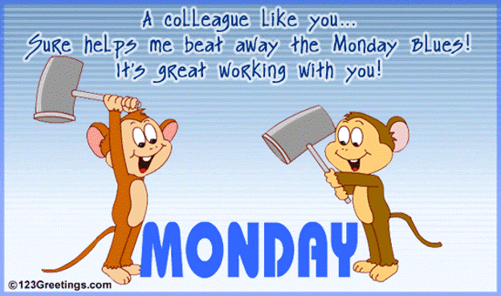
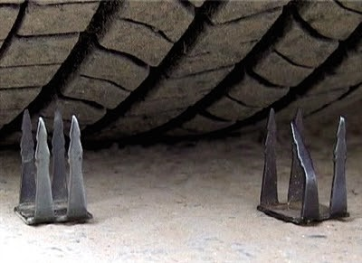
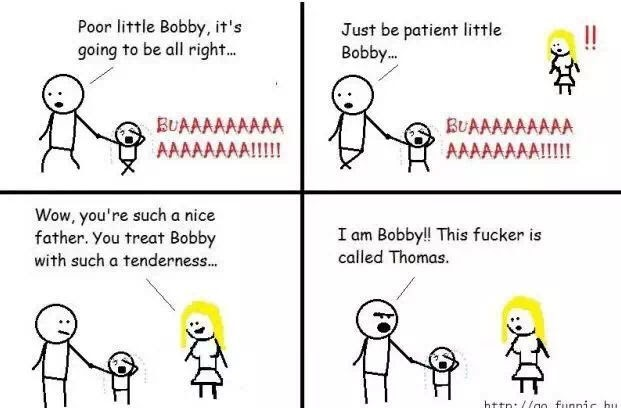
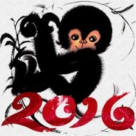
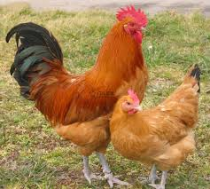
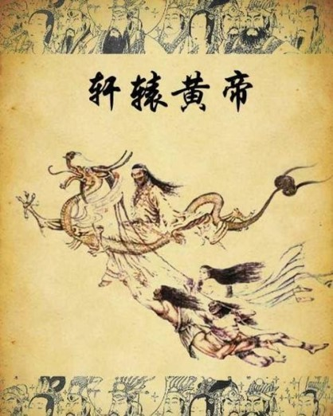

# 生活娱乐

## 【爱情的三个层面】

爱情既简单又复杂。

说她简单，是因为爱情终归是一种感觉。跟着感觉走，爱你没商量。正如麦当劳的广告口号“我就爱它”（I'm Lovin' It）一样简单明了，率真执着。

然而，爱情表面上虽然显得简单粗浅，在其背后却有复杂精深的机制。

爱情实际上是人的生理，心理和智慧的一种综合效应。这三者实际上都有其对应的身体器官 - 性，心和脑。而且这三个器官在人体的位置正好从下到上，自然而然形成爱情从低级到高级的三个层面。

应该说爱情的根基还是在于最底层的性。两性相吸，是动物本能。这本能又进一步引申到容貌，身材，举手，投足，声音，嗅觉等等。这种基于性的天然吸引力乃是爱情之根本。性有如房子地基。没有地基, 就没有房子。地基不牢，房子不稳。

再上一层是心。心乃血之源头。有血才有柔情，热情和激情。人们用心心相印来表示男女双方的互相关照和体贴。心好比房间。房间设计高雅，装饰时尚，收拾整洁，住着就很舒适开心。

爱情的最高层是脑。人的智慧来自大脑。这是人类区分于动物的根本。因为有智慧，爱情变得高雅，美丽。当两个大脑想到一块时，两个人就会在品味风格上匹配适应，在为人处事上志同道合。脑好比屋顶。世俗生活会给爱情带来好多考验，就如房子座落于自然环境要经风吹雨淋一样。没有牢固的屋顶，房子要漏水。屋顶漏水可不是小事。房间受灾不说，搞不好还会损害地基。

通常所说的“一见钟情”，往往是发于性，止于心，少有上升到脑的。性易现，心可印，脑难摸（难怪俗话说“摸不着头脑”）。所以大家要注意。一见钟情是很美，见完别忘摸头脑。

西方人常说的“化学感应”（Chemistry)是指两个人之间有情缘，情投意合，脾气相投。这种化学感应实际上是男女在性，心和脑三个层面的融洽和谐。 

假如你正在热恋中，你就跟着感觉走吧。你没有必要做化学分析。

假如你的爱情出现问题，不凡问问自己爱情的地基还稳固吗？爱情的房间是否还温馨？爱情的屋顶有没有漏洞？

\newpage

## 【“逝者如斯夫”新解】

子在川上曰；“逝者如斯夫！不舍昼夜。”

几千年来，后人一直误以为孔夫子感叹时光易逝，告诫后生要珍惜时间，抓紧分分秒秒，不可虚度年华。

其实大错特错！看官在此先不要着急，等我慢慢解释。你要是没空，先去忙你的，有空再来细读。切不可匆匆瞄过，虎头马尾。

“逝者如斯夫”乃指光阴似水，如长江后浪推前浪。流水源源不断，日夜不息。何需顾虑时光消逝不再来？何必争分夺秒赶时间？

“抽刀断水水更流”讲的就是时间的充裕，时间的连续，时间的永久。时间乃天然资源，虽不可再生，但也随你使用，无穷无尽。人最富有的是时间。
与生俱来，用之不竭，直到生命最后一刻。生命中最值得享受的也是时间。最能享受的起的也是时间。
不论贫富，不论卑贱，不管男女老弱，谁都有同等的享用权利。时间乃无价无私。时间面前，人人平等。

看官如果已经读到这里，说明对时间已经有一知半解了。很多人读到第三句就没空或没耐心，溜之大吉了。

享受时光要如享受美食一样，细嚼慢咽；或如享受香茗一般，细品慢酌。

享受时间最忌急躁，匆忙。最忌缺乏耐心，急功近利。你越急，时间就消逝的越快。时间的享受就越小。

务必慢条斯理啊！

哎呦，不好了，写着写着就忘了时间。得赶紧去上班了。迟到了，老板要给脸色的，还影响提升与涨工资呢。

88！

\newpage

## 【微博之我见】

微博乃时尚，现在很热，季节一过就冷。

时尚是少数精英明星的奢侈品，平民百姓与之无缘。

乡亲们，有时间就多和家人亲友一起聊聊侃侃吃吃喝喝，不要把宝贵时光浪费在别人无聊的微博上。

也不要费劲心思写微博，生活没有那么琐屑，你也没有那么多粉丝。当你有很多粉丝的时候，你就不会有咱们百姓平常悠闲的生活。

有空写点日志博客，与朋友共享。写博就如偶尔与自己谈心，与朋友交流。微博大凡婆婆妈妈，无病呻吟。

名人和企业把微博当作宣传和营销的盈利工具，老百姓要警惕。

写博读博好习惯，微博迟早会冷淡。一寸光阴一寸金，请君务必要珍惜。

\newpage

## 【被美眉追】

好友老李今年十月九日（2011年）参加芝加哥马拉松比赛。这是他的第五个马拉松。
这张照片里有一群女运动员跑在他后面，他急匆匆，不时看表。
比赛结束，他有感而发，写了一首诙谐的英文小诗。我把它翻成中文，与大家共享。

> 【Chased by Girls - Old Li】   
> But I am late   
> for a date
>
> with my running mate  
> of 32 years
>
> 【被美眉追 - 老李】    
> 美眉们请不要穷追  
> 老李我早已有约会
>
> 等在终点望断秋水  
> 是伴我三十二年的跑妹

注：老李和夫人结发已三十二年。他的第一个马拉松就是和夫人一起训练，一起参赛的。所以他管夫人叫 “Running Mate” 。
英文 “Running Mate” 正规翻译是竞选伙伴，比如总统和副总统候选人。我翻成 “跑妹” ， “Run” 直译为 “跑” ， “Mate” 音译为 “妹” ，即巧妙又达意。

无独有偶，更确切地说是“近墨者黑”，我在十月十五日参赛巴尔的摩马拉松，也有类似的一张相片。后面跟着一群女运动员。不过我慢悠悠，一点不急。我东施效颦，也写了一首。

> 【Chased by Girls – Monkey】  
> You don't have to be hasty  
> For I am in no hurry
>
> At the finish line is Old Li  
> But he is not as pretty  
>
> 【被美眉追 - 猴哥】  
> 美眉们穷追太费力  
> 猴哥我一点不着急
>
> 等在终点的是老李  
> 他哪有你们的魅力

注：猴哥跑巴尔的摩马拉松，好友老李路途为我照相，并在终点等我，为我最后冲刺拍照。

\newpage

## 【花果山人猴对话】

穆阳猴：行者，你何故取人名？

孙悟空：猴哥，我想做人，无奈进化太慢，故取人名聊以自慰。

穆阳猴：行者，做人不见得比做猴好啊！

孙悟空：猴哥，你是人，那你为什么叫猴哥呢？

穆阳猴：行者，人类演化以来，远离自然，渐失天性。我想回归，故自号猴哥。

孙悟空：猴哥，这太好了，我们半途相遇！

穆阳猴：行者，是的，我们殊途同归，三生有幸！

\newpage

## 【科幻：掉进湖里或坠入爱河】

今天清晨猴哥和猴婆在湖边跑步，一个男士上前问“到湖对面的儿童荡秋千处从左半圈走近呢，还是从右半圈走近？”

猴哥略思片刻，回答道“这可不是一个简单的问题。让我帮你分析一下吧。从数学角度来看，两点之间直线最短。” 

男士：“可是水太脏，我不想从湖里游过去。” 

猴哥：“你看到湖中间那个划船的美眉吗？可以让她把你载过去。”

男士：“这可不好，要欠人情的。我们西方民主社会只讲法制，不讲人情。”

猴哥：“这没问题，西方自由市场讲平等交换，你就付她钱好了。”

男士：“这是好主意，可是该付多少钱呢？”

猴哥：“她省了你时间，所以这要看你如何估价你的时间。”

男士： “不过，我还担心掉进湖里。”

猴哥：“你想的对，要考虑风险。可是，你也要抓住机会。那个美眉很有魅力，万一你们一见钟情，坠入爱河呢?”

男士： “我的时间价值比较好评估，可是掉进湖里的损失和坠入爱河的收益怎么能用钱来衡量呢？”

猴哥： “是的，这是经济管理学的难题。今天没有时间深入探讨。还是实际一点吧，我估计从左半圈走要比右半圈走要快3分半。”

男士拿出手机，打开计算器应用，按10 - 3.5 = 6.5。然后说“刚才听你分析花了10分钟，选择走左半圈省3.5分钟，结果反而多用了6.5分钟。”

猴哥：“是的，有时候，求助不如自助。靠人不如靠己。分析不如直觉。逻辑不如形象。吹牛不如实干。科学不如智慧。”

男士点点头，笑着说“谢谢开导。多花这6.5分钟上了一堂数学，经济，管理，风险分析，爱情，东方智慧的课，太值了。”

猴哥笑眯眯，心里很高兴。

男士刚转身要走，又回头，问道“请再告诉我一下，两点之间，哪一条线的距离最短？”

猴哥：“哦，就是最短的那一条。”

男士略思片刻，微笑说“谢谢，我懂了。”

数年以后，猴哥逛书店，偶然看到一个书，书名叫【Fall In Lake or Fall In Love - My Serendipitous Encounter With The Eastern Wisdom】(掉进湖里还是坠入爱河 - 我与东方智慧的一次邂逅）。
打开封面，第一页上赫然写着：

> To the Mysterious Master  
> I am sure someday you will stumble upon this book  
> just as I stumbled upon you 
> 
> 献给神秘的大师    
> 相信有一天你会邂逅这本书    
> 就如当年我邂逅你一样  

\newpage

## 【平庸男人的魅力】

世界上的男人实际上也是遵循统计学上的正态分布的。左端是少数精英，右端是少数赝品，中间的大多数则是浩浩荡荡千军万马的平庸男人了。

精英男士一般都有公认的标准。比如长相帅气，身材高大，穿着时尚。他们要末出生名门，有优越的家庭和父母。要么名校毕业, 即使没有博士学位，至少也得混个硕士。事业成功乃是不可或缺的。没有官衔，必有财运。若两者皆无，那一定得有科技发明。要不然就是文艺圈子里的大腕。精英男人还有好多品质，比如智商高，口才好，交游广，等等。总而言之，精英男士乃成功之士。不仅女人爱慕他们，连平庸男人也羡慕他们。当然羡慕之外，还有三分嫉妒。

女人要是能嫁给一个精英男士就如中彩票，一辈子就搞定了。可惜的是僧多粥少，供不应求。而且精英男士就像停车场得泊车位，好的早就被人占去。大部分女士不得不屈尊下嫁平庸男人。

其实平庸男人和精英男士比毫不逊色，别有风味。只是因为他们谦卑低调，他们的魅力也鲜为人世人所知。更何况他们的女人也都本份，自己默默享受，极少四处张扬。

精英男士是咖啡，远远的你就可以闻到浓浓的香味扑鼻。凑近看到的则是黑黑的一杯, 深不可见底。咖啡单独饮用是很苦涩的，所以一定得加糖加奶，把苦味中和。所以嫁给精英的女人也是要付出许多代价的。咖啡还是兴奋剂，能让你兴奋一时，过后你会更加疲劳消沉。

平庸男人是香茗，离的远闻不到，必须靠近才能闻其清香。一杯清茶，淡中有味，几片绿叶，飘逸悠然。当你闭起眼睛，看到的便是一个美丽的湖，你可以在上面尽情泛舟。湖表面风平浪静，水底却有一个美妙世界。绿茶的香醇，能沁人心脾，回味无穷。茶还是绿色健康之饮。

贤惠女人心里都明白，平庸男人的最大魅力其实就是平庸：
- 因为平庸，他才谦卑，中庸，实在，质朴。原汁原味最甜。
- 因为平庸，他不会削尖脑袋往上爬， 也不会费尽心去发财。
-	因为平庸，他待人厚道，与人为善。他不会斤斤计较，心眼狭小。
-	因为平庸，他保持淳朴的感性，追求内在的精神。
-	因为平庸，他不酗酒，不抽烟，身心健康。
-	因为平庸，他读书，写字，运动，养生。
-	因为平庸，他无官一身轻，无财好睡眠，每天都有好心情。
-	因为平庸，他有更多的时间和精力去照顾自己。
-	因为平庸，他有更多的时间和精力照顾妻儿老小，关注亲朋好友。

诸葛亮在刘备三顾茅庐之前也是一个平庸的男人。他自称“臣本布衣，躬耕于南阳。”刘备第三次找他时，他正在睡午觉。
他醒来吟到“大梦谁先觉，平生我自知。草堂春睡足，窗外日迟迟。”，这正体现了他平庸的魅力，也印证了他“夫君子之行，静以修身，俭以养德。非淡泊无以明志，非宁静无以致远。
”的人生哲学。能平庸到如此精致，以一孔之明，照亮后世，不愧为平庸男士的典范。

\newpage

## 【工作和生活（一）】

人们经常说要处理好工作和生活的关系。西方人也常说要追求工作和生活的平衡（Work Life Balance）。其实这种把工作和生活分割开来，并把两者看成是两个互相对立互相排斥的想法是错误的。
工作应该是生活的一个部分，工作就是生活。

人们一天二十四小时，三分之一的时间用在睡觉做梦，三分之一的时间用在上班挣钱，另外三分之一的时间则用于诸如吃喝玩乐扶老携幼等其他活动。
如果我们把工 作看作一种苦力，一种劳役，那么人生的三分之一就缺乏乐趣，失去色彩。这对人类该是多么的不幸啊！

所以，问题不是如何平衡工作和生活。问题在于如何在工作中寻找乐趣，在工作中享受生活。一个全职母亲一天二十四小时都在持家育子。
如果她把这个当作不得不 做的工作，就会感觉辛苦不堪；如果她把这个当作理所当然的生活，她就会享受到很多乐趣。我们在单位上班也一样。
如果我们只是把工作当作养家糊口而不得不 做，我们每一天的八个小时就变成蹲监狱。英语中有一个熟语叫“Monday Blues”， 中文意思是“周一忧郁症”。
这是指人们经过了一个周末的休息调整，一想到周一又要去上班，就心情不好。反之，如果我们把工作当作生活的一部分，我们就会去 想办法把上班的八个小时过好。

过好班上八个小时的办法是很多的。我想有几条是很基本的，值得列出来:
- 第一条，我们应该尽量做自己爱做的事，所以职业选择特别重要。
- 第二条，务必把工作当作生活的一个有机部份，工作就是生活。不要被“工作生活平衡”的谬论受害。
- 第三，每天都要带着一张灿烂的笑脸去上班，带着笑脸为人处事, 最后带着同样灿烂的一张笑脸回家。

掌握了这三项基本原则，你的天生的创造力就会给你很多具体的妙法。

\newpage

## 【工作和生活（二）】

前文讲到工作和生活不可分割，工作乃生活之有机组成部份，工作就是生活。文章结尾抛砖引玉提出增加工作乐趣的三项基本原则。

在工作乐趣上美国佬比中国人差远了。在美国单位，一般看不到新闻报纸和休闲杂志。在中国办公，一杯茶，一份报，翘起二郎腿，十分惬意。

美国企业特别怕员工行为出轨，公司遭起诉名利双丢。其中最敏感的就是性骚扰。搞的男女之间授受不亲，工作乐趣大减。
男同事遇到女同事不敢轻易夸奖恭维。想一想，一个男人，见到年轻漂亮女同事青春美丽，再加上时尚服装首饰，浓妆淡抹，能不为之动心？
可是在单位里，只能假装没看见，还得扳着面孔，不苟言笑，最多点个头就走。回到办公室，才春情萌动，难以言表，心情为之郁闷。
女同事的日子其实也不好过，每天起大早，花个把小时梳妆打扮，可是到了班上，无人问津，无人表示。
女为悦己者容，那些囊生真是有眼无珠，白为他们费尽心思了。倩女回到办公室，先是怒火中烧，烧完便开始顾影自怜，怀疑自己是否青春依旧，最后凄凄惨惨戚戚，无精打采，无心工作。
这种局面既不利于创造工作乐趣，又严重影响工作效率。

在中国上班可不是这样。男女同事之间有说有笑，很有乐趣。我当年在建行上班，中午午休，有些同事不回家，就一起打牌，男男女女，特别热闹。
这种事在美国不可想象。在中国，单位有自己的宿舍食堂车辆，生活和工作成一体。白天上班聊聊孩子老公老婆等婆婆妈妈的生活之事，晚上周末提点烟酒礼物上领导家谈谈提升分房奖金职称等正正经经的工作之事。
生活和工作不再有区别，也没有矛盾。一个企业或者政府部门就像一个大家庭。想像一下，当年在中国猴哥在班上见到美眉，总是笑容可掬，恭维一番，“小妹今天打扮的真漂亮，
特别是这件裙子很青春啊！”，美眉听了眉开眼笑，也把猴哥赞赏几句，“谢谢！猴哥你今天也很时尚，尤其那体恤衫很风采啊！”。
猴哥心里美滋滋，回办公室，边哼小曲，边干活。美眉也心情快乐，接待客人彬彬有礼, 处理文书井井有条。 

难怪中国经济增长比美国高那么多。

\newpage

## 【警惕屁股】

当人们不用脑袋思考,不用双手劳动,不用两脚走路,屁股就自然而然成了指挥官。 设想屁股当领导,它是不会让人往前走,而是让人倒退。
因为屁股长在身体后面。 美国为什么后退? 因为它让金卡戴珊(Kim Kardashian)的屁股和投资银行家的P股取代人们的头脑,双手和两脚。
更有甚者,那些政客,不做事实, 只会放屁, 加快了倒退的速度。 国人万万不可东施效颦, 让屁股牵着你的鼻子倒退啊。

\newpage

## 【奥运会与美国大选】

奥运会与美国大选有什么关系？有的。

大家记否2008年中国在北京首次成功举办夏季奥运会，成绩辉煌，金牌总数第一，奖牌总数第二，仅次于美国。这不仅仅体现中国的运动竞技水平的提高。这是中国经济增长，国力增强，民族兴盛的一个表现。

二战以来，特别是冷战以后苏联的解体，美国成为世界第一的经济军事强国。再加上英德法意大利等欧洲发达资本主义国家，东西半球出现了前所未有的失衡。西方靠着强大的经济和武力，在国际事物上对东方弱小贫穷国家肆意掠夺，干涉，奴役。世界越来越不公平，不安全，不和谐。

中国的崛起是对东西方的阴阳失衡最有效的改善。没有中国的崛起，这种失衡会越来越加剧而造成人类不可弥补的灾难。这些年世界上极端主义，恐怖主义的出现和世界安全的恶化，归根结底是东西方阴阳严重失衡造成的。

同是2008年，美国的民主选举产生了历史上第一个黑人总统。这标志着几百年来美国的白人一族专制开始受到挑战。少数族裔的地位逐步提高。美国国内的阴阳失衡开始有所改善。

所以2008年对美国人，中国人，乃至全世界人民都是一个很值得纪念的一年。

8年以后的2016年，又是一个历史的新起点。中国体育健儿在巴西里亚热内卢夏季奥运会再次与美国争夺。美国出现了历史上第一个女性总统候选人。 希拉里还很有希望成为美国的第一个女总统。这将标志着美国弱势群体的声音越来越大，实力越来越强。西班牙裔和亚裔人口的增加也会形成新的抵御白人专制的力量。也许8年以后美国会出现第一个西班牙裔总统，1年以后出现第一个亚裔总统。

可以说美国国内的弱肉强食，富人任性，强者任意和国际上西方国家对东方国家不成比例的经济和武力优势以及西方在国际事务上的强行强权是一脉相承的。世界需要多样和包容，一国一族独大而造成阴阳失衡是当今乱世之根源。

美国少数族裔和弱势群体的崛起将给美国带来多样化，使美国社会更加和谐；中国的崛起将给国际社会带来平衡，带来和谐，给世界带来和平。

所以我们在乱世中看到一点希望。这里有着中国的巨大贡献，作为炎黄子孙，我们应该骄傲。

当有一天世界变得更加美好的时候，全世界人民都会感谢中国的。希望崛起的中国保持谦卑，中庸，慈善，包容的传统美德，不要效法西方强国，而要吸取他们的教训。

\newpage

## 【人生的四个“自”和四种“情”】

四个“自”:

-	自由的思想
-	自主的职业
-	自在的生活
-	自律的行为

四种“情”:

-	亲情
-	乡情
-	爱情
-	豪情

\newpage

## 【成功的标准】

（一）成功的人都一样，不成功的人各有各的不成功。

（二）成功的第一标准是你能否自己定义成功的标准。

（三）成功的人大都自己定义标准，而不成功的人总是拿别人或社会的标准衡量自己。

（四）当你可以给自己量身定做成功标准的时候，你想不成功都难。

（五）正因为可以自己量身定做，成功人的标准并非一成不变。成功人的标准不断修改，与时俱进，所以他们永远成功。

（六）成功的反义词不是失败，而是不成功。因为成功的人往往没有不失败的，而不成功的人不失败的却很多。

（七）成功的人即便输了依然成功；不成功的人即使赢了，还是不成功。

（八）成功的人大凡藏而不露，不成功的人则容易识别。就如商家的折价货品总是要贴上大字鲜红的标签，摆在招人耳目的位置。

（九）成功的人与不成功的人有一点是相通的，就是他们都有烦恼。管你成功不成功，都得吃喝睡拉撒，都得对付柴米油盐醋，都有七情六欲，都得扶老育幼。烦不烦哪，这些尘俗之事。

（十）写到这里，笔者心烦，不想写了。读者就随便吧，反正成功与否，你们自己说了算。

\newpage

## 【2019感悟】

-	自由是在各种约束下还能自在自如。没有约束，谈何自由。
-	简约是最好的写作习惯。不光是写作，在为人处世的方方面面包括吃喝穿用都要简约。
-	在这信息过量，物质丰富的时代，简约更是一种品德。
-	简约也是养生之道，健康秘诀。
-	生命不息，学习不止。“路漫漫其修远兮，吾将上下而求索”。
-	谷歌搜索就是个人图书馆。培根说知识就是权力（力量）。谷歌搜索让大众分享权力。
-	知识的海洋已经太大了（都怪谷歌搜索）。所以应该尽量避免在里面扔垃圾。

\newpage

## 【键盘与显示器】

如果男人是键盘，那么女人就是显示器。 

自从八十年代个人微机的问世至今，键盘数十年不变，显示器则数年一变。 

键盘一直就那么两种颜色，不是黑的就是白的，非常单调。四四方方的健子，总是整整齐齐排成长方形。那长方形的大小也是一成不变。 

显示器却大不一样，她总是变化多端。最初是黑白，如今是彩色，有如女人的口红,色彩鲜艳繁多。其大小也从最初12英寸之小，到19英寸，21英寸乃至更大，像是做了隆胸手术。从胖乎乎沉甸甸的显像管式，到轻便超薄的平面直角式，瘦身效果非常显著。 

隆胸和瘦身只是改变外表而已。显示器内在的改变要归功于九十年代微软的视窗操作系统的出现。 

键盘与显示器的关系曾经是比较简单的。显示器起初只有一个黑白清晰的屏幕。键盘上的每一个健子，都会反馈在显示器那单纯的屏幕上。可是自从出现了微软的视窗操作系统，显示器就像一个纯情少女经过了几年大学的熏陶，一下子变的成熟复杂了。她那曾经单纯的屏幕上出现了无数的视窗，丰富多彩，层层叠叠，让键盘脑袋发晕，不知所措。打出的健子，不知道落到了哪个窗口。收到的回馈也不知道在哪个窗口出现。窗口还时大时小，甚至躲蒇起来。键盘的日子从此难过。键盘与显示器的关系从此磕磕碰碰。 

应该感谢鼠标， 他的出现扭转了这种尴尬的局面。鼠标可以说是键盘的脑袋，就像视窗是显示器的心灵。如果说视窗使显示器更加美丽多姿，那么鼠标则使键盘更加聪明睿智。有了鼠标，键盘就知道哪个窗口是需要什么样的健子，就明白健子该打在什么方位。有了鼠标，那缩小的窗口可以放大，那隐藏的窗口可以彰显，没有窗口的时候，可以开它一个，乃至几个。更绝的是，你不喜欢或不需要的窗口，可以随时关闭。有了鼠标，一切都变灵活了，不可能的事变可能了。鼠标让键盘与显示器的互动更加容易，更加密切，更加默契。 

男生们，想一想你的鼠标是什么？ 

女生们，想一想你的视窗有几个？

图一：八十年代的老式微机 - 看那显示器有多胖多土。

 
图二：二十一世纪新式微机。看那显示器有多薄多酷；键盘几乎没有变化；小小的鼠标却神通广大。

\newpage

## 【僧多粥少怎么办？】

-	提早去排队
-	万一去晚了就加塞
-	跟厨师搞好关系
-	跟方丈搞好关系
-
其实这些都不是最佳方案，也非长久之计。

最佳方案是：还俗。

\newpage

## 【歧视】

世上有各种各样的歧视，性别歧视，种族歧视，年龄歧视，不一而足。其实这些都是表象，并非实质。

歧视其实是不分性别，种族，年龄的。歧视归根结底是因为人在社会中的地位有高低不同。根据地位的不同, 人可以简单地分两种，一种是强势者，一种是弱势者。
所谓歧视，就是强势者或强势群体对弱势者或弱势群体的不公平，不公正的态度和行为。

所以歧视不长眼睛, 看不见颜色, 分不清性别, 辨不清人种。谁能歧视黑人总统奥巴马? 谁能歧视女性前第一夫人, 前纽约参议员, 前国务卿希拉里?

高贵者欺凌低贱者, 居上者欺凌处下者, 这就是歧视。

哪一天, 地球失去吸引力，水不往低处流, 人类才不再有歧视。

\newpage

## 【法治与人治】

隔壁邻居的瓜藤视无忌惮，越过栅栏在我家后院明目张胆地长出四个瓜。一条丝瓜，一条青瓜，两个壶瓜，十分诱人。

未经主人许可，擅自闯入私宅，应该是违法的。

我找了律师想打官司。律师分析说这场官司胜算。当我问到费用多少时，律师说，四个瓜，他得一个，对方律师得一个，我能赔到一个，邻居自己留一个。律师让我马上签约，我犹豫不觉。

这时老婆电话过来，说她和邻居阿嫂刚刚沟通并达成协议。邻居愿意赔偿两个瓜，自己留一个，第四个瓜留着作种，将来种子分我们一半。

我谢了律师，高高兴兴回到家。老婆端上热腾腾香喷喷的一盘丝瓜。我边吃边自言自语，"到底是法治好呢还是人治好?"。老婆在边上冷冷地回应，"你什么事都爱上纲上线。法治人治，关你啥事? 没有女人，世界没治!"

\newpage

## 【钉子路口】

你知道丁字路口的英文怎么说吗？你要是能不假思索，脱口而出，我就服你了。

昨天我在小区散步，前方开来一辆小车停在我边上。一个貌似印度裔的老先生从车窗探出头来，递出一张纸，指着中间的一行字问我如何走。我一看，这不就是我住的那条街， 往前开，遇到丁字路口左拐既是。我正要回答，发现丁字路口的英文不知道是什么。情急之下就告诉客人“It is not that far。Keep going until you hit the nail then turn left。”  老先生大眼圆瞪，做愕然状。我才明白可能是“hit the nail” （扎到钉子） 把他给吓住了。

我镇定片刻，才想起丁字路口的英文应该是T Section。大写英文字母T长得就像中文丁，字亭亭玉立。唯一区别就是T是赤足，丁则穿高跟鞋。另外我还把钉子误作丁字了，就像花木兰身穿灰甲替爹从军。

旅居海外就是这样，洋文不地道，中文还退步。

\newpage

## 【五十年是什么婚？】

猴婆一向崇尚名牌。当年误上猴哥贼船，就是因为迷信名牌大学。

如今身在猴营，依然心系白马王子。开着凌志，想着宝马。猴哥谓之“心猿意马”。

有一天，路上看到一辆三系列宝马，非常精致，猴婆十分欢喜，对猴哥说“我就要这一款"。

猴哥下意识地摸摸自己的钱包，略思片刻，答道”等我们结婚五十周年一定给你买一辆“。

猴婆没吭声。猴婆读文科的，数学差一点。猴哥估计她还在费劲做心算，看看离五十周年还有多久，便自言自语道“五十年是什么婚呀，金婚还是银婚？”。

没想到猴婆气乎乎，立马回应“是离婚！”。  

\newpage

## 【Eye Love You】

英文和汉字一样, 可以做有趣诙谐的文字游戏。

欧洲旅游，在捷克首都布拉格机场看到一个墨镜专卖店, 取名叫"Eye Love Prague"。直译是"眼爱布拉格"。

因为眼睛"Eye"的读音和我"I"的读音一样, 所以读起来是"I Love Prague", 就是"我爱布拉格"。

猴哥突然在想，猴婆五十岁生日送什么礼物? 可以考虑送一副老花镜，并在生日贺卡上写"Eye Love You"。

\newpage

## 【随感】

猴年跑马，蛇我其谁。  
猩猩相惜，猴猴爱你。

知道不能被所有的人喜欢，  
所以格外珍惜喜欢自己的人。

知道不能遇见所有的人，  
所以格外珍惜所有的相遇。

\newpage

## 【当爹不容易】

左上男人： "可怜的小鲍比, 一切都会好起来的。" (小孩在哇哇大哭)  

右上男人： "再耐心一点, 小鲍比。" (小孩依然哭个不停)

左下女人： "哇, 你真是一个好爸爸, 对鲍比这么温柔。" (小孩不哭了)

右下男人： "我是鲍比! 这个混蛋叫汤姆斯。" 

这个漫画寓意深刻。

一方面, 说明当爹的往往没有当妈的那样对小孩子无微不至。这种情况，当妈的往往会抱起孩子哄劝。当爹的则束手无策, 只好压住怒火，自己忍着。

另一方面也说明为人父是一件很难的事。必须牺牲自我，修身历练。

\newpage

## 【要住房到建行】

这是八十年代的一句顺口溜, 和当今的银行按揭房贷没有关系。那个时候没有房地产和私人购房这种事。

这个顺口溜是说建行是好单位, 因为建行职工都能分到住房。当时年轻职工只要成家就能分到一套公寓, 没有几个单位有这么好的福利。

除此之外, 建行逢年过节, 隔三叉五都会分发实物, 吃的, 用的, 应有尽有。我在建行那几年, 分到的实物就有柑橘, 香菇, 南京板鸭, 鸡等。有些是下级支行送给省分行的当地土特产或是时令水果。

有一次分到两瓶两公升的可口可乐。可口可乐在当时是很贵重的东西。据说有人到医院看望病人, 就有拎着可乐去的。当时是夏天, 没有冰箱, 就放在宿舍角落, 想的时候就倒一小杯喝。两瓶可乐可以喝上一两个礼拜。还好可乐不会坏。

还有一次分到两圈卫生纸。大家都纳闷, 不发点好吃的, 发卫生纸有啥用。后来一打听, 才知道这是行长亲自嘱咐工会主席的。因为行长有一天如厕, 发现茅坑里(那时还没有抽水马桶)有建行的公文纸。原来有职工用公文纸搽屁股。行长很恼火, 就让工会给大家发卫生纸。

发实物这种变相福利其实在当时是不符合政策的。不过建行作为企业, 不像事业单位, 有一定灵活性。据说工商银行胆子更大, 发东西更频繁, 更好, 更多。建行就跟在工行后面, 邯郸学步, 不敢超过。人民银行的福利就差些, 毕竟是中央银行, 必须以身作则, 遵守纪律。

\newpage

## 【爱和喜欢（一）】

多年前，曾经和一个同事闲聊。他说的一句话给我留下深刻印象。他说“我最近才开使逐渐喜欢我老婆。”当时这位同事结婚有七八年，有两个女儿，大女儿五六岁，小女儿两三岁。在他看来爱老婆是很自然很容易的事。因为爱才结婚成家，生儿育女。有了家，有了儿女，爱就是一种不可推卸的责任和义务。但是喜欢老婆则不是一件容易的事。结婚以后，近距离审视，就没有恋爱时的朦胧美了。一个女人在日常生活的油盐酱醋中就没有恋爱时在花前月下那么动人了。
 
其实不光是丈夫有喜欢妻子的问题。妻子也同样有喜欢丈夫的问题。喜欢一个人，就要对他或她的穿着打扮，言谈举止，为人处事，人生理念等方方面面都要认同。这可不是轻而易举的事。男女由互相喜欢，到相爱结合。结婚以后，各自的弱点缺点逐渐暴露出来，因而夫妻之间要有一段很长的磨合过程。而且因为大家都有自己的工作事业，各忙各的，相互之间的沟通就会逐渐减少而导致情感危机。我们不妨把这个磨合过程取名叫“再恋爱过程”。再恋爱可没有恋爱那么美好。它多的是磕磕碰碰，少的是卿卿我我。
 
并不是所有的再恋爱都成功。失败无非有两种，要么凑合，要么离婚。不过再恋爱的成功也是很值得庆贺的事。就像回锅肉，回锅加工后更美味。也像普洱茶，二次发酵后更香醇更养生。

\newpage

## 【爱和喜欢（二）】

周末看一部电影，英文名叫《Meet Valentine》，可以意译为【为妻寻偶】。

故事讲的是一个三口之家，丈夫是画家，妻子是厨师，有一个月约十岁女孩。

夫妻之间各忙各的, 感情渐渐疏远, 但也没有什么矛盾，一家子相安无事。

直到有一天, 丈夫被诊断脑癌, 只能活不到一年。

丈夫没有把病情告诉妻子, 而是和一个朋友策划如何帮妻子找一个理想的配偶, 以便自己死后妻女能得到最好的爱护。

当他在寻偶网站上填写妻子的个人档案时, 发现自己平时对妻子了解太少, 竟不知道如何填写她的个人兴趣一栏。

从此他就开始关注妻子。去她上班的餐馆看她并约她出来喝咖啡聊天, 和她去打保龄球, 和她到沙滩练瑜伽，情人节和她约会，等等。

妻子感觉丈夫近来有点奇怪和神秘, 但却陶醉在幸福之中, 没有追问。

直到有一天, 丈夫忍受不住, 半夜痛哭，妻子才知道实情。

后来因为病症逐渐明显, 丈夫不忍妻女看到自己的病状, 试图投海自杀。结果被妻子发现, 死里逃生。 

两人在海滩相拥，有一段简短而又富有深意的对话：

> 丈夫问: “你还爱我吗？“ （You still love me?)  
> 妻子答：“爱你从来都不是问题。” (Loving you was never a problem.)  
> 过片刻，妻子说：“我喜欢你。” (I like you.)  
> 略停顿，妻子接着说：“我非常喜欢你” (I like you very much.)  
> 丈夫答：“我也喜欢你。” (I like you too.) 

爱当然重要，但是只有真正喜欢一个人，爱才有基础，爱才牢靠。喜欢一个人要花时间和心思去相处，了解和沟通。

\newpage

## 【猴年祝愿】

亲们, 请收下这个充满心愿的红包:

猴年, 请你

对孩子多一点耐心  
对父母多一点关心  
对配偶多一点细心  
对亲友多一点真心

对领导多一点支持心  
对下属多一点照顾心  
对工作多一点责任心  
对创业多一点持久心

对坏人多一点识别心  
对异己多一点容忍心  
对众生多一点慈悲心  
对自己多一点清净心

读微信要粗心  
读猴哥要用心  

你可懂得  
我的苦口婆心?

\newpage

## 【吾十一岁】

友人：猴哥今年高寿？   
猴哥：吾十一岁。   
友人：哇，你比实际年龄显得成熟老道。   
猴哥：谢谢夸奖。   
友人：猴哥从事什么职业？   
猴哥：我是营养学家。   
友人：哦，难怪早熟。   
猴哥：我"营"造人生，"养"性修心，"读"书学习，"修"身齐家。所以叫营养学家。   
友人：哇，赞你！不过为什么不治国平天下呢？   
猴哥：我还小呢，得等我长大以后再说。

友人感动，即兴作诗一首：

> 寒窗十一载，劲羽尚须丰。  
> 一朝长啸起，奋飞何其雄！

\newpage

## 【爱的小船说翻就翻】

（一）

老婆：看，水上这么多荷叶，怎么见不到荷花呢？   
老公：季节没到。   
老婆：什么时候季节才到啊？   
老公：荷年荷月荷日荷时，荷花就开了。

爱的小船说翻就翻。

（二）

老婆：你这辈子帮了那么多人，可是谁帮过你呢？   
老公：（抬头把手指向天上）   
老婆：（抬头看） 

爱的小船说翻就翻。

（三）

老婆：为什么家里到处都是你的臭袜子？   
老公：这都不是为你好。家里哪里有灰尘，你随时都能找到抹布擦啊。 

爱的小船说翻就翻。

\newpage

## 【鸡年伊始，为鸡正名】

牛年，国内国外尽吹牛；马年，群里群外皆拍马；鸡年，全国上下却集体失声，为什么？

原来，鸡这个为人类做出重要贡献的牲畜，这个普通平常的文字，在过去几十年来被严重污染了。人们忌讳而羞于言及。耻矣！

今天，野鸡大学猴校长站出来为鸡正名。希望同学们向鸡学习。虽长翅膀，却脚踏实地；纵有金嗓，却轻易不叫；
母鸡下蛋从来不数，孵小鸡更怡然自得；公鸡觅食任劳任怨，无事，就闲庭信步，有苦，则仰天长鸣；
小鸡们，个个天真无邪，充满野趣。金窝，银窝，不如自家的鸡窝。

为了破邪扶正，猴校长特地做春联一对，鸡年与同学们共勉：

> 上联：鸡血鸡汤鸡帝屁鸡时休矣

> 下联：害国害民害天下害不改呀

> 横批：你鸡道吗？

注：鸡帝屁乃指GDP。几十年来不顾全局，片面追求GDP的高速增长是腐败和道德沦丧的根源。

\newpage

## 【野鸡大学开门大吉】

经过一年多的精心筹备，野鸡大学在2017本命年正式成立。

本校不设鸡笼， 野外就是课堂。

本校只设两门课： 鸣叫， 下蛋，孵小鸡。（不学算术）

本校招生唯一标准：保证不打鸡血，坚决不喝鸡汤。

本校不设学位，不发文凭，随时入学，终生教育。

入学手续简便: 只要点赞，立马入学。

第一任校长猴哥在新年亲笔题词：

> 跑跑学习，天天向外。    
> 老老学习，天天向内。    
> 不上不下，俺是老中。

\newpage

## 【懒人读书】

庄子曰:“吾生也有涯，而知也无涯。以有涯随无涯，殆已" 。

怎么办呢? 

懒人自有办法：

没有一本书是作者专门为你一个人写的。

所以完全不必要把一本书从头到尾，一章一节，一字一句地读完。

你只要挑选其中合你口味，貌似为你量身定做的字句章节反复咀嚼，细细品味即可。

其余的皆可以不求甚解，一知半解，乃至忽略不计。

这样，你就可以把节省下来的时间和精力读更多的书。特别是同时读几本内容相关或意见相左的书，从不同角度，向不同作者学习。

孔子说"三人行，必有我师"。韩愈说"圣人无常师"。集百家之长，融会贯通; 树一己之见，细水长流。

\newpage

## 【懒人金句】

点不在多，不连线何以成图形?  
树不在茂，不超越何以见森林?  
识不在广，不融汇何以出创新?

人生苦短，知见难寻。信息时代，真隐假兴。  
言语道断，处灭心行。数据皆矿，沉默是金。  
惜时如金，惜字如金，惜言如金，惜情如金。

\newpage

## 【黄帝炎帝来自外星，亚洲美洲一个祖先?】

今天美国记者从百慕大报道，由著名太空深海考古学家，MIT教授犹曼博士(Dr. Yuman)带领的团队
在百慕大黑三角海域通过深海摄像发现一架不明飞行物（UFO）。

通过考古鉴定，这架外星飞船大概是在公元前8000 到10,000年之间到达地球的。
更为神秘的是犹曼博士认为中国神话中的黄帝和炎帝正是乘坐这架飞船到达地球的外星人。

这个发现要归功于他的汉学家妻子哈佛大学犹无曼博士（Dr. Yuwoman)。犹曼博士有一天把飞船的摄像放给他妻子看，
没想到她大吃一惊，拍案叫绝， 说从飞船的头部正面看就是”黄“字， 从高处往下看飞船就是”帝“字， 从侧面看就是"中"。
而且，飞船有两个引擎一上一下（不同于人类的飞机，两个引擎一左一右），看上去像”炎“字。 
犹曼博士由此推论黄帝和炎帝就是乘坐这架飞船来到地球的外星人。

如果这个推断得到证实，它将会推翻我们现有的对中国历史乃至世界文明的认知。
不少人在网上发表评论说人类同一祖先，都是外星人，为什么要勾心斗角，互相残杀？

不过，哥伦比亚大学著名华裔历史学家余仁杰博士则持谨慎态度。
他认为类似黄，帝，炎字左右对称或上下对称的汉字比比皆是，不能过早下结论。
但是他也承认炎字的两个火与飞船的两个引擎之间确实有神秘联系，不仅仅是一种巧合。应该是今后继续研究的重点。

这个消息发出不久，全美轰动，大家纷纷要求犹曼博士公开视频，一睹为快。
犹曼团队在他们的官方推特上回应说，视频已经被美国政府定为绝密，目前已被国家安全管理局（NSA）取走。

附：不少朋友对百慕大三角区的新发现很好奇，认为比三星堆更神秘，热情高涨，纷纷垂询。
可惜我对考古一窍不通。今天征得余仁杰博士的同意，将他的电话和电邮发给大家。有问题，可以直接和他联系。

**余仁杰博士联系方式**

> 电话: 1-2021-04-01 (请不要打对方付费电话，余教授薪水有限)
>
> 电邮: dr-yu-ren-jie@april-first.com (字数请控制在41字以内，余教授时间宝贵)

\newpage

## 【黑名单】

圆球平地新闻网（Global Flat News) 记者余仁杰报道，全球商界这几天热议美国政府以“涉及军方”为借口
将七家中国超级计算机实体列入黑名单（又名实体清单）中。这是续2020年底美国将华为，中兴等68家中国企业
列入黑名单之后的又一践踏市场经济与自由竞争的独断霸道行径。

全球商界巨头们在惊愕之余，反思彻悟，发现进入黑名单的门槛其实极高，对入围企业的品牌，资信， 公关，
及营销都有巨大的促进作用。国际企业开始认识到福布斯（Forbes）和胡润排行榜已经过时，应该抛弃，改用美国黑名单。
只有挤入美国黑名单才能证明一个企业真正的强大。目前已经有不少国际企业向美国商业部递交申请，
并提供详实材料证明自己有足够条件荣登黑名单。不过，这些申请最近都被退回。
其中包括著名的洛克希德马丁（Lockheed Martin)公司 和波音（Boeing）公司。
这两家曾是竞争对手的公司如今联合起来起诉美国政府。代理律师告诉余记者洛马和波音从市值，市场，
到科技和华为中兴都不相上下，而且它们都是美国国防部武器装备的最大供应商，与美军有着千丝万缕的瓜葛，
完全符合“涉及军方”的条件。他们对美国政府偏袒中国企业而忽视美国企业感到愤慨不平，所以对簿公堂。

另外，余记者从福布斯和胡润得到内部消息， 两家高层正在酝酿调整企业排行标准。
它们认识到，只有与时俱进，它们的传统排行榜才能和美国商业部黑名单竞争，否则必将被淘汰。
余记者对《财富》世界500强（Fortune Global 500）首席执行官（CEO）的民意调查结果显示，
89.98%不愿意看到企业排行榜被美国政府垄断。然而，当被问道是否会放弃福布斯（Forbes）
和胡润排行榜并加盟美国政府黑名单时，高达69.96%回答愿意。
余记者强调这种貌似自相矛盾的调查结果正说明企业所面临的两难困境。
当自由市场的无形之手（Invisible Hands)被美国政府的有形之爪紧紧抓住时，
市场惊慌失措而语无伦次是可以理解的。

对《财富》世界500强总裁问卷调查结果的自相矛盾，余记者特地采访了其中一位总裁， 
德国高科技巨头猴见猴仿（Monkey See Monkey Do) 人工智能公司惑夫慢（Hoffman）先生。
当被问到如何解释问卷参与人自相矛盾的回答时，惑先生幽默的说, 中国不是有句古话不能“只许州官放火，不让百姓点灯”吗？
更何况我们处在自由民主的现代，怎能只许美国政府狗急跳墙，而不让国际商界猴急乱语呢？
余记者为惑先生对中国文化的精通十分惊讶和佩服。看来国际企业家比美国政客更了解中国，更有智慧。

注：余教授因为两周前涉及百慕大考古事件被美国联邦调查局约谈。哥伦比亚大学迫于政府压力，以有潜在危害国家安全为由把余教授辞退。余教授为生计所迫，不得不改行当记者。

\newpage

## 【马大哈教授】

今年秋季（2020）我在两所大学做兼职教授：

- 给马大(马里兰大学)数据科学研究生讲授【统计分析与数据可视化】
- 给哈大(哈里斯堡科技大学)医疗信息学研究生讲授【美国医疗体制】

所以我给自己取了一个外号叫"马大哈教授"。

马大哈教授本学期遇到一个棘手的情况。学生甲和乙的作业雷同。问询甲，甲说自己独立完成。问询乙，乙说自己独立完成。
这怎么可能? 要么两人互相抄袭，要么两人都抄第三方。过几天，学生丙交来作业，和甲乙的作业也雷同。
本来想追根究底，搞个水落石出。再想想，新冠期间，学生也不容易，就不了了之了。
马教授本来对学生是很严格的，只是年纪大了，就成马大哈了。

\newpage

