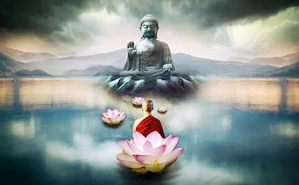

# 东方智慧

## 【禅】

禅是一种心灵的境界（心境）。习禅指的是达到这种禅境的修行。坐禅只是习禅的一种。其实站着和躺着也可以习禅。禅机无处不在，习禅的法门也是没有限制和没有极限的。

禅和禅宗有别。禅宗是佛教的一个派别，由达摩从印度传到中国。因为强调“不立文字，教外别传，直指人心，见性成佛＂，有那么一点”只可意会，不可言传“的味道，所以叫禅宗。

禅作为一种心境， 禅修作为达到这种心境的修行，并不是佛教独有的。不论是哪种宗教，都希望人们达到心灵净化，身心宁静的境界，都与禅相关。比如祈祷就有禅的意境。
虔诚的教徒在祈祷的时候就是进入了一种美好祥和，神圣安宁的禅境。所以禅是不分宗教, 没有国界的。禅是人类追求幸福与和平的共同境界。

在我看来，禅不是神秘的，艰难的，只有意志坚强并有高人指点的少数人才能坚持的苦修, 才能获得的境界。造福全人类的东西是不应该是高不可攀，只为少数人所独享的。

生活随时随地都有禅机。人生每时每刻都有禅境。就看我们有情还是无情，有心还是无心。

-	忍得厄运，是禅；耐得寂寞，是禅。
-	甘于平庸，是禅；乐于贫穷，是禅。
-	与人为善，是禅；助人为乐，是禅。
-	富而不淫，是禅; 贵而不骄，是禅。 
- 忙里偷闲，是禅；闲而充实，是禅。
-	困了睡觉，是禅；累了打盹，是禅。
-	饿了吃饭，是禅；愁来饮酒 ,是禅。 
-	被好人误解而无怨，是禅；
-	遭小人恶意而不怒，是禅。
-	退一步海阔天高，是禅；
-	心底无私天地宽，是禅；

\newpage

## 【苦】

世界上的宗教大凡以苦为出发点。这似乎可以理解，因为人只有苦才会有宗教信仰的需要。这在世界主要宗教的经文故事里都可以找到。

- 佛教最基本的四圣谛（苦，集，灭，道）的第一谛就是苦谛。【心经】开篇讲"观自在菩萨，行深般若波罗蜜多时，照见五蕴皆空，度一切苦厄。"
【心经】中的“观自在菩萨”也是”观音菩萨，“观音”是「寻声救苦」的意思。

- 基督教里，当年亚当夏娃偷吃禁果被赶出了伊甸园，从此下了尘凡，开始苦难生活。【多马福音】第五十八节里耶穌說: “受苦的人有福了, 他已经找到了生命。” 

- 印度教的【薄伽梵歌】第七章第十六节里主克里希纳说道 “阿朱纳啊! 崇拜我的义人分四个阶段: 首先是受苦难者, 再来是冀求知识者, 然后是渴求真理者, 而最后是获得智慧者。”

- 儒家的孟子在【生于忧患，死于安乐】中说过 “故天将降大任于是人也，必先苦其心志，劳其筋骨，饿其体肤。” 颜回是孔子最得意的门生，特别吃苦好学。
【论语 - 雍也】赞他“一箪食，一瓢饮，在陋巷，人不堪其忧，回也不改其乐。”

- 道家的老子在【道德经】第十三章讲道 “何谓贵大患若身？吾所以有大患者，为吾有身，及吾无身，吾有何患？ “这里的”大患“是大祸患，会带来苦厄。

苦是人类的共性。苦是人类最好的老师。人可寡欢, 但不可无苦。人可少福, 但不可无忧。

正如哲学家叔本华所说“快乐仅仅只是痛苦的消极面，然而痛苦是生命的积极面。”（Pleasure is only the negation of pain, and that pain is the positive element in life.）

\newpage

## 【德】

处弱势，能自强不息，不自暴自弃。\
处强势，能谦卑慈善，不胡作非为。

这既是做人之德，也是为国之德。"人无德不立"，"国无德不威” 。

然而，古今中外，总有缺德之人和缺德之国。

尤其是缺德之强人和缺德之强国。前者危害社会和谐，后者危害世界和平。

不幸的是这两者都处在食物链的顶端，缺乏约束，可以肆无忌惮，为所欲为。

强人夺利，强国争霸的结果就是 "兴，百姓苦; 亡，百姓苦"。因为百姓和弱国都处在食物链的底层。

注：
- "人无德不立，业无德不兴，国无德不威"出自西汉刘向【战国策】
- “兴，百姓苦; 亡，百姓苦" 出自元朝张养浩【山坡羊·潼关怀古】 

\newpage

## 【论洗脑】

我把洗脑定义为：大脑被动接受大量的片面的信息而产生偏见。

- **被动** - 在社交媒体的自动推送下，人们经常是被动地接受信息。
- **片面** - 所有的信息都只是从某一个特定角度看问题，都不代表事物真相。同时信息还难免夹杂着无益的噪音，有意的误导，乃至恶意的歪曲。
- **大量** - 接受的片面信息多到一定程度就会产生偏见偏激乃至无知无明。

在信息爆炸的时代，人们每天都在被洗脑。同时，人们分享信息，也是有意无意地为洗脑推波助澜。

那么，人们应该如何应对被洗脑呢？

- 要有**系统思维能力**，观察问题要多角度, 获取信息要多渠道。兼听则明，偏信则暗。
- 要知道**认知的局限性**。庄子说“吾生也有涯，而知也无涯”。所以在未知面前，既要怀疑自己，也不轻信他人。
- 要知道**语言的局限性**。老子说“道可道，非常道；名可名，非常名”。语言作为符号，难以精准表达真相。况且，人类的知识有显性（Explicit) 和隐性 (Tacit) 之分。隐性知识只可意会，不可言传。
- 要**时时警觉**，对网络上微信上流传的信息，没有被证实的都要持怀疑态度，皆不可轻信盲从。

最后，人的身体只需要有限的食物，吃多了造成负担而生病折寿；同样，人的大脑不需要也不能承受过多的信息。 
信息过量，会造成头脑不清。所以，人们不仅要**忌口以保持身体健康**，还要**忌眼以保持精神健康**。

\newpage

## 【佛教的木筏与快艇】

两千五百多年前佛陀在印度菩提迦耶的菩提树下证悟得道，成为觉者。从此他把自己所得经验传授给弟子众人，帮助众生离苦得乐。
佛陀涅槃之后，佛教继续传播。从印度往南传到斯里兰卡，缅甸，泰国等东南亚国家成为南传佛教；从印度往北传到中国的是北传佛教；
北传佛教又分从汉朝传入中国的汉传佛教和后来从西藏传入的叫藏传佛教。北传佛教形成不少宗派。比如禅宗，天台宗，净土宗，显宗和密宗等。
而南传佛教基本保持原始佛教的教义，更加接近佛陀最早的经验和教导。

佛陀把他的经验和教导比喻为木筏用以帮助弟子信众修行得道，解脱苦恼，抵达智慧彼岸。
这个木筏应该是个人使用的，因为修行要靠自身。可是后来佛教发展以后，朴素的原始佛教变为小乘（小的落后的运输工具）。
后面发展的则被尊为大乘（大的先进的交通工具）。似乎在大乘佛教里， 信众只要念经，烧香，拜佛，求菩萨，
或者得到高僧大德的指点和秘传，就可以速成得道解脱， 有如坐快艇一样。这是佛教发展的一种不良现象。

佛教发展有两个极端是值得我们思考和注意的。一个是走向神秘化，混杂了神，鬼，怪，灵。一是走向庸俗化，人们为升官发财而念经烧香拜佛求菩萨。

众人都喜欢坐快艇，只有少数人选择木筏。其实“孤舟蓑笠翁，独钓寒江雪”更自然，更原始，更有意境，也更符合原始佛教的教诲。
每个人都有佛性，称为 “自性”。自性只有靠自己常修渐悟。

\newpage

## 【佛的苦和道的乐】

人生无非苦乐。

佛家侧重苦的一面，教人如何灭苦。无我乃灭苦之道。

道家侧重乐的一面，教人如何享乐。无为乃享乐之道。

佛家认为苦来自人们自我的三毒贪，嗔，痴（贪欲、憎恨、愚痴）。通过禅定达到无我和虚空的境界就能灭苦。佛家认为每个人都有佛性，都是佛。
只是人的佛性被五蕴（色蕴、受蕴、想蕴、行蕴、识蕴，简言之就是人的肉身和精神）所遮掩屏障而不能显现。

【心经】讲”照见五蕴皆空，度一切苦厄“就是说观音菩萨在禅定中悟到人的五蕴皆是空无。众生如果能够在禅定中同样获得这种智慧就可以从苦难和厄运中解脱超度。

道家认为宇宙是有秩序的，和谐的， 美丽的。人和自然是浑然一体，没有矛盾的。世间万物虽有差异，都是平等的。所以人生是快乐的，至少是以快乐为主的。
享受生命，就是享受大自然赋予的一切。人生不必刻意去追求。轻举妄动，会打破自然和谐。无为而治，顺其自然，就不会产生矛盾和斗争。没有矛盾斗争，就不会有苦难和厄运。

道家和佛家不同，不讲”无我“。因为快乐本身是自我感受，无我就无快乐。道家强调的是对自我的正确认识，不要把我和他对立起来。
我和他是平等和谐的。他我合一，天人一体，万物同等，天下同乐。

\newpage

## 【圣贤所见略同】

道教的【道德经】和佛教的【金刚经】异曲同工，有惊人相似之处。

老子和佛陀生活的年代非常接近，都是在公元前大约五六百年前。【道德经】讲的道和【金刚经】讲的法都是指宇宙运行的自然规律和法则以及万物生灭，循环往复的本源和因果。
佛教用法轮来代表，图案是一个圆形，代表了佛教教义的完满，八个轮辐代表了破除无明脱离苦海的八正道。道教则用阴阳太极代表，图案也是圆形，代表宇宙周而复始之本质。
道教有八卦，用来代表一切自然现象的动静状态和运行规律。

【道德经】开宗明义讲“道，可道，非常道。名，可名，非常名。“ 指出道之玄妙深奥，无法用语言来表达和解说。
对五种感官能够意识到的事物，人类给予命名，以便文字描述，语言表达，和逻辑思维。但这些名只是标签而已，并不代表实际的事物。
事物的内在本质是人类的感官所不能直接感受的。做完这个声明之后，老子才开始讲述。读者应该明白后面所有章节所讲述的只是道的表象和体现而已。
它们并非真正的道本身。因为道是不可道的。

做个比喻，我们给人取个名字，但这个名字并不是这个人。我们虽然可以深入了解知道这个人的年龄，性别，学位，职业，长相，脾气，爱好，家庭背景，社会关系等等，但这些即使全部加起来还不是这个人。
你知道她的价值观吗，你知道她的成长经历吗，你知道她此刻在想什么吗？你知道她怎么看你吗？我们不知道，我们无法知道。我们可以和她长时间接触慢慢了解，但是无论如何我们不能够知道她的全部。
况且她并不是一个固定不变的人，她是在不断变化成长的。所以当一个人说”我懂你!” 的时候，请不要激动，以为找到知己了。其实没有人能懂你，甚至你自己都不懂你自己。
所以【道德经】第三十三章说“知人者智，自知者明。”

所以说“她， 非她。你，非你。我，非我”。 这正好和【金刚经】里佛陀反复强调不断用各种比喻来说明“某某者，即非某某，是名某某”不谋而合。
佛陀谆谆教诲信众不要被名和相所迷惑而住相生心。离相寂灭分第十四里讲 “菩萨应离一切相。”

佛陀在【金刚经】无德无说分第七里讲的“如来所说法，皆不可取，皆不可说”，在非說所說分第二十一里讲的“说法者，无法可说，是名说法。” 
这与老子的“道，可道，非常道。名，可名，非常名。”是多么相似啊。

佛陀还用一个非常形象的比喻来阐明这个道理。在正信稀有分第六中讲到“知我说法如筏喻者，法尚应舍，何况非法。” 
他把他所说的佛法比喻成用来渡河的木筏，木笩只是工具，不是目的，过了河到了彼岸，木筏就没有用，可以扔掉了。
这也说明佛陀在世时用语言以及后人用文字传授的佛法其实并不是真正意义上的佛法，而只是能够用语言文字来表达和描述的佛法的表象和体现而已。
也许只有进入涅磐，到了彼岸，把木筏彻底甩掉，才能真正得到佛法。真正的佛法是不能靠照本宣科，言传口授的。也不能靠读书念经，求神拜佛的。佛法必须靠自身体验。这也是佛教的特色之一。

佛教的一个很重要的特点是她不以我独尊，排斥异己。她承认其他法的存在。佛陀也不以我独大，可以有很多佛，甚至还有佛之外的其他觉着或圣贤。
【金刚经】无德无说分第七里就说道”一切圣贤，皆以无为法而有差别。“ 就是不同的法虽有差别，但都出自贤哲，一律平等。
道教的道和佛教的法出自两位先哲，一个出自中国，一个来自印度，道理相似，又各有千秋。我们中华文化其实是非常多样和具包容性的。
三教九流，百家争鸣。因为我们知道人类认知的局限性，只有多样化，多种思维综合互补才能更加接近实相和真理。

中国有句古话叫”英雄所见略同“。 这里的”英雄“并不恰当。英文有一句类似的话可能更贴切, “Great minds think alike。” 翻成中文就是“圣贤所见略同”。
 

\newpage

## 【白发之恼】

最近注意到自己的头发越来越白，每照镜，必苦恼。昨夜刷牙对镜，忽然想起佛陀在【四十二章经】讲：

> 夫为道者。譬如持炬。火入冥室中。冥闇也。 其冥即灭。而明犹存。

顿悟。

原来年纪大了，智慧增多，犹如火炬照耀，脑袋渐渐光明，头发自然被照亮而变成稀疏花白。

年轻时无知无明，脑袋昏暗，所以只长浓密的黑发。

俗话说:

> 繁忙的大道不长草，聪明的脑袋不长毛。

道理一样。

\newpage

## 【事， 势， 时】

《孟子 · 公孙丑章句》讲 -  齐人有言曰：“虽有智能，不如乘势；虽有镃基，不如待时。”

意思是说”成事不能光靠才智和能力，还得有大环境和大趋势；不能光有农具，还得等待耕种的时令。”

所以，事与势同音，事与时同韵。时势造英雄， 要成事，必赖天时地利。

总算给自己的一事无成找到了冠冕堂皇的借口。

三十年前，我的大学同学对此早有预言。他给我的毕业留言是这样写的：

“这辈子注定你是庸才，我是蠢才；但转世必定你是英才，我是伟才。” 

\newpage

## 【人生多彩因三无】

人生多彩因为这三无：  
无助，无知，无有。

因为无助，才努力；  
因为无知，才学习；  
因为无有，才创造；

假如有灵显的神明和万能的上帝， 还要我干吗？

假如我们有先知先觉，人生就没有变数，没有悬念，生活不就太无聊？

假如有富贵腾达的父母，衣食不愁，前途无量，我又该追求啥？ 

从零开始，   
增长率就是无限；

从无限开始，  
增长率就是零。

猴哥老矣，  
尚能算否？

\newpage

## 【自佛】

好久没有读佛, 最近感到神智空虚。昨天读六祖坦经, 有所感悟。写一联, 自勉：

心善, 意善, 行善, 常种善根  
欲寡, 言寡, 事寡, 甘当寡人

六祖说：

> “善知识。各自观察。莫错用心。经文分明言自归依佛。不言归依他佛。自佛不归。无所依处。
> 今既自悟。各须归依自心三宝。内调心性。外敬他人。是自归依也。” 

有对联曰：

若能自知藏佛处  
何须出世觅菩提

\newpage

## 【水】 
地球表面的百分之七十被水覆盖，人体的百分之七十由水构成。水是生命的重要元素。五行中，水排第一。可以说认识生命从认识水开始。从对水认识的角度不同可以看出儒释道之不同。

儒家的水–“水至清则无鱼。”

儒家重视生存现实，讲究社会效益。儒家认识到完美的事物是不存在的，即使有，也是脆弱和虚幻的，如水中月，镜中花。鱼无法在纯净的水里生存。养鱼的人都知道，鱼缸的水不能一次全换，换一半留一半。没有完美的社会，完美的家庭，完美的人。所以做人要讲究实际，避免空谈。 

佛家的水 - “佛观一碗水，八万四千虫。”

佛家慈悲为怀，心内求法，通过修持六度，达到禅定境界，获得般若正觉。五眼皆开，洞悉宇宙万物，证得生命真谛。所以释迦牟尼能够看到水中的无数微生物。而且为了避免伤害它们，佛祖教导弟子喝水前务必用布过滤后才喝。慈悲之怀，怜悯之心，由此可见。 

道家的水 - “上善若水”

水顺势而流，择下而处，是自然无为的典范。老子【道德经】里两处提到水。 第八章讲“上善若水。水善利万物而不争，处众人之所恶，故几于道 ”。第七十八章讲“天下莫柔弱于水，而攻坚强者莫之能胜，以其无以易之。弱之胜强，柔之胜刚，天下莫不知，莫能行。” 

\newpage

## 【一个系统工程师对道的解读】

系统科学是西方科学的一个新兴分支，始于二十世纪四十年代，它一反传统西方科学个体的局部的分析方法，开始强调整体的系统的思维模式。
而早在两千五百年前，老子就已经提倡系统思维，这比西方早了整整两千年。中医就是系统思维最成功的运用。老子的《道德经》可以说是一部系统工程学的经典。
它第一章就开宗明义，阐明系统思维的要义：

> “道可道，非常道。名可名，非常名。无名天地之始。有名万物之母。故常无欲以观其妙。常有欲以观其徼。此两者同出而异名，同谓之玄。玄之又玄，众妙之门。”

翻译：

系统难以用文字来精确描述，难以用语言来清楚表达。我们虽然可以给组成系统的各个部分命名，但名字并不能代表它们原有的真实。
系统原本混沌，它所包含的各个部分，原本无名无姓。人类为了探究方便，开始给它们归类命名。所以我们要用抽象思维，从整体高度去明了系统之微妙。
然后再以具体分析，从局部角度来洞察系统之精深。抽象和具体，整体和局部, 乃一刀两刃，不可分割。系统很玄妙, 系统思维这把利剑也一样玄妙，掌握了它你就能打开系统的玄妙之门。

解释：

宇宙就是一个大系统。道，可以解释为认识宇宙运作规律的方法，道也是一个系统。人是一个系统，社会也是一个系统。
这个世界就是由或大或小，或虚或实的无数系统组成。所以上述译文中可以把“系统”换成“宇宙”，“天地”，“人”，“道”，“社会”，等等。语句依然通顺，哲理依然清晰。

\newpage

## 【半杯水】

西方人常用半杯水作比喻来区分人对待生活的态度：

> 悲观的人说杯是半空 (The glass is half empty)
> 乐观的人说杯是半满 (The glass is half full)

佛家的出发点是苦，所以看到半杯水是半空。

道家的出发点是乐，所以看到半杯水是半满。

易家的出发点是变，所以看到杯子从空到满，再从满到空，水由少变多，又由多变少。

儒家的出发点是实，何必纠缠杯是半满还是半空。水可以解渴， 也可以浇花。口渴了就喝。不过要让长辈先喝，要让妇幼老弱先喝。

- 苦乐，内心之感受， 学佛学道可以离苦得乐。
- 变常，宇宙之运作， 学易可以懂得灵活应变。
- 君臣，家国之伦理， 学儒可以懂得为人处世。

儒释道易，东方文化之精髓。

\newpage

## 【佛与情人节】

佛教把世间有生命的有感性的都叫有情，或叫芸芸众生。这不仅仅包括人类， 还包括飞禽走兽，花鸟虫鱼草木， 乃至于肉眼看不见的微生物。

“佛观一碗水，八万四千虫”，就是讲佛祖释迦摩尼能看到水里的无数微生物。他教导弟子在喝水以前用纱布过滤以免伤害这些小生命。
佛教倡导素食和放生也是基于对世间有情万物的慈爱。

所以对信佛的人来说，世间的所有有情万物都是情人。我们的情人遍天下。

今天是情人节，我与大家分享《无量寿经》的一句：

> “于诸有情，常怀慈忍，和颜爱语，劝谕策进。” 

翻译：

> 对世间一切有情众生，我们都要慈悲为怀，包容忍让;
>
> 平时对他们要和颜悦色，轻声细语，充满爱意；
>
> 他们有不足的地方和犯错误的时候，我们不能粗暴对待，要耐心地规劝，晓谕，策勉，和鼓励他们。

佛教不是深奥莫测的空，不可捉摸的悟，不切实际的禅。佛教是实实在在的做人之道。
我们每个人要是能做到《无量寿经》这简短浅显的十六个字，我们就成佛了， 家庭就和睦了， 社会就和谐了，世界就和平了。

\newpage

## 【学佛心得：住还是不住？】

佛教有一个字不大为人知。那就是“住”字。这个字在《金刚经》里多次出现。比如，“应无所住，而生其心。”， ”不住相生心“。
因为诸行无常，万法皆空，故不能执着于相。这里讲的是大乘的空观，也是佛法的最高境界。

然而要达到这种不住相的境界，需要一个过程。这个过程则是从住相修心开始，渐修渐悟。

南传佛教的《四念住经》讲的就是住相修心。四念住也叫四念处。住和处在这里指的都是住所，住处。
四念住包括身，觉，心，法，是指人的身体和意识。修行首先要把心从向外探索收回到向内观想。内观则从身体开始并逐渐提升到意识层面。
心有所住，才魂魄不散。如《四念住经》讲的“立念在身（觉，心，法），有知有见，有明有达”。
立念在身，就是把心安放在自己的身体，不要被外物所迷，外相迷惑。身，觉，心，法是修行的四个处所，好比房屋从地下室，
一楼，再到二楼，三楼。知，见，明，达是觉悟的四种层次，好比西方科学常用的智慧金字塔（Wisdom Pyramid) 从数据，信息，到知识，智慧（Data, Information, Knowledge, Wisdom)。

所以应该先学《四念住经》，再学《金刚经》，或者两经同时学习，融会贯通。

前者是小乘，后者是大乘。西瓜大的甜，饺子小的香。小乘大乘，都是佛法，各有千秋，皆我所爱。

\newpage

## 【寓言 • 龙赴虎宴】

岛上住着一只猛虎。海底藏着一条蛟龙。

虎邀龙作客，龙欣然前往。

虎在悬崖上对远方来客耀武扬威。

龙怒，咆哮，虎被冲天巨浪卷入大海。

看着虎的狼狈样，龙语重心长地说: 

"Dude, Listen up! (老兄，听着!） 即使有实力，也不要霸道。更不要居高临下，藐视对方。要藏而不露，谦卑恭敬。博弈讲艺术，交往讲礼节。别总以为自己是老子，别人都是孙子。“

虎无言以对。

临走，龙说 “等你伤势好转，头脑清楚一点，我请你到龙宫做客。除了招待山珍海味，我还教你老子之道德和孙子之兵法。这对你特别治愈。"

龙刚走不远，听到虎大吼: "龙哥，你的山珍是不是从我岛上偷的?"

\newpage

## 【寓言 • 龙虎无争】

山上住着一只猛虎，海底藏着一条蛟龙。

虎之啸也，震耳欲聋，威压四海。

一日，潜龙举首，巨浪冲天，光耀八方。

虎见之，万分恐慌。

虎见神父，责问:"即生虎，何生龙?"

神父回答: "虎踞山，龙镇海，各司其职，互不相犯，何惧之有?"

虎不服，回应到:"山乃吾宫殿，海乃吾猎场。一山容不得二虎，四海何以有蛟龙?"

见虎怒气冲冲，它的海龟顾问，上前劝慰:"老板， 余昔时在海底曾遇智者，听其说道。万物各异，道心相通。形虽不同，不碍和平共处; 群有分别，可以友好往来。"

虎不仅听不进海龟之谏，还以涉嫌通敌将它解职。

独居山顶，孤家寡人，杞人忧天，无济于事。

虎只好回到它的群里，和它的虾兵蟹将，狐仙狼士商量对策。

\newpage

## 【东方智慧之精髓】

东方智慧之精髓体现在释道儒医218字。

【心经】第一段 （52字）

观自在菩萨，行深般若波罗蜜多时，照见五蕴皆空，度一切苦厄。
舍利子，色不异空，空不异色；色即是空，空即是色。
受想行识，亦复如是。

【道德经】第一章（59字）

道，可道，非常道；名，可名，非常名。
无名，天地之始；有名，万物之母。
故常无，欲以观其妙；常有，欲以观其徼。
此两者同出而异名。
同谓之玄，玄之又玄，众妙之门。

【中庸】第一段（62字）

天命之謂性，率性之謂道，修道之謂教。
道也者，不可須臾離也；可離，非道也。
是故君子戒慎乎其所不睹，恐懼乎其所不聞。
莫見乎隱，莫顯乎微。
故君子慎其獨也。

【黄帝内经上古天真篇】(45字）

上古之人，其知道者，
法于阴阳，和于术数，
食饮有节，起居有常，不妄作劳，
故能形与神俱，而尽终其天年，度百岁乃去。

\newpage

## 【东西半球 阴阳失衡】

当今世界何以如此动乱？简言之，就是东西半球，阴阳失衡。

- 西方在经济和军事上的绝对优势，造成在国际事务中西方强国对东方弱国的 “任性” 和 “任意” 。
这应该说是极端主义和恐怖主义出现的根源。强者任意，富者任性，终结恶果。
- 工业革命以来资本主义的高速发展造成贫富两级的巨大差距，同时自然生态的破坏，
人性道德的败坏引发了社会的不安和动乱。个人失去健康，幸福，和内在和谐，人与人之间失去和谐，
最终结果是社会，国家，世界失去和谐。
- 片面强调科学技术的发展和创新而忽略人文艺术，人的身心健康，人的互相理解容忍，和谐共处。
这表现在疾病丛生，婚姻破裂，家庭离散，暴力犯罪增加。

总的来说，科技在进步，经济在发展，人类文明却在倒退。

有什么办法吗？有的，那就是阴阳平衡。

要致力于东西方的平衡，科技和人文的平衡，贫富强弱的平衡。东方要学习西方的先进科技，发展经济，提高国力，但也要吸取西方片面追求科技和经济的教训。
西方要学习东方的智慧，以人为本，开始注重个人健康和幸福，社会和谐，在国际上，要帮助落后贫穷国家，在国际事务中，放弃武力干预，停止把自己的制度和意思形态强加于他国。

东西半球构成世界的一个整体，犹如阴和阳构成太极的一个整体。东西半球失衡，地球在宇宙之中就不稳定，搞不好要掉下来的。大家要特别注意。

\newpage

## 【以戒为师】

猴哥有种种坏习惯，常招猴婆数落。比如吃饭出声，说话大声，鞋子袜子到处扔。Monkey see， monkey do。
猴崽都跟着学坏了。 不过，猴哥总能自圆其说。不好的习惯实际上也是给孩子以反面教育，让他们知道什么不该做。
光知道什么该做，不知道什么不该做，就偏科了。正反面教育双管齐下，更加全面有效。所以我们家，猴哥是反面教材，猴婆是正面教材。

佛教讲“众善奉行，诸恶莫作”就是从正反两面着手。六度（也叫六波罗蜜）的头两个是布施和持戒。
布施就是要做好事，持戒就是不要做坏事。佛经上有许多论述都是正反两面教导我们如何修行。以【无量寿经】为例。
“于諸有情，常怀慈忍。 和颜爱语，劝谕策进”，就是从正面阐述，让我们待人慈善，容忍，对人和颜悦色，鼓励鞭策。
”不起贪嗔痴欲诸想，不著色声香味触法“则从反面着手，让我们不要有贪欲和恶念，不要被六尘污染。
这里的贪嗔痴（贪欲、憎恨、愚痴），在佛教中总称三毒，乃世间一切烦恼的根本。色，声，香，味，触，法在佛教里总称六尘，它们能够侵蚀污染我们的六根（眼、耳、鼻、舌、身、意）。 

【孙子兵法】讲到兵家的五事（道，天，地，将，法）中，将领是其中之一。讲到将领，孙武也从正反两面阐述。
第一篇【计篇】首先从正面上要求将领要有五个基本素质：“将者，智，信，仁，勇，严也”。 一个将领必须具备智谋才干，赏罚有信，爱抚士卒，勇敢果断，军纪严明这五种优良品质。
在第八篇【九变篇】中则从反面入手，提出“故将有五危：必死，可杀也；必生，可虏也；忿速，可侮也；廉洁，可辱也；爱民，可烦也。”。
这里讲到将帅要极力避免的五个危险或弱点：不要硬拼蛮干，否则就有被杀的危险；不可贪生怕死，否则就有被掳的危险；
不能刚忿急躁，否则就有被轻侮的危险；不宜过度清廉自好，否则就有被污辱的危险；不必过分宽仁爱民，就有被烦扰的危险。

正面的事情往往比较抽象，比如要慈善，有爱心，勇敢，智慧等。比较难于落到实处。而反面的事情则比较具体，比如不要做坏事，佛教中的戒律就很具体。
少的有五戒，一不杀生，二不偷盗，三不邪淫，四不妄语，五不饮酒。这五戒，是佛门四众弟子的基本戒，不论出家在家皆应遵守的。
多一点就是十善：不杀生、不偷窃、不邪淫、不妄语、不两舌、不恶语、不拍马、不贪婪、不恼怒、不背离佛法。更多的是具足戒。
其中适用于和尚的比丘戒有二百五十条，适用于尼姑的比丘尼戒有三百四十八条。

在企业经营, 项目管理和投资决策中也存在正反两方面的考量。正面是强势（Strength），反面是弱势（Weaknesses）。正面是机会（Opportunities），反面是风险（Risks）。
风险管理是投资和经营中很关键的一环节。

所以我们不管为人处事还是经营管理都应该重视反面的事情, 以戒为师。  

\newpage

## 【半夜醒来想到】

-	快乐 - 感官的刺激和享受
-	幸福 - 舒适的物质生活(包括好的收入，住宅，饮食，健康等)和谐的人际关系(包括亲情，乡情，爱情，友情，豪情)
-	欢喜 - 精神上的享受。读书，信仰，觉悟，智慧等。

基督教教人把生命托付给上帝， 这样人们就如释重负，活得无私无畏。

佛教教人把握自己的生命。通过去四毒，修六度，达到空无的觉悟境界。

宗教让人们减少对快乐和幸福的依赖与迷恋，而追求更高层次的欢喜。

欢喜出自佛经的皆大欢喜。

\newpage

## 【人的局限】

不要以为人有无限潜能，可以为所欲为。

其实，人有各种局限。人的脑力有限，体力有限，精力有限，能力有限。而且人的时间有限。
一天只有二十四小时， 一周只有七天。一年只有三百六十五天，一生也就百年。如果除去吃喝睡拉撒，就剩下大致三分之一的时间了。

好在人生重要的事情并不多。衣食住行， 父母子女，配偶兄弟姐妹。把自己和自家的事情搞好，就是美满的人生了。
也就是说修身和齐家是人之根本。孔子在【大学】里所说的“修身齐家治国平天下”中齐家是中心，修身的效果体现在齐家上。治国平天下的前提是齐家。

其实生命和生存所需的非常简单和少量。然而现代社会，科技发达，物质享受方面的选择花样繁多。人们往来和沟通的途径越来越多样和快捷。
这对人实在是一种挑战。人必须有所取舍。否则就会本末倒置，舍本求末。孔子在【大学】第一章就说“ 物有本末，事有终始。知所先后，则近道矣。”。

我们每天都要问自己“什么是最根本的？”和“什么是无关紧要的？”。世事纷杂，包罗万象，于我有益者，寥寥无几。

我们每时每刻都要做决策 - 是取还是舍？取什么，舍什么。 

决策的英文是“Decide” （动词）， “Decision” （名词）。 这个词的词根是”Cid" 或 "Cis"，它的意思是“裁剪”，“去除” （Cut）。 所以决策就是抛弃没用的。

中国俗语有一句叫”少而精“。英语也有一句类似的叫”Less is more“。

【论语 - 先进十一】中讲到：

> 季路问事鬼神。子曰：“未能事人，焉能事鬼？”曰：“敢问死。”曰：“未知生，焉知死？”  

孔子不在乎世间有鬼还是无鬼，不争论人死后有灵还是无灵。他认为人自身的事都忙不过来，哪有闲暇去管鬼的事？人都不知道该怎么活着，还担忧什么死后的事？ 

孔子这种”事人优于事鬼，知生重于知死“的人生态度就是非常现实和积极的。 他深知人之局限，教导人们把精力放在现实生活的重要事情上，活在当下，不要装神弄鬼，杞人忧天。 

\newpage

## 【从六度看儒释道的关系】

六度是佛教提倡的六种修行方法，也叫六波罗蜜多。波罗蜜多是梵语Paramita的音译，意思是到达彼岸。所以六度也是六种脱离苦海到达彼岸的法门。

六度循序渐进，从基本到高级：布施、持戒、忍辱、精进、禅定和般若（智慧）。

我们如果仔细分析六度，就不难看出前四度（布施、持戒、忍辱、精进）都是很实在的入世修行法门，十分接近儒家学说。
比如布施不只是捐几个钱，做几件好事。布施有更广泛的意义，孝养父母，尊敬师长，帮助亲朋好友，兄弟姐妹，助人为乐，侍奉君臣，支持领导，关照下属， 等等。
这就是佛家所说的众善奉行，也就是儒家所说的修身齐家治国平天下。

后面两度（禅定和般若）则是出世修行法门，十分接近道家。禅定与道家的自然无为异曲同工，般若是大智慧，就是道家所说的道。“道,可道, 非常道。”, 般若亦如是。

所以佛教是包容了儒教和道教，兼顾了入世法和出世法，或者说是超越了入世法和出世法的不二法门。

正因为如此，佛教在中国能够两千多年传播下来，经久不衰。

注：佛教的三学戒，定，慧是六度的简化。以戒概括前四度。修行首先要持戒，不持戒，如何能入定？不入定，如何能达波若彼岸？
所以，三学戒为首。戒是诸恶莫做，邪念不生，和道家的无为是异曲同工的。
 

\newpage

## 【儒释道医】

儒释道医是东方传统文化的四大支柱。

其中每一个都可以用四个字来概括:

- 儒 - 修齐治平 （修身，齐家，治国，平天下）
- 释 - 苦集灭道 （四圣谛 - 苦谛，集谛，灭谛，道谛）
- 道 - 无为而治 （道法自然，无为而治）
- 医 - 阴阳平衡 （阴阳失衡是疾病之根；阴阳平衡乃养身之本）

以人为本的东方传统文化又可以用四个“H”来概括：

- Humanity - 人性
- Health - 健康
- Happiness - 幸福
- Harmony - 和谐

\newpage

## 【知识和智慧的区别（一）】

【道德经】第七十一章讲：

> “知不知，上；不知知，病。圣人不病，以其病病。夫唯病病，是以不病。”

意思是说认识到自己的局限，认识到自己对真相即使不是一无所知也只能知道局部而已，这才是高明，这就是智慧。相反，知道一点点或一无所知却以为自己知道很多乃至全部， 这就是缺乏智慧。

知识是指我们所知道的。知识通常是通过科学实验，收集数据并分析而得到对实相的了解。科学的实验分析方法局限于可数量化的事物属性，最多让我们了解事物的局部和表面。

事物的整体和本性是难以简单地数量化的。它有赖于人们的直觉和经验。通过直觉和经验而获得对事物整体和本质的更深一层更全面的认识，同时还意识到这种认识并不代表真实的事物。这就是智慧。

知识可以通过科学手段获得，智慧需要人生历练。

有知识的人往往傲慢，因为他们认为自己能力强，懂得很多；因为自认为有能力，懂得多，才会有为，妄为，爱说，爱吹。

有智慧的人则谦卑，因为他们知道自己能力有限，懂得很少；因为知道自己的局限，才无为，无言，无我，法自然，顺天理。

东方文明和西方文明的根本区别就在于此。

知了?

\newpage

## 【佛教与道教的异曲同工】

佛教和道教都讲“无为”和”无言“。

佛在【四十二章经】第十八章中说:

> "吾法念無念念，行無行行，言無言言， 修無修修。"
 
这就是佛教的无为思想。无行就是无为。无言就是不言。

老子在【道德经】第二章中讲:

> "是以圣人处无为之事，行不言之教。"

第三章讲:

> "为无为，则无不治”

佛教和道教都讲道的精深玄妙，不可言说，不可妄为。

同样在【四十二章经】第十八章中，佛说:

> “言語道斷， 非物所拘” 。

意思是佛法（佛之道）是言语所不能表达的，表达出来的都不是真正的佛法。佛法是不受任何名相所限制的。这里的“物”是指名相，而不是实相。

这正好与【道德经】第一章讲的:

> “道可道，非常道。名可名，非常名” 

不谋而合。这里的“名”与佛说的“物”是一致的，只是人们给事物的命名而已，并不代表真实的事物或”实相“。

佛陀的法和老子的道都是讲宇宙，自然，和人类的因果关系及变化规律。这种因果关系精深玄妙，才不可言说；这种变化规律不以人的意志为转移，所以人才不可妄为。

\newpage

## 【猴哥悟空（一）】

- 儒 - 有
- 道 - 无
- 佛 - 空

学儒让人有情有义有忠有孝  
学道让人无为无欲无忧无虑

有过头了就成占有，最终导致贪婪腐败  
无过头了就成虚无，最终导致消极厌世

在有和无之间便是佛教的空  
空是一种似有还无，似无还有的禅境

空气， 肉眼看不见，似无；  
然而空气中充满生命不可或缺的氧气和对人体有害的微尘，乃有。

 

\newpage

## 【猴哥悟空（二）】

儒家讲究读书。四书五经，学而时习之。学以致用, 最终达到修身, 齐家, 治国, 平天下的境界。

佛家注重感悟。通过自身的修行来开发自己的悟性。每个人都有一颗佛心, 只要持戒修行, 终能成佛。

儒家从书本获取知识，佛家则从内心挖掘智慧。

相比之下，道家就简单多了。不必苦读，无须苦修。回归自然，天人合一，随遇而安, 无为而治。

所以自古以来，大凡有钱人, 能买得起书, 上得起学, 必学儒，做官事君, 经邦济民；老百姓贫穷受苦, 读不起书，只能信佛自救；文人墨客, 愤世忌俗, 寄情山水之间, 逍遥现实之外, 指望得道成仙。

所以学儒成仁, 学释成佛, 学道成仙。

我, 儒释道三学兼修, 融会贯通, 成猴。 

\newpage

## 【诸法心先导】

近年来，以美国为首的西方诸国对中国充满敌意和仇恨，并采取各种手段污名和围堵中国。这种恶行应该说是这些国家自己内部矛盾的外部映射。美国这些年民众分裂，互相仇视，内斗不休，暴力频繁。就如一个人内心不宁，就会影响其为人处事。一个国家内部矛盾激化，也会影响其国际行为。

中国强大了，他们就把中国当成威胁，想像成敌人。紧张恐惧，怀恨于心。心怀怨恨，言行即随。

【法句经】有几句他们应该好好学习，对他们十分治愈:

诸法心先导，心主心所作，  
若以意恶行，恶语恶身行，  
则苦必随彼，如轮随兽足。  

诸法心先导，心主心所作，  
若以意善行，善语善身行，  
则乐必随彼，如影随身形。

不能以怨恨，止息世间怨，  
唯慈能止怨，乃不易古法。

西方列强及其政客要能学点佛的智慧，这个世界就不会这样不公平和不安宁。

\newpage

## 【花为媒】

孔子，佛陀，和老子开圆桌会议。迦叶主持。

迦叶把一朵鲜花放在圆桌中间，权当话筒。

迦叶看一眼孔子，示意他先发言。孔子对着花眨一下眼睛，佛陀和老子会心一笑。

接着轮到佛陀发言。佛陀对着花眨一下眼睛，老子和孔子会心一笑。

最后，由老子作总结。老子对着花眨一下眼睛，佛陀和孔子会心一笑。

后人用文字记载了这次会议的发言内容:

> 孔子说，"巧言令色，鲜矣仁。"

> 佛陀说，"言语道断，心行处灭。"

> 老子说，"道可道，非常道。"

猴哥总结：

> 致仁无功

> 妙法无我

> 大道无形

\newpage

## 【松以律己, 宽以待人】

净土三经一论，【无量寿经】为首。

如果说【金刚经】教导众生如何出世成佛，【无量寿经】则教导众生如何入世做人。

【无量寿经】简短精美的警句甚多。我最爱的有两句。

第一句教导我们如何律己：

> “言色当和，身行当专，动作瞻视，安定徐为。 “

这里讲的是做人最基本的修养。无需苦修，并不苛刻，而是给自己松绑，让自己从容。简言之，就是淡定两字。

第二句教导我们如何待人：

> “于诸有情，常怀慈忍。和颜爱语，劝谕策进。”

看似简单明了，却字字珠玑，值得细细品味。简言之，就是耐心两字。 

我把这两句总结为：松以律己，宽以待人。

只有松以律己，才能从容淡定。只有把自己搞定了，才能有耐心和细心去关爱他人。

\newpage

## 【大乘不大，小乘不小】

大乘精深抽象，只有少数人能够领会，多数人难以理解。所以大乘不大，只能载少数人到彼岸。

小乘浅易具体，平常人容易明了，并在日常生活中践行。所以小乘不小，可以载更多人到彼岸。

大乘小乘，其实非乘。宝马香车，皆是梦幻泡影。抵达彼岸，唯靠自己。自造竹筏，自渡苦海。

烧香拜佛求菩萨，都不管用。因为佛说，你自心有佛，自救吧。

\newpage

## 【普通】

我是一个普通人，我要打工挣钱，养家糊口。我要做个称职的儿子，兄弟，丈夫，父亲，亲戚，朋友，领导，下属，邻居，公民，乃至陌生人。

只有先履行一个普通人的职责，然后才能考虑济世成仁，开悟成佛，得道成仙。

我是一颗普通树，之所以能够在四季轮回中生存下来，全靠深入土壤的根，全靠大地的厚爱和给养。

我也羡慕天上浮云，悠哉悠哉，清净超脱。但是我知道，离开大地，失去土壤，我无法生存，终将枯干变成朽木。

不过我要感恩云的慷概。她带来的雨露滋润万物，助我腰杆挺直，枝叶葱绿。特别是秋燥冬寒的季节，让我望云止渴直到春天来临。

\newpage

## 【学佛心得】

佛学精深，我以七言，概括五点：

诸行无常有因果，诸法无我有轮回。
凡圣无别同真性，自他皆度共慈悲。

一。无常

无常是佛教的根本，是佛教科学性的体现。

生老病死，成住坏空；宇宙万象，变化无常；

【金刚经】的四句偈是对无常的最佳解释：

“一切有为法，如梦幻泡影，如露亦如电，应作如是观。”

二。因果

诸行虽无常，三世有因果。善有善报，恶有恶报。

因果报应，常不显明，亦需时日。

【传灯录】说，”且善恶之报，有三时焉。“

【二入四行论】讲报冤行， 因为前世恶业，今世才果熟；讲随缘行，因为今生善行，来生才果报。

所以我们既要诸恶莫作，众善奉行，也要安贫乐道，随意随缘。既不可因冤生疑，也不可急功近利。

三。轮回

诸法虽无我，六道有轮回。

【心地观经】说：“有情轮回生六道，犹如车轮无始终。”

【过去现在因果经】说：“贪欲、嗔恚及以愚痴，皆悉缘我根本而生。又此三毒，是诸苦因，犹如种子能生于芽，众生以是轮回三有。”

唯有发慈悲心，行菩提道，除三毒，修六度，才能离生死，出六道，达彼岸，归净土。 

四。平等

【大般若经】说，”上至诸佛，下至旁生，平等平等，无有分别。“

【二入四行论】说， ”含生同一真性“，”无自无他，凡圣等一“，”无有分别，寂然无为“。

真性即是佛性。【涅槃经】说， “一切众生，悉有佛性。如来常住，无有变易。”

对众生，应持无分别心，不论贫富贵贱，皆平等相待。

若有分别心，便染贪嗔痴。摒弃分别心，方得菩提果。

五。慈悲

慈是予乐，悲是拨苦。

【涅槃经】说：“大慈大悲，即为佛性。” 

慈悲是众生佛性之体现，修行之前提。度己度人，必从慈悲开始。

如何把慈悲心落实到日常生活？【无量寿经】讲的最简单明了：“于诸有情，常怀慈忍，和言爱语，劝谕策进。” 

就是说话要和颜悦色，待人要耐心细腻；慈爱容忍，规劝诱导; 晓以事理，鼓励鞭策。

无常，因果，轮回，平等，慈悲，这五个概念紧密联系，一脉相承。前三属于世界观，后二属于人生观。对世界之理解，决定为人处事之言行。

最后以一首七绝总结:

无常深处藏因果，苦因结果即轮回。  
通达彼岸从何始? 平等慈悲智慧随。

\newpage

## 【洗心四法】

禅宗初祖菩提达摩在【二入四行论】中说”含生同一真性，但为客尘妄想所覆，不能显了”，并教导人们“舍妄归真，凝住壁观”。 就是说我们凡夫头脑脏乱，需要清洗。

洗心和洗衣一样，可以从两个维度归纳：

- 手洗（靠自己），还是机洗（靠别人）？
- 干洗（离文字），还是水洗（借文字）？

2 x 2 = 4。 这样就有四种洗法。其中一种最为危险，请大家务必警惕。

其余三法，各有优略。三管齐下，清净无染。

> "欲得净土，当净其心，随其心净，则佛土净。"   
> 【维摩诘经】

> 一切有情入佛智，以性清淨無別故；  
> 佛與眾生性不異，凡夫見異聖無差。  
> 【大乘理趣經】

\newpage

## 【做人四观】

在这个生活被打乱，生命受威胁的时刻，有必要审视和清点一下人生四观。

**苦乐观** 

苦中有乐，知苦才惜乐。苦之乐，更有韵味，更隽永，更健康，更环保。孔子云：”未知苦，焉知乐？“

**得失观** 

生命所需甚微，生存所需甚少。不必多得，多求，多要，多争。得到便习以为常，失去才弥足珍贵。塞翁失马，焉知非福？

**是非观**

识别对错，知道什么事可做，什么事不可做，什么话可说，什么话不可说。特别是在紧急关头，需要头脑清醒。如今网络上谣言四起，鱼龙混杂，更要注意甄别，不轻信，不传播。不把复杂事物简单化，不草率下结论。

**生死观** 

生命因为有限才美丽和珍贵，人们才追求生命的意义和价值。心有信仰，行有规矩，克己利人，无私奉公。这样的人不怕死，视死如归，无咎无悔。

\newpage

## 【气度】

人和气球一样，没有气就瘪皱，有了气就饱满。

气太少飘不起来，太多则会爆掉。只有适量才能升上天。

但也不能升得太高，太高容易被树枝割破。再高则会因空气稀薄而最终爆裂。

所以人不能光有气，还要有度。这就是气度。

\newpage

## 【我执】

青少年时，我常思索人生，特别对人生的目的和意义抱着极大的兴趣，想知道人为什么活着，为谁活着，
人应该如何活着才有意义和价值。 大学时，读路遥的小说《人生》，十分认真。 
当然，这是个抽象而没有具体答案的摸索。后来就不了了之了。估计这是大多数人都有的经历， 是成长的必要过程。

如今我就比较现实， 不再去追究目的和意义，更不想人生价值。 在生活和工作中，遇到事情，
我常问自己我在乎什么，我不在乎什么，什么对我是重要的，什么对我是不重要的。 什么该争，什么不该争。
什么该做，什么不该做。 有了这个判断，很多事情就容易解决。

最近读佛，知道佛的三法印。第一法印”诸行无常“告诉我们世间没有永恒的事物，任何事物都是瞬息即逝。 
所以人生不要追求抽象的不切实际和一成不变的目的和意义。

第二法印”诸法无我“告诉我们不要我执，自我膨胀，把人类或个人摆在宇宙的中心，凌驾于万物之上。
追究人生的目的和意义，实际上是过分重视自我，把自我摆在一切事物中心。 似乎我来到这个世界是有使命的，是有目的的。
我的一切行为都是为了实现一种价值。 从而自我奋斗，追求成功。很多人因为这种误导而误入歧途。

个人的烦恼，社会的问题，世界的动荡，应该说大多是由于我执。这个”我“，可以指一个人，一个企业，或一个宗教，
一个国家。 当一个企业我执，就会只顾利润，不顾消费者，环境和社会道德。 
当一个宗教我执， 它就不会接受和容忍与己不同的其他宗教，宗教冲突因而产生。 
当一个国家我执，就会唯我独大, 干涉他国事务，破坏世界和平。

我执不除，人类就会在烦恼和苦难中执迷不悟，不得解脱。

\newpage

## 【心随境转也是禅】

人不是活在真空，而是活在周边的环境和人事当中。故“心”和“境”是分不开的。

佛家讲究心不随境转，或者叫“境随心转”。就是说在修行中达到”外不著相，内不动心“的禅定境界。

宋代学者诗人程颢有一首著名的七律《秋日偶得》描写的就是这种禅境：

> 闲来无事不从容，睡觉东窗日已红；  
> 万物静观皆自得，四时佳兴与人同。  
> 道通天地有形外，思入风云变态中；  
> 富贵不淫贫贱乐，男儿到此是豪雄。

这里有两个关键字， ”闲“和”静“。人闲无事，心静无念，就是禅境。人闲心静，才使得物闲事静。在闲静中，看周边环境和人事，从容自得。这里不仅诗人从容自得， 万物也从容自得。这是天人合一的和谐境界。

然而，人们并非天天都能沉浸在这种境随心转的禅境中。人心不是死水一潭, 人也有心随境转的时候。无独有偶, 程颢的另外一首七律《游月殿》写的就是这种境界：

> 月陂堤上四徘徊，北有中天百尺台。  
> 万物已随秋气改，一樽聊为晚凉开。  
> 水心云影闲相照，林下泉声静自来。  
> 世事无端何足计，但逢佳节约重陪。

这里，诗人和朋友在秋夜月色下四处徘徊，登高远眺，看到秋色萧条，寒气逼人，心情自然不佳，只好借酒取暖解愁。这是明显的心随境转。

好在一杯下肚，身体暖了，心也舒坦了。这时才有心思注意到天上的白云悠闲地投影在湖心；才听到树林下的泉水潺潺有声，让夜晚显得更加宁静。这里也有两个关键字， “闲”和“静”。这里的闲静出于自然环境，然后影响和感染了诗人的心境。

诗人的心情开朗了，不再悲秋了。世事无常又何妨，下回抽空再来玩。

所以心随境转也是一种禅境。那是道家的顺乎自然，无为无争, 随心所欲, 随遇而安的境界。

\newpage

## 【知识和智慧的区别（二）】

奥修在他的著作【佛陀的生平与教义】中用一个简短的小故事来说明智慧和知识之不同。

> 一个女主人买了一瓶水果罐头，不知道如何打开，就冲到书房，想在烹饪书籍里找答案。
> 等她找到开瓶的办法，回到厨房，她的仆人早已把瓶子打开了。女主人很诧异，问仆人"你是怎么把瓶子打开的？"。 
> 仆人回答说"夫人，我不识字，只好自己动脑筋。"

知识可以从书本上学来，智慧却要靠脑袋去琢磨，用心灵去体察，在生命中挖掘。

当今，人们借助无所不在的互联网和搜索引擎瞬间即可得到大量的信息和知识，然而人们的智慧并没有因此而提高。
相反，人们急功近利，不求甚解，成了信息和知识的奴隶。在信息膨胀和人心浮躁的时代，
谁有足够的耐心和充足的时间去栽培，浇灌和哺育智慧之花？

\newpage

## 【道教非教】

《道德经》开宗明义把道的本质一言点破：”道， 可道，非常道“。道精深博大，不可言说。

如果一定要给道一个描述的话，最多也只有两个字: 阴和阳。宇宙和自然界的千变万化都始于阴和阳的互动。

基督教有圣经，佛教有佛经，伊斯兰教有古兰经，这些宗教都有自己严密的组织机构，有自己独特的教条教义和清规戒律。

道教什么都没有。道法自然。

道教和其他宗教的根本区别就在于道无教条，无戒律，无组织，无传统。

所以道家崇尚自然，反对虚伪；崇尚自由，反对约束；崇尚个性，反对苟同；崇尚无为，反对妄为；崇尚快乐，反对苦行。

\newpage

## 【中国总共有几个厕所?】

1972年应中国总理周恩来邀请，美国总统尼克松访华。从此中美关系进入正常化。

我记得当时听过几个关于这次历史性访问的趣事。 其中一个是这样的：

> 尼克松问周恩来中国总共有几个厕所，周恩来机智地回答“两个”。 
> 尼克松不解，周恩来补充道“一个男厕所，一个女厕所。”

当年周恩来在国人心目中地位很高，所以有关他巧妙对答尼克松的风趣智慧故事就有好几个。

现在想想这个故事很有深意，它反映了东西方思维的差异。西方人擅长量化分析和局部思维，
因此科学技术较发达，重视法治，创新，和开拓。

东方人则擅长形象思维和整体思维，因而科学技术不够发达，重视人文，智慧，社会和谐，和可持续发展。

尼克松的提问就是从量入手，问有多少厕所（不论厕所是男是女，臭不臭，脏不脏）。这个问题不好回答。周恩来的妙答则避开量，只讲质，给出的答案是男厕和女厕。

从系统科学的角度来讲，事物的整体特质是无法量化的。量化只是描述事物的局部表象而已。这就是【道德经】说的“道可道，非常道。名可名，非常名。”

这些年我们盲目追求GDP的高增长而忽视生活质量，生存环境，社会道德就是受这种重量轻质的西方思维的影响。

\newpage

## 【对镜刷牙 自问自答（一）】

我: 一枚硬币有几面?  
镜: 两面。

我: No。三面。  
镜: Why?

我: 正面，反面和侧面。  
镜: No。很多面。

我: Why?  
镜: 因为没有一面是平坦光滑的。坑坑洼洼，凹凹凸凸，所以有很多面。

我: 就像我的老脸一张?  
镜: No。我只照见童心一颗。

\newpage

## 【对镜刷牙，自问自答（二）】

问: 你依然信奉"桃李不言，下自成蹊"吗?   
答: 是的。

问: 那你为什么说"言多必失，不说更亏"呢?    
答: 不矛盾。

问: 不明白，请解释。  
答: (沉默)

问: 你不解释，不怕吃亏?  
答: 我还说过"君子乐吃眼前亏"。

> 善者不辩，辩者不善  
> -【道德经第八十一章】

\newpage

## 【对镜刷牙，自问自答（三）】

问：你急急忙忙去哪里?  
答：不去哪里。

问：你急急忙忙干什么?  
答：不干什么。

问：你急急忙忙有啥事?  
答：没啥事。

问：那你急什么?  
答：不急。

问：那你忙什么?  
答：不忙

问：那......  
答：你再问，我跟你急！

\newpage

## 【愚公移山，滴水穿石】

老子在【道德经】里说：

> 图难于其易，为大于其细；  
> 天下难事，必作于易；  
> 天下大事，必作于细。

这段话对世人的通病特别治愈：

- 浮夸 - 眼高手低，脚不踏实地。  
- 浮躁 - 急功近利，缺乏耐心。  
- 拖拉 - 事情难，不知从何入手。目标大，不知如何开始。只好拖着。
- 懒惰 - 空想(谈)不费力，做事太辛苦。懒得做，接着想(谈)。

把难事大事分解成容易入手的小任务，每天完成一点点，即可。

具体如何做，可以借鉴管理学的SMART方法。

SMART方法是一种基于目标的管理方法，好的目标必须具有如下属性：

- S（Specific)：要细化，不要含糊
- M（Measurable）：要量化，不要抽象
- A（Attainable）：要可行，不要高不可攀
- R（Relevant)：要有实际意义，不要假大空
- T（Time-based)：要定时完成，不要无限拖延

\newpage

## 【佛教与数字（一）】

0：诸行**无**常，诸法**无**我。色既是**空**，**空**既是色。

1：一道净众生，一花一世界，一树一菩提，凡圣等一。

2：不二法门。

3： 三毒，三业，三世(生)，三学，三法印。

4：四大皆空， 四圣谛。

5：五蕴皆空。

6：六根，六尘，六度(波罗蜜)。

7：七宝，七觉支。

8：八正道。

9：九有情居.

10：十缠。

12：十二因缘(缘起)

3000：三千大千世界

84000：佛观一钵水，八万四千虫

\newpage

## 【佛学与数字（二)】

从左到右是修行的起点，途径，和终点。

从上往下按数字从小到大排列。

不求全面，不求精准。  
提纲挈领，大道至简。

数字美，汉字更美; 
数字加汉字是美的平方;  
再加佛法就是美的立方。

\newpage

## 【二入四行论图解】

禅宗初祖菩提达摩的【二入四行论】寥寥数百字，提纲挈领，寓意深刻。

虽然没有【心经】和【金刚经】著名，但我对她情有独钟。我喜欢把她和【道德经】一起参照对读，融会贯通。

老子讲道不可道，名不可名，教导人们无为而治，“常无，欲以观其妙”。达摩讲“舍妄归真”，”藉教悟宗”，“无有区别，寂然无为”。真是智者所见略同。这里的道， 真，宗，指的都是一个概念，一个只可意会不可言传，“玄之又玄”的“众妙之门”。

我把自己的理解通过可视化图形表达出来，与君分享。

学法度己，传法助人。
法喜充满，不亦乐乎。

\newpage

## 【做人四心】

- 感恩心: 感恩一切万物众生。亲近的，熟悉的，偶遇的，和陌生的，皆怀感恩之心并无所歧视，一视同仁。

- 责任心: 人非生活在真空，不能忘记自己的责任。尽职尽责，有所担当。"居庙堂之高，则忧其民; 处江湖之远，则忧其君。"

- 谦卑心: 宇宙之浩瀚，道理之玄妙，世情之繁复杂，非区区小我所能尽知尽悟。避免夜郎自大，恃才傲物。

- 欢喜心: 不论贫富弱强，苦乐逆顺，都能感受生命的美妙和人伦的美好。避免低级的感官刺激，追求高雅的智慧乐趣。

附：

【孟子·公孙丑上】提到四心：恻隐之心、羞恶之心、辞让之心和是非之心。原文节选如下：

> 人皆有不忍人之心。先王有不忍人之心，斯有不忍之政矣。  
> 以不忍人之心，行不忍人之政，治天下可运之掌上。  
> 所以谓人皆有不忍人之心者，今人乍见孺子将入于井，皆有怵惕恻隐之心；  
> 非所以内交于孺子之父母也，> 非所以要誉于乡党朋友也，非恶其声而然也。  
> 由是观之，无恻隐之心，非人也；无羞恶之心，非人也；无辞让之心，非人也；无是非之心，非人也。  
> 恻隐之心，仁之端也；羞恶之心，义之端也；辞让之心，礼之端也；是非之心，智之端也。

\newpage

## 【三才，三经，与三教】

- 三才：天， 地， 人。
- 三经：【易经】，【山海经】，【黄帝内经】，统称上古三大奇书。
- 三教： 释，道，儒。

\newpage

## 【2021新年伊始快乐分享】

已故统计学家乔治·伯克斯（George Box）曾经说过：

> 所有模型都是错的，但有些有用。
>
> All models are wrong，but some are useful。

伯克斯以科学家的谦虚揭示了科学的局限。

科学，道学，佛学，各有千秋。三学兼修，知天识命。

\newpage

## 【读六祖坛经】

好久没有读佛, 最近感到神智空虚。

昨天读【六祖坛经】, 有所感悟。写一对联, 自勉：

> 善心, 善念, 善行, 善根常护
>
> 寡欲, 寡言, 寡欢, 寡人自得

附： 【六祖坛经】金句：

> 善知识, 各自观察, 莫错用心。  
> 经文分明言自归依佛，不言归依他佛。  
> 自佛不归，无所依处。  
> 今既自悟，各须归依自心三宝。  
> 内调心性，外敬他人，是自归依也。

\newpage

## 【无漏三学】

佛教称戒定慧为无漏三学。无漏就是无扰无恼。

做个比喻, 就是屋顶不要有漏洞, 否则下雨就麻烦了。

那么如何防漏呢?

- 戒：不做不该做的事, 就不会招惹外界干扰。
- 定：不想不该想的事, 就不会产生内心烦恼。
- 慧：外无干扰, 内无烦恼, 智慧生矣。

从修戒, 到修定, 到修慧, 这是修佛从低级到高级的三个境界。

佛家的其他概念比如四果, 五戒, 六度, 八正道, 十善, 及十二因果都与三学密切相关。

无漏三学, 只有三项, 简单易懂, 方便大众。

\newpage

## 【三学浅说】

佛教的三学(戒定慧)是六度(布施，忍辱，持戒，精进，禅定， 般若)的简化，容易记住，更适合我们常人修行。

- 戒就是自律。这是做人最为基本，最为关键，又最难的品质。只有自律才不为贪嗔痴三毒所袭，才能有清净之身。

- 定就是自得。不依赖外物，不受外物所左右。"心不随境转"。自得就是拥有清净之心，并能自娱自乐。

- 慧就是自知。"自知者明"，日月之明即般若之慧。当我们真正明了自己本心自性的时候，我们就成佛了。

\newpage

## 【人工智能与人类智慧之别】

谷歌译器 (Google Translate) 算是一种人工智能。我让它把 "大道至简" 翻成英文。
它给的答案是 "Avenue to Jane"。意思是 "大街通到简的家"。让人捧腹。

这是直译。Avenue 是大道，指南北走向的大路 (Street 指东西走向的小街)。
比如纽约曼哈顿的第五大道就是 "The Fifth Avenue"。Jane 是简，西方女人名字。
比如名著 [简爱] 的女主人名简 (Jane)，姓爱(Eyre)。

我则把 "大道至简" 翻成 "The Tao is subtle yet simple"。这是意译，信，达，雅兼俱。

不过，人工智能也有其优越之处。比如我要是和阿法狗 (AlphaGo) 对弈，我必定一败涂地。

在处理复杂模糊，无规可循的问题上，人类智慧高于人工智能。

在处理机械重复，有规可循的问题上，人工智能强于人类智慧。

这个结论可以推而广之，用来比较科学与哲学之别，西方文化与东方文化之别。

\newpage

## 【无量寿经金句】

- 于一切万物, 随意自在。为诸庶类, 作不请之友。
- 于诸有情，常怀慈忍，和颜爱语，劝谕策进。
- 于诸众生, 视若自己。拯济负荷, 皆度彼岸。
- 善护口业，不叽人过；善护身也，不失律仪；善护意业，清净无染。
- 自然无为，虚空无立，淡安无欲。
- 远离分别，诸根寂静。
- 行寂静行，远离虚妄。

\newpage

## 【佛】

看来，信佛不如学佛。如果把佛当作宗教来信仰，就容易迷信。如果把佛当作哲学来探索，就容易清醒了悟。

信佛就是信己，修行就是自修。但是不少信众不明了，不能自主自律，所以就急功近利，想依靠高僧大德，走捷径。
而一些不法之徒乘机掠财骗色。这也是当今人心不古，道德沦丧的一个方面。

社会上似乎有两种极端，一是把佛神秘化。而是把佛庸俗化。皆为外道，不足取，要警惕。

\newpage

