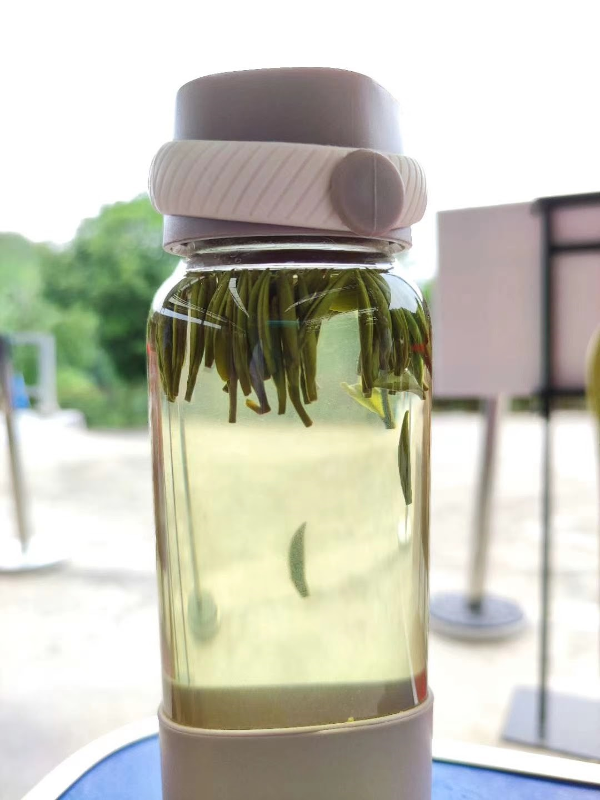

# 五绝

## 01 - 【如是我闻】

（一）
五眼谁为首？金砖你最萌!  
莫学他霸道，发展利苍生。

（二）
入道有多途，无分社与资。  
黑白非对立，灰里蕴真如。

 注：

- “入道多途”出自禅宗初祖达摩的【二入四行论】。
- 汉语成语有“殊途同归”。
- 邓小平有“白猫黑猫论”。
- 西方谚语也有“条条大路通罗马（All roads lead to Rome)”。

## 02 -  【茶】

浮沉自在游，深浅见春秋。  
冷热随冬夏，淡浓禅意留。

注：

每句前面加两字就成七绝：

芽叶浮沉自在游，色泽深浅见春秋。 

清汤冷热随冬夏，香气淡浓禅意留。

## 03 - 【闲居】

酒酣思李杜，梦醒念渊明。  
桃源今何在，邀月杯中寻。

## 04 - 【旅居】

窗明缘有鸟，几净恨无朋。  
家住山头上，楼孤客意萌。

注:

读朋友翡翠人生的【闲居】有感:

~~~
【闲居】- 翡翠人生

厅间一簇绿，盆上几丝兰，
家住闽江岸，楼高望水长。
~~~

## 05 - 【中秋】

今宵明月异，万古客心同。  
网络虽神妙，乡愁怕太浓。

## 06 - 【父亲节】

父道与天同, 茫茫四宇中。  
无穷江海水, 万物尽葱葱。

## 07 - 【不亦乐乎】

远客家乡至, 幽林众鸟欢。   
火红枫叶美, 应谢降秋霜。 

## 08 - 【花与雪】

窗前几朵开，窗外一片白。  
望雪心方净，观花念又来。

## 09 - 【赞格律诗】

方圆因规矩，美玉自雕琢。  
格律为何妙？言稀限制多。

## 10 - 【加勒比的黄昏】

海阔鱼沉睡，天高鸟倦飞。  
席空谁独坐？几净酒无杯。

注：

在加勒比海度假，偶然看到沙滩边棕榈树下，一张桌，几张椅，空无人。我在一张椅子坐下，照相留念。

## 11 - 【孤帆远影】

孤帆逆水行，远影浪峰轻。  
碧海长空尽，欲泊何处停？

## 12 - 【有感】

职海几春秋，浮沉独自游。  
幽悠思故水，何日异乡流？

## 13 - 【裁员】

今日裁员走, 十年尽效劳。  
旅途分岔口, 职场再开头。

注：

洛克希德马丁公司是美国最大国防供应商。公司主要靠生产武器。因IT服务竞争强烈，利润不如武器制造，洛马把IT业务卖掉。在公司上班整十年。本来想在洛马干到退休。

## 14 - 【读博】

半百读博士， 人生又一关。  
学习无止境， 好比日三餐。

注：

从2016年到2019年，在美国宾夕法尼亚州的罗伯特莫里斯大学（Robert Morris University）读信息系统与通信科学博士。2019年5月毕业取得学位，开始人生转型（Transformation）。

## 15 - 【无题】

生当做华人，死不为鬼魂。  
至今思元亮，不肯忘桃源。

注：效仿李清照【夏日绝句】“生当作人杰，死亦为鬼雄。至今思项羽，不肯过江东。”

## 16 - 【贺崔大鹏马拉松BQ】

猴年马上催，摇滚动春雷。  
大展鲲鹏翅，波城又一魁。

注：

BQ = Boston Qualified （波士顿资格）。波士顿马拉松世界著名, 参赛者根据年龄性别必须达到一定的成绩标准才能报名参赛。
知足常跑群崔大鹏在华盛顿摇滚马拉松（Rock N Roll Marathon）获得 B Q。这里把他的名字入诗。催谐崔。

## 16 - 【知“足”常跑】

赤脚亲草地，柔情从心起。   
知“足”常跑步，豪放不拘泥。

## 17 - 【情诗】

早知你是鱼，我即化作水。  
你如鱼得水，我年年有鱼。

注: 

吾弟超芳微信晒鱼缸,引用宋荦题江苏苏州沧浪亭对联“共知心似水，安知我非鱼”。典故出自【庄子·秋水】：

> 庄子与惠子游于濠梁之上，庄子曰：“倏鱼出游从容，是鱼之乐也。”惠子曰：“子非鱼，安知鱼乐？”庄子曰：“子非我，安知我不知鱼之乐？” 

猴哥以情诗一首回应。鱼谐余。

## 18 - 【裸跑】

赤足慢长跑，累赘尽量少。   
若非路人多，光屁股更好。

【Barefoot Joggling】
 
Jog without shoes on   
I enjoy so much freedom   
If nobody looks on   
I rather bare my bottom 

## 19 - 【天涯芳草】

奔命半世纪，侨居二分一。   
天涯芳草绿，情独钟故里。

## 20 - 【春】

春眠大早醒，被窝读微信。   
不怨天涯远，掌上有亲情。 

## 21 【梦】

强球十五亿, 夜夜梦黄梁。  
梦醒衣冠整, 乖乖去上班。

注：

2016年1月，美国的强球（Power Ball）彩票奖金高达十五亿美金。猴哥买了两张，充满期待，自以为很快就可以辞职退休了。