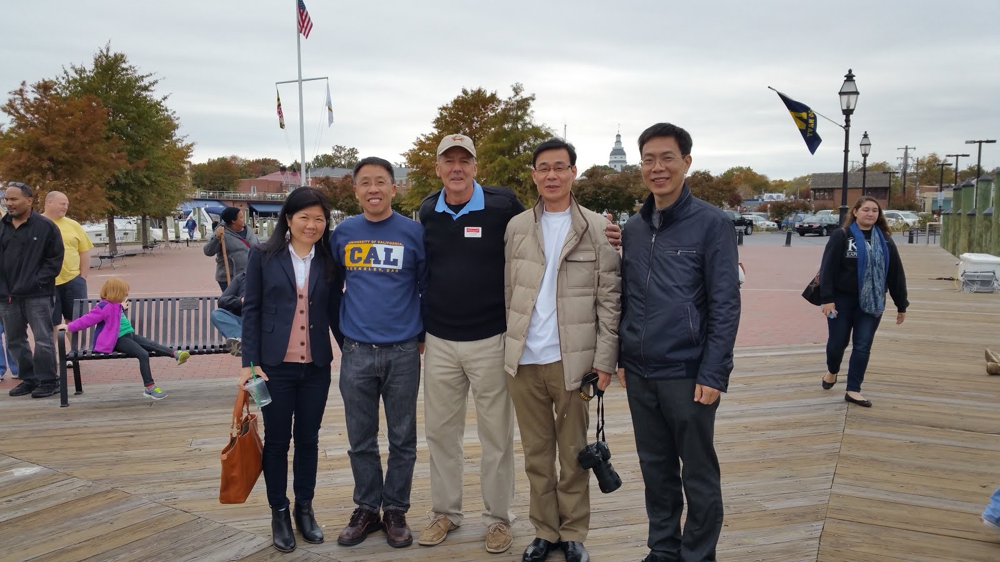
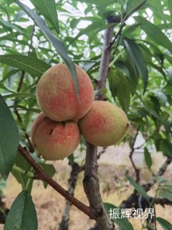
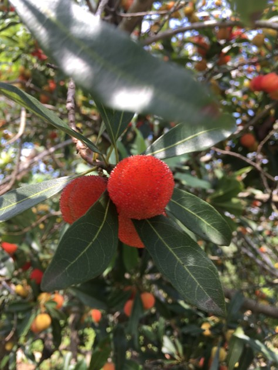
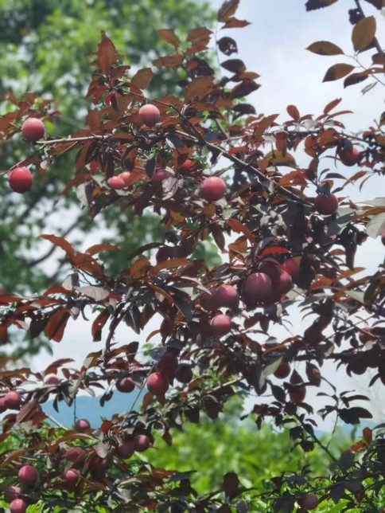
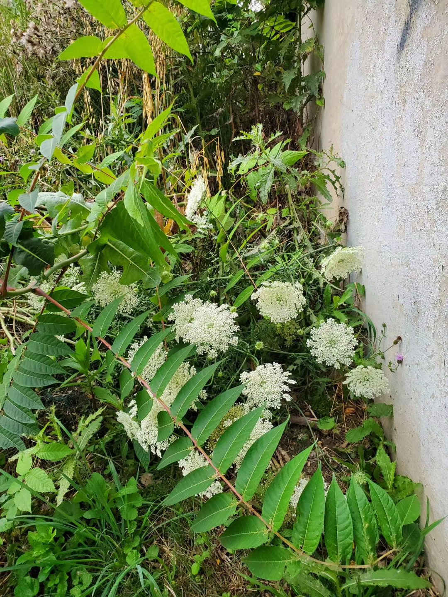
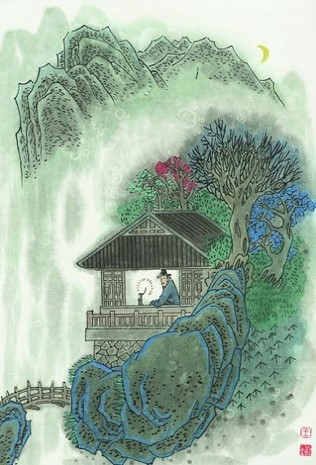
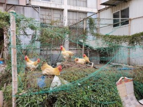
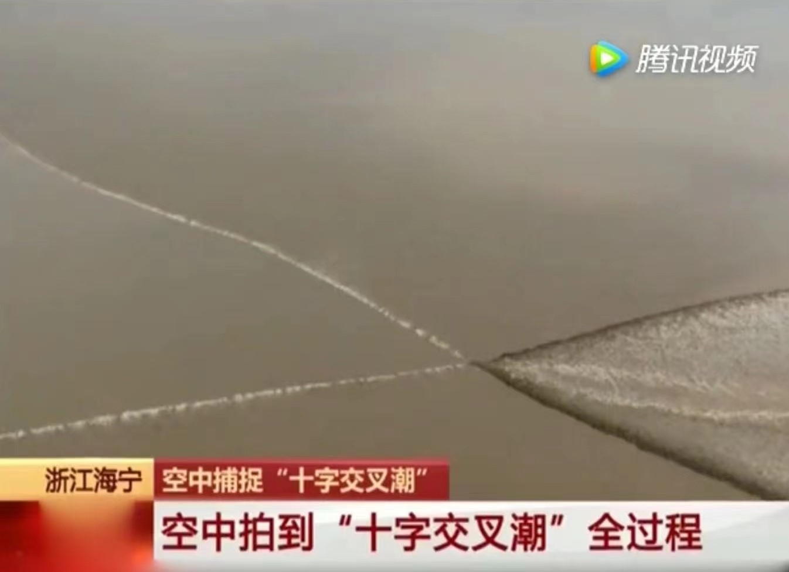
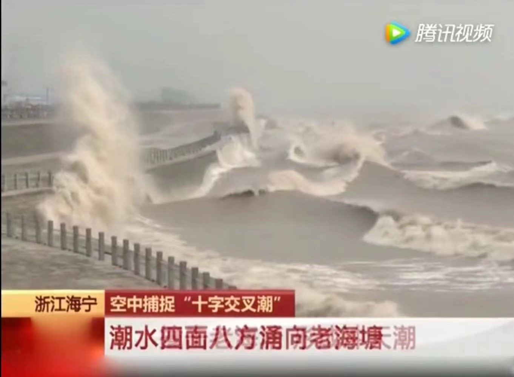

# 五绝

## 【如是我闻 • 新韵】

 （一）

五眼谁为首？金砖你最萌!  
莫学他霸道，发展利苍生。

（二）

入道有多途，无分社与资。  
黑白非对立，灰里蕴真如。

注：

- “入道多途”出自禅宗初祖达摩的【二入四行论】。
- 汉语成语有“殊途同归”。
- 邓小平有“白猫黑猫论”。
- 西方谚语也有“条条大路通罗马（All roads lead to Rome)”。

\newpage

## 【茶】

浮沉自在游，深浅见春秋。  
冷热随冬夏，淡浓禅意留。

注：每句前面加两字就成七绝：

芽叶浮沉自在游，色泽深浅见春秋。  
清汤冷热随冬夏，香气淡浓禅意留。

\newpage

## 【闲居】

酒酣思李杜，梦醒念渊明。  
桃源今何在，邀月杯中寻。

\newpage

## 【旅居】

窗明缘有鸟，几净恨无朋。  
家住山头上，楼孤客意萌。

注: 读朋友翡翠人生的【闲居】有感。

> 【闲居】- 翡翠人生
> 
> 厅间一簇绿，盆上几丝兰。  
> 家住闽江岸，楼高望水长。

\newpage

## 【中秋】

今宵明月异，万古客心同。  
网络虽神妙，乡愁怕太浓。

第二版：

东西明月异，今古客心同。  
微信虽神妙，乡愁怕太浓。

\newpage

## 【父亲节】

父道与天同, 茫茫四宇中。  
无穷江海水, 万物尽葱葱。

\newpage

## 【不亦乐乎】

远客家乡至, 幽林众鸟欢。   
火红枫叶美, 应谢降秋霜。 

\newpage

## 【花与雪】

窗前几朵开，窗外一片白。  
望雪心方净，观花念又来。

\newpage

## 【赞格律诗】

方圆因规矩，美玉自雕琢。  
格律为何妙？言稀限制多。

\newpage

## 【加勒比的黄昏】

海阔鱼沉睡，天高鸟倦飞。  
席空谁独坐？几净酒无杯。

注：

在加勒比海度假，偶然看到沙滩边棕榈树下，一张桌，几张椅，空无人。我在一张椅子坐下，照相留念。

\newpage

## 【孤帆远影】

孤帆逆水行，远影浪峰轻。  
碧海长空尽，欲泊何处停？

\newpage

## 【有感】

职海几春秋，浮沉独自游。  
幽悠思故水，何日异乡流？

\newpage

## 【裁员】

今日裁员走, 十年尽效劳。  
旅途分岔口, 职场再开头。

注：洛克希德马丁公司是美国最大国防供应商。公司主要靠生产武器。因IT服务竞争强烈，利润不如武器制造，洛马把IT业务卖掉。在公司上班整十年。本来想在洛马干到退休。

\newpage

## 【读博】

半百读博士， 人生又一关。  
学习无止境， 好比日三餐。

注：从2016年到2019年，在美国宾夕法尼亚州的罗伯特莫里斯大学（Robert Morris University）读信息系统与通信科学博士。2019年5月毕业取得学位，开始人生转型（Transformation）。

\newpage

## 【无题】

生当做华人，死不为鬼魂。  
至今思元亮，不肯忘桃源。

注：效仿李清照【夏日绝句】“生当作人杰，死亦为鬼雄。至今思项羽，不肯过江东。”

\newpage

## 【贺崔大鹏BQ】

猴年马上催，摇滚动春雷。  
大展鲲鹏翅，波城又一魁。

注：
- BQ = Boston Qualified （波士顿资格）。波士顿马拉松世界著名, 参赛者根据年龄性别必须达到一定的成绩标准才能报名参赛。
- 知足常跑群崔大鹏在华盛顿摇滚马拉松（Rock N Roll Marathon）获得 B Q。这里把他的名字入诗。催谐崔。

\newpage

## 【情诗】

早知你是鱼，我即化作水。  
你如鱼得水，我年年有鱼。

注: 吾弟超芳微信晒鱼缸,引用宋荦题江苏苏州沧浪亭对联“共知心似水，安知我非鱼”。典故出自【庄子·秋水】：

> 庄子与惠子游于濠梁之上，庄子曰：“倏鱼出游从容，是鱼之乐也。”  
> 惠子曰：“子非鱼，安知鱼乐？”  
> 庄子曰：“子非我，安知我不知鱼之乐？” 

猴哥以情诗一首回应。鱼谐余。

\newpage

## 【知“足”常跑】
 
赤脚亲草地，柔情从心起。   
知“足”常跑步，豪放不拘泥。 

\newpage

## 【裸跑】

赤足慢长跑，累赘尽量少。   
若非路人多，光屁股更好。

 【Barefoot Jogging】
 
Jog without shoes on   
I enjoy so much freedom 

If no one looks on   
I rather bare my bottom 

\newpage

## 【天涯芳草】

奔命半世纪，侨居二分一。   
天涯芳草绿，情独钟故里。 

\newpage

## 【春】

春眠大早醒，被窝读微信。   
不怨天涯远，掌上有亲情。 

\newpage

## 【中彩梦】

强球十五亿, 夜夜梦黄梁。  
梦醒衣冠整, 乖乖去上班。

注：

2016年1月，美国的强球（Power Ball）彩票奖金高达十五亿美金。猴哥买了两张，充满期待，自以为很快就可以辞职退休了。

\newpage

## 【梦山】

久居平阔地，昨夜梦山庄。   
绿树藏农舍，良田散土香。

\newpage

## 【读锐萍重阳节诗】

九九又秋凉，诗兄情意长。  
寒窗得皓月，暖句胜春光。

附：缪锐萍【2021重阳节】

> 又见东篱下，昔年不忍别。    
> 今当多载酒，共醉重阳节。

\newpage

## 【读见文重阳节诗】

（一）

九九又重阳，梦多嫌夜长。    
登高君望远，辗转我思乡。

（二）

九九又重阳，异乡秋色凉。   
窗前牙月冷，楼上客心寒。

附：缪见文【重阳节】

> 九九又重阳，星月来相伴。      
> 登高还望远，浩气入心怀。

\newpage

## 【中秋 • 新韵】

迷雾随流水，炊烟绕远山。  
无缘尘世见，相遇在云端。

\newpage

## 【悟 • 新韵】

云雾笼高塔，醉翁独坐禅。  
叮当微信响，唤醒有情郎。

附：缪锐萍【悟】

> 多情山俊秀，寡欲水常流。    
> 天地菩提树，何须世外求?

\newpage

## 【母爱】

女子手中线，不停一路牵。  
旅途虽短暂，母爱阔无边。

注： 今天坐巴士去华盛顿上班，边上的女士一上车就开始织毛衣说是给她女儿织的。我说这一小时车程， 是可以好好利用。

\newpage

## 【穆阳水蜜桃】

三桃你我她，绿叶缀枝丫。  
甜蜜家乡水，何时到海涯?

\newpage

## 【馋】

北美芳菲尽，老家梅李酸。   
悄悄吞口水，回味旧时欢。

\newpage

## 【野花 • 新韵】

几枝墙角白，清净少蝶来。   
过往谁人顾？怜惜异客呆。

注：
- 呆有两层含意：
  - 一是停下来，呆一伙儿，留步注目。
  - 二是呆傻。异客痴呆，与众不同，与野花一样寂寞清净，无人问津。
- 想起屈原的"举世皆浊我独清，众人皆醉我独醒。是以见放。”

\newpage

## 【五绝 • 夜读】

残月半空临，孤灯照客心。   
无言谁自语？欲说有谁听？

\newpage

## 【五绝 • 鸡仙】

网乃人编织，缚人难缚仙。   
小庭闲信步，天地阔无边。

\newpage

## 【渔翁醉晚 • 新韵】

夕阳倾暮色，弱草耸晴空。  
浪静涟漪淡，舟轻酒意浓。

注：
- 题目来自渔舟唱晚。渔舟改为渔翁，唱晚改为醉晚。算是异曲同工吧。
-【渔舟唱晚】是一首古筝名曲，其标题取自唐代王勃【藤王阁序】名句“渔舟唱晚，响穹彭蠡之滨；雁阵惊寒，声断衡阳之浦”。

附：缪锐萍【五绝 • 尾巴草】

> 辛丑孟冬上浣之九日，新历2021年11月13日，远航发江边夕照图，独有尾巴草抢眼，有感而作。
>
> 野岸无舟廓，江天映晚红。  
> 临风添妩媚，浩气寄苍穹。

\newpage

## 【码农诗】

两段数天得，一调大汗流。  
编程千古事，苦乐寸心知。

注：
- 自从进城，田园荒芜多年。这几年重操旧业。
- 写代码和写作有异曲同工之妙。
- 这里效仿贾岛的名句“二句三年得，一吟双泪流”和杜甫的名句“文章千古事，得失寸心知”。
- 借此展示一下码农的看家本领 (trade secret): 拷贝和粘贴 (copy and paste) 

\newpage

## 【穆阳石马兜】

津渡观石马，繁华商贾达。  
小舟追梦驾，雨巷风情洒。

附： 缪锐萍【忆秦娥 • 穆阳石马兜】

> 狮岩下，穆溪津渡观石马。观石马，繁华商贾，宾朋盈闼。
>
> 往昔追梦小舟驾，深深雨巷风情洒。风情洒，桃香城满，景色如画。

注：石马兜又称雨巷, [历史](https://kknews.cc/zh-sg/history/6943n63.html)。

\newpage

## 【秋 • 新韵】

空中月半明，枝上叶双轻。  
风过云无影，为何不见星?

\newpage

## 【江舟垂钓】

天湖落世间，垂钓四神仙。  
不见鱼儿跳，棹横舟自闲。

附: 缪锐萍【点绛唇 • 江舟垂钓】

> 天高云低，江阔舟横客垂钓，鸬鹚环绕，悠闲黄昏后。
>
> 潮落潮起，看秋月露颢。江南好，千钟美醪，一览风华貌。

\newpage

## 【观钱塘十字潮】

心胸两股潮，涨落比低高。  
命运三叉口，去留独自愁。

附： 缪锐萍【忆秦娥 • 观钱塘潮有感】

> 放眼望，双龙交汇千重浪。千重浪，推波助澜，江潮激荡。
>
> 十里长堤惊拍岸，万古钱塘如梦幻。如梦幻，不羁岁月，几回豪放？

\newpage

## 【两全 • 新韵】

饮酒胆才豪，喝茶性自高。  
两全何处觅？醉向碗中捞。

\newpage

## 【观自在】

云深禅有意，天阔法无边。  
身坐飞机上，心怀人世间。

\newpage

## 【2020 新冠】

白发三千丈，蜗居日更长。  
何时云鬓剪，回去看爹娘?

\newpage

## 【退而不休 • 新韵】

情怀藏万字，妙笔写千秋。    
一首接一首，志休心不休。

\newpage

## 【悟 • 新韵】

一念胜七宝，三生当贵之。  
言行虽重要，智慧靠觉知。

\newpage

## 【读佛】

自在观菩萨，如斯闻梵音。  
妙行无住处，万法自凡心。

\newpage

