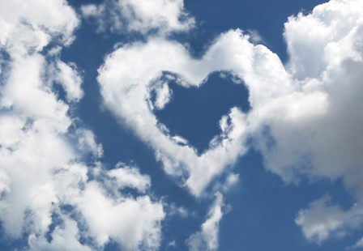
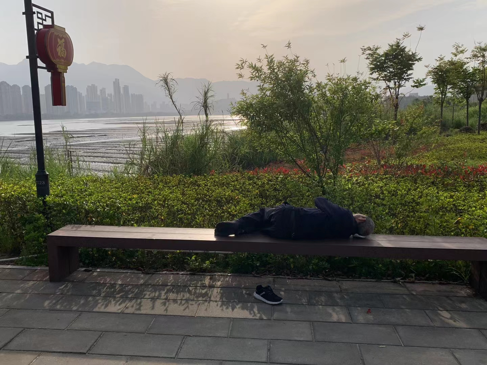
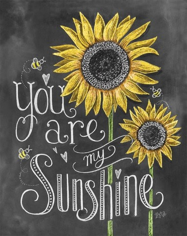
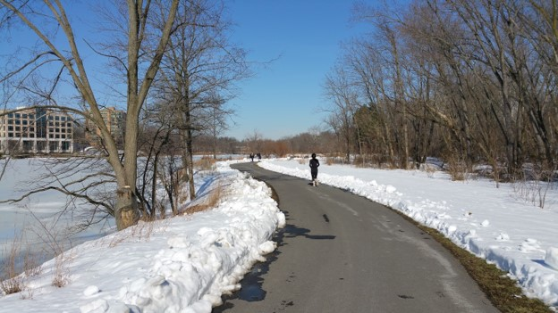
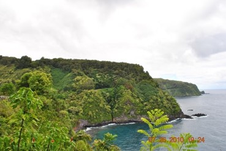
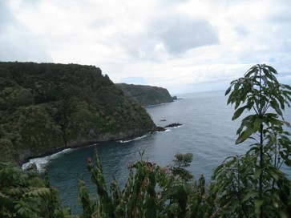

# 自然

## 【云】

我闭目  
想不出你的模样

我竖耳  
听不到你的声音

你时而闲栖在树梢  
你时而高悬在天上

你时而驻足俯视  
你时而随风飘移

你时而洁白如棉  
你时而尘埃蒙面

你时而近在咫尺  
你时而远在天边

你因阳光而灿烂  
你因月色而妩媚

你带来雨露滋润大地  
你化作雷电震撼苍穹

你没有固定的位置  
你没有规则的形状

你似近又远  
你去来无踪

你给人间梦幻  
你把天地相连

\newpage

## 【尼亚加拉大瀑布】

有一种距离  
和尼亚加拉大瀑布一样宽

任何一种跨越的尝试  
都是徒劳  
乃至危险

有一种落差  
和尼亚加拉大瀑布一样深

飞流直下  
势不可挡

人与人之间的距离和差异  
就当是大自然的造化  
一如尼亚加拉大瀑布

请不要因为无法超越  
而叹息无奈

就让我们为她的美丽   
叹而观止吧 

\newpage

## 【光膀晒太阳】

今天我又光膀  
因为我爱太阳  

没有阳光  
万物不能生长 

没有阳光  
人类生存困难

太阳懂体谅  
在我们睡觉的时候  
悄悄躲藏

太阳好心肠  
托月亮守护窗外  
让星星点缀我们的梦乡 

太阳很周到  
怕我们睡过头  
清早透过纱窗  
提醒我们该起床 

冰封雪飘  
她照耀大地抵御严寒 

雨过天晴  
她送来彩虹色彩斑斓

太阳是我们的榜样

做人要阳光  
带给他人温暖 

做人要有激情  
但不要过热把人烫伤

替人分忧  
为人着想  
但不给人施加压力   
不给人增加负担 

做父母的  
要学习太阳 

当领导的  
要学习太阳

今天我又光膀  
因为我爱太阳  

\newpage

## 【今天你晒太阳了吗？】

生命最重要的  
不是财富和权势  
而是阳光，空气和水

不论贫富  
不分贵贱  
我们每一个人的身家都一样

我们都平等地拥有大自然  
和她所赋予的  
取之不尽用之不竭的无价之宝

所以我们每一个人的身家  
都是无价的无穷的

至于钱财多和少  
至于官职高和低  
在无价和无穷面前  
都是微不足道的

阿里巴巴上市  
马云成为中国首富  
而他的身家  
与一个乞丐没有区别

奥巴马当美国总统  
称雄称霸世界  
但他的身家  
与一个囚犯没有两样

请不要羡慕  
马云的财富  
奥君的权势

请重视和珍惜  
任你享用无穷无尽的  
阳光，空气和水

今天你晒了吗？  

我知道你晒了  
你在网上  
晒了不少照片

今天你吸了吗？  

我知道你吸了  
你在KTV包厢里  
吸了许多乌烟瘴气

今天你喝了吗？  

我知道你喝了  
你在应酬宴请中  
喝了过量的酒精

但是请别忘了  
每天都要

晒太阳  
吸新鲜空气  
喝清水

\newpage

## 【阳光, 空气和水来自哪里?】

见到明媚阳光  
才知道自己在阴暗中摸黑了多久

吸到新鲜空气  
才知道自己在雾霾里喘息了多久

见到涓涓细水  
才知道自己在沙漠中饥渴了多久

见到你,  
才知道阳光, 空气和水来自哪里

\newpage

## 【我是太阳】

寒冬  
我带给你温暖

酷夏  
我会把你灼伤

有时  
被云遮挡  
我让你惆怅

偶尔  
我也悲伤  
你得撑雨伞

白天  
我的灿然  
让你心情舒畅

夜晚  
我借月光  
在你床前徜徉

不管春夏秋冬  
不论阴晴圆缺

我是太阳  
我最阳光

\newpage

## 【树】

做人  
要是能像一棵  
普普通通的树  
足矣

高也好, 低也好  
大也成, 小也成

有花无花, 有果无果  
枝多枝少, 叶茂叶疏

都不重要  
皆无所谓

只要

根  
深埋于大地

杆  
挺拔于苍天 

\newpage

## 【阳光, 空气和雨露】

要像太阳  
无分别心  
普照万物大地

要像空气  
给人供氧  
不留一点痕迹

要像雨露  
微风中  
润物无声细腻

不要学马云, 普京  
乔布斯和希拉里

财富和权力  
乃人类天敌

把那些商贾, 政客  
桶桶扔到垃圾堆里

不受外物刺激  
不被他人激励

谁敢拔苗助长?  
我根深扎土里

我只效法自然  
我就崇尚自己

\newpage

## 【湖】

不像江河奔流不息  
你永远守着同一圆心
 
不似海洋汹涌澎拜  
你一贯静默怡然自得
 
你平缓的湖面好泛舟  
你清幽的湖边好垂钓
 
寒冬，你被冰封雪盖  
春暖花开，鸟儿为你吟唱
 
盛夏，你有绿树环绕  
秋高气爽，红叶投影你的心怀
 
白天，你在阳光下波光潋滟  
夜晚，你在月色中烟雾朦胧
 
虽然原地不动  
你非死水一塘

当风起  
碧波荡漾是你的微笑

当雁过  
展翅翱翔是你的遐想

没有大海的深奥  
鱼群是你的宝藏

没有江河的踹急  
闲适是你的风范

当江河入海无影无踪  
你依然如故不声不响

你是跑者的天堂  
你是我的港湾

注：

- 美国马里兰州哥伦比亚市有三个湖。
  - 一个大湖， 一圈约2.5英里。
  - 一个中湖，一圈约2英里。
  - 一个小湖，一圈约1.5英里。
- 湖边是跑步的最佳去处。
  - 一则路径安全
  - 二则景色优美
  - 三则跑程好计算
- 跑步是一种享受：
  - 跑一圈是小资怡情 
  - 跑两圈是中产享乐
  - 跑三圈是土豪奢侈
- 仅以这首小诗献给爱好跑步的群众和朋友。

\newpage

## 【山海恋】

不要说你高山仰止  
其实我也望洋兴叹
 
雾绕山腰你不曾介意  
浪拍沙滩我没有妒嫉
 
落叶梦成孤帆一片  
浪花梦游青山绿水
 
待到暴风  
我会闻到你的咸味
 
待到闪电  
你会见到我的苍翠
 
偶尔雨过  
还有彩虹惊现

为那七彩瞬间  
守候千年

注：在夏威夷度假，看到山海相接，有感而作。

\newpage

## 【四季】

前几天好热   
仿佛听到夏天的脚步蹒跚 

这两天转凉   
似乎冬天刚刚告别又回乡 

春天里有冬夏   
夏天里也有春秋 

一如职场的反复无常   
一如生活的变化多端 

而冬天终究会到来 

只是希望那时   
能尽量留住秋天的金黄   
再创造一点春天的灿烂  

\newpage

