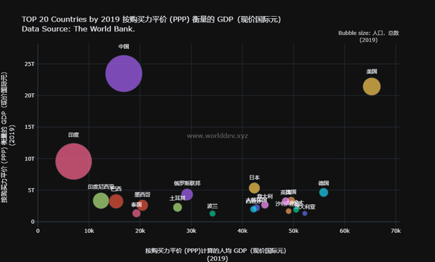
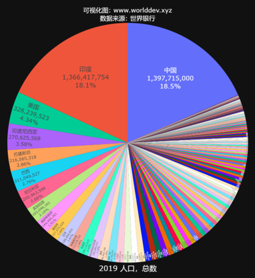
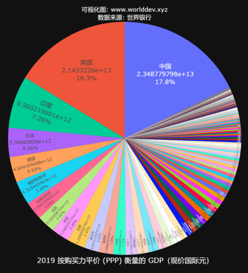
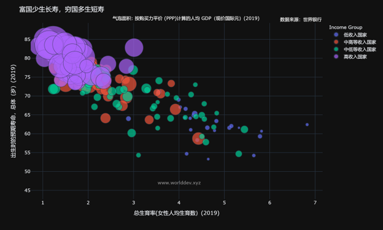
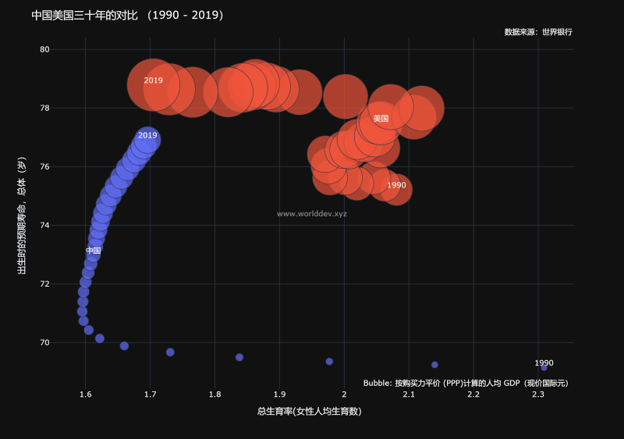
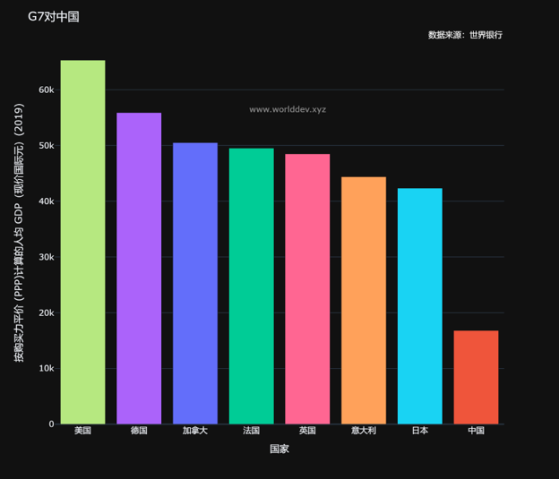
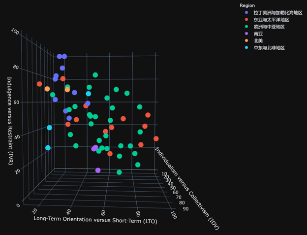
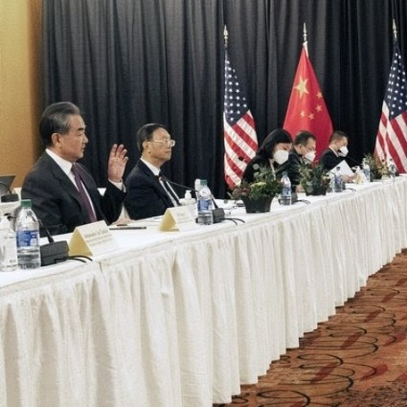

# 政治文化

## 【慎读】

社交媒体，良莠不齐。有人唯利是图，煽情造假, 以博眼球。
有人心怀恶意，煽风点火，挑起争端。如何避免被误导和欺骗？

- 第一，读文字要用批判的眼光 - 不要盲信。
- 第二，看问题要从全面的角度 - 以免偏见。
- 第三，下结论要凭理性的思考 - 避免感情用事。
- 第四，写评论要持建设的态度 - 刻薄嘲弄，无济于事。
- 第五， 先三思，慎转发。

\newpage

## 【中国与五眼联盟的文化差异】

本图从霍夫斯泰德的国家文化模型中取两个维度（长远导向程度和个人主义程度）来作可视化比较。

可以看出，中国文化以长远为优先，集体为至上，而五眼联盟文化则是以眼前为优先，个人为至上。

顺便提及，五眼的文化之所以相似，是因为它们的语言相同，都是英语。英国以外的四眼都是西方殖民扩张的产物。语言既是文化的工具，又是文化的体现。

政府和民众应对新冠病毒的态度，措施，和效果的天差地别正是体现了这两种文化的天壤之别。

中国与五眼联盟的较量，不仅仅体现在军事，经济，科技，和人才等各个方面。文化虽然看不见摸不着，却是不可忽视的重要一面。

相信一个既能深谋远虑，又能克己奉公的文化会永远立于不衰之地。

\newpage

## 【群虎之首】

七国集团(Group of Seven， 简称G7)由七个工业大国组成，可以说是列强俱乐部。G7以美国为首，其余六国皆是随从。这是因为美国在经济和军事上独占鳌头。这从两张可视化图一目了然。

图一: 美国的经济实力是其余六国的总和。

图二: 美国的军费支出是其余六国总和的三倍。

六国中，加拿大，英国，和日本跟美国最紧。因为加英都是英语国家，和美国文化最接近。日本则二战失败以后，为美国所控制，军事上成为美国的附庸国。

德法意三国比较独立，其中一个重要因素是它们都有自己独特的语言和文化。

\newpage

## 【军费开支】

通过两张数据可视化图了解世界各国军费支出分布情况。供参考。

道，法，术，器，势，必须全面。器只是其中一项。

如孙子兵法所言，道，天，地，将，法，以及智，信，仁，勇，严，一样都不能少。

光靠武器，远远不够。

伊拉克战争和阿富汗战争，前车之鉴，不可不察。

\newpage

## 【富和强】

四十多年的改革开放，中国经济高速持续增长，人民生活不断提高改善。大家公认中国富强起来了。

不过，富强这个词比较笼统模糊，有必要拆开做深入分析。其实富和强不同。富指人民生活水平，强指国家经济实力。

可以用人均GDP来衡量人民的贫富，用GDP总量来衡量国家的强弱。GDP总量大，说明国家经济实力足。人均GDP大，说明人民生活水平高。

这张散点图横坐标是人均GDP，纵坐标是GDP总量，点的大小是人口总量。图中只包含GDP总量前20名的国家。这张图告诉我们：

- 美国在右上角，是又富又强的国家。
- 中国在左上角，是强而不富的国家。中国GDP总量虽然超过美国，居世界第一，但人均GDP还不如墨西哥和泰国，离发达国家更加遥远。
- 右下角是富而不强的国家，除了日本，韩国，和沙特以外，其余是西方发达国家。
- 左下角是既不富又不强的国家，它们分布在南亚，东南亚，拉丁美洲，中东，和东欧。印度是其中最强也最穷的一个。

\newpage

## 【人性是什么？】

**一。善性**

人之初，性本善。 

【三字经】

人性善，人性之善也，犹水之就下也。人无有不善，水无有不下。  
【孟子·告子上】

一切众生，悉有佛性。   
【涅槃经】

**二。恶性**

人性恶，人之性恶，其善者伪也。 
【荀子·性恶篇】

**三。自私性**

人不为己，天诛地灭。

**四。个体性**

人之不同，各如其面。

**五。群体(部落)性**

物以类聚，人以群分。

\newpage

## 【中印美 Chindius】

今天我发明一个新的英文词: Chindius， 用来代表中印美三国联盟:

Chindius = China + India + US

美国，人口占世界不到百分之五，地处偏僻的北美洲，东与欧洲远隔大西洋，西与亚洲远隔太平洋，
而军事基地却遍布全球各个角落。美元是国际贸易的结算货币，华尔街是国际金融中心, 
美国百年来一直独领风骚，称雄八方。

中国和印度人口各占世界近五分之一，而长期处于落后地位。过去半个世纪不断发展，
跃居世界经济强国之列。对美国维持霸主地位确实是一种挑战。

美国的盟友都是小国家。人口最大的是日本，一亿多，占全世界不到百分之二。
其余像韩，德，英，法，澳，加，人口就更少。

所以中国的强大确实对美国维持霸主地位不利。美国拉拢人口第二大，经济总量第三大的印度，也是可以理解的。

中印美人口加起来占全世界百分之四十以上，经济总量加起来也占全世界百分之四十以上。

如果美国能够放弃一国独大的霸权主义，和中印联盟，取长补短，互相学习，
共同解决全球面临的各种难题，
人类的未来将会更加美好。

\newpage

## 【财富与健康】

财富与健康的关系极其密切。英文的Wealth（财富）与Health（健康）就一个字母之差。
图一有助于了解这种关系。

预期寿命是健康的一个标志。人均GDP是财富的一个标志。最近中国放松生育政策，允许一对夫妇生三胎。所以我把生育率数据也引入图形。

本图每一个气泡代表一个国家，气泡面积代表该国人均GDP。总共178个国家。左上角是富国，低生育率，长寿命。右下角是穷国，高生育率，短寿命。

看来，财富影响健康和生育。

图二比较中国和美国过去三十年的发展变化。中国的气泡（人均GDP）比美国小，中国2019年的人均GDP还不到美国1990的水平。中国的预期寿命三十年来不断提高，逐渐接近美国。生育率上世纪90年代一直下降，世纪末开始回升，逐步接近美国。

\newpage

## 【G7对中国】

七国集团（G7）峰会在英国召开。主要议题是如何勾结起来围堵中国。

图一：GDP总量的分布。中国和美国相当，各占三分之一。美国之外的六国经济总量加起来相当于一个美国，占剩下的三分之一。G7勾结起来，就相当于两个美国对付一个中国。

图二：人均GDP比较。中国在这八个国家中是最穷的。富国联合起来欺负穷国。

图三: 人口数量，中国是G7总和的两倍。人多力量大。只要团结一心，不内斗，不内卷，持续稳定发展，就能转危为安，战胜外敌。

形势严峻。中国不能单打独斗，也要建立国际联盟，抱团对抗。还要继续韬光养晦，发展壮大。

世界各国本该同心协力，解决争端，对付危机，促进和平。这是理想。但现实残酷。

\newpage

## 【个人小结：从危机中学习】

【一】患难见真情

人类的命运是连在一起的。我们每个人都离不开家庭，每一个家庭都离不开邻居，社区，和国家，每一个国家都离不开其他国家和全球。互斗，则两败俱伤。互助，才共度难关。和平时期争权夺利，尚可理解。危难时刻，互相责骂拆台，则不可取。同时我们也要认识到”物以类聚，人以群分“。每个人，每个民族，每个国家，都有自己的特点，皆平等独立。文化不同，制度不同，信仰不同，实为正常。只是不能以己之心，度人之腹，以己之见，强加于人。

【二】摸石头过河 

新冠病毒的全球大规模传染是一个十分复杂的生物医学及社会文化现象。人们对这个现象的认识有一个学习过程。应急时难免有认知的不足，行动的缓慢，和决策的失误。学习需要时间，应对需要科技和智慧的结合。我们不能一味指责政府，领导，专家及民众。社交媒体上爱指点江山，激扬文字的，大都活在现代世外桃园，不识人间烟火，“不知有汉，无论魏晋”。

【三】科技两刃刀

科学技术是一把两刃刀。在抗疫中，互联网和社交媒体让沟通更及时，更方便，更规模，但也成为错误信息和恶意谣言传播的途径和无端争斗的平台。科学技术既能带给人类便利，也会对人类的思维产生负面影响。发达的科技，让人们忘记现实世界的复杂性，随机性，不确定性，和不可知性。人们因此养成过于简单的，确定的，机械的，非0即1的逻辑思维方式。人人自以为是，而别人都是错的。

【四】 健康多维度

新冠病毒不仅仅造成病患和死亡，它对康复者，未感染者，医护工作者，领导人，及各行各业的从业者都会带来各种各样的，心理，社会经济，心灵上的负面影响。这种非生物病理的健康维度，往往被人们所忽略。不仅抗疫期间要重视，抗疫之后，恢复正常生活和生产更要注意这些因素。完善社会制度，改进国家治理是应对未来公共卫生危机的最好预防措施。

【五】兴亡百姓苦

古人说”兴，百姓苦，亡，百姓苦“。 在新冠之前，世界各个角落，不管是落后穷国，还是发达富邦，都有贫穷落魄，在社会低层挣扎的人群。他们在新冠病毒流行中，就业和生存更为艰难，更受歧视，偏见，和不公。他们没有良好的饮食和居住条件，受感染的风险更大，感染后得到的医护更差，死亡率更高。一个国家的强弱，可以用它的经济实力，军事力量，和科技水平来衡量。但是，一种制度和文化的优劣则直接反应在它对待弱势群体的态度和关怀上。

【六】危机是镜子

危机即是一个机会，也是一面镜子。通过危机，我们对个人行为，家庭关系，国家制度，国际事务会有更深度的审视和了解。我们对一个国家的社会制度和医疗体系的优劣强弱，以及公民的生活条件，对资源的拥有，和社会的公平等等都有更深刻的认识。健康与医疗是社会经济文化的一个折射和缩影。应对传染病传播和公共卫生危机务必兼顾生物医学，社会科学，和国家治理。

\newpage

## 【读离骚 怀屈原】

端午节，写一联，缅怀先贤，鼓励自己。

横批: 逝者如斯  
上联: 不屈守原 上下求索归一水  
下联: 悲离吟骚 古今天问醒众人

附：屈原其实也讲乐《九歌·少司命》中写到：

“悲莫悲兮生别离，乐莫乐兮新相知。”

所以悲乐不可分。有相聚之乐就有别离之悲。

\newpage

## 【三个时代，三种思维模式】

美国未来学家托夫勒在80年代出版的畅销书【第三次浪潮】中把人类社会的进程分为三个阶段：

- 农业时代
- 工业时代
- 信息时代。

这三个时代可以形象地用三个F打头的英文字来代表：

- Farm（农场），
- Factory（工厂），
- Floppy（软盘）。

三个不同时代都有自己独特的思维模式。我总结如下：

**农业时代的圆形0思维模式**

以个体生存和家庭生活为基础，受田园农场影响的圆形0思维模式。这是一种朴实，和谐，内向的思维模式。
这种模式下，人们同甘共苦，和平相处。人归自然，天人合一。这种思维的特色在精神层面。

**工业时代的线性1思维模式** 

 以福特的批量生产线和泰勒的科学管理为基础，受工厂装配线影响的线性1思维模式。 
 这是一种简单，直线，量化，重复的思维模式。这种模式导致科技高速发展，物质高度发达。
 这种思维的特色在物质层面。

**信息时代的二元对立01思维模式**

 以互联网和社交媒体为基础，受电子计算机影响的二元对立01思维模式。这是一种非黑即白， 分裂，对立，外向的思维模式。
 这种模式容易引起社会矛盾，政治斗争，和国际争端。这种思维特色在集虚拟层面。

科技进步让机器人越来越拟人化，而人则变得越来越机器化。

线性思维和二元分裂思维都有局限，我们应该提倡圆形思维。

这证实了农业时代的圆(o)思维模式的优越性。扎根于土地，包容万物。
没有工业时代线性思维的简单化和信息时代二元对立思维的排他性。

“归去来兮，田园将芜胡不归?”

\newpage

## 【只有社会主义才能救美国】

美国视社会主义为大敌。恨之入骨，惧之如魔。其实这是极端愚蠢的。世界上已经不存在美国臆想中的社会主义。
中国特色的社会主义吸收了资本和市场的合理有益之处。这是中国四十年改革开放成功的重要因素。
美国如果聪明一点的话，应该采纳社会主义的合理有益之处，并学习东方智慧和中国崛起的经验，
借此帮助解决美国内部种族分裂和贫富悬殊的困境。只有采纳社会主义理念和学习东方文化智慧才能救美国。
这才是美国长久之计。挖中国墙角与中国为敌是不明智的也是无效果的。
弱人不如强己，害人不如学人。竞争不如合作，独吞不如双赢。

>
> In public, the Pentagon was saying China is a threat to US interests because of the choices of its
> leadership, but in private, the NSC was frankly stating the conflict was, cold war-style, a showdown 
> between capitalism and socialism that will continue until one or the other is defeated.
>
> 五角大楼在公开场合说，由于其领导层的选择，中国对美国利益构成威胁，但在私下里，美国国家安全委员会则坦率地说，
> 这场冲突是冷战式的，资本主义和社会主义之间的摊牌将持续下去。 直到对方被击败为止。
>
> [【资料来源】](https://sputniknews.com/asia/202101151081783213-trump-administration-unexpectedly-declassifies-nscs-2018-indo-pacific-strategy-framework/)

\newpage

## 【人权与主权】

人是群居动物。物以类聚，人以群分。

集体由多个个体组成。没有集体，个体无法生存。没有(单个)个体，集体依然存在。所以集体大于个体。

人权属于个体，主权属于集体。一个国家的主权是每一个国民，所有国民的人权的总和。
没有国家主权就没有个人人权。所以主权高于人权。

国家以人权为借口干预他国内政，个人以人权为借口背叛祖国，都是不可取的。

国家是为所以人民服务，不是为某个或某些人服务。部分个体的利益和权力不能代表所有国民的利益和权力。
当集体的生存遭到威胁时，部分个体不得不为了全体人民的生存而牺牲自己的利益和权力。

这种简单的线性的次序的排列，并不能反映复杂的，互为因果，互相依存的社会现象和社会关系。

人民和国家分不开，不能说那个更重要。国家就是由全体人民组成的。不可分割。

但是，某一个人，某些人，就不代表全体人民或国家。所有他们的权利是在国家，人民权力之下。

没有他们，国家照样存在。没有国家，他们就没有生存之地。

当瘟疫流行，对民族的生存造成威胁的时候，所有人都要带口罩，保持距离，避免聚会，打疫苗。
这个时候，所有的人的个人的自由和权力都要受到限制。一部分人也许认为他们没有必要照办，
他们对自己负责，可以自由选择，自主决定。但是他们的个人权利没有全体人民和国家的重要，必须服从，必须牺牲。

牺牲个人，成全集体，是东方文化的特点。这并不等同于人权受危害剥夺。
个人自由是人类进步的动力，但极端个人主义则是对人类生存和持续发展的极大危害。

\newpage

## 【中西差别】

想起多年前非典时，我听说韩国泡菜可以治非典。虽然不知真伪，但也从另一个角度说明中医之效。泡菜可以算是一剂中药。

中西医之别也是东西方文化之别的体现。前者强调人自身的力量，后者依赖外在的技术及工具。
前者顺其自然，后者急功近利。用一个比喻，前者是功夫茶，后者是速溶咖啡。

中西结合，系统防治。以防为主，治为辅。以人体自愈力为主，外在药物手术为辅。以追求长康为主，缓解短痛为辅。

再引申到中美之争。美国认为贸易战他们赢了，其实他们最多是赢了一场战斗而已。输赢要看持久的文化和技术的实力和平衡。
中国如果能弘扬传统文化传统，发挥传统文化优势，再铺之发达的科技，做长久打算，终将胜利。
当然，两国之间还是合作共赢最佳。但这不是一厢情愿。西方殖民文化注定要侵略和掠夺，竞争和战争。

人类其实是很愚蠢的。两千多年的学习，智力是提高了，智慧却在不断减少。物质是丰富了，而精神却越来越匮乏。
所以我对人类的现状和未来基本持悲观态度。

\newpage

## 【极简人类文明史】

从哲学到神学到科学，人类文明史丰富多彩。

三学和谐，世界和平。

\newpage

## 【文化差异】

我以为人与人之间的冲突，国与国之间的冲突归根结底是文化的冲突。

为什么五眼能联盟？因为他们的文化相似。比如他们说同样的语言英语。语言是文化的一个重要方面。

为什么五眼联盟对中国另眼相待？因为中国文化和他们的文化有较大差异，他们缺乏对不同文化的尊重和包容。

荷兰社会心理学家霍夫斯泰德（Hofstede）从六十年代末开始利用在IBM工作的机会，
通过问卷调查几十个国家十多万IBM员工并通过严谨的统计分析，建立了一个国家文化模型。

这个模型经过多年多次修订完善，最终形成了六个维度的衡量指标：

- 权力距离指数（Power Distance Index，缩写为PDI）：指在家庭、公司、社区等组织机构中地位较低的成员对于权力分配不平等的接受程度。
- 个人主义（Individualism，缩写为IDV）：与集体主义相对，指个人融入集体的程度。
- 不确定性规避指数（Uncertainty Avoidance Index，缩写为UAI）：指社会能在多大程度上容忍不确定性。
- 男性化（Masculinity，缩写为MAS）：与女性化（Femininity）相对，指人们（不论男女）更富有竞争精神，自信与野心，注重财富和社会资源的积累，而女性化社会則注重人们之间的关系和生活的品質。
- 长期导向（Long-Term Orientation，缩写为LTO）：最初名为“儒家动力”（Confucian Dynamism），指社会对未来的重视程度。
- 放任与约束（Indulgence vs. Restraint，缩写为IVR）：指社会成员在多大程度上意图控制自身的欲望。

这里和大家分享我自己制作的两张文化差异数据可视化图像。 我选择其中比较容易理解的三个维度：

- 个人主义与集体主义 
- 长期导向与短期导向
- 放任与约束来作三维散点图

图一显示的是所有国家，每一个点代表一个国家，点的颜色代表国家所在地区。
可以看出点的分布松散随机，显示世界文化的多样化。

图二把中国和五眼联盟放在一起作比较，可以看出， 五眼联盟的五个国家文化十分相近，形成一个聚类。
而中国文化金鸡独立，与五眼联盟相距甚远。

\newpage

## 【智慧与智能之较量】

今天把中美谈判一个多小时的视频看完。中方表现十分出色。杨委员和王外长不亢不悲，大智大勇。
他们既有备而来，又临阵发挥。翻译官也是头脑敏捷，话语铿锵。蛟龙镇虎，海内外华人为此扬眉吐气是很自然的。

中美之争表面上看是经济，科技，军事，及制度之争，然而究其深处则是文化之争。
文化多样并互相包容，世界才丰富多彩，和谐平安。文化对立并歧视不容，则纷争四起，杀气腾腾。

这次教量，充分体现了东方智慧和西方智能之别。智慧和智能本是人性之两面，阴阳互补，才有和谐。
中美唯有合作，互相学习，取长补短，世界才能共赢。

我认为中方的强烈反击和美方开场白用多少时间没有关系。我想中方是事先充分就准备好的。
美方在会议前制裁中国官员，访日韩造舆论，等等行径是其中因素。美国国务卿的开场白也被认为是无理挑衅。
另外我想中国也想利用这个难得机会教训一下美国。从来都是美国人给全世界上课。这次，全世界人看中国人给美国人上课。

中方刺激美国痛点后布林肯的回应软弱无力。苏利文搬出土星项目更是牛头不对马嘴。
也反映美国把实力科技当作一切。让我感觉武夫缺德，土豪无识。

当下的所有美国人不论龄多大，他们的生活经验中，美国一直是世界最强大最繁荣的国家。
如里根说的:"美国是山顶上的一座闪亮的城市"。在美国人眼里，他们就是世界的领导者和看护人。
他们的眼睛被这种荣耀挡住，看不到其他国家和人民的多元多样化的生活方式，思维方式和治理方式。
同时他们对其他民族的苦难和挣扎也缺乏悲悯和同情。
这和他们对美国的少数族(黑人，西班牙裔，印第安土著)的压迫和无情是一致的。
美国是发达国家中唯一没有全民医保的。其中一个深层原因就是种族问题。富足的白人不愿意为贫穷的少数族买单。

过去半个世纪的全球化，中国的崛起。美国国内少数族裔人口的增加，要求更公正，平等的待遇和机会。
他们一下子不适应。还想用老一套的做法来统治世界，治理国家。

\newpage

## 【贸易，贸易逆差，贸易摩擦】

一个富人雇了一个穷人。穷人为富人做饭及打扫卫生，富人付穷人工钱。这就是贸易。

这里穷人卖劳力，富人付费享受穷人的服务。这就造成贸易逆差。不过，富人没有抱怨逆差。
自己不爱做的事，花钱请人做，何乐不为？管他逆差顺差，被人伺候，就是好差。

后来穷人向富人学习文化，并从工钱里拿出部分付学费。贸易逆差就缩小一些。
穷人有了文化，就和富人谈判，要求提高工资。富人想，有文化的佣人做事更清楚。
况且，若不涨工资，怕被别人挖去，就接受了。贸易就是这样简单，互相平等，互赢互利。

过了几年，穷人把辛苦钱攒起来，供孩子上学。穷人孩子读书勤奋，成绩拔尖，毕业后找到一份高薪职业，
穷人家就慢慢地富了起来。这时，富人开始感觉不爽，认为这个贸易不公平，开始抱怨逆差，并找各种理由挑刺。
比如，穷人不讲卫生，菜没有洗干净，上完厕所不洗手，偷看富人私家藏书等等。富人和穷人的关系开始恶化。
这就是贸易摩擦。

贸易摩擦其实和贸易逆差没有什么直接关系。贸易摩擦是由贸易双方的地位变化引起。
想想也难怪，如果大家都是富人，那脏活，臭活，苦力活，危险活，不体面的活，和伤身体的活由谁来做？

\newpage

## 【波音737和马云996】

波音737事故  
AI不听从人的指挥  
制造商置利润于生命之上  
政府监管不力  

马云996言论  
高管成为资本的工具  
劳工成为资本的奴隶  
人性被技术和资本吞噬

\newpage

