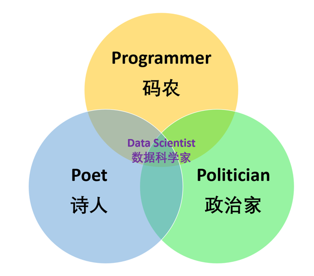
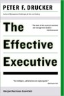
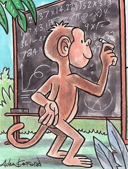
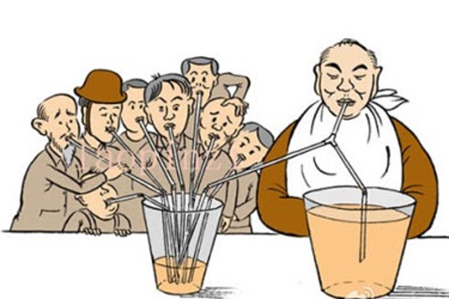
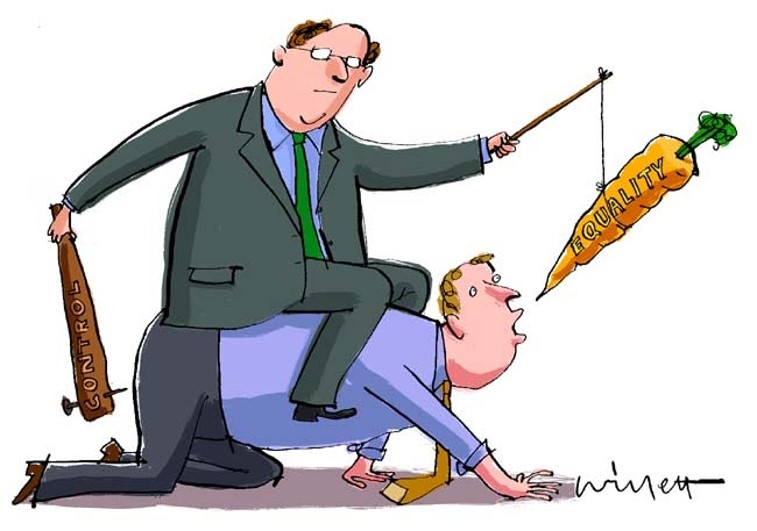
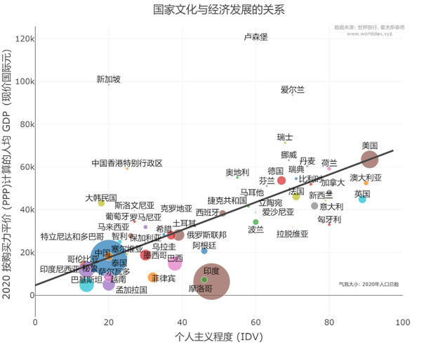
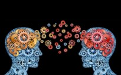
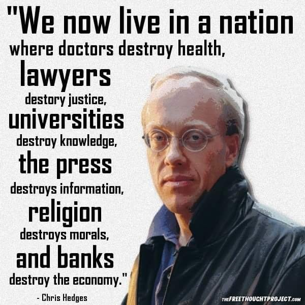
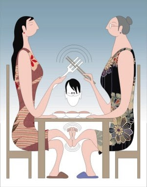
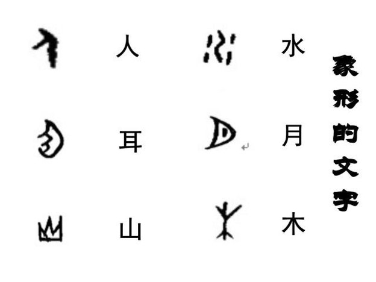

# 经管科技

## 【数据，诗， 和远方（一）】

> “科学不只是眼前的数据， 还有诗和远方。” - 穆阳猴

从前有个县官，负责扶贫。他派部下到一个贫困村调研。部下回来送上一份十分详尽的调研报告。县官没翻几页就看不下去，因为他政务繁忙，没有时间和耐性细读。

有一天，县官和他的诗人好友相聚，煮酒品茶之间，聊起这事。 诗人自告奋勇，愿意代劳阅读。几天后，诗人送上一份总结，不到一页，县官大喜。半分钟阅毕，立马做决策。

这份总结内容是一首五绝，仅二十字：

> 一去二三里，烟村四五家。  
> 亭台六七座，八九十枝花。

县官读第一句，想到这个村离县城近，不宜发展工业，怕噪音和污染影响城里人民生活。读第二句，想到这个村人口少， 发展农业怕劳力不够。读到第三句，感叹这个村文化底蕴深厚。
读到第四句，更被这个村的优美环境所吸引。这不是发展旅游业的最佳条件？！于是立马做决定，叫来旅游局局长安排落实。

这个古代诗人就是我们现代所谓的数据科学家。数据科学就是从大量数据中挖掘信息，发现知识，并用简单易懂的方式与人分享， 辅助决策。

\newpage

# 
# 【数据，诗，和远方（二）】

> “科学不只是眼前的数据， 还有诗和远方。” - 穆阳猴

自从诗人为领导读报告写总结传为佳话后，不少县官纷纷东施效颦。其中有一个县官还有所创新，直接让他的诗人朋友去一个贫困村调研。
诗人回来交了一份调研报告，不到一页。内容是也一首五绝，仅二十字：

> 满纸荒唐言，一把辛酸泪。  
> 都云作者痴，谁解其中味。

县官读完，一头雾水，不知所云。原来诗人下乡看到百姓的贫困生活，非常痛心，不知如何禀报。心如乱麻，情不自禁，就写了这首五绝权当调研报告。

所以数据科学家不能光有诗人的情怀，还要有政治家的胸怀。遇事不慌，坐怀不乱。面对现状，如实报告。出谋献策，辅助领导。

\newpage

## 【数据，诗，和远方（三）】

> “科学不只是眼前的数据， 还有诗和远方。” - 穆阳猴

有个县官被安排到穷乡僻壤去锻炼。赴任前，让他的诗人朋友先去乡下了解情况。诗人回来写了一份报告。报告就一页，内容是一首五律，仅四十字：
~~~
见说蚕丛路，崎岖不易行。
山从人面起，云傍马头生。
芳树笼秦栈，春流绕蜀城。
升沉应已定，不必问君平。
~~~

诗人不避讳报告坏消息，直接告诉领导“山路崎岖不好走啊，兄弟”。诗人通过山和人，云和马的强烈对照来描写山路险峻。
寥寥十字，让人如入其境，堪称史上最牛的数据可视化 (Data Visualization) 图形。

诗人不仅给领导提供精准信息，还替领导出谋划策: "兄弟，你的仕途早已命中注定，不必去求卜问卦了。依我看，你还是随遇而安，顺其自然吧"。

这位诗人应该算是史上比较高明的数据科学家。难怪人们称他"诗仙"。按现代标准堪称数据科学的"学霸"。
 

\newpage

## 【数据科学家的曾用名】

2012年世界著名的【哈佛商业评论】（Harvard Business Review) 把数据科学家（Data Scientist）标榜为 “二十一世纪最性感的职业” 。
然而，人类从事数据科学的活动由来已久。以下这些职业都可以列入数据科学家的行列，都很性感。
-	经济学家 Economist（特别是从事计量经济学 Econometrics 研究的）
-	流行病学家 Epidemiologist (流行病学后来也有一个性感名字叫人口健康管理 Population Health Management）
-	精算师 Actuarialist （保险业）
-	统计学家 Statistician（传统的统计学以小样本数据和精准数学推倒来估计总体参数和推断总体特征）
-	商业分析师 Business Analyst （属于工商管理领域）
-	金融/财务分析师 (Financial Analyst)（属于工商管理领域）
-	数据分析师 Data Analyst （介乎工商管理和信息技术之间）
-	数据工程师 Data Engineer （属于信息技术领域）
 

\newpage

## 【数据科学家的素质】

2012年世界著名的【哈佛商业评论】 (Harvard Business Review) 把数据科学家标榜为 “二十一世纪最性感的职业” 。

数据科学家之所以性感，应该源于她是一个多学科，交叉学科，边缘学科的综合人才。
她不仅要精通科学技术，还要懂得人文艺术，更要重视经济管理哲学政治。简而言之，数据科学家的素质可以用三种职业或三个P来概括。

-	Programmer 程序员（码农）

计算机代码和软件是现代信息技术的核心。编程乃是数据科学家的基本功。码农这个职业在过去几十年的发展中，变化很快。从最初的手工，独立的自留地耕作，到现在的多环境，多平台，多工具的团队协作及大规模流程化集体生产。数据科学家要懂数学，统计学，数据库，数据处理，数据可视化，机器学习，深度学习等各种技能。
-	Poet 诗人

数据科学既是科学又是艺术。数据科学家要有人文情怀，具备系统思维能力，面对复杂现象，要有好奇心和谦卑感。数据科学作为一门交叉边缘综合学科，需要多学科多行业的密切合作，这就要求数据科学家学具有团队精神，善于与人打交道，协作共赢。
-	Politician 政治家

数据科学的宗旨是为决策提供科学依据，为社会解决棘手问题。数据科学家务必有经济管理者和政治家头脑，懂得成本效益分析，了解组织管理理论，理解政治利益冲突。数据科学家还要讲道德伦理，学会分析和纠正数据和算法中存在的偏见，保护数据安全和个人隐私。

\newpage

## 【统计推断 vs 机器学习】

俗话说西瓜大的甜，饺子小的香。小样本和大数据两者各有千秋。 我们不能小看小样本，也不能夸大大数据。就如小家碧玉和大家闺秀一样各有魅力，都讨人喜欢。

基于小样本的统计推断是统计学的核心。统计学源于应用数学，至今已有三百多年的历史。

基于大数据的机器学习则是伴随电子计算机的发明而出现，至今也有大半个世纪的历史。
过去十年由于计算机的存储空间和计算能力的指数增长和电子数据的海啸般积累推动了机器学习和人工智能的迅猛发展。

数据科学家既要懂统计学又要懂计算机科学。根据多年工作经验和学习心得冶炼升华形成的这一张图，从六个维度比较统计推断和机器学习，让你一目了然。

\newpage

## 【唐僧的团队】

 【西游记】讲唐僧带领沙和尚，孙悟空，猪八戒，白龙马，师徒一行五“人”，跋山涉水，降魔斩妖，西天取经。
  
这实在是一个最佳的团队组合。
  
为什么唐僧就带一个和尚，不多带几个呢？因为一个和尚挑水喝，两个和尚抬水喝，三个和尚没水喝。所以唐僧就带一个沙和尚。
  
孙悟空神通广大，会七十二变，一个筋斗行十万八千里，取经路上，贡献最大，为什么不多招几个呢？
  
一方面是这种高端人才太少，另一方面是这种人才大都奇货可居，比较高傲，难以降服。再者，一山容不得二虎，多了就容易引起争权内斗。
  
猪八戒和孙悟空真好相反，能力不足，贪图享受，经常坏事。这样的“人”其实并不都是多余， 他们对团队能够起到中和调节的作用。
当然，一个就够，多了就影响士气和战斗力。
  
白龙马则是队伍里默默无闻的无名英雄，一路上师父就靠他坚强和舒坦的马背才得以长途跋涉，终得真经。 
  
如果你是风险投资资本家，你完全可以聘用唐僧师徒四人作为你的管理团队。根据每个人的性格和能力，他们的分工可以作如下安排: 
- 唐僧（有使命感，善于用人）: 总裁
- 沙和尚（老实忠诚）: 副总，分管财务和融资
- 孙悟空（多变激进）: 副总，分管市场营运和销售
- 白龙马（任劳任怨）: 副总，分管研究，开发和生产
- 猪八戒（懒散但有亲和力）: 副总，分管人力资源和职工福利
 
【附：唐僧管理团队成员个人简介】
- 唐僧，上山下乡知识青年，多年基层党政工作经验，期间到中央党校脱产进修多次。
- 沙和尚，上海财经大学金融系本科，上海证券交易所工作多年，后考入中央财经大学攻读会计学硕士。
- 孙悟空，中国对外经济贸易大学毕业，后来自费到美国读工商管理硕士，海归后供职外企多年。
- 白龙马，某大型国企技术骨干，车间主任，以工农兵学员身份保送清华大学。
- 猪八戒，北京大学哲学系本科，毕业后后自由职业，后到中国人民大学人力资源系进修学习。
 

\newpage

## 【有效的管理者】

这年月有关管理和领导力的书简直和超市上的鸡翅膀一样多。然而我对现代管理学（Management Science）之父彼得德鲁克（Peter Drucker）
1985年写的经典著作【有效的管理者】（The Effective Executive ） 一书情有独钟。

三十多年前在大学时初读中文版。后来再读英文版。今天又重新翻阅，依然感觉字字珠玑。

这本书前言的第一段就很有见地： 

> 有关管理方面的书籍通常讲如何管理别人。而我这本书则是讲如何有效管理自己。实践证明管好别人不是件容易的事。
> 但是管好自己倒是不难。事实上，一个连自己都管不好的领导是不能指望管好下属的。管理是以身作则。
> 一个不懂得如何有效地做好自己份内工作的领导就成为员工的一个坏榜样。

英文原文:

> Management books usually deal with managing other people. 
> The subject of this book is managing oneself for effectiveness. 
> That one can truly manage other people is by no means adequately proven. But one can always manage oneself. 
> Indeed, executives who do not manage themselves for effectiveness cannot possibly expect to manage their associates and subordinates. Management is largely by example. Executives who do not know how to make themselves effective in their own job and work set the wrong example。

\newpage

## 【管理者的四个层次】

庄子在【道德经】第十七章写到：

> 太上，下知有之；其次，亲而誉之；其次，畏之；其次，侮之。

这里讲到管理者的四个层次，非常精辟:

**太上，下知有之**

这是管理者的最高层次。也是“无为而治”的境界。当下属都感觉不到他的存在时，他就到了有效管理的顶峰。最有效的管理者往往是最有智慧的管理者。
他很自信，所以相信下属，给他们最大的自由和空间去创造。他很民主，把权力下放，让下属做决策。他同时还有权威和力量，下属知道有他在，不用怕，可以尽管大胆去干。
这个层次的管理者，往往不忙，貌似无所事事，不会咋咋呼呼，不需呼风唤雨。他润物细无声。他养尊处优。他运筹帷幄之中，决胜千里之外。他常有空暇，闲庭信步，煮酒论英雄。

**其次，亲而誉之**

这是管理者的第二层次。他的下属对他很有感情，赞誉有加。这是因为他善待下属，有亲和力，又很能干。

**其次，畏之**

这是管理者的第三层次。他的管理风格是规章制度清楚，纪律严明，对下属管制严格，员工对他敬而远之。

**其次，侮之**

这是管理者的最低层次。他靠玩阴谋诡计，使用不正当手段来管理，下属皆痛恨和看不起他。

如果你是领导，你是哪一类？

如果你是下属，你的领导是哪一类?  

\newpage

## 【领导风格与企业文化】

孔子在【中庸】第十四章讲到:

> 在上位而不陵下，在下位而不援上。

翻译成现代文就是:

> 地位高的人，不欺凌地位低的人；地位低的人，不攀缘地位高的人。

领导的风格大致可以分为两种，一种是护下敬上， 一种是欺下媚上。
- 护下敬上的领导犹如大树扎根于土壤。树根越深，树杆越强壮挺拔。
- 欺下媚上的领导犹如气球漂浮于天空。气球升得越高, 越容易破裂坠落。

一个企业的文化往往取决于她的领导人或领导阶层的风格。

当一个企业形成一种护下敬上的文化时，企业就能在激烈的竞争环境中生存立足并持久发展。

当一个企业形成一种欺下眉上的文化时，员工不能发挥积极性和创造力，企业就不能高效率运转，最终将走向衰退, 乃至破产倒闭。

\newpage

## 【管理的四个对象】

孔子在【论语】公治长第十六章写到:

> 子谓子产，“有君子之道四焉：其行己也恭，其事上也敬，其养民也惠，其使民也义。”

子产姓公孙名侨，字子产，郑国大夫，做过正卿，是郑穆公的孙子，为春秋时郑国的贤相，是中国古代一位杰出的政治家和外交家。
孔子对子产的评价甚高，认为治国安邦就应当具有子产的这四种道德。

这四种道德对于现代管理也是十分实用。它提到管理中的四个对象：

- 客户
- 上司
- 下属
- 管理者自己

**其事上也**

这里的”上”一方面指管理者的上司，另一方面也指企业的客户。对上司和客户务必恭敬。我们常说“客户就是上帝”。企业因客户而存在。没有客户就没有企业。

从广义上讲，上司也可以算是管理者的客户。管理上级并不是拍马屁, 也不是避之如狼。税务, 工商, 银行, 投资人都属于上司的范畴。

**其养民也惠，其使民也义**

这里的”民“可以指企业的员工，团队的队员。这里讲到管理的两个重要方面：

- 一是人性化, 就是”惠”；
- 二是制度化, 就是”义”。

对员工首先必须给予人性化的关照养护，在这基础上建立规章制度以便让他们更有效率地工作服务。

**其行己也恭**

这里的“己”就是管理者自己。管理者首先要行为庄重，以身作则。管理企业就是管理客户，上司，和员工。而管好企业的前提是管好自己。 
只有管好自己，才能获得别人信任。有了信任，人才会服，令才能行。

**总结**

三才天地人。天在上，是上司和客户；地在下，是员工；人在中间就是管理者。只有管好客户，上司，下属和自己，才能成为一个优秀的管理者。
 

\newpage

## 【有效管理者的时间安排】

- 三分之一的时间用来管理客户
- 三分之一的时间用来管理上司
- 三分之一的时间用来管理下属
- 三分之一的时间用来管理自己

这个安排可以用数学公式来表达：

1/3 +1/3 + 1/3 + 1/3 = 100%

猴总老矣，尚能算否？

\newpage

## 【什么是经济学?】

首先, 经济就是节俭的意思。省吃俭用叫经济。铺张浪费是不经济。五言绝句, 短短二十字, 情景交融, 寓意精深, 也是一种经济。

经济学就是研究如何以最低的消耗取得最大效益。

因为货币(钱)是经济的计量单位, 很多人就把经济误解为以最少的钱去谋取最多的钱。经济学家就研究如何没钱变钱, 借钱生钱, 少钱变多钱。

比如滥印钞票就是没钱生钱。炒股投机就是少钱变多钱, 借钱生钱。结果就是没人原意种庄稼, 大家都想拔苗助长。

人类很多重要的东西是无法用货币来计量的。像环境, 道德, 正义, 人权, 健康, 和平等等。因此, 经济学就把这些无法计量的东西都忽略不计了。经济学就堕落为钱学或发财术。

其次, 经济这个词是从经国济民或经邦济世而来, 这其实是经济的最终目的。然而, 经济学教材是不讲这个的。
因为这个目标也是不好用货币来计量的。企业赢利, 资本暴利都是以钱为单位, 所以才成为经济学的主要研究范畴。

简单的说, 微观经济学就是研究企业赢利, 宏观经济学就是研究资本暴利。经营企业难以暴富。暴富就得玩钱。
玩钱就得有赌场。豪赌要赌资, 赢钱要么坐庄, 要么作弊。股市这个大赌场, 只有政府才能开设。
宏观经济学讲的利率, 货币流量, 杠杆最终被赌徒利用而成为他们暴利的工具。 

\newpage

## 【经济名词新解】

- 资本 ● 让鬼推磨的钱（有钱能使鬼推磨）。
- 劳工 ●  就是推磨的鬼。
- 资本家 ● 雇鬼推磨，自己呆家里数钱。
- 杠杆 ● 舍不得自己的钱，拿别人的钱让鬼推磨。
- 做空 ● 老鼠藏在米仓里，坐吃山空。
- 利息 ● 钱存在银行，牟取暴利的机会就被窒息了。
- 红利 ● 钱用来创投或炒股，为图暴利，眼都红了。
- 通货膨胀 ●  领导头脑发热，野心膨胀，为政绩烂印钞票。
- 金融 ● 把平民百姓家里的锅碗瓢盆收集起来，拿到股市的大火炉里溶炼，提炼出来的金被少数人抢去，剩下的炉渣退还百姓。 

\newpage

## 【文明和野蛮】

当人类第一次把御寒的衣服用来遮羞和装饰的时候, 文明时代就从此到来。然而这冠冕堂黄的服饰同时也遮盖了多少人类的恶念和丑行。

当人类第一次用货币来衡量物品的价值, 取代以货易货的交换方式时, 市场经济就从此诞生, 人类的财富从此剧增。然而这个本身没有实用价值的货币同时也参与了多少人类肮脏的交易和犯罪。

当人类第一次为了抵御外敌而组成群体时, 部落从此出现。部落最终发展成强大的国家。然而权力也随着国家的出现而产生。当权力集中在少数人手上时, 它就被滥用。人类文明史上权力的滥用制造了多少人祸。

所以文明和野蛮不是两个不同的东西。他们是人类演变过程不可分割的一体两面。

文明社会的人类依然是野蛮的, 甚至比野蛮时期的人类更加野蛮。人类的文明史其实也是一部弱肉强食，血迹斑斑，赤裸裸的野蛮史。
反过来应该也是成立的, 野蛮时期的人类也有文明，或许也有比文明时代的人类更文明的地方。这也是为什么我们常想到要返璞归真，回归自然。

所以达尔文的进化论不叫进步论。其实它也不能叫进化论，因为进化的“进”字依含有“进步”的意思。英文的Evolution本身是中性词。
严复把它翻译成“天演论” 则更为忠实，意指自然演化，没有进退褒贬之意。
 

\newpage

## 【做牙】

三四十年前，我童伴的父亲从事这样一种职业，用当地方言（福安话）说就是“做牙”。用现代的商业语言说就是“经纪人”。他经纪的是猪。谁家有猪要卖或谁家要买猪就去找他，然后他就带着买家到卖家去看货，协调讨价还价，最后成交。成交后，他就可以得到几毛或几元不等的佣金。我猜想之所以叫“做牙”，大概是因为从事这个职业需要费口舌。这和现在的房地产经纪人，股票经纪人是一样的，只不过经纪的商品不同而已。

经纪这个职业应该说是很平常的。日常生活中，我们也多多少少做过，比如做红娘为亲朋好友搭桥牵线，为朋友介绍工作，等等。再推广开，最早的电话电报，现在的电邮微信，为人们沟通感情，交流信息提供方便；铁路公路，桥梁轮渡，汽车飞机，为人们提供交通旅游的便利。这些都算广义上的经纪人。

经纪和经纪人在社会经济和人们生活中的作用是举足轻重的。但是，我们也不能过分夸大高估，也不能盲目依赖。

就拿互联网来说，过去二三十年，它确实为人们的生活和经济的发展带来了很多便利。然而，我们都不要忘记，它只是无数经纪人职业中的一种， 它所起到的作用也离不开经纪这个大范畴。

对于个人生活来说，电邮和微信取代不了面对面的交流。我以前的老板告诉我他父亲是一个退伍军人，对新技术不熟悉，他的沟通主要依赖“Belly to Belly”的交流。“Belly to Belly” 直译就是 “肚皮对肚皮” ，意译就是 “面对面” 。 我把它简称为“B2B”。

对社会经济来说，互联网确实是信息传播分享的最佳工具，对商业交易，业务往来提供了极大的便利。但是，互联网也只是一个配角，只起到辅助的作用。商品还是要靠工厂生产，运输还得依赖交通，管理只有靠人的领导力。
鹊桥为牛郎织女的约会提供了方便，功不可没。但是，如果没有牛郎织女的恩爱，鹊桥又有什么用呢？

\newpage

## 【实体店和网店的区别】

实体店就是在热闹的十字街口租个店面, 每月付5000元租金, 街上络绎不绝的人流就是潜在顾客。不必花钱去拉客。

网店就是在荒芜的沙漠上摆一个摊铺, 不用付租金, 但每月要付给旅游公司5000元, 负责拉旅客来购物。  

\newpage

## 【猴哥论股】

今天不谈猴P股, 请大家不要慌张。猴哥在树上, 看不到自己的屁股, 你们的屁股却是看得一清二楚。所以今天重点谈你们的屁股。

老百姓通常所说的股市, 实质上是叫资本市场。资本市场就是资本家玩钱的地方。资本家就是不劳动以玩钱为职业的人。
另外, 他们玩的一般都不是自己的钱, 而是别人的钱。企业主, 创业者不算资本家, 因为他们劳动。
上市企业的老总和管理层也不是资本家, 他们是资本家雇佣来监督工人劳动的。小股民虽然也玩钱, 但玩的都是自己劳动所得, 节省下来的积蓄, 所以也不算资本家。

那么谁是资本家呢? 资本家这个词是抽象的泛指。英文叫 Capitalist, 在西方其实是不常用的。具体的说资本家就是投资银行家 (Investment banker) 。
他们可厉害了。在美国, 总统和国会都听他们的。2008年次贷引起的金融危机从而造成经济危机, 总统和国会首先救的是他们, 而不是工人和百姓。2016年总统换届选举在即, 候选人都要靠他们的巨额赞助。西方民主和资本市场可以说是同穿一条裤子(就是说他们合用一个P股) 。如果以犯罪为例子, 他们作案方式一样, 而且常常是同伙 (Partner in crime) 。原始股IPO的过程和总统竞选过程就很类似。都要靠吹牛和欺骗。2012年和奥巴马角逐总统的罗姆尼就是一个投资银行家, 假如他得逞, 美国的资本主义就会得到更大发展。
股市就像是一场大宴会。灯红酒绿, 美味佳肴。

不过先入场的不是小股民们,而是那些投资银行家。他们狼吞虎咽后, 嘴一摸, 屁股一拍走了。接下来才轮到小股民们入场争夺残羹冷滓。
走运的抓到几根别人啃过的骨头, 不走运的, 只好吞自己的口水。吃点剩菜并不算什么, 问题在于他们吃了半饱, 最后却要买单。这就是资本市场。

一言以蔽之, 资本主义就是工人辛苦劳动,资本家吃香喝辣, 小股民买单。

 

\newpage

## 【猴哥爱股】

猴哥虽然写过唱衰股市的文字,但我还是爱股市,今天我要喉歌股市。

股市本身其实并不复杂, 股票本来也不是坏东西。

股市是企业融资的一个平台。企业营运和发展需要资金。融资有三个渠道:
- 一是银行贷款(一般短期,用于流动资金)
- 二是发行债券(一般中长期,用于设备更新,厂房扩建等大项目)
- 三是发行股票(用于市场扩张,新产品开发和企业拓张)。发行股票是以企业所有权的转让来获取发展资金。

股市也是公众投资的一种渠道。公众有积蓄, 不满足于银行储蓄的利息收入, 希望投资企业以获得高回报。不过高回报和高风险是关联的。因为企业有盈有亏, 甚至有可能倒闭。

投资企业的途径不光是买股票。买共同基金是相对比较简便, 风险较小的途径。社保和退休金由专业机构带管, 一般也是投在股票和基金上。
所以很多人即使不直接买股票, 实际上也是间接地投资股票, 投资企业。

所以股市给普通百姓提供了一个间接的创业的机会。人们除了一份工作以外, 还可通过股票投资间接参与经济活动, 以图增加收入。

投资股票就是投资企业,不是几天,几个月能见效的。只有做几年的打算。股票市场为股票提供流通买卖的平台。
你可以卖掉效益差的股票, 买进效益好的股票。股票的自由买卖让企业所有权能够自由流通。有利企业, 有利投资人。

股市的好处有三点:
- 公众通过购买和持有股票为企业提供营运发展资金同时分享企业红利。这才是股票交易的初衷。炒股和投机并非股市的正常行为。
- 企业通过上市, 增加透明度, 接受政府和公众的监管, 有助于提高管理水平。
- 股市也是宏观经济的指标或温度计, 它能体现经济的健康状况, 为经济决策提供参考。

然而,人之初,性本贪。股市成赌场, 是由于人们的贪婪。再加上政府监管不力, 市场被少数赌徒操纵, 就会造成震荡并导致崩盘。

总而言之(in a nutshell), 股票和股市就是这么简单明了。他们和商品, 商品市场, 劳务, 劳务市场的功能是相似的。

经济学家用统计分析和高深的数学模型分析股票股市, 那是为了给他们的高薪和要职找借口。

投资银行家编造了那么多金融衍生产品,是为了有利于他们骗钱。这些都不是股市的根本。群众务必擦亮眼睛。政府领导要避免上当。

\newpage

## 【极简世界模型】

地球就三种人，白人，黑人，和黄人。

长期以来，白人骑在黑人背上，黄人在边上伺候。

有一天，黑人受够了，黄人胆大了。他们要求白人下来，大家一起走。

白人不干，就闹起来。

\newpage

## 【不知所云】

下面是马云昨天(2015年12月20日)在乌镇国际互联网大会上发言:

> 这是一个摧毁你，却与你无关的时代；这是一个跨界打劫你，你却无力反击的时代；这是一个你醒来太慢，干脆就不用醒来的时代；
> 这是一个不是对手比你强，而是你根本连对手是谁都不知道的时代。在这个大跨界的时代，告诫你唯有不断学习，才能立于不败之地！ 
>今天你還很贫穷，是因为你怀疑一切；如果你什么都不敢尝试，你将永远一事无成，机会总是留给有准备的人。

朋友, 你读懂了吗?  
猴哥我是一头雾水。

也许我是站在山脚, 马先生站在山巅。  
他看到的我看不到, 他大吼我听不清。

这不怪他, 问题在我。  
要是我能爬到哪怕是半山腰, 至少也能领会些许。

然而 我正经还有三个硕士学位, 二十多年挨踢(IT)工作经验, 自认为有点小聪明。  
假如连我这种不知天高地厚的人都不懂, 那些普通老百姓该怎样呢?

不过, 这事也不能怪马先生。  
这种语言已经是当今商场的八股了。

成功人士用的都是这种语言。  
梦想成功的后生, 爱听的也是这种语言。

这种文字初读, 让人心跳加快, 血压升高。  
可是仔细琢磨, 却不知所云。

热血沸腾之后, 
只能像一只泄气的气球瘪在地上,   
期待着下一个充气的机会。

马云马云, 不知所云。  
猴哥不懂, 随便云云。  
不是仇富, 更非恨您。  
自己落后, 不求上进。  
朋友原谅, 兼听则明。  
无意伤情, 向您致敬。  

\newpage

## 【回归】

未来五十年的关键词是: 回归。

生活要回归简朴（而非奢靡），生命要回归本真（而非本能）；

个人要回归初心（而非野心），人性要回归仁慈（而非冷漠）；

资本要回归融资（而非投机），市场要回归公平（而非垄断）；

科技要回归实用（而非作秀），经济要回归实业（而非虚构）；

环境要回归低碳，气候要回归低温；

社会要回归和谐，世界要回归和平。

西方列强霸凌世界数百年，该到拨乱反正的时候了。

同时，中国高速发展四十多年，腐败滋长，贫富悬殊，环境恶化，世风日下，也该是拨乱反正的时候了。

所以，中国政府和人民任重道远。既要在持续发展中不断改善自身， 又要在列强围堵中金蝉脱壳， 还要助力弱国发展，促进世界和平。

> “归去来兮，田园将芜胡不归！” - 陶渊明

\newpage

## 【美国的形象】

圣经记载上帝按照自己的形象用泥土创造了人类。

美国自从一战以来发展壮大而成为全球经济强权和军事霸主，似乎也是按照自己的形象来拿捏世界诸国的。

那么，美国是一个什么样的形象呢？

简言之，美国是一个两级对立的国家：富人和穷人；强者和弱者；殖民和土著; 白人和黑人；共和党和民主党；资本家和劳工；华尔街和主街; 政客和平民; 青壮年和老年; 保守派和自由派; 宗教和科学; 有机食品和垃圾食品。不胜枚举，不一而足。总之，这是一块分裂的土地。这里缺乏阴阳和谐，更多的是零一对立。

再看看世界: 北越南越；北韩南韩；北美拉美；大陆台湾。哪里有分裂的痕迹，哪里就有美国的指纹。

那么，美国是靠什么拿捏世界的呢?

简言之，就是萝卜加棍棒(carrot and stick)。一手用号称放之四海而皆准的民主，自由，和人权来利诱，另一手用遍布五洲数百个军事基地的军舰，飞机，和炮弹来威逼。

胡萝卜好歹可以充饥，民主，自由，和人权则貌似水中月，镜中花，和画中饼，令人垂涎，其实是咬了伤牙，吞了致命的硬石块。

阿富汗人民过去二十年来所受的灾难，眼下美军溃逃的混乱，和今后重建的困境，给全球敲了警钟。

包括美国人民在内的世界人民，应当三思，不可不察。

\newpage

## 【文化与发展】

文化和发展有着千丝万缕的联系， 犹如阴阳互补互动，是一个国家的一体两面。

好比冰山，水面下的部分是文化，看不见(阴)；水面上的部分是发展，看得见(阳)。

个人主义程度是文化的一个重要维度。人均GDP是发展的一个重要指标。

从这张散点图可以看出，个人主义程度和人均GDP有着正相关关系。个人主义程度比较高的国家，人均GDP也比较高。个人主义程度比较低的国家，人均GDP则比较低。

Why？

是不是在个人主义程度高的文化环境中，个人受到的约束相对较少，比较独立自由，因而有更高的创造力和生产力？

另外，文化和发展的关系应该不是单向的。发展也会影响文化。经济发达了，人们更加独立，而对集体的依赖会减少，因而个人主义程度会提高。

\newpage

## 【王不视论数据】

> "数据与宗教一样，皆为人造，不可迷信。" 

> "数据虽可视，真实不可知。" 

> "数据误区有二: 一是迷而轻信，二是视而不见。"

Dr. 王不视

\newpage

## 【躺平】

读文遇到生僻词"躺平"，不得其解。百度一番，恍然大悟。原来我多年前写的【卧禅】就是一首躺平诗。其时内心纠结，故以躺平缓解。

从个体角度，躺平是一种理疗自助。从社会角度，躺平作为一种社会现象和思潮，是社会内卷的结果和表现。躺平是症状，内卷是病根。

说躺平才是正义，是年轻人对当今社会不够公平和公正的不满。躺平是他们的无奈之举。

说躺平是无耻，则是一些人缺乏对年轻人的理解和对社会现象的洞察。希望他们多点爱心，多点智慧，想点办法，改善社会。

附：

> 【卧禅】
>
> 周末悠闲好时光，清幽后院绿树环。  
> 仰天方觉阳光灿，闭目始闻鸟语欢。  
> 冷凳闲坐日如年，何妨横躺好春眠。  
> 站着顾影易自怜，倒下反得一片天。

\newpage

## 【文化衰败】

美国一个记者这样描述当今的美国:

> 我们现在生活在这样一个国度:  
>
> 医生摧毁健康;  
> 律师摧毁正义;  
> 大学摧毁知识;  
> 媒体摧毁信息;  
> 宗教摧毁道德;  
> 银行摧毁经济。

不明白的人还误以为他说的是中国。

\newpage

## 【现代版拔苗助长】

女人靠硅胶隆起  
男人靠伟哥勃起  
经济靠印钞撑起  
股市靠投机涨起  

\newpage

## 【人与事 ● Man & Matter】

Nothing is difficult,  only people make it so;  
Nothing matters,  only people do.

世上本无难事, 让人搞复杂了。  
事本无关紧要, 只有人最重要。

\newpage

##  【猴哥论投资】

投机和投资的概念和行为是市场经济的产物, 而非资本主义所独有。只要有经济活动就会有市场的出现。
市场从商品买卖开始,发展到劳务交换, 再发展到资本融通, 从而产生现代的投机和投资行为。

中国古代虽然没有发达的资本市场, 但投机和投资的概念和行为还是存在。你想想,在A股和B股出现以前,P股早就出现了。
P股的历史和人类的历史一样长, 应该从人类祖先猴子那里开始。

那么我们祖先是如何理解投机和投资的呢?

很简单, 投机就是拔苗助长。投资就是守株待兔。

所谓投机就是以及最少的投入,在最短的时间里获取最大利润。这种事情显然是违背自然规律的。那该怎么办? 

只有拔苗助长。拔苗者一般都是风险投资商VC(Venture Capital)和私募股权基金PE(Private Equity), 
他们拔了苗, 通过发行原始股IPO(Initial Public Offering)牟取暴利。

等到股票上了市,进入交易市场, 小股民们就要吃亏了。因为常识告诉我们拔离出土的苗迟早要死的。

所谓投资就是守株待兔。经济活动是有规律的，就如女人九月怀胎，不足月是不行的。所以要有耐心。
兔子的数量有限，就那么多，并不是每个人都能逮到，只有能沉得住气的少数人才有收获。
守株待兔靠的是屁股，屁股要坐得住才行。

这就是为什么猴哥主张大家投资P股， 放弃A股和B股。 

\newpage

## 【竞争和股市】

人类社会和动物世界的区别在于人类有道德和良知, 社会有政府和法规。

在缺乏道德良知和政府法规的动物世界, 就是达尔文所说的"物竞天择, 适者生存"。 自由竞争就是大鱼吃小鱼, 小鱼吃虾米, 弱肉强食, 赢家通吃。资本(股票)市场就是老鹰, 老虎和鲨鱼联合开设的赌场。他们通过各种欺骗手段把小鸟,小鱼, 小虾和小动物骗到赌场, 让他们输光, 然后吃掉。赌场实际上是毒场, 屠宰场。

为什么资本主义是人类的大敌? 因为盲目的高增长是不符合经济规律的和危险的

\newpage

## 【大跃进】

网络新闻说:"经过近两周的大幅震荡后，上海股市一举突破5000点大关，为七年多来首次。
中国2015年已超越美国成为全球最大的首次公开募股（IPO）市场，中国股市是2015年迄今为止全球表现最佳的股市之一。"

猴哥忧矣。

全民炒股和全民砸锅炼铁炼钢有什么区别?

股市突破5000点和亩产上万斤有什么不同?

小日寇武力征服不了中国, 美帝国民主渗透不进中国, 而最终毁掉中国的就怕是民风日下, 人心不古, 政府昏庸, 环境恶化, 经济崩溃,历史重演。

刚从贫困中走出来,难免有暴富心理, 可以理解。三十年的经济高增长, 民富国强, 还想暴富,还无视环境,道德,就是愚蠢昏暗了。

这不让美国佬暗自高兴。对付中国不需武力,不用民主, 让中国自己衰弱腐烂更好。

\newpage

## 【狂喜庆祝还是急诊就医?】

偶然读到新闻说中国股市形势一派大好：

> 上证综合指数2015年迄今为止上涨约53%，较2014年同期上涨140%以上。
> 深证综合2015年迄今为止上涨115%，较2014年同期上涨185%。

股市成倍增长,这合乎逻辑吗?

一个男人早上醒来,突然发现自己的生殖器从六英寸变成一英尺(12英寸), 你说他是应该狂喜庆祝呢, 还是应该赶紧上医院急诊就医?

你说是谁半夜给他注射春药?

要不要报警立案, 作刑事犯罪调查?

\newpage

## 【君子动口不动手】

三百六十行，无非就三种职业。

第一种用手， 就是工人农民等体力劳动者。

第二种用脑， 就是知识分子，技术科研人员等脑力劳动者。

第三种用嘴， 就是企业高管，政府官员等领导人物。

嘴是人类沟通的工具。只要是两个人以上的社会活动，就需要沟通。

一个社会活动要完成，不仅要有埋头苦干的体力劳动者，还要有创造性有智慧的脑力劳动者，更重要的是要有能说会道的沟通者。

领导的素质有很多， 沟通能力是首要。

\newpage

## 【最诚信和最不诚信的企业】

最诚信的企业是彩票。它很透明, 没有承诺, 只有诱惑。花几块钱就能得到一夜的好梦。第二天醒来不中奖, 也不会失望, 因为本来就不指望, 照常上班。

最不诚信的企业是传销。它不会告诉你决大部分参与传销的人都是白费功夫, 最终放弃。只有极少数人能挣到钱。

\newpage

## 【科学人生观】

- 经济学：边际效益递减, 所以不要贪。
- 概率统计：随机事件，所以要随缘。
- 统计统计：正态分布，所以要做平常人。
- 物理学：同性相斥, 异性相吸。所以要求同存异，兼收并蓄。
- 物理学：能量守恒， 所以多吃妄为折寿。

\newpage

## 【宗教，哲学,和科学的形成】

电闪雷鸣，暴风骤雨，庄稼被淹，牲畜离散，房屋受损，人类第一次见到各种自然现象，很恐慌，
问：这怎么回事？难道我们做错了什么事，动怒了神明？人类开始祭神，拜神。宗教就这样产生了。

后来人们发现这种现象总发生，不管自己有没有做错事。看来这个现象和神明无关。如何解释呢？ 
估计事天和人一样，时不常都要生气，放屁，大小便。闪电乃天在生气，雷鸣是天在放屁，下雨就是天在小便了。
天和人一样，所以天人合一的思想就出现了，这就是哲学的开始。这个解释虽然可以自圆其说，但对人类无助。
打雷下雨照样影响生产生活。

后来，人们就研究探索，发现现象背后有更深的道理。地上蒸气随气流升天遇到空气中的尘埃，形成积云，
积云形成雷云，雷云上下形成电位差而造成闪电和雷鸣。这样科学就出现了，科学知识帮助人类预测气候，方便生产生活。

人类对一个问题， 如果能找到答案， 就是科学；

找不到答案，但能自圆其说，就是哲学；

如果即找不到答案，又不能自圆其说，那就是宗教了。

\newpage

## 【八卦和汉字 - 可视化的先驱】

数据可视化是统计分析和数据科学的基础工具。它借助计算机来处理数据，并产生图像来清楚简洁地
表达数据的内涵，从而帮助人们克服认知的局限，洞察事物的本性，辅助决策的制定。

中国的八卦和汉字应该说是可视化的先驱。【易·系辞下】讲到伏羲“仰则观象于天，俯则观法于地。
观鸟兽之文与地之宜，近取诸身，远取诸物，于是始作八卦，以通神明之德，以类万物之情。” 
我们智慧的祖先通过制作既形象又抽象的八卦图来帮助人们了解宇宙万物和人类社会的变化规律。

从伏羲画卦到象形汉字，可视化进一步发展。设想，远古时期，语言文字刚刚开始萌芽，
我们祖先初次看到灿烂温暖的太阳和朦胧静谧的月亮，激动之余，在没有相机和微信的情况下，
如何与同伴分享自己的所见？绘画是最原始最直接的表达工具。绘画逐步演化便成象形文字，
并继续简化到现代汉字的“日”和“月”。汉字继续发展，通过把”日“字和”月“字相结合便成光明的”明“。
这种复合字就是把多个可视化图形结合起来用以表达更加复杂的现象。这就是数据可视化仪表盘的前身。

汉字不仅模拟自然景观，还表达人类情感。比如，“愁”字心上有秋，福字有衣有田。
再者，汉字结构严谨，上中下，左中右，各司其位，包含宇宙，自然，家庭，及社会的结构和秩序。
汉字把复杂的自然现象和社会现象通过简单易懂的可视化方式表达出来，使得人们的沟通协更加作流畅高效，
传统的文化习俗更加容易地代代相传。

\newpage

## 【佛学的知见明达和科学的知识金字塔】

佛学的知见明达和和科学的DIKW知识金字塔（数据，信息，知识，智慧）异曲同工。
- 知（数据）： 由感官收集数据以感知世界
- 见（信息）： 把收集到的数据进行加工整理已得到信息，世界看的更清楚（见）
- 明（知识）： 把信息和经验结合让人更加明了事理（明）并创造实用的知识， 
- 达（智慧）： 把知识提高到更高的层次而达到智慧

注：【大念处经】句：

> 立念在身，有知有见。有明有达。

\newpage

## 【海纳百川有容乃大 = Diversity， Equity，and Inclusion】

中国在两千多年前的先秦春秋战国时期就有诸子百家争鸣。

民族英雄林则徐有一副自勉联：

> 海纳百川，有容乃大；壁立千仞，无欲则刚。

意思是要像大海那样能容纳无数江河的胸襟宽广，以容纳和融合来形成超常大气。 

“海纳百川”最早出自晋代袁宏《三国名臣序赞》：“形器不存，方寸海纳。” 
李周翰注：“方寸之心，如海之纳百川也，其言包含广也。”

过去十几年美国企业才开始讲DEI（Diversity， Equity， and Inclusion 多样，平等，与包容）。
最初只停留在种族，性别，年龄上的多样，平等，和包容。这几年才开始重视思想意识上的多样，平等，和包容。

系统之系统理论的一个重要概念就是Diversity (多样）。
新生事物的涌现 （Emergence），科学技术的创新（innovation）都取决于参与系统（participating systems）的多样化。

医疗信息的互联互通应该遵循系统之系统的原理。 让各个医疗机构，医务人员，管理机构，以及他们使用的信息系统，
操作流程有自己的独立性和多样性。通过定义数据标准及建立安全可靠的交换平台来实现互联互通。

将来如果成立一个数据技术公司，可以取名叫有容乃大科技公司。

\newpage

