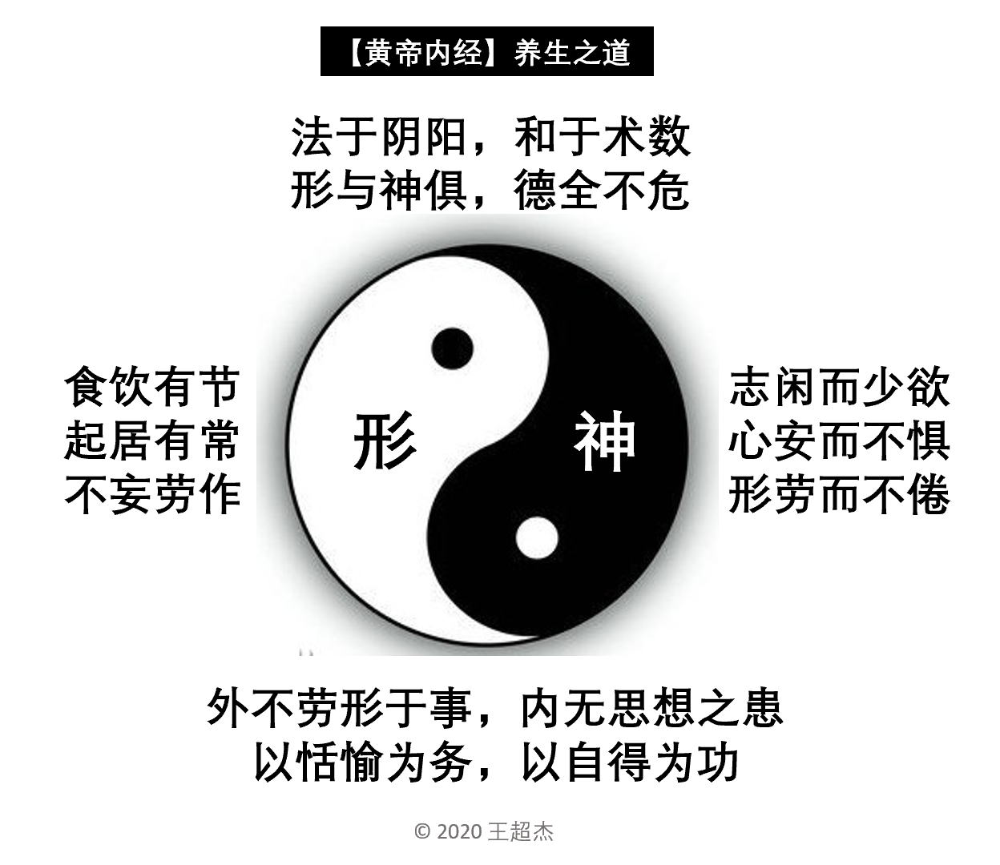
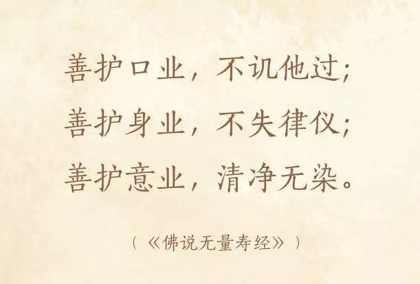
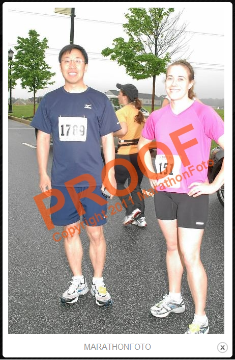
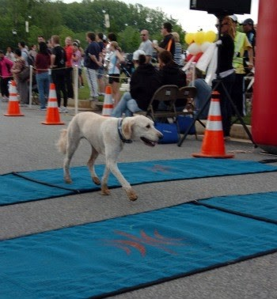
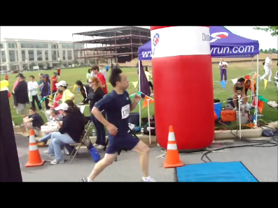
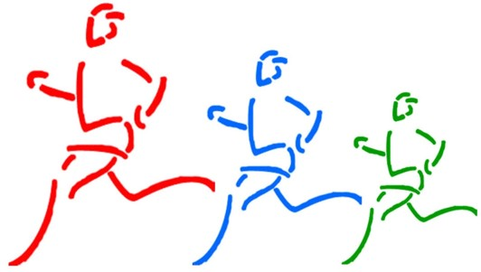

# 健身养生

## 【跑步漫谈】

【一】跑步的好处

跑步简便易行，不需特殊场地，出门就是；也不用昂贵器材，最多是磨破几双鞋。最重要的是跑步的健身效果全面，心，肺，肌肉，骨骼，全身上上下下，里里外外都能锻炼到。而且跑步能让大脑休息，清醒，能让人们心情舒畅，愉快。跑步还可以治病，对降胆固醇，减肥等效果很好。

【二】人类天生善跑

人类的身体要不是天生用来跑步的，就是因为跑步而进化的。我们应该感谢父母给我们一双能走善跑的腿。善待善用这双腿，你将受益终生。

【三】跑步有学问

跑步是很简单，只要把一只腿向前迈出，另一只腿接着跟上，如此重复下去即可。但是跑步作为一项常年的健身修心运动，里面有不少学问，初学者应该注意学习，吸取经验。

【四】跑步与损伤

跑步容易筋骨肌肉受伤。因为跑步是不断重复的运动。 在跑步过程中，下身的肌肉，肌腱，韧带，骨骼，及关节都受到几倍于身体体重的成千上万次压力。跑速越快，压力越大，跑程越长，压迫越久。再加上跑步次数过频，身体得不到应有的休息调整，更容易受伤。筋骨肌肉受伤，恢复很慢，有的伤如果恢复不彻底，还会复发。搞不好，还会影响今后跑步。初学者，要特别谨慎。 受伤有 两种，一是过度疲劳而损伤（跑太久，太快等）， 一是不小心出事故的急伤创伤（踩到石子，滑倒摔跤等）。前者可以控制避免，后着则要小心翼翼。跑步过程中只要感觉不对或不适，马上停住，不可以蛮干。万一受伤，务必停跑，理疗养伤。即使是需要几周几月，也得停跑。长久考虑，不可急躁。跑步乃终身运动，不可不慎重。

【五】跑步大原则

为了避免受伤，切记两条。 

- 第一， 跑步目的性要明确。跑步是为了健身修心，不是为了比赛出成绩拿名次。跑步是一项终身运动，不能光凭一是热情，只有坚持，才有效果。不为成绩，故不过度训练；长久考虑，故不急于求 成。
- 第二，跑步的最关键原则就是跑休结合，循序渐进。初学者，年龄大或体质弱着，最好避免天天跑步。肌肉通常需要48小时的恢复时间，隔天跑较好。刚开 始，跑速不要太快，跑程不要过长。专家建议，跑程的增加不要超过10%。这里有两方面，一是一次跑程不要超过自己最长一次的10%，二是一周总跑程不要超过自己最长一周的10%。当然，这不是火箭科学, 没有那么严格，灵活掌握即可。    

 【六】跑步的乐趣

跑步和其他体育项目一样，让人类在运动中享受生命，感悟人生。除了一般运动带来的乐趣以外，跑步还有有它自己独特的方面， 因而会给人带来独特的感受和乐趣。其中比较公认的是“跑步者的兴奋”。跑步过程可以分为两个阶段，第一阶段是开头的磨合阶段。这阶段，身体各器官特别是心肺在逐渐磨合适应过程中，跑起来不顺畅，还会感觉吃力，揣不过气来。过了这 个阶段，身体各部位都适应并配合进入状态，跑起来就感觉很舒畅从容。我管这个阶段叫自动驾驶阶段。有点像开车，上高速公路前，得穿过城市繁忙的大街，人车拥挤，又有好多红绿灯，开开停停，让人心烦。过了街市，上了高速公路就好了。马路宽敞，车辆稀少，再给车自动定速，连脚都不用踩油门。这就有一种像开飞机自动驾驶的感觉。当你跑到这个阶段，你就基本上脱离了身体的约束，你的精神就得到了充分自由，可以随意驰骋了。你因此而为之兴奋。这种“跑步者的兴奋”虽 然和用毒品的兴奋有点类似，但前者是健康的，而后者是有害的。

 【七】跑步的枯燥

跑步基本上是一项个人运动，自己受益，乐在其中。也正因为是单枪匹马，再加上机械重复的步伐，跑步有时也会有枯燥的时候。特别是跑长程，越到后面枯燥感越强。一个解决办法就是找跑伴。两个人或一群人一起跑长程，可以边跑边聊，累了可以互相鼓励。如果找不到跑伴，可以考虑加入跑步俱乐部，参加群跑及比赛。其实跑步大多数时候并不需要人陪。跑步的乐趣主要来自自己一人自由自在的感受， 这种“落花人独跑，微雨燕双飞”的意境是不可以让别人破坏的。也许孤独的乐趣和孤独的枯燥是分不开的。

 【八】跑步的成就感

跑步的乐趣除了来自“跑步者的兴奋”以外，还来自跑步的成就感。在生活中我们都会遭遇各种各样的挫折失败，诸如感情的，婚姻的，工作的，身体的， 精神的，自己的，亲朋好友的，应有尽有。很多事情，成败胜负都不由自己。只有两脚，全属自己支配。你可以给自己定跑步目标计划，执行任务，完成指标，全靠自己努力，不依赖任何人。生活中有几件事，自己能够说了算？跑步是其中难得的一件。有时候我们觉得自己无能为力，但是怨天尤人没用用； 有时候我们感觉百无聊赖，可是苟且偷生也不是办法。这时侯，只有换上运动服，穿上跑鞋，带上一瓶水或运动饮料，推门出去，先拉伸热身，接着撒腿就跑。三十六计，“跑”为上。很多跑步者选择跑全程马拉松或半程马拉松，就是为了一种自我成就感的实现。挑战自我，战胜自己，做一件体力上毅力上超越极限的事情，而且不依赖任何人。这就是跑步的成就感。

 【九】跑步的路径

跑步最好要有几条不同的路径，轮流更换，不要每一次都跑同一条路。这样一则避免枯燥，二有利于腿上不同肌肉的锻炼。跑平路，跑上坡和跑下坡用的是不同的肌 肉。路径既有平路，又有上下坡最好。跑步应尽量选软地面以减轻对肌肉和关节的压迫。土路或草地最好，柏油路其次，水泥地最差。  在马路边跑或经过马路或跨越马路，务必十分小心，安全第一。有条件到公园，湖边，树林跑最佳。跑步毕竟是一个健身养性的活动，环境也是很重要的一个因数。

 【十】跑步的计划

跑步作为一项终身受益的运动，贵在坚持。要坚持，就要定计划。否则三天打渔，两天撒网，最终往往虎头蛇尾，有始无终。计划其实很简单，主要有两方面。一是每周的跑步计划，比如，一周跑三次。平常跑两次短程，速度可以快些，坡度可以大些。周末跑一次长程，速度慢些，以练耐力和毅力为主。养成一种习惯就好。计划的另一方面就是有计划地增加长程的跑程，比如每月加一两公里。这样一年内就可以进步一二十公里。这是很大的成就。有了计划就像旅行有了指南针和地图。跑步的计划里还可以安排一些比赛活动。从短程开始，比如先参加5K比赛，然后10K。以后还可以参加15K， 半马（21K）和全马（42K）的比赛。跑步比赛是一个很好的激励因素，众人捧场，对手如林，十分刺激。当然要注意，比赛不是为了出成绩，拿名次，依然是以安全无损伤为原则。

\newpage

## 【跑步的短期健身效果】

跑步和其他运动项目一样，需要一段时间才能看到健身效果。包括体重的减轻，心肺功能的增强，筋骨的强壮，身材的健美，都不是一早一夕之事。

但是，跑步也有很多立竿见影的短期功效，不必等一年半载。其实每一次跑步都有成效，都可以享受，都值得庆贺。

这里根据个人经验总结几条:

【一】能把自己从舒适的沙发艰难地拖到门口，迈出第一步，就是一个很大的成就。与其把宝贵时光浪费在电视机前和互联网上，不如出门跑步，锻炼身体，舒畅心情。

【二】刚开始的几百米或几千米往往很吃力，因为身体各个器官需要一个磨合的过程。苦尽甘来，后面你会越跑越轻松，甚至会感受到“跑者愉悦”（Runner's High)。跑者愉悦之感与用毒品的效果类似，其科学原理同出一辙。跑步激发了大脑中一种叫做“内源性大麻素”物质的释放，这种物质可以产生一种很强的快感。正如它名字所指的，这种内源性大麻素作用的方式跟大麻的成分是一样的。

【三】当你一路上汗流浃背的时候，你真正开始体会健身效果。出汗乃良药。中医的秘诀就是熬一碗又苦又热又黑又浓的草药，病人喝下，立马发汗，病菌连同汗水一起蒸发了。西医就比较落后，不用天然本草，而是用人工合成的化学物质。西药是把病毒打死在体内。西医即使把病治好了，人体内还会有药物残留和病菌残骸，造成副作用。这是猴哥怪论，请西医人士包涵。

【四】有时你发现痰和鼻涕多了，因为你的呼吸系统在清新的空气中得到清洗，把污水拍出来了。有痰就吐，有鼻涕就擤，在大自然里，大可不必讲公共卫生。

【五】有时你发现自己一路放炮，请不要脸红，那是你的肠胃在跑步的上下颠簸蠕动中通畅了。在大自然中，你大可不必遮遮掩掩。路边百花齐放，体内百家争鸣，天人合一。大鸣大放，最利健康。

【六】当你跑着跑着，突然大自然向你召唤，说明你的排泄系统得到锻炼，跃跃欲试想排空了。就在路边的丛林里解决吧。我们的祖先早年就是这么潇洒的。有什么比路边撒野更让人回归自然？小撒野难以避免，因为跑步过程人体发热流汗要大量喝水补充。大撒野一般都是意外事故。为了避免难堪，务必注意跑前食物选择。我的经验，跑前千万不要吃芒果和猕猴桃。否则，后果不堪设想。猴哥跑步两年，一次意外，两次险情，十分狼狈。（。。。。。。为了避免造成环境污染，这里删去368字。。。。。。)

\newpage

## 【马拉松的挑战】

大家都知道跑马拉松是对人的身体和意志的极度挑战。但是并不是所有人都明白这种挑战不仅仅是在漫长的四十二公里（二十六英里）中。
其实马拉松运动员在站在起跑线之前，就已经经历了无数的挑战，在冲出终点线之后还要面对无数的挑战。

【一】马拉松训练的挑战

马拉松运动员在赛前都要进行四个月的有计划的科学训练。每周跑三到五次不等，从短距离到长距离，从慢速到快速。里程不断增加。
对于业余运动员来说，这四个月不仅是对体力和毅力的挑战，而且还是对日常工作和家庭生活的挑战。
跑步是很费时间的，跑前通常要十几分钟到半小时的准备，跑后要十几分钟到半个多小时的放松。
长程训练，身体疲劳，还要休息恢复。训练过程，常有挫折。不少人在长程跑训练中途都会”撞墙“（这词来自英文”hit the wall“，指体能消耗殆尽，无法继续）。

【二】马拉松比赛前的挑战

海军陆战队马拉松是美国四大马拉松之一。地点在美国首都华盛顿特区。今年(2012年)有来自美国五十个州和世界五十四个国家的三万名运动员报名。
比赛鸣枪是在早上七点五十五分。我一大早四点四十五分就起床，和跑友一起开车半小时到达市区，车库爆满，只好停在附近酒店的车库，然后排长队坐大吧去赛区。
到赛区，还得走十几分钟去寄存包裹。这中间，还得找地方如厕排空。不少运动员情急只好就地在路边树林解决。从起床到起跑线，整整三个小时。起跑前，已经先剥了一层皮。

【三】马拉松赛程的挑战

三万人的马拉松，第一个挑战就是人挤人。跑了大概十五英里，才好转。到那时我开始感觉两个膝盖疲劳，只好把速度降下来。
后面几个英里膝盖实在酸疼，只好走走跑跑。这时就会有消极的想法萌生。一是想为什么要这么受罪。然后就担心膝盖受损留下后遗症。还想以后不再跑全程，干脆改跑半程马拉松。

【四】马拉松跑完的挑战

马拉松的终点线离自己家的啤酒和沙发还有几十英里的距离，而就这几十英里则要花三个多小时。
跑完拿了奖牌，照几张相留影后，还得走一段路去取寄存的包裹，拿了包裹再走一段路去排队坐地铁。
三万人的马拉松，再加观众，总共有十万人参加。大型马拉松也有不方便的地方。做什么都要排队。特别是上厕所，要吗找不到，要吗排长队。
坐地铁要排半小时的队。跑完膝盖酸还得走很多路。回到家后，挑战还没有完。楼梯爬不上去，好不容易爬上去，又下不来。
沙发椅子坐不下去，好不容易坐了下去，又起不来。十分狼狈。打盹睡觉腿还不能弯曲。
 

\newpage

## 【懒猴的养生之道 】

>  “人之初, 性本懒。勤补搓，懒添福。得与失，自斟酌。”- 【三字经】

 (一）早睡。不要浪费时间在电视电脑手机微信上，信息过度，不利健康。没有比睡觉更养身的活动了。八十年代流行电影歌曲中有一句 “昏睡百年” ，意思是说爱睡的人都能活到一百岁。
 
（二）迟起。能赖床就赖吧。“懒”字本来就出自“赖”字。例外：有班的早上不要误了工。

（三）什么都吃。千万不要费心研究什么可吃，什么不可吃。也不要去看食品标签上的营养成分表。懒人不是不相信现代医学，只是更相信自己的肚子。
另外，吃多吃少，听肚子的，不要听嘴的。人体五官四肢，最不可信的是嘴。

（四）购物挑贵的。不要费脑筋货比三家，累不累？市场经济的美丽在于，广大勤俭精明的消费者已经迫使商家合理定价了，懒人可以坐享其成，不必费心。
【三字经】里就讲: “一分钱, 一分货，挑贵的, 准没错。”  例外：找对象，不仅要挑，还要挑便宜的（家里有名有钱有势最佳）。

（五）不费心机。不要费尽心思琢磨人生的意义，多累啊。活着的目的就是为了活着，简单一点吧。
生活就是柴米油盐醋，吃喝睡拉撒。例外: 闲着的时候，读点哲学书。五谷养身，三教养心。

（六）简易健身。打高尔夫球要起大早，打网球得有伙伴，打太极拳太复杂，练瑜伽难度大, 练气功会走火入魔。
还是跑步吧。靠自己的两腿。买不起跑鞋，赤脚跑更好。上了年纪跑不动，改为散步。古人早就说过, “三十六技, 走为上。”

（七）孩子少管。管孩子，伤脾气。乖的孩子不需你管，不乖的孩子管了也没用。
有其父必有其子。懒人的孩子即使不乖也坏不到哪儿去，因为他们懒得干坏事。

（八）不和配偶顶嘴。多伤和气啊！家不和谐，心无寄托。家若和气，身自健康。例外：顶嘴不可以，亲嘴是可以的。

（九）在家里不要决策权。决策可是件伤脑筋的事。比如计划度假旅游，选度假地点，定机票酒店，太烦了。让配偶去做决策吧。
权力下放，配偶高兴，自己轻松。例外：决策权可以不要，否决权务必留着。配偶要是选了太贵的度假计划，就果断给予否决。
当然否决权的有效实施有赖于经济权。没有经济权就连发言权都没有了，谈何否决权。

（十）少做事, 少来事。记住毛主席的话:"事不关己, 高高挂起。" 做事不要太认真也不要太较劲儿。
最好虎头蛇尾，知难而退。

刚才腰有点酸，就此搁笔不写了。还有几点， 无关要紧，就忽略不计了，请包含。

\newpage

## 【养生与损生】

生命其实是世界上最美妙完善最深奥最坚强的。根本无需养生。关键是不要损生。不损生就是养生。而我们其实每天都在损生。 

损字有三部分：

-	手 - 我们常妄为， 做有损害生命的事， 比如熬夜， 贪婪。
-	口 - 我们常恶语伤人， 暴饮暴食。
-	贝 - 我们贪财， 过度追求财富。

所以黄帝内经说的养生十二字才是最简单又最根本的：

> “饮食有度， 起居有常， 不妄劳作。”

\newpage

## 【养心靠读书】

- 健身靠运动以强胫骨
- 养生靠吃睡以护性命(少吃多睡)
- 养心靠读书以弘气神

三管齐下, 缺一不可。请遵猴嘱, 不可偷懒。

清朝张英写的的《聪训斋语》开头几段很合我意, 与你共享:

> 人心至灵至动，不可过劳，亦不可过逸，惟读书可以养之。书卷乃养心第一妙物。  
> 闲适无事之人，镇日不观书，则起居出入，身心无所栖泊，耳目无所安顿，势必心意颠倒，妄想生嗔。  
> 处逆境不乐，处顺境亦不乐。每见人栖栖皇皇，觉举动无不碍者，此必不读书之人也。  
> 富贵贫贱，总难称意，知足即为称意；山水花竹，无恒主人，得闲便是主人。大约富贵人役于名利，
贫贱人役于饥寒，总无闲情及此，惟付之浩叹耳。
> 古人以“眠、食”二者为养生之要务。脏腑肠胃，常令宽舒有余地，则真气得以流行而疾病少。“予从不饱食，病安得入？”。

\newpage

## 【心病妙方】

现代人多多少少都患心病。

心病症状很多。比如无聊, 空虚, 孤独, 寂寞； 吃饭不香, 睡觉不宁, 坐卧不安, 精神不振； 无所事事, 百无聊赖，无病呻吟，苟且偷生，贪生怕死，等等， 不一而足。

心病没药, 只能理疗; 医生无助, 只有自治。

这里与大家分享一个秘方, 成本低, 效果好, 且简便易行。 

- 读书
- 写作
- 跑步

读书是与别人交流;   
写作是与自己交流;   
跑步是与天地交流。

只有交流, 才能通畅。缺乏交流, 导致纠结。纠结日久, 心病即生。

另外，生命在于运动。读书动脑，写作动手，跑步动脚。

“流水不腐, 户枢不蠹”, 就是这个道理。

\newpage

## 【读黄帝内经】

今天读【黄帝内经】，开卷就被第一章深深吸引。两千多年前黄帝和岐伯的对话就像是对我们现代人说的，栩栩如生。只有一千一百二十九字，就把养生之道说的明明白白，清清楚楚，简简单单，真真切切。

这里最关键的四个字就是：“法于阴阳”。阴阳平衡是万物之道，人生之本。

微信上的那些养生鸡汤都该付诸流水。什么这多吃，那少吃，这可吃，那不可吃，这和那不能一起吃，晚餐最好不吃，不一而足。我们还活不活？

读读这么简易朴素的语言：“食饮有节，起居有常”，“志闲而少欲，心安而不惧，形劳而不倦”，“美其食，任其服，乐其俗，高下不相慕”，“外不劳形于事，内无思想之患，以恬愉为务，以自得为功”。

黄帝，岐伯，高也!

附：【黄帝内经 - 素问 - 上古天真论篇第一】

> 昔在黄帝，生而神灵，弱而能言，幼而徇齐，长而敦敏，成而登天。乃问于天师曰：余闻上古之人，春秋皆度百岁，而动作不衰；今时之人，年半百而动作皆衰者，时世异耶？人将失之耶？
>
> 岐伯对曰：上古之人，其知道者，法于阴阳，和于术数，食饮有节，起居有常，不妄作劳，故能形与神俱，而尽终其天年，度百岁乃去。
>
> 今時之人不然也，以酒为浆，以妄为常，醉以入房，以欲竭其精，以耗散其真，不知持满，不时御神，务快其心，逆于生乐，起居无节，故半百而衰也。
>
> 夫上古圣人之教下也，皆谓之虚邪贼风，避之有时，恬惔虚无，真气从之，精神内守，病安从来。
>
> 是以志闲而少欲，心安而不惧，形劳而不倦，气从以顺，各从其欲，皆得所愿。
>
> 故美其食，任其服，乐其俗，高下不相慕，其民故曰檏。
>
> 是以嗜欲不能劳其目，淫邪不能惑其心，愚智贤不肖，不惧于物，故合于道。
>
> 所以能年皆度百岁而动作不衰者，以其德全不危也。
>
> 。。。。。。(中间部分省略）
>
> 黄帝曰：余闻上古有真人者，提挈天地，把握阴阳，呼吸精气，独立守神，肌肉若一，故能寿敝天地，无有终时，此其道生。
>
> 中古之时，有至人者，淳德全道，和于阴阳，调于四时，去世离俗，积精全神，游行天地之间，视听八逹之外，此盖益其寿命而强者也，亦归于真人。
>
> 其次有圣人者，处天地之和，从八风之理，适嗜人慾于世俗之间，无恚嗔之心，行不欲离于世，被服章，举不慾观于俗，外不劳形于事，内无思想之患，以恬愉为务，以自得为功，形体不敝，精神不散，亦可以百数。
>
> 其次有贤人者，法则天地，象似日月，辨列星辰，逆从阴阳，分别四时，将从上古，合同于道，亦可使益寿而有极时。

\newpage

## 【病从口入，病由心生】

社会发展，物质丰富，人们生活水平提高，就不忌口，贪吃乱吃，从而生病。故，病从口入。

生活节奏快了，竞争激烈了，人际关系复杂了，人的心地也不再清纯淡泊，人承受的心理压力增加，从而生病。故，病由心生。

佛教所说的贪嗔痴三毒是人类的病根。贪指贪欲，嗔指嗔恨，痴指无知。三毒不除，病患不断。

除三毒，要从净三业做起。三业是身，口，意。指行为，语言，和心念。

如何净三业，【无量寿经】给我们开了一副简单易服的药方:

> “善护口业，不讥他过；善护身业，不犯律仪；善护意业， 清净无染”。

随时服用，常年不断，病根即除。

\newpage

## 【猴爷蛇草】

猴哥幼时, 常听奶奶说起爷爷的蛇草。此草治疗毒蛇咬伤，效果甚好，内服外敷均可。

我爷爷年轻时在山上遇巧一捕蛇人手腕被一只蟒蛇咬住不放。捕蛇人就让我爷爷从他的篓子里拿出几片草叶, 放进他的嘴里。他把草叶嚼烂后把草汁吐到手腕蛇咬处, 不一会儿, 蛇就松口爬走了。他接着就把草渣敷在手腕被蛇咬的伤处。为了表达对我爷爷的谢意, 他送给我爷爷一些草种。我爷爷把草种带回家种在院子里。后来乡下农民被蛇咬伤, 都找我爷爷帮忙。

此草难种, 昨天我妹微信上报告说成功栽种一棵, 并附相片。猴妹家住农村, 农舍依山而建, 山坡既是后墙, 种草药倒合适。

猴哥上网查询, 找到两种类似的草药, 鬼针草和香茶菜, 并找中医专家鉴定,都说不是。看来这是祖传秘方了。

希望哪天【本草纲目】2.0版能把它列入。中医瑰宝，再添奇葩。此草能治蛇伤，必有它用。比如排毒，治癌什么的，应该研究挖掘。

\newpage

## 【猴哥长寿秘诀】

在百岁生日那天，曾孙问猴哥长寿秘诀，猴哥回顾半生（猴哥认为自己可以活到两百岁，故“半生”），总结六条：

- 儿时家贫，吃不饱， 故长寿。因为猴娘常说人一辈子吃多少是固定的，多吃短命，少吃长寿。正如汽车引擎，能开多少里程是基本固定的，开多开快早报废。
- 少年白头，早熟老成，所以后面的日子只能越活越年轻。
- 青年郁闷，前途渺茫，时间似乎停留了好几年。
- 壮年留洋，吃苦奋斗，乘年轻力壮，先把苦吃了，以后就是甜的日子。
- 中年不得志，海不归，碌碌无为，只好跑马拉松健身，读MBA健脑，写博健心。
- 老年依然心未死，梦不断，生命从头开始。

\newpage

## 【2011年马里兰半马比赛点滴】

今年五月十五日我参加马里兰半程马拉松比赛。这是我的第一个半马比赛，也是我进军全马的一个重要里程碑。

比赛前一天晚比以往提早一个小时睡觉。睡的还不错，就是一直在做梦。做的都是跑步的梦，断断续续的。
梦中赛前换下来的衣服没人拿，只好仍在草地上；还有比赛时忘了穿鞋，赤着脚，干着急。
以为自己赛前不紧张，其实潜意识里还是紧张的。第二天一大早闹钟还没响，就提早半个多小时醒来。
以为自己赛前不激动，其实潜意识里还是激动的。

离鸣枪还有十分钟时，去上厕所，结果队很长，排了一伙儿见没有希望，只好慢跑回到起点等鸣枪了。
排在我后面的是一位美眉，摄影师以为我们是在一起的，就给我们照了合影，我后来到比赛相片网站才知道。
再查一下发现这位女士跑得比我还快，成绩2小时1分21秒。不过她才30岁，有年龄优势。

（图一）赛前偶遇一美眉，留下证据（Proof)

鸣枪前，我观察一下周围，站在我前面的是个男性，站在我左，右和后面的都是女性。
统计一下，两男三女，女运动员占多数，60%。我一直认为女人跑步的比男人多，因为每次看到路上跑步的大多是女性。
后来比赛结束，成绩公布，总共有1662人跑完，其中女性946人，占总数57%，这跟我的土办法统计结果相吻合， 
也证实了我的猜想。看来我当年在克莱登大学的统计硕士学位没有白拿。

（图二）跑在前面的高手们

等到鸣枪，大家都往前冲，我则撒腿朝厕所跑。等我从厕所出来，我所在的2小时20分跑组早已不见了，
我归队后跟上的是2小时40分跑组。接下来就是激动人心的13.1英里。我一直在往前超人，
路途还跟观众不断招手欢呼。到6英里的水站我停下来喝水时，边喝边踢腿伸腰做拉伸运动，
在前面收水杯的志愿者跟我开玩笑说“No dancing”（“这里不允许跳舞”）。

跑到9英里左右经过一朋友家，我朋友带着7岁的女儿和两岁的儿子在门口给我照相，
我就停下来抱着他女儿照了一张，然后又和他坐在推车的小女儿及大女儿又照了一张。
朋友太忙，到现在还没有把相片电邮给我。让我想起自己当年孩子年幼时的辛苦日子。

（图三）八英里的时候还兴高采烈

前十二英里似乎都很顺利，跑得也挺快。跑到最后一英里的时候明显感觉吃力，腿脚有点不听指挥了。
一半是体力到极限，另一半估计是心理作用。人往往在胜利在望时，意志开始放松。
不过最后还是以2小时5分52秒的成绩冲出终点，比预期的2小时20分要快14分钟。1662名运动员中，名列580。

回到家里，我拿着奖牌跟我小儿子炫耀说爸爸拿了金牌，可我儿子既不羡慕也无鼓励，回应说这算什么金牌，
不是跑完的每个人都又一个吗？嗨，孩子长大了，不好哄骗啊。尽管如此，这对我来说是名副其实的金牌。
这辈子，三好生奖状拿过无数张，却从来没有参加过体育比赛，更不用说体育奖状和奖牌了。

（图四）最后1英里非常吃力

我朋友和我开玩笑说，要不是我起跑后一头扎紧厕所，中间停下来又喝水又“跳舞”，还停下来和朋友的女儿照相，
在2小时内跑完是完全可能的。不过，憋着跑，太难受。大自然的召唤，不得不响应。路上留影也是比赛的一种乐趣。
在水站停下来喝水，做拉伸也是为了减轻疲劳，防止损伤。

说来也巧，比赛过程，有一狗在5英里处的一人家里冲出无形电子围墙，跟在跑步人群里，最后跑到终点。
很多人都不知道，以为是哪位带着狗一起跑。这只狗跑得还挺快，到终点是大楷是2小时15分钟。

（图五）这只从家里逃跑出来的狗在做最后冲刺

我在我的年龄组的名次也很巧。40-49岁男子年龄组总共有222人， 我的名次是第111名。111和222，这么巧的数字！

从去年11月的10K比赛，到今年三月的15K比赛，到这次13.1英里半马，循序渐进，不断进步。
接下来四个多月，再接再厉，今年10月份的巴尔的摩全马就胜利在望了。

（图六）我的最后冲刺

\newpage

## 【船为什么会沉?】

这段英文颇有哲理, 翻译成中文与大家分享。

> 英文
>
> Ships don't sink because of the water around them;   
> ships sink because of the water that gets in them.   
> Don’t let what’s happening around you get inside you and weigh you down.

> 中译 
>
> 船不是因为周边有水而下沉;  
> 船之所以下沉是因为水渗透到船舱里面。  
> 所以不要让身边发生的事情浸染你的内心而使你消沉。

无独有偶, 唐代诗人白居易的七律【醉赠刘二十八使君】中有一联和它有异曲同工之妙: 

> 沉舟侧畔千帆过, 病树前头万木春。

我们要避免成为沉舟和病树。希望我们都在千帆之列, 万木之中。

\newpage

## 【跑步的十大理由】

- 跑步最简单，不需场地，不要器材，自个儿空手出家门即可。
- 跑步最容易，只要把一只脚放在另一只脚前面即可，与生俱来的能力，不需费劲学习。
- 跑步最灵活，跑快跑慢，跑长跑短，根据自身状况，随心所欲。
- 跑步最健身，全身从上到下，从里到外，心肺，骨骼，关节，肌肉，面面俱到。
- 跑步能治病，只要锻炼得法，长久坚持，百病竟除，身心健康。
- 跑步可养颜，出汗及血液循环加快都有利于皮肤光洁健美。
- 跑步可修心，跑步过程，内观自我，外连天地，冥想静思，天人一体，达到一种动态禅境。
- 跑步能锻炼耐力和意志，耐力是身体的忍受力，意志是精神的忍受力。
- 跑步能增进友谊，朋友一起跑，既减少独自跑步的枯燥，又可以互相交流，鼓励。
- 跑步有利社会和谐，以跑步比赛为慈善募捐，有利全民健康和公益事业。

\newpage

## 【今天不想跑的十个借口】

懒猴懒跑，有时偷懒不想跑步，又不好意思，就给自己找借口，以图心安理得。

- 早上起床，身体僵硬，不能跑
- 白天上班，不便跑
- 下班回来疲惫，跑不动
- 天气太冷怕着凉
- 天气太热怕中暑
- 雨天怕淋湿
- 晴天怕嗮黑
- 阴天又没心情
- 年纪大了身体恢复缓慢，再休息一天
- 上周跑多了，这周就少跑点

\newpage

## 【禅修徒劳】

脱贫是生存必要，致富是人之常情， 暴富是人性贪婪。

如果我们在脱贫致富之后还想暴富，为暴富而执着，乃至不惜代价，不择手段， 那么任何禅修的努力都是徒劳的。

与其每天花22小时绞尽脑汁暴富，花两个小时禅修 ， 不如每天24小时珍惜生命，享受生活，0小时禅修。

现代人追逐功名利禄是问题之根本。禅修治标不治本， 好听好看而已。

\newpage

## 【跑步段位】

- 5K - 小资
- 10K - 中产
- 半马 - 土豪 
- 全马 - 贪官
- BQ - 恶霸
- 超马 - 毒梟

我曾是土豪, 花钱买了官, 后来变成贪官,如今被反腐回到中产。平时过着小资生活。

\newpage

## 【健康和疾病】

病是生命的一种状态，在这个状态下，人不能正常生活，不能充分享受生活和发挥人的内在潜力。
这里，病就是健康的反义词。世界卫生组织1946年成立时，在它的宣言里把健康的定义从狭隘的生理范畴扩大到包括生理，
心理，和社会三个方面。后来学者和医生又加了第四方面，信仰。认为人的信仰也是影响健康的一个不可忽视的第四方。

血压，心率等指标只是代表生理方面的， 不能片面看待。健康的风险因素还有遗传，环境，个人行为，经济资源，
社会地位，精神信仰等。要综合考虑。

中医和西医相比，其高明之处就是在于中医的系统综合方法。西医的高明之处在于其利用科学技术，治的是身体，
生理，生物之人，而不是有灵有性，有心有情的人。

医生的作用:

- 有时治癒，常常帮助，总是安慰。

个人的行为:

- 及时睡觉，常常喝水，总是自律。(好)
- 及时行乐，常常贪欲，总是放任。(坏)

祈祷的健康效益：

- 基督教的祈祷 
- 佛教的念佛名，诵经，坐禅，冥想。

\newpage

## 【形与神俱 德全不危】

1946年联合国世界卫生组织（WHO）在纽约成立，并在其章程中把健康定义为:

> 不仅是指没有疾病或体不衰弱，而是指生理、心理与社会功能的完好和谐。
>
> Health is a state of complete physical, mental and social well-being and 
> not merely the absence of disease or infirmity。

这种三位一体全方位的健康定义与【黄帝内经】两千年前提出的形， 神， 德整体兼顾的养生之道十分一致。

- 生理 (physical) 指体格，为形;
- 心理 (mental) 指精神，为神;
- 社会 (social) 指品行，为德。

那么，我们如何学以致用呢? 我总结的养生五行，简明实用，与你分享:

- 充足的睡眠 (形) -> 起居有常
- 平衡的饮食 (形) -> 饮食有节
- 适度的活动 (形) -> 不妄劳作 (形劳而不倦) (工作，社交，运动) 
- 阳光的心态 (神) -> 心安不惧
- 慈善的品行 (德) -> 德全不危 (志闲而少欲)  (信仰，道德，人生观)

【黄帝内经】金句：

> 食饮有节，起居有常，不妄作劳。
>
> 志闲而少欲，心安而不惧，形劳而不倦。
>
> 美其食，任其服，乐其俗，高下不相慕。
>
> 外不劳形于事，内无思想之患，以恬愉为务，以自得为功。

\newpage

## 【养生之道】

正本清源,回归自然。这是我们应该追求的。然而，我们往往舍本逐末，远离本源。

包括对疾病的防治。其实病毒细菌都是天然存在，和人类一样，各种疾病也是自然现象。

我们过度依赖现代科技而忽视人类自身的力量。

病之本源在自身，防治根本也在自身。

凡药皆春药，春药乃毒药。越吃越不可救药。

我有三大妙方: 打喷嚏，醒鼻涕，出臭汗。解毒秘方，再加上读书，写字，跑步三种理疗。

\newpage

## 【长寿之道】

今天看到华盛顿邮报 (Washington Post) 的一篇讲[长寿的文章]
(https://www.washingtonpost.com/lifestyle/wellness/longevity-research-diet-exercise-tips/2021/10/10/edb5cdc2-2856-11ec-9de8-156fed3e81bf_story.html)。

概括一下，长寿 (longevity) 有三个要素: 饮食，健身，和精神面貌。

(一) 饮食（DDiet）

应该节食，但要避免营养不良 (MMalnutrition)。所以要在保证营养充足的前提下节食。就是说美食不可少，但不宜过多。

(二) 健身 （Exercise）

健身要适度 (Moderation)，避免过度。高强度间歇训练(High Intensity Interval Training，简称HIIT) 和
力量训练 (Strength Training) 可以延缓衰老。建议一周三天HIIT(隔天)，两天力量训练(隔天)，剩余两天散步。
另外，每坐一个小时都要起来活动三分钟。

(三) 精神面貌（Mental Outlook)

当然是心宽气缓者长寿，比如乌龟。不过，生活中有适当压力 (Stress) 可延寿。
人类的基因不是在温床 (Pampered Comfort) 里进化的，而是在生存压力中通过一个"兴奋" (Hormesis) 的过程不断改进的。
这个过程可以激活哪些减缓细胞生长和老化的基因。

**总结**

饮食，锻炼，和精神面貌综合起来就是生活方式 (Life Style)。有些生活条件优越的富人比有些生活条件艰苦的穷人还要短命，这是因为前者的不良生活方式所致。

另外，遗传也是长寿的一个重要因素，并且大多数的疾病与遗传基因有关。只是基因疗法(Gene Therapy) 目前仅处于研发初期，尚不成熟，风险较大。所以长寿只能靠自己。控制饮食，适度健身，并保持良好精神状态，这样即能改善生活质量，又能延年益寿。

注: 跑步时，一会儿快跑，一会儿慢跑，就是HIIT。散步时，一会儿快走，一会儿慢走，也是。跳舞时，一伙儿快三，一会儿慢四，也是。

\newpage

