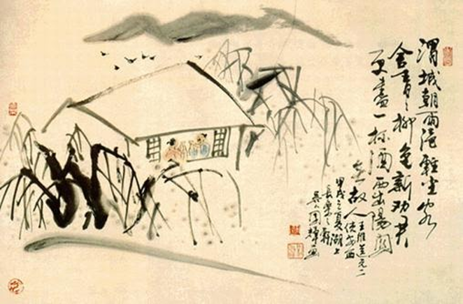

# 吾爱诗词

## 【读古思今】

>
> 冷泉亭 * 宋 * 林稹
>
> 一泓清可沁诗脾,冷暖年来只自知。    
> 流出西湖载歌舞,回头不似在山时。
>

南宋诗人林稹的七绝<冷泉亭>是难得的一首专门写水的好诗。通过对冷泉水的描写来言情喻理。今天重读, 又有一番新的感受。

这首诗似乎是写给当今出国留学, 旅居海外的学子。

**一泓清可沁诗脾** 

想当年我们大学刚刚毕业, 天真正直, 胸怀大志, 雄心勃勃, 希望能在工作岗位上大显身手。

**冷暖年来只自知** 

进入社会以后, 发现理想和现实差距很大, 书本知识不能学以致用。工作中难免遇到困难挫折。

**流出西湖载歌舞**

只好选择出国留学。学成找到工作, 养家糊口, 滞留不归。为他国打工贡献, 肥水流入他人田, 尽为他人做嫁衣。良心自问, 十分惭愧。

**回头不似在山时** 

回首遥望, 对比今昔, 发现自己已经不再是当年的清水一泓, 纯真无染了。而祖国也变得陌生疏远了。 去和留, 得失利弊, 矛盾重重。

\newpage

## 【古诗今读 * 阳关曲】

>
> 送元二使安西 唐 * 王维
>
> 渭城朝雨浥轻尘，客舍青青柳色新。    
> 劝君更尽一杯酒，西出阳关无故人。
>

古人送别诗很多, 王维这首七绝应该说是最脍炙人口的。它还被谱成曲, 取名阳关曲, 渭城曲和阳关三叠, 成为中国十大古琴曲之一, 为世代传诵。

古人送别诗之所以美, 在于她把自然景色和惜别之情融汇一体, 因景生情,情景交织。

你看那由泥土和石砾铺成的马车道, 在清晨小雨的淋湿下, 一尘不染。 清新的空气正好醒酒。客栈青色的瓦片, 和溪边的绿色柳丝相映衬, 更激发了人们依依惜别的心情。

虽然我们现代人也经常送别, 但是我们的送别远比不上古人的凄美柔情。因为我们得益于交通之便, 通讯之便, 离别就不会显得那么痛苦。

同时我们生活在都市, 很难再有那种天然淳朴的送客景观。总之我们的送别太平常, 不管情和景都不如古人, 当然也就难以写出像阳关三叠那样美丽的诗曲了。

设想你在北京送客, 你的送别诗估计大致是这样写的:

> 京城夜雨浥霾尘，酒店高高鱼肉腥。  
> 劝君再饮一回醉，坐上飞机睡更深。

京城的马路大凡是水泥或柏油铺的, 一般没有泥土沙砾的轻尘。空气里倒是有太多霾尘。酒楼高高耸立, 灯火通明, 送行的宴席充满大鱼大肉的腥味和香烟味。

客人已经醉了好几回, 大家还不过瘾, 接着使劲灌酒。反正醉酒上飞机正好呼呼大睡。
 

\newpage

## 【格律诗要领】

**押韵**
- 平水韵为旧韵
- 普通话为新韵
- 押韵起到每一句前后呼应，整首诗回环和谐的音韵效果。
**四声**
- 现代汉语：阴平，阳平，上声，去声
- 古代汉语：平声，上声，去声，入声
**平仄**
- 阴平阳平为平，平代表缓和语调。上声去声为仄，仄代表高亢语调。
- 平仄平仄显得急促仓皇，踹不过起来。平平仄仄则舒缓悠然，抑扬顿挫。
- 两句成一联。上句叫出句，下句叫对句。
- 出句和对句开头要平仄相反叫对，这样就有对比变化之美。
- 上联的对句（第二句）和下联的出句（第一句）开头要平仄相同叫粘，这样就有前后四句连贯无缝，相通相接。
- 对则有对比，粘则有连贯。
- 平平仄仄中重点在第二字。故一三五不论，二四六分明。
- 拗句（不合平仄）和救拗（补救之法）。
- 拗句有多种，补救办法也有多种。
**对仗**
- 律（五律，七律）有八句
- 一二句叫首联
- 三四句叫颔联 - 要对仗工整
- 五六句叫颈联 - 要对仗工整
- 七八句叫尾联

\newpage

## 【写律诗和做人】

律诗最短的是五绝, 只有四句共二十字。最长的是七律, 也才八句共五十六字。律诗还要讲究韵脚, 平仄，和对仗。
在这么短短几十字里, 既要写景, 又要抒情, 既要喻理, 又要言志, 真是一种折磨和挑战。然而, 律诗是多么美妙, 千古流传。

做人与写律诗很相似。

没有几个人有无穷的资源和无限的自由。大多数人都承受各种各样的生存压力和自身局限：
-	你有足够的钱养家糊口吗? 
-	你在单位里有满意的职位吗? 
-	你有理想的婚姻吗? 
-	你有听话懂事的子女吗? 
-	你有健康长寿的父母吗? 
-	你有绝顶聪明的脑袋吗? 
-	你有健壮的身体吗? 
-	你有迷人的美貌吗? 

有几个人能给出有的答案?

然而人们在那么多的限制和不完美中依然要活得快乐, 活出趣味。

律诗的美正是因为有限的字数和无尽的约束。这是一种简约, 含蓄, 精深的美。

做人的艺术也是如此, 在约束中自娱, 在限制中平衡, 在律己中升华, 在无奈中超脱。

这就是少胜于多, 无超过有。不着一字, 尽得风流。没有奢华, 依然灿烂。

\newpage

## 【吾爱七绝】

格律诗按每首句数和每句字数分类。

一首四句称绝句, 一首八句叫律诗。

每句五字叫五言, 每句七字叫七言。

这样就有四种组合: 五言绝句(五绝), 五言律诗(五律), 七言绝句(七绝), 七言律诗(七律)。

其中五绝字数最少, 四乘五, 只有寥寥二十字, 非常精炼, 写起来难度较大; 

七律字数最多, 七乘八, 共五十六字, 并要求第三四两句成对, 第五六两句成对, 所以写起来难度也大。

字数太少和太多是两个极端, 都不好创作。

一般认为七绝字数适中,四乘七等于二十八, 不太多也不太少, 比较容易入手。

古诗像巧克力糖, 小巧玲珑, 精致甜美, 闲暇品尝, 余味无穷。

功名利禄, 山珍海味, 与之相比, 实微不足道。

况且, 古诗乃中华特产, 千年传承, 老外只能垂涎, 难得其妙。

\newpage

## 【男儿到此是豪雄】

> 秋日偶成 宋 ● 程明道
>
> 闲来无事不从容，睡觉东窗日已红；    
> 万物静观皆自得，四时佳兴与人同。    
> 道通天地有形外，思入风云变态中；    
> 富贵不淫贫贱乐，男儿到此是豪雄。

古诗或写景, 或抒情, 或言志, 或喻理。寥寥数十字, 简约精美, 寓意深刻。

古诗讲究起, 承, 转, 合。往往以写景, 叙事开始, 然后触景生情, 情景交融。最后画龙点睛, 寓理于情景之中, 让读者回味无穷, 深受教育。
比如王之涣的 “欲穷千里目, 更上一层楼”; 朱熹的 “问渠哪得清如许? 为有源头活水来”。

宋朝诗人程明道的这首七言律诗[秋日偶成]则十分独特, 从第一句到第八句, 句句富有哲理。而且融汇儒释道, 让人受益非浅。

**闲来无事不从容** 

做人何必为追求功名利禄而忙忙碌碌, 紧紧张张? 野心小一点, 追求少一点。有了闲情逸致, 接人待物才能从容不迫, 井井有条。

**睡觉东窗日已红** 

要能天天睡懒觉那就更好。晚睡早起, 伤害身体。能吃能睡, 少吃多睡, 才叫富贵。

**万物静观皆自得**

宇宙万物, 本来秩序井然, 各得其所。你若匆匆忙忙, 怎能体察? 只有保持一颗清静心, 才能感知宇宙的神妙。

**四时佳兴与人同** 

春夏秋冬风景各异。人世浮沉其实与四季变换一样, 皆属自然规律。天人合一, 就是把自己融入自然景观之中, 去体会和欣赏这四季的神奇变换, 从而对人生的浮沉得失才能从容淡定, 应付自如。

**道通天地有形外** 

不要闭门造车, 空想得道。应该注重观察天地之有形物, 世间之有情种。并在超越有形和有情之上感悟生命, 通晓大道,

**思入风云变态中** 

世事人心有如天上风云, 变化无常。你的思维可不能僵化。你可不能故步自封, 墨守成规。要像水一样, 委婉灵活, 顺势而流。

**富贵不淫贫贱乐** 

钱多可别乱花, 权大切忌烂用。放纵贪欲, 万恶之源。贫穷也没什么, 不就少吃几块肥肉? 卑微也不足哀伤, 无非少几个粉丝? 

**男儿到此是豪雄**

男人要是能做到以上这些, 就是君子豪杰了。

今天你有烦恼, 请读读这首诗。 

\newpage

## 【先人智慧如明月】

古人写诗作文讲究起承转合。
- 起 - 事情之开始，起因，交代事件的时间，地点，人物。一般以写景开始。
- 承 - 就是承接上句，提供更多的细节，比如发生了具体什么事情。往往情景交融。
- 转 - 就是通过对事件或景物的观察，触景生情，抒发自己的情绪，发表自己的感受。从身外之风景和事件, 转到内心之感受和思考。
- 合 - 就是一种总结，把自己的感受升华到更深厚的哲理以给人回味和启发。

绝句的四句正好与这四种阶段想匹配。短短四句，跌宕起伏。真是“不著一字，尽得风流”。

以猴哥刚刚出炉的【夜读】为例：

> 夜静灯孤倚小窗, 随心开卷沁书香。  
> 先人智慧如明月, 半是朦胧半亮堂。

**夜静灯孤倚小窗**

这里开门见山，交代了时间（夜晚），地点（书房），人物（猴哥，台灯， 窗户）。

**随心开卷沁书香** 

承接上句，详细描述猴哥今夜得宽余，有闲情逸致，拿起书来随便翻翻，沉浸在淡雅的书香里。

**先人智慧如明月**

猴哥在这种禅境中，突然悟到古人真是伟大，给我们留下如明月一样珍贵和永久的智慧。这里也顺便透露了猴哥读的是古诗文，比如唐诗宋词，四书五经。而且这里的月和第一句的窗前后呼应。

**半是朦胧半亮堂**

为什么把先人智慧比作明月呢? 因为古人的思想含蓄而精深，一如神秘的夜月，时而朦胧，时而明亮，只有静观，方能悟得。

哇噻，短短二十八字，蕴含这么美妙的构思！

How Good You Are! 

猴哥牛啊！

\newpage

## 【吾爱古诗】

古诗美在精简含蓄。

没有长篇大论, 仅有寥寥数十字, 却情景交融, 寓意精深。有着一种"不着一字，尽得风流”的境界。

这与现代人追求奢侈铺张, 激进外露的生活行为形成鲜明对照。

古诗提示我们含蓄和简约的少而精，远胜于不加节制的盲目的多而滥。

这在文学和审美上如此, 在其他方面诸如经济, 教育和个人生活中也一样。

\newpage

## 【写律如做人】

写律如做人，难。

情景理趣，形意气神，平仄对仗，起承转合，多种因素要通盘考量，难以周全。

格律可严格遵守，也可宽松灵活。诗人往往在两者之间纠结徘徊，推敲不定。

写律难，才有"两句三年得，一吟双泪流"。

在合律与不合律之间有多种可能，诗人们因理念有别，或情境有异，而有不同选择，不能以对错高低评判。

社交媒体上有人把律和非律当做黑白对立，非此即彼。这些人似乎并不真正懂格律之妙和做人之难。
或许他们懂，却故弄玄虚，故意煽情，以博眼球，骗流量。

\newpage

## 【诗词欣赏的一点细节】

从字，词，句，对，到整首，都要细嚼慢咽。

还要从形式的美和意境的美一起结合欣赏。

形是体， 意是用。形是外，意是内。形是阳，意是阴。

还要了解作者生活的时代背景，作者的生平遭遇，写作时的处境心态。

是的。形意和谐，体用兼备。由景生情，以物喻理。

是的。言外之意，玄外之音。

另外，字，词的模零两可，意思的朦胧，读者根据自己的处境和心态去诠释，理解。

苏轼的"缺月挂疏桐" ，平常人读来，就是写夜景。而对一个命运不顺，心情不佳的人读来就会很触动。
缺，疏字都带情。乃至挂字。挂在半空，不上不下。

最后一句"捡尽寒枝不肯栖，寂寞沙洲冷"是这首词的点睛之笔。

让我想起"独在异乡为异客"。 异者才孤独，才寂寞。这里又会联想到屈原。路慢慢。独醒。独清。

\newpage

## 【人生三个阶段】

（一）青年时期， 远征何难。

毛泽东【长征】  

红军不怕远征难，万水千山只等闲。    
五岭逶迤腾细浪，乌蒙磅礴走泥丸。  
金沙水拍云崖暖，大渡桥横铁索寒。  
更喜岷山千里雪，三军过后尽开颜。

（二） 中年时期， 月夜徘徊。

程颢【游月陂】

月陂堤上四徘徊，北有中天百尺台。    
万物已随秋气改，一樽聊为晚凉开。  
水心云影闲相照，林下泉声静自来。  
世事无端何足计，但逢佳节约重陪。
　　
（三）老年时期，从容淡定。

程颢【秋日偶成】

闲来无事不从容，睡觉东窗日已红。  
万物静观皆自得，四时佳兴与人同。  
道通天地有形外，思入风云变态中。  
富贵不淫贫贱乐，男儿到此是豪雄。

\newpage

