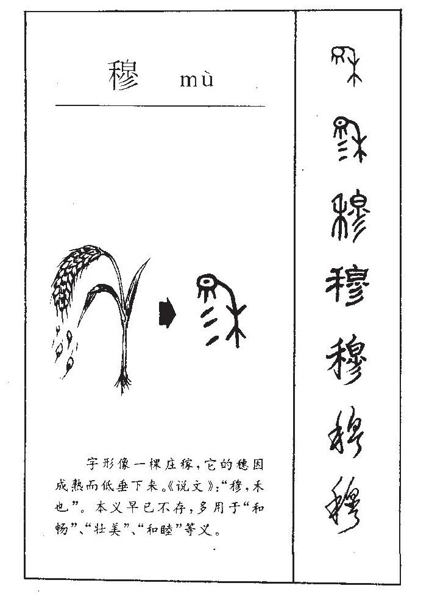
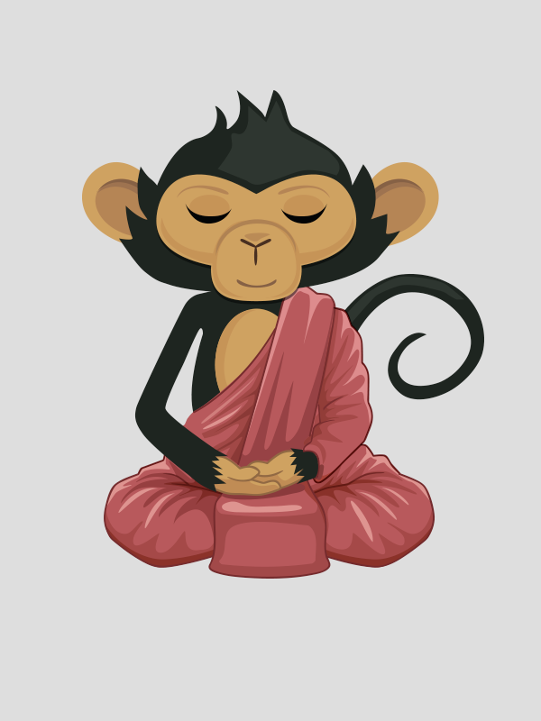
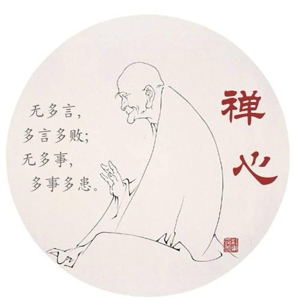
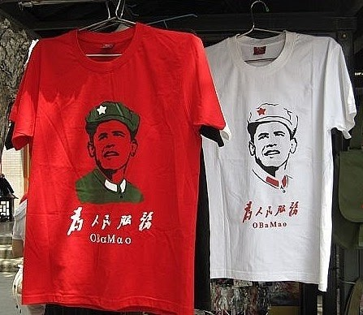
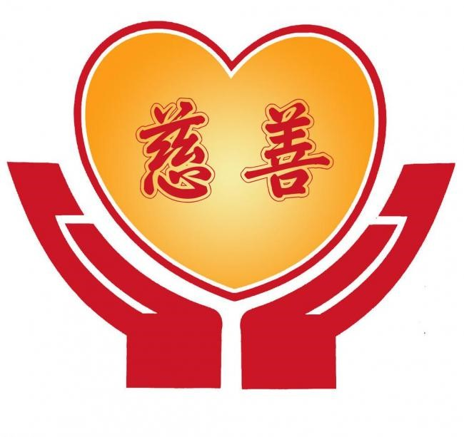

# 文字游戏

## 【穆】

【说文解字】对穆字的解说极其简单：穆，禾也。从禾㣎声。

译成白话就是: 穆，禾谷。字形采用“禾”作边旁，"㣎"是声旁。

穆字的甲骨文像成熟而下垂的稻穗(参见插图)，象征美好，和睦，庄严，恭敬, 体现了先人对农耕之依赖和重视。
比如【诗经 • 泮水】其中一句: 穆穆魯侯，敬明其德。意思是鲁侯庄重又和美，他的品德光耀且可敬。

为了弥补【说文解字】之不足，我对穆字的右半部作了进一步解剖。”㣎”可分为上中下三个部分：

上面是”白”, 由一撇和一日组成。一撇像是一抹云。日是太阳。阳光透过一抹云而成”白“字。
由此可见洁净的白色与亮丽的阳光有千十丝万缕之联系。

中间是”小”，形似一叶孤舟，左右各有一桨。

下面是”川”，形似水波，代表河流。

综合起来，穆字就是一幅吉祥美丽，水穆阳华的田园诗画:

> 小河缓缓流，小舟轻轻荡。  
> 阳光透祥云，照耀禾苗壮。

汉字作为最古老，最美妙的数据可视化， 从穆字便可略见一斑。

\newpage

## 【贝】

人类的每一个发明都是一把双刃剑。人类每前进一步都要后退一步。这就是为什么在科技发达的今天，人类依然像野蛮时代一样互相残杀。
人类可以把卫星送上天，却依然用武器和鲜血来解决争端。

就拿货币的发明来说，不可否认它是人类发展商品经济和创造物质财富的孵化器和加速器。然而，货币也因此成为人类的主宰而给人类带来不平等，不公正，乃至灾难。
金融危机说白了，就是少数有钱有势的玩弄货币，敛财暴富，着火入魔而嫁祸平民百姓。

让我们看看四个带“贝”的汉字就可以略知一二。
- “财”字，“贝”在前， “才”在后。真才实学不如腰缠万贯。
- “赢”字和“败”字都带有“贝”， 有钱才是赢家，没钱沦为败者。
- “赞”字也有带“贝”, 有钱就能买到名声，获得赞许。

这个世界之所以物欲横流，人类之所以你争我夺，都是为了财富这个宝贝。

你和我比财，我才不和你比！

注: 中国古代以海贝充当原始货币。“贝者，水虫，古人取其甲以为货，如今之用钱然。”（《尚书·盘庚中》孔颖达疏）中国商周时期的墓葬时有出土。

\newpage

## 【猴子读孙子】

孙子兵法开宗明义，指出"兵者国之大事，死生之地，存亡之道，不可不察也。"。
接着单刀直入，提出用兵的五大要素（五事 - 道，天，地，将，法）并做详尽精辟阐述。

五事中，天是天象气候，地是地理环境，都是外在因素，不可控制。天时地利，可遇不可求。
赤壁之战，周瑜想火攻曹军，诸葛亮指出“万事俱备，只欠东风”就是指天时未到。赤壁之险，长江之急则是指地之不利。

如果我们给五事中的每一个要素20点，总共100点。因为天和地的不可控制，每个只能给百分之五十的机会，各得10点。
剩下的三事道，将，法，我们可以控制。道可以选择，正义之师得道，不义之师失道。将领可以甄选和培养，纪律可以制定和执行。
不过即使可控制的要素，我们很难百分之百到位。我们要能做到四分之三就不错了。这样，20点得15点。三事共得45点。五事总和65点（10+10+15+15+15）。

这说明我们在战争中和在战场上通常只有百分之六十五的胜算。概率不高啊。所以孙子才说"不可不察也"。

要是不义之师，道还要扣掉10分，一分拿不到。不义不仅无助，而且将领也很难有智，信，仁，勇，严，再扣10分。法制也就不会严明，士兵不会忠诚善战，又扣10分。
这样胜算的可能性就剩百分之三十五了。所以不义之师必败。
~~~
五事道为首，正义才得之。
得道者多助，不义终失之。
天时大气候，地利不由己。
只有将与法，自己能控制。
猴子读孙子，数字解文字。
概率加统计，科学观五事。
~~~

\newpage

## 【九斤灯的典故】

> 【山村咏怀 宋 邵康节】
>
> 一去二三里, 烟村四五家。 
> 亭台六七座,八九十枝花。

这首短短二十字的五言绝句把数字从一到十巧妙地融入, 即简单易懂, 又郎朗上口, 深得小朋友喜爱。

古诗中类似这种文理融汇的例子比比皆是。比如唐朝杜甫的七绝:

> 两个黄鹂鸣翠柳, 一行白鹭上青天。
> 窗含西岭千秋雪, 门泊东吴万里船。

这里就用了一, 二, 千, 万。

猴哥1981年中学毕业。2011年, 同学举办毕业30周年纪念活动。猴哥写了一首以资怀念。

> 【(7 - 2) × 6 = ？】
>
> 八一年挥手道别, 三十载弹指瞬间。  
> 五湖四海少年梦, 九斤考验同窗情。

诗句用了1，3，4，5，8，9，10。却少2，6，7。只好借用标题。可谓名符其实的借 “题” 发挥。标题是一道数学题, 答案正好是30, 十分巧妙。

另外, 九和酒及久谐音。同学经常聚会喝酒, 故久经考验也是酒精考验。这里用九斤取代酒精还隐喻一个中学时期的典故:

> 化学科肖老师有一天在课上评讲考题，说某同学在填空题上把“酒精灯”写成“九斤灯”，全班哄堂大笑。

2011年, 猴哥不懂格律, 就会写打油诗。最近学写格律诗, 略做修改, 更加精美:

> 【(7 - 2) × 6 = ？】
>
> 八一挥手共惜怜, 弹指三十仅瞬间。  
> 四海五湖青涩梦, 九斤考验再情牵。

\newpage

## 【书山有鹿】

汉字之精美，以对联最为绝妙。比如:
~~~
因荷（何）而得藕（偶） 
有杏（幸）不需梅（媒）
~~~
荷和藕是同一植物，开在水上是荷花，长在泥里便是藕。出污泥而不染指的就是荷花。杏和梅都很酸，所以有杏就不需要梅了。
我曾经逛荷塘，看到一张荷叶两边开着两朵荷花就像两个朋又围桌对坐，就写了一副对联：
~~~
藕尔独酌无趣， 
荷时与你同饮？
~~~
今天我照葫芦画瓢，给数学家华罗庚的名句画蛇添足，锦上添花。
~~~
书山有路（鹿）勤为径（颈）  
学海无涯（牙）苦做舟（粥） 
~~~
上联新解: 
> 长颈鹿的脖子很长，象征求学的道路漫长。所以诗人屈原感叹“路漫漫其修远矣，吾将上下而求之"。鹿又谐音禄，喻读书当官拿俸禄。鹿还象征吉祥如意。好好读书，就有福禄吉祥。

下联新解: 
>活到老学到老，即使牙齿掉光，吃不动大鱼大肉，只能喝粥，还继续学习。     

咋看牵强附会，细品饶有趣味，你懂的？ 

\newpage

## 【P的力量】

根据几十年的工作和生活经验总结出人生发展的12个P。我把它们叫做The Power of P (P的力量）。

这12个P分为四个层次，就像四层楼的房子，层层往上。
- 首先，最基础的是要有一个可以立足的平台(Platform)，通常是指一个有潜力的工作单位，有一个合适的职位(Position)可以施展，学习和进步。
还要有很好的人脉和人缘(People)。这三者是外在的，就像天时地利人和。
- 其次是个人内在的才华和魅力(Personality)再加上适当的包装(Packaging)和宣传(Publicity)。
个人就像商品一样，一定要注意外在的包装，才能凸显内在的才华和魅力。包装好了，别忘了对外宣传和推销。我们不是生活在“桃李不言，下自成溪”的桃花源里。
这是一个市场经济和社交媒体的时代, 营销（Marketing) 至关重要。
- 再次是个人的敬业和努力。一切都体现在实践和实战(Practice)中，要有高质量的产品 (Product)和绩效 (Performance)。否则名不副实。要walk the walk, 不要talk the talk。 就是多做少说。老实为人，踏实做事。
-	最后就是要有明确的人生目的和事业目标(Purpose)。你想要什么？你的组织需要什么？个人和组织两者要合拍一致。另外为人做事要有底线和原则(Principle)，不可失责，违规，犯法。实现理想还要靠毅力和坚持 (perseverance, Persistence)。 

\newpage

## 【之乎者也】

王家媳妇生龙凤胎, 全家欢喜。王父好古, 喜欢之乎者也, 就给小孙子取名王也, 小孙女取名王乃，并戏称 “此乃王家宝贝也” 。
王母也特别喜爱两个小宝贝, 甜蜜地管小孙子叫也也, 小孙女叫乃乃。

\newpage

## 【6和8顺和发 】

6和8  
顺和发

8字拆开两个0  
财富身外物  
最终归于零

6字转过来是9  
人生若顺利  
如天长地久

六和八  
顺和发

“八”字先上坡  
不堪重“富”便下坡   
最后“趴”下来

“六”字象“大”字  
没有荣华富贵  
一人也能顶天立地

8虽然大于6  
“六”字却包含“八”

所以我说吗：

发未必顺  
顺乃大发 

朋友们请记住  
我的蛇年猴语：

小心8八发趴  
不如6六大顺

\newpage

## 【宫和官，三和川】
 猴大儿好学习，虽然中文不好，但很用心。他最近在白宫实习，因此认识”宫“字。
 今天晚上我们到一家叫”华馆“（P.F. Chang’s）的中餐馆吃晚餐，他看到菜单上的 “馆”字就问右边这个是白宫 “宫”字吧。
 猴哥赶紧纠正说不时，这是官员的 “官”字。为了让儿子理解这两字的区别，猴哥急中生智解释宫是宫殿或办公室的意思（英文Palace或 Office），官是 “官员”的意思（英文Official）。
 宫和官很像，是因为官员都在宫殿里上班。就像英文的 “Office” (办公室）和 “Official” （官员）很像。

这让我回想起二十几年前读到的一个笑话。说四川一个富家子弟（现在叫富二代），不识字。
父母告诉他，身为四川人，你至少得知道“川”字。这样他勉强就学会了“川”字。有一天，他看到邻居在读书，就要炫耀，说他认字。
邻居就把书递给他。他一页一页地翻，想找到那个“川”字。可是翻了好多页，就是看不到“川”字。正在着急的时候，看到一个“三”字，他既兴奋又生气地说“原来你躺在这里睡大觉，让我找半天”。 

\newpage

## 【猴语花香】
与猴有关的英语简称猴语。初学英语难度较大，可以先从猴语开始。猴语引进门，英语就不难。
-	How do you do? 猴肚油肚（猴就爱吃）	 
-	How do I know？猴肚爱闹 （吃多不消化）
-	How do you know？猴肚又闹 （得看医生了）
-	How are you? 猴哈腰（猴讨好大夫）
-	How could you do that? 猴裤又大裂（吃胖了, 一哈腰，不好啦）
-	How to love a woman? 猴投老虎而无门（猴太胖，老虎看不上）
-	How old are you? 猴偶尔忧（猴失意）
-	How are you doing? 猴啊又独饮（何以解忧，唯有杜康）
-	How fast? 猴发誓（不再贪吃）
-	How many? 猴骂你（都怪你取笑猴胖）
-	However 猴爱我（因为我不在乎猴胖）
-	Anyhow 爱你猴（你不在乎猴胖，猴更爱你）
-	Know-how 怒猴（猴脾气不好）
-	Somehow 山猴（猴想回归自然，修心养性）

\newpage

## 【人口统计】

一人就是一个世界，就是一个佛，所以“大”；

二人和睦相处, 顺乎天意，故“天”；

三人形成一个家庭，一人保护两人，故“众”；

五人组成一个团队, 可以作战, 故“伍”。

七人形成一个社会，文化从中产生，故“化”；

九人就有点人满为患，难免相互摩擦，乃至争斗，故“仇”;

七十人指中国人多士众, 故“华”。
 

\newpage

## 【人云亦云】

每次开车在路上，透过挡风玻璃映入眼帘的总是天上的白云。

开车无聊，就观云遐思：白云朵朵，形状各异；行云悠悠，变化无穷。

人和云不是也一样?

俗话说“人之不同，各如其面”，每个人都是一朵独特的云。而且人生无常，人也像行云，外在内心，时常变化。

难怪我们把人类叫做芸芸众生。只不过“芸”在“云”上多了一个草头。想必那一撮草是人的头发?

人为什么长头发？是否为保护头皮不得已？那要怪天，时不常翻云做雨；也要怪云，总喜欢兴风作雨。

古文把说话叫做云，学别人说话叫人云亦云。人是云，云亦人。

人劳动叫耕耘，也许是因为人们总在蓝天白云之下辛勤劳作。“耘”字是“丰”和“云”的组合，那是人们不忘与云共享丰收果实。

人和云都在天地之间，只是人脚踩大地，云头顶蓝天。

看人如观云，不管什么面孔脾性，都应该尊重欣赏。

人生如行云，不管命运如何变化，都应该应付自如。

我想起王维《终南别业》里富有禅意的两句:

> 行到水穷处，坐看云起时。

这是一种超脱尘俗，超越自我的禅境。

当我们达到这样一个境界时，就可以从从容容地和天上白云平起平坐，指点苍穹， 笑谈尘世，煮酒论英雄了。
 

\newpage

## 【饿肚子的谜语】

-	饿肚子聊天（打一两字常用词）- 空谈
-	饿肚子思念（打一两字常用词）- 空想
-	饿肚子补牙（打一两字常用词）- 空洞
-	饿肚子怒吼（打一两字常用词）- 空气
-	饿肚子下楼（打一两字常用词）- 空降
-	饿肚子走路（打一两字常用词）- 空前
-	饿肚子送货（打一两字常用词）- 空运
-	饿肚子求爱（打一两字常用词）- 空心
-	饿肚子打仗（打一两字常用词）- 空军
-	饿肚子赏雪（打一两字常用词）- 空白
-	饿肚子扔手榴弹（打一两字常用词）- 空投
-	饿肚子弹琴（打一家用电器）- 空调（念音调的调）
-	饿肚子唱歌（打一三字词）- 空好音 （取自杜甫《蜀相》里的两句 “映阶碧草自春色，隔叶黄鹂空好音” ）
- 饿肚子打招呼（打一三字运动项目）- 空手道（挥手道声 “Hi， 我饿了，有什么好吃的吗？”)
-	饿肚子观天象（打一三字军事用语）- 空对空
- 饿肚子干农活（打一三字军事用语）- 空对地
-	两个饿肚子的大男人（打一四字成语）- 空空如也（爷）
 

\newpage

## 【我欲乘风归去】

2010虎年的春节就要来临。离开故乡，飘零海外整整二十年，年年都是在异乡平淡冷清地度过春节。
这两天美东下历史罕见雪暴，也算是瑞雪丰年。闲着在家没事就瞎编《饿肚子的谜语集锦》，编着编着就由衷想起儿时在家乡过年猜灯谜的事。

穆阳文化馆每年春节期间都搞猜谜活动。文化馆小小的窗户上挂满一条条琳琅满目的灯谜。我从小就爱猜灯谜，总要挤到人群里跟大家一起猜。
每次都能猜中几条。奖品有糖果，还有香烟。糖果自己享受，香烟带回家给我父亲抽。

有一个福安话为谜底的谜我至今难忘。谜面大致是“雨伞倒过来装东西”，打一水果名（福安话）。
答案是“橄榄”（福安话谐音“假篮”，雨伞倒过来当篮子用，故曰假的篮子）。

有两个哑谜我依然记忆犹新。哑谜是不能说出答案，而是通过动作来表示答案。哑谜通常难度较大，奖品也丰厚。

第一个哑谜的谜面是桌上放三件大小不同的东西（好像是笔记本或是书本，记不大清了），猜一国名。
猜中的人必须把这三个东西叠在一起，然后把大的那个拿走。答案是“加拿大”。奖品就是拿走的那个大件东西。

第二个哑谜的谜面是桌上放三盒不同品牌的香烟，其中有一盒是乘风牌，另外两盒记不清，大概是鹭江牌和光荣牌。猜宋词一句。
猜中的人把其中的一盒乘风牌香烟拿了就走。谜底是苏东坡《水调歌头 - 明月几时有》中的一句”我欲乘风归去“。奖品就是那盒乘风牌香烟。

还有一个谜出的很难很绝，没有人能猜中。谜条上画了一个很粗大的句号，猜一个四字常用语。奖品是酒一瓶。答案是“群众观点”。
你想一想，一大帮人围在谜条前面盯着那个句号傻看。这不正是“群众观点”吗？那瓶酒当然是出迷人留着自己享用了！ 

\newpage

## 【科幻：先有鸡还是先有蛋？】

先有鸡还是先有蛋？西方人对这个问题的探讨和争论从古希腊哲学家亚里士多德和柏拉图至今已有两千数百多年了。
这个因果困境如果更进一步就是有关宇宙和人的起源，因而涉及哲学，生物学和宗教。

今天这个迷终于被解开。花果山东方智慧研究中心的一个研究小组在水帘洞进行了多年的研究，终于得出结论：鸡和蛋是同时问世的。

研究小组组长侯咬文先生在介绍这项由联合国科教文组织资助的项目及其研究成果时说“根据水帘洞的壁画描述，在很久很久以前，
有一只鸟，她飞腻了，飞累了，飞饿了，就在花果山的水帘洞口停下来休憩。这只鸟正想要喝水，突然发现草地上有一只虫，
就本能地上前把虫给吃了。可是没多时，鸟感觉肚子痛，而且越来越痛，最后她下了一个鸡蛋，同时自己也变成了一只母鸡。” 

侯组长同时引用汉字来做证，他说鸡字右旁是”鸟“字，蛋字下边是”虫“字。这也恰恰说明鸡和蛋的前身原来是鸟和虫。
这也是为什么两千三四百多年前当古代西方哲学家在探讨和争论这个问题的时候，同一时期的中国贤者先哲像老子孔子等集体沉默。
因为他们早就知道答案了。侯组长还特别提醒大家，汉字历史更早，已经有五千多年，她不仅是沟通工具，她还是人类历史，知识，乃至科学的载体。
所以鸡和蛋的问题实际上在西方人开始提出来之前中国人的祖先早就有定论。

侯组长还向听众展示了水帘洞墙壁上的绘画，壁画上所描绘的故事情景依然十分清晰。关于壁画的年代还有待考古学家鉴定。
鉴定工作目前因为经费没有到位而被迫暂停。这是因为美国害怕这项研究会影响美国鸡和鸡蛋的出口销量而阻止联合国拨款。
目前水帘洞出产的鸡和鸡蛋在国际市场的名声和销量都急速增长。不过侯组长特别提醒大家，并非贴上水帘洞标签的都是真货。
 

\newpage

## 【父亲笑话】

我大儿子高中时和一个女同学相好，她有一个妹妹。有一次，我跟她开玩笑说，我们家老二还没有女朋友，你正好有一个妹妹，可以“Date Wang, Get Wang Free”。这里的Date是约会，恋爱的意思。Wang刚好谐音One。这里借用商店里常用的促销手段“Buy One, Get One Free” (买一送一）。

大儿子去年夏天在塔吉克斯坦学习波斯语。有一天给我发微信，说偶然发现一个正宗湖南餐馆，准备和几个朋友去戳一顿，让我推荐几个菜的名字。我推荐完，最后加了一句说，你还可以来一碗“Wang Tongue Soup”（直译王舌头汤）。这个正好和馄炖汤的英文“Won Ton Soup”谐音。儿子没有回应, 我估计他已经知道这又是一个 Dad Joke （父亲的笑话）.

父亲的笑话是指父亲临时瞎编用来哄骗和娱乐孩子的。在孩子看来都是蹩脚的，不是很好笑的，所以Dad Joke大凡也是Bad Joke (蹩脚笑话)。

\newpage

## 【妙行无住】

读【金刚经】看到“妙行无住”四字，有所感悟。

什么样的修养才是妙行? 很明了，就是一个妙字。

妙字由女和少组成。

女代表母性，阴阳之阴性， 就是慈悲，宽容，忍辱，谦卑。

少则是指简单，简易，简约，虚空，清净，无染。

生活在这个科技发达，物质丰富，人心浮躁，物欲横流的现代，我们更应该以女(母性)为榜样，以少(简单)为准则。存妙心， 修妙行。

\newpage

## 【我解安住两字】

人自主乃住  
宅有女则安

\newpage

## 【简单】

简 – 竹字头，门字里面有一个日字。冬天坐在竹舍门口，晒太阳。

单 – 中间是田字，丫字加一横像把犁田。有一块属于自家的田，犁田耕地播种收获，自给自足，自由自在。

简约 - 约乃约束。只有约束才有简单。没有约束，就会奢侈和繁杂。律诗就是简约的典范。五律，只能有二十字，既要符合平仄韵律。又要富有诗情画意哲理智慧。

\newpage

## 【酒】

酒 = 一 + 洒

喝一盅便潇洒，洒脱。

\newpage

## 【论股票】 

A股，B股和P股，你投哪种股？ 

爱股者都知道A股和B股震荡很大，因而投资风险也很大。时刻都要盯着市场走向，既耗时间，又伤脑筋。而且一不小心，决策失误，血本无归，一贫如洗。

猴哥建议大家放弃A股和B股，转投P股。 
- 先看看A,B,P三个字母的形象。A是先猛涨到峰值，然后一直猛跌到初值，白欣喜半天。
B是直线上涨到峰值，经过两次漫长的市场纠正，先跌一半，再次跌到初值，如过山车，提心吊胆，最后还是无所收获。
P则不同，先直线上升到峰值，然后市场调整跌到半途打住，不再下滑，离你的初始点还高许多，你依然有可观的回报。 
- 请大家务必关注，最近P股出现一个很看好的股票，海内外都有上市。在上交所的股票符号是HPG（猴P股) 。
在美国纳斯达克的股票符号是MB (Monkey Butt) 。这个HPG总是向上走势，非常红火。特别是在美国，很多股民都抢购，在他们看来MB就是Money Back（钱回来）。
哪个爱股者不爱钱？有几个股票既能上涨，又有红利？ 

声明: HPG（猴P股）虽火红，但投资如赌博，赢家少，输者多。后果自负，猴哥无责。  

\newpage

## 【2020的启示】

- 爱您爱您，爱是第一。
- 饿您饿您，忌口节食。
- 简单最好，从新归零。
- 20对20， 和谐对称。
- 两个圆圈，日月光明。

\newpage

## 【童话 ● 狐狸和猴子】

很久很久以前, 猴子住在花果山, 与狐狸做邻居。狐狸狡猾, 猴子经常上当受骗。为此, 猴子耿耿于怀, 伺机报复。

有一天, 猴子问狐狸说:”你知道吗, 咱们花果山共有几个湖?” 狐狸不假思索, 立马回答:”这里有三个湖, 大湖, 中湖和小湖。” 猴子回应:”不对, 这里共有七个湖。包括你这只小狐, 我这只老猢。” 狐狸反应过来, 心算片刻, 反驳说:”那才五个湖。 “ 猴子提醒道:”你爱胡闹, 这就六个湖了。” 狐狸好生气, 大声反驳说:”你胡说。”

猴子洋洋得意, 下了结论: “你看看, 你爱胡闹，我爱胡说，这不就是七个湖了吗?”

正当猴子得意忘形之际, 狐狸忽然大叫: “妈呀, 我的米饭烧糊了。”

意料不到，又多一湖。猴子垂头散气, 狐狸得意忘形。

当天晚上猴子提了一壶酒, 到狐狸家求婚。

猴话说得好, 你若斗不过她, 就把她娶回家。

猴子穷, 买不起婚戒, 就从树上摘了一个葫芦做为定情物, 并向狐狸发誓有一天学会游泳就到大海里找一个漂亮的珊瑚送她。狐狸深受感动, 只提出一个条件: 婚后不下厨, 以免把饭菜烧糊了。

成亲那一天, 从胡建省胡州市西湖公园飞来一只美丽的蝴蝶, 为他们祝胡。

 

\newpage

## 【童话 * 猪猴割据】

小猪问老猪: “今天是五一劳动节，我也要上街庆祝。” 老猪答道“孩子，劳动节是给平常辛苦劳动的人们放假休闲的。
我们啥事不做，游手好闲，天天放假，天天休闲，哪有资格享受这个节日。” 小猪很失望，就追问“那咱们可以过哪个节日啊？” 
老猪回答“孩子，我们哪个节日都不能过。” 小猪愤愤不平地抱怨道“连傻瓜都有愚人节过，为什么我们什么节都没有？难道懒猪还不如愚人？” 
老猪耐心地对小猪开导说“孩子，人家傻瓜能够愚公移山，我们能做什么呢？”

小猪还是不明白，追究到底 “那猴子一天到晚上蹿下跳，辛辛苦苦，忙忙碌碌，怎么没有节日呢？”老猪沉思片刻，
回答道 “谁说猴子没有节日？他们从早到晚，都在树上跳跃，从这一枝跳到那一枝，这一节跳到那一节，他们不仅天天过节，
而且一天过好几个节啊”小猪恍然大悟，赶紧说“那我这就去找猴哥，向他学习”。

猴哥听说小猪要来，就下树恭候。可是小猪没走几步就累了走不动，最后还是没来见猴哥，结果就形成一个在南一个在北，"猪猴割据"的局面。 

\newpage

## 【般若与无聊】

般若是从梵语 prajñā 或者巴利语 paññā 音译过来的，读作bō rě。比如：
- 心经的全称是**般若**波罗蜜多心经。
- 心经首句: 观自在菩萨，行深**般若**波罗蜜多时，照见五蕴皆空，度一切苦厄。

般若的意思接近于智慧。但智慧不够精准，所以通常人们就采用音译。这和西方把中国的道音译成 The Dao 或  The Tao 一样。
虽然偶尔会看到意译的 The Way 或 The Path。 道教则翻译成 The Taoism。

道不可道，般若也惹不起，所以中西学者不敢随便意译。

bo 和 re 合在一起便是英文 bore, 意思是无聊。 比如：
- I am bored to death! (我好无聊啊!)。
- This movie is boring (这部电影没意思)。

无聊和般若不仅形似，而且神似:
- 当人们对日常生活失去兴趣时，就产生无聊的感觉。
- 当人们摆脱尘俗欲想之缠缚时，就接近般若的境界。

哪天你觉得无聊，你离般若的禅境其实就不远了。

\newpage

## 【般若与无聊(二)】

无聊与般若之间其实只有三个字的距离，那就是戒，定，慧三学。勤修三学, 即可抵达三摩地。

如何实践呢? 大道至简，就六个字: 戒三毒，定三业:

- 贪，瞋，痴三毒，是抵达般若的障碍。三毒不戒，无法前行。具体说就是不要贪恋身外之物，不要憎恨异己他人，不要无知无明。
- 身，口，意三业，是抵达般若的途径。三业若定，即得菩提。具体说就是要净化身体不妄为，净化言语不乱说，净化意念不瞎想，追求虚空宁静的禅境。 

诗云:

> 戒三毒莲续无染，定三业荷其清净。  
> 修三学藕得智慧，抵三摩安住般若。

注：三摩地，三藐三菩提，菩提，和般若都是从梵文或巴利文音译过来。它们意思相近，都是指修行达到的最高境界，亦称无上正觉。

\newpage

## 【英语文字游戏】

我们都熟悉汉语的文字游戏，它通过汉字的谐音以及象形产生精妙的意境。像“因荷（何）而得藕（偶），有杏（幸）不须梅（媒）”就是一个很绝妙的例子。
 
其实英语也有文字游戏。其道理和汉语相似，利用谐音及字母组合的变化来达到趣味横生的效果。有的还结合当前的政治经济形势，对时事人生进行饶有趣味的讽刺。下面举两个例子。
 
**奥巴马（Obama）与奥巴毛（Obamao）**
 
奥巴马是当今美国第一任黑人总统。他是民主党成员。美国政治以民主党和共和党两足鼎立为特色。简而言之，民主党代表“工人阶级”的利益，共和党代表 “资本家”的利益。奥君竞选期间及从政之后，共和党抨击他主张收入再分配并批评他是社会主义者。甚至有人恶作剧在他的姓Obama后面加了一个字母 “O”，这样他的姓就变成“Obamao”（奥巴毛），以此暗喻他是毛泽东的追随者（Maoist）。
 
 **Rest的双重含义**

有一天我开小组会议安排工作。在把任务一一分配给大家后，仍然有几项任务没有着落。我最后轻松诙谐的口气做决定说“The rest will have to rest upon David”。中文意思是“剩下的任务就只好落在大为肩上了”。这里我巧妙地利用了“Rest”的一词多义。第一个Rest是形容词，意思是“剩余的”。第二个Rest是动词，意思是“依赖”。 大为是我组的一员大将。小伙子既聪明又肯干，业绩斐然，跟我两年，提升两次。

顺便提一下，大家熟悉的Rest通常是“休息”的意思， 比如“Take a good rest”就是“好好休息一下"。

\newpage

## 【慈和善】

慈字, 以心为底 
善字, 以口为底

慈的底线就是: 心不怀恶意 
善的底线就是: 口不出恶言

今天, 你慈善了吗?

\newpage

