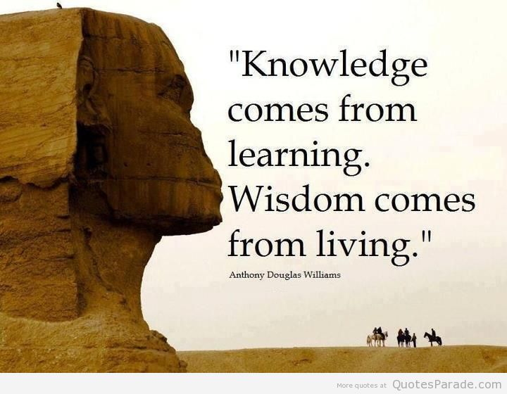

### 【Knowledge and Wisdom】

There are two approaches human beings gain understanding of the phenomenal world. One is through indirect experiments. The other is through direct experiences. The former is also known as scientific methods or simply sciences. Sciences emphasis measurement, empirical analysis, and logical reasoning. The latter relies more on intuition, imagination, and analogical reasoning. 

The understanding we gain through sciences forms the body of knowledge. The understanding we gain through life experiences and intuition leads to wisdom.

The complex reality is like an iceberg. We can only see the small part that is above the water. The large part is beneath the water and beyond our sights. So we only know what we know through observation. For the vast unknown, we have to rely on our intuition, imagination and analogical reasoning.

We need both knowledge and wisdom in order to have a more comprehensive and more accurate understanding of the reality and the world.

In his 2005 book “A Whole New Mind”, author Daniel H. Pink coined the term “Conceptual Age” - a new era starting in 21st century that is different from the past Agriculture Age (18th century), Industrial Age (19th century), and Information Age (20th century).

Pink pointed out that while the Agricultural Age and Industrial Age requires physical strength and the Information Age requires knowledge, high tech, and IQ the Conceptual Age requires high concepts, high tough, and EQ.

We have passed the Information Age in which knowledge workers were in demand and had thrived. We are now in the Conceptual Age where people with both knowledge and wisdom are in high demand and will thrive.

