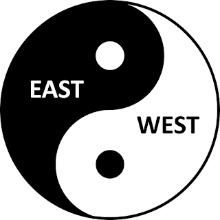

### 【Yin-Yang Balance】
Yin-Yang balance is the most fundamental concept of the ancient Chinese philosophy. Many aspects of Chinese civilization from culture to politics, from science to medicine, and the many schools of thoughts including Taoism and Confucianism have been deeply rooted in or subtly influenced by this concept.

Yin and Yang are the basic elements or forces that make up or drive the phenomenal reality - physically and metaphysically. The interaction, interconnection, and interdependence of these two opposing but complementary elements or forces is the simplest possible but most elegant way to explain phenomena of any kind, be it cosmos, nature, human, or society.

The imbalance of Yin and Yang is the root of instability. In order for the whole which both Yin and Yang are part of to survive, sustain, and prosper, Yin and Yang have to constantly interact with each other,  complement each, and reach the ever evolving dynamic balance.

Interestingly, the globe is divided geographically into two hemispheres - the East and the West. These two hemispheres also exhibit prominent differences in cultures, religions and economic standings.

The West has the characteristics of the Yang which is masculine, individualist, extrovert, analytical, and innovative. The East has the characteristics of the Yin which is feminine, collective, introvert, intuitive, and conservative. Consequently, the West is more advanced in science and technology, more economically developed and more active and aggressive in world affairs; In contrast, the East tends to focus more on humanity, arts, self-cultivation, harmony between human and nature, harmony within self, family and society.

The global problems and crisis we are facing today can be attributed to the imbalance of the East and the West. This imbalance comes in many shades of grey, but the most important is the imbalance in economic and military power. The West is much more developed in economy, more advanced in science and technology, and possesses overwhelmingly stronger economic and military power.

The differences in cultures and religions and the lack of dialog and tolerance also make it harder for the East and the West to interact and connect with each other, let alone to depend on and support each other.

To achieve balance and harmony, the West and the East should learn from each other's strength. The West needs to put more focus and emphasis on arts, humanity, social justice, and income equality while the East needs to improve on science, technology and economic development.

But most importantly, the East and the West should learn to tolerate and respect the differences and to value and cherish the diversity.

The world peace and the future survival of our human race depend largely on the balance and harmony of the East and the West. If the current trend of imbalance persists, the world will become more and more dangerous and human survival will be at great risk.

