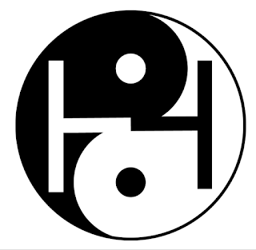

### 【H for Humanity, Health, Happiness, and Harmony】

As human beings, we all seek health, happiness, and harmony.

According to the ancient Chinese wisdom dated back over five thousand years ago, the balance of Yin and Yang is the key to everything. Yin and Yang represent the most fundamental forces of the Universe and are found everywhere in the Nature, human body and mind, families, communities, societies, and the world. Yin represents soft, feminine, water, earth, intuition, introvert, conservative, etc.; In contrast, Yang represents hard, masculine, fire, heaven, logic, extrovert, radical, etc.

Yin and Yang are not against or opposite to each other but are complementary and interdependent. They are two inseparable parts of the whole just like the two inseparable sides of a coin. They are also like the two movements of a pendulum which swings constantly left and right to achieve the dynamic balance.

When Yin and Yang are in the state of imbalance, say, one is overpowering the other, disorder will come. For example:

When Yin and Yang in our body lose balance, we become sick; 
when Yin and Yang in our mind lose balance, we suffer from our internal conflict and stress; 
When Yin and Yang in the society lose balance ,we see social injustice and unrest; 
When Yin and Yang in the world lose balance, we see conflicts between cultures, religions, and nations and large scale human suffering follows when conflicts escalate and wars erupt. 

Interestingly, humanity, health, happiness, and harmony all begin with alphabet "H". "H" is symmetric and represents balance. "H" also looks like a bridge connecting two sides. 
In the world, There are gaps between the rich and the poor, the power and the people, the privileged and the disadvantaged, the West and the East. 
Global issues and social problems are rooted in the gaps and imbalance and bridging the gaps and restoring the balance are keys to long term peace and harmony. 
The health and happiness of all human beings depend on the harmony and the peace of the world.

