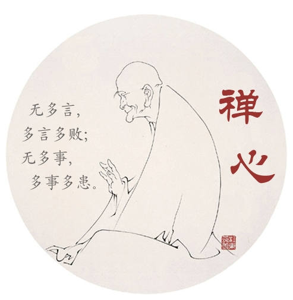

### 【般若与无聊(二)】

无聊与般若之间其实只有三个字的距离，那就是戒，定，慧三学。

勤修三学, 即可抵达三摩地。

如何实践呢?

很简单，就六个字: 戒三毒，定三业:

- 贪，瞋，痴三毒，是抵达般若的障碍。三毒不戒，无法前行。具体说就是不要贪恋身外之物，不要憎恨异己他人，不要无知无明。
- 身，口，意三业，是抵达般若的途径。三业若定，即得菩提。具体说就是要净化身体不妄为，净化言语不乱说，净化意念不瞎想，追求虚空宁静的禅境。 

诗云:

>戒三毒莲续无染，定三业荷其清净。
>
>修三学藕得智慧，抵三摩安住般若。

#### 注：
三摩地，三藐三菩提，和般若都是从梵文或巴利文音译过来。它们意思相近，都是指修行达到的最高境界，亦称无上正觉。

