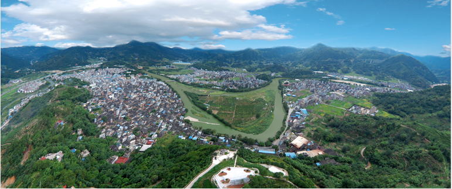
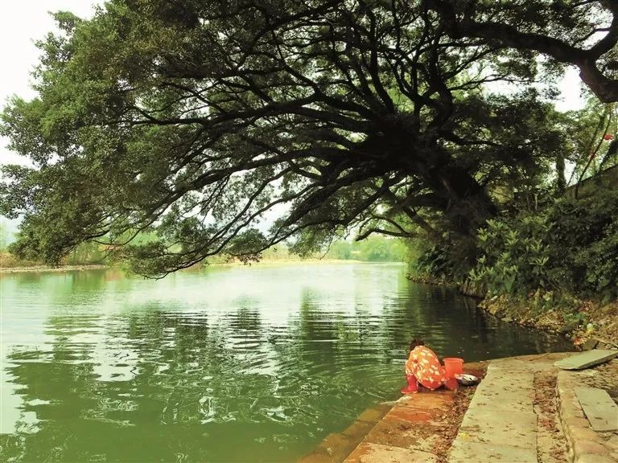

# 【小镇铭】

山不算高，炊烟漫萦。水不算深，古树垂荫。斯是小镇，人杰地灵。
狮虎护佳苑，桃李吐芬馨。往来八方客，谈笑世代邻。可以尝扁肉，逛印坪。
无都市之喧闹，有畬乡之风情。凤翔清泉洞，溪塔葡萄亭。老子云: "见小曰明。"  

注:

- （一）本文模仿刘禹锡【陋室铭】。重点在于“小”字。见微知著，见小曰明。通过描绘穆阳古镇的美丽景观及人文底蕴，以表达对家乡的热爱。
- （二）狮虎，狮子岩和虎头山，穆阳两大风景。狮岩虎峰，护佑家园。
- （三）桃李，穆阳以水蜜桃闻名，犹以虎头村的蜜桃园盛名。本句承接上句“人杰地灵”，寓意穆阳古往今来，人才辈出，桃李满天下。
- （四）扁肉，穆阳著名小吃。印坪街，穆阳主街，集市中心。
- （五）畬乡，穆云乡是畲族乡。穆阳镇是乡中心。
- （六）清泉洞位于凤翔山，道家胜地，洞小大道深。葡萄沟位于溪塔村，闻名全国，沟浅葡萄甜。
- （七）见小曰明，出自老子道德经第五十二章"见小曰明，守柔曰强。"

