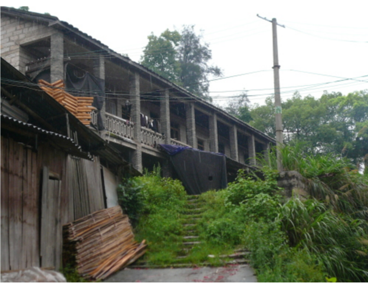

# 【读锐萍江城子 • 回望八间】

妙笔抒乡恋，七夕忆八间。  
清泉藏净水，雨巷孕才贤。  
两届三中遇，四方五帝连。  
何时狮虎聚，煮酒话流年?

注:

- 数字一到九入诗。忆谐音一，酒谐音九，流谐音六。
- 清泉指清泉洞。雨巷指石马兜。
- 两届指八零八一两届。两届同学有缘三中相遇，不分你我，亲若一家。
- 四方指同学们分散天涯海角，四面八方。
- 五帝指三皇五帝。中华之先贤圣君。
- 狮虎指狮子岩和虎头村。又指同学们如雄狮猛虎。
- 煮酒出自三国演义煮酒论英雄。曹操刘备一代枭雄，犹如狮虎。

附：

> 缪锐萍【江城子 • 回望八间】
>
> 忆昔母校望八间。自贪欢，正华年。  
> 初曜骄阳，潇洒舞翩跹。  
> 沐浴春风情放纵，融山水，地天宽。
>
> 当时邻位发披肩。辫花缠，翠霓衫。  
> 回雪流风，总把涩羞传。  
> 最是人生得意处，明月下，秀溪边。