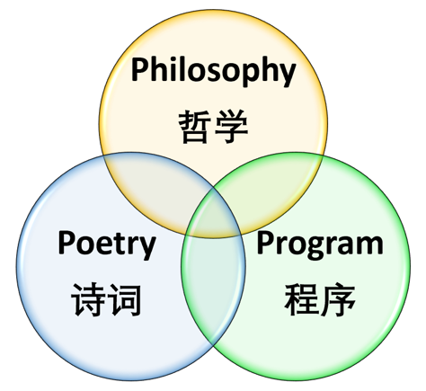

# 【爱好 • 新韵】

糊里糊涂世事深，自修自悟渐归真。  
哲学思辨添明智，格律情怀养气神。  
万象静观皆有道，初心返照本无尘。   
半知半解读贤圣，精益求精码派森。

注：

- 颈联上句效仿程颢【秋日偶成】“万物静观皆自得”。下句与【华严经】“初发心即成正等正觉”异曲同工。
- 派森（Python） 是当下最为流行的计算机语言之一，用于软件工程，数据科学，和人工智能。
- 在【五柳先生传】中，陶渊明自述一生三大志趣：
  - 读书：“好读书，不求甚解。”
  - 饮酒：“性嗜酒，家贫不能常得。”
  - 写作：“常著文章自娱，颇示己志。”
- 我也有三大爱好(Passion):
  - 哲学 (Philosophy)
  - 诗词 (Poetry)
  - 程序 (Programming)

