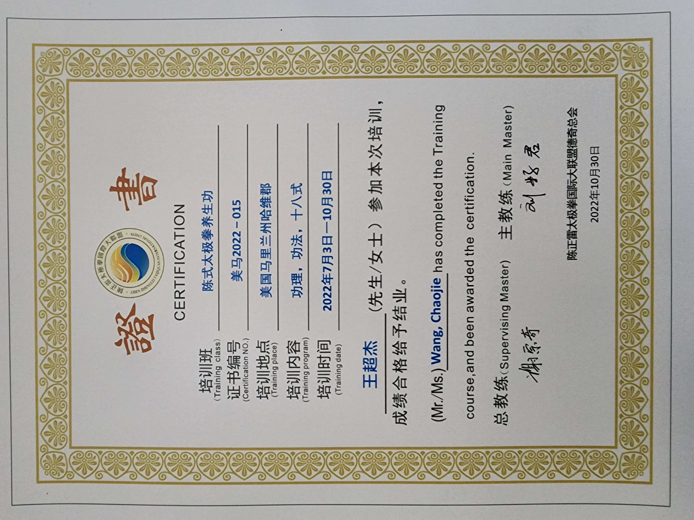
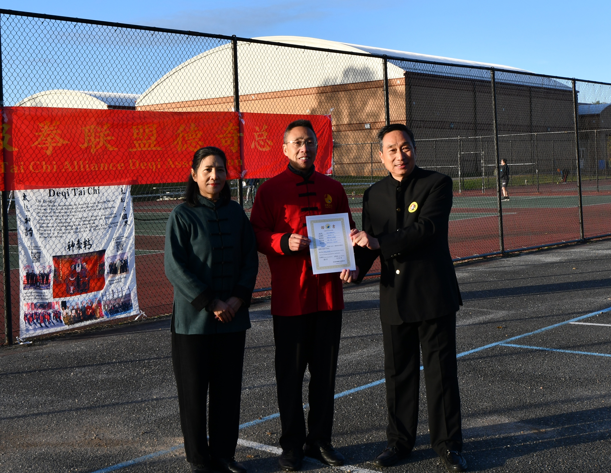

<<<<<<< HEAD
# 【七律 • 2022虎年第一聚 • 次韵锐萍】

春到虎头郊野芳，童鞋相聚醉农庄。  
山泉甜蜜君醒酒，竹叶清幽我梦桑。  
狮子岩高天道近，葡萄沟翠客思酸。  
多情暗恨亲朋远，何日归来共尔欢?

=======
# 【太极拳 • 新韵】

有缘西土遇明师(1)，半老识途只恐迟(2)。  
亦步亦趋学架子(3)，时迷时悟定神思(4)。  
刚柔并济身心正(5)，形意相随气韵慈(6)。  
儒释道医融一体(7)，归真返朴顺天时(8)。 
 
注：

(1）陈氏太极拳第十二代传人，武术七段谢宗奇老师2022年移民美国，落地马里兰州哈维郡。日月同辉，知理谙道曰明。

(2) 我四十六岁跑马拉松，五十一岁读博士，五十七岁学太极拳，可谓半老识途，唯恐太迟。

(3) 架子：指太极拳的套路，包括手形手法和步形步法等细节。习拳六阶段：学、正、捏、顺、拆、定架子。学架子为首。

(4) "迷时师度，悟时自度"，借用佛家语。架子为形，意念为神。形神兼备，得意忘形。

(5) 立身中正，端心正意，“正”乃儒之教。

(6) 形柔意净，气缓色慈，“慈”为佛之修。

(7) “体”含两意。一指太极拳理论体系，它以阴阳之道为核心，融合儒释道医之精华而自成一体；二指人之身体。学太极拳是不假身外之物，仅凭一己之躯，践行儒释道医之教化，从而达到物我两忘，天人合一的无极禅境。

(8) “真”和“朴(亦作璞)”皆指人的无染初心，也是道家的无极境界，佛家的本心佛性。这个境界，阴阳无分，混圆玄妙，无自无他，凡圣等一。太极拳套路的起势和收势就是无极状态。中间各势的虚实静运，开合蓄发则是阴阳互化，在动态中追求平衡与和谐的太极过程。一个套路也象征人的一生。生命始于无极，生长是太极运化，人生追求的是回归于无极。

>>>>>>> 4155a89d7a8b535ff27f49d57117de9befd8b6dd
