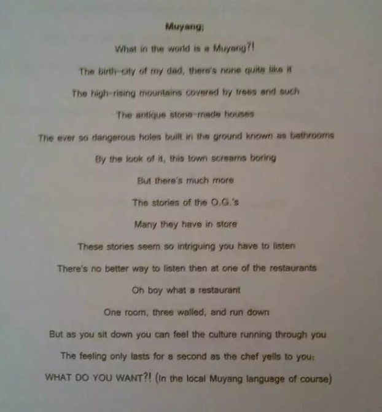

# 【Muyang 穆阳】

三年前偶然发现上初中的猴二崽英文课作业里有一首诗，题目就叫【Muyang】,偷偷拍照下来并翻成中文。
因为是用手机偷拍的, 战战兢兢, 手发抖,所以文字有点模糊。侵犯隐私权是非法行为，在此我向儿子抱歉, 
并以大学四年学费作为赔偿。

这是我的翻译。因为是直译，不够传神。朋友米国皇叔版是意译，效果更好，附在后面。

穆阳？  
这是世界的哪个角落啊?

这是我老爹的故乡  
一个独一无二的地方

高高的山上绿树成荫  
山脚下是砖和土砌成的老房

还有那在地上挖个洞的所谓的卫生间  
又臭又险又脏

乍一看，这个小镇并不好玩  
可是她有着许多故事  
这些故事是那么精彩  
你不得不听一听

听故事的最佳去处当数一家餐馆  
天哪，那算什么餐馆  
就一间屋，三面墙，再加一个门帘  

可是当你一屁股坐下  
乡土文化就如流水穿过你的身体

然而在你刚刚陶醉在这种氛围  
正想尽情享受的那刻  
厨师冲着你大吼  
“你要吃什么？！”  
（当然是用当地的穆阳话）

附： 米国皇叔版

穆阳，啥子个鬼地方？  
那是俺猴爹的故乡

高高的花果山  
绿树成荫，鸟语花香  
还有山脚下  
成片的灰瓦土墙

地上挖个坑就是茅房  
臭气熏天啊苦不堪言  
穷乡僻壤虽然不好玩  
可美丽故事恒古流传  
坐下听听也无妨 

一间小屋三面墙  
加个门帘是餐馆  
想听故事请入座  
乡土文化有气场  

刚刚陶醉此氛围  
享受片刻好时光  
猛然耳边一声响  
惊醒俺这美国狼  
“你吃米诺，尾羊便式汤？”

