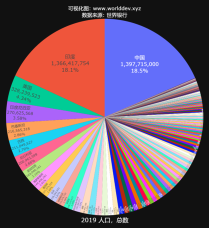
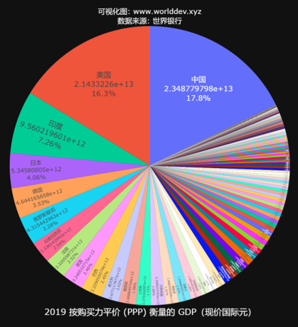

# 【中印美 Chindius】

今天我发明一个新的英文词: Chindius， 用来代表中印美三国联盟:

Chindius = China + India + US

美国，人口占世界不到百分之五，地处偏僻的北美洲，东与欧洲远隔大西洋，西与亚洲远隔太平洋，
而军事基地却遍布全球各个角落。美元是国际贸易的结算货币，华尔街是国际金融中心, 
美国百年来一直独领风骚，称雄八方。

中国和印度人口各占世界近五分之一，而长期处于落后地位。过去半个世纪不断发展，
跃居世界经济强国之列。对美国维持霸主地位确实是一种挑战。

美国的盟友都是小国家。人口最大的是日本，一亿多，占全世界不到百分之二。
其余像韩，德，英，法，澳，加，人口就更少。

所以中国的强大确实对美国维持霸主地位不利。美国拉拢人口第二大，经济总量第三大的印度，也是可以理解的。

中印美人口加起来占全世界百分之四十以上，经济总量加起来也占全世界百分之四十以上。

如果美国能够放弃一国独大的霸权主义，和中印联盟，取长补短，互相学习，
共同解决全球面临的各种难题，
人类的未来将会更加美好。

