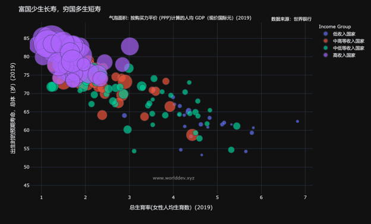
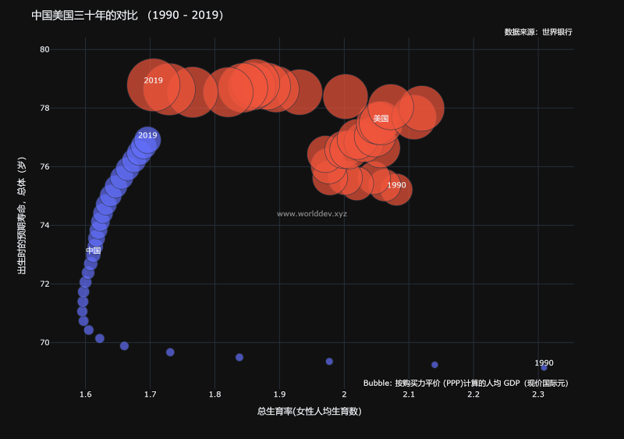

# 【财富与健康】

财富与健康的关系极其密切。英文的Wealth（财富）与Health（健康）就一个字母之差。
图一有助于了解这种关系。

预期寿命是健康的一个标志。人均GDP是财富的一个标志。最近中国放松生育政策，允许一对夫妇生三胎。所以我把生育率数据也引入图形。

本图每一个气泡代表一个国家，气泡面积代表该国人均GDP。总共178个国家。左上角是富国，低生育率，长寿命。右下角是穷国，高生育率，短寿命。

看来，财富影响健康和生育。

图二比较中国和美国过去三十年的发展变化。中国的气泡（人均GDP）比美国小，中国2019年的人均GDP还不到美国1990的水平。中国的预期寿命三十年来不断提高，逐渐接近美国。生育率上世纪90年代一直下降，世纪末开始回升，逐步接近美国。

