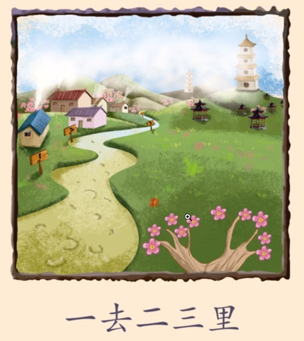

# 【数据，诗， 和远方（一）】

> “科学不只是眼前的数据， 还有诗和远方。” - 穆阳猴

从前有个县官，负责扶贫。他派部下到一个贫困村调研。部下回来送上一份十分详尽的调研报告。县官没翻几页就看不下去，因为他政务繁忙，没有时间和耐性细读。

有一天，县官和他的诗人好友相聚，煮酒品茶之间，聊起这事。 诗人自告奋勇，愿意代劳阅读。几天后，诗人送上一份总结，不到一页，县官大喜。半分钟阅毕，立马做决策。

这份总结内容是一首五绝，仅二十字：

> 一去二三里，烟村四五家。  
> 亭台六七座，八九十枝花。

县官读第一句，想到这个村离县城近，不宜发展工业，怕噪音和污染影响城里人民生活。读第二句，想到这个村人口少， 发展农业怕劳力不够。读到第三句，感叹这个村文化底蕴深厚。
读到第四句，更被这个村的优美环境所吸引。这不是发展旅游业的最佳条件？！于是立马做决定，叫来旅游局局长安排落实。

这个古代诗人就是我们现代所谓的数据科学家。数据科学就是从大量数据中挖掘信息，发现知识，并用简单易懂的方式与人分享， 辅助决策。

