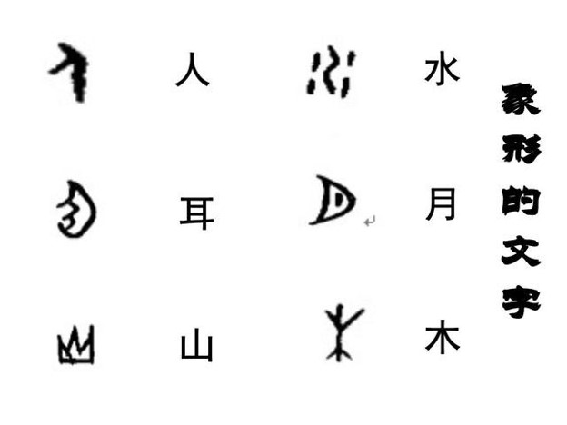

# 【可视化先驱】

数据可视化是统计分析和数据科学的基础工具。它借助计算机来处理数据，并产生图像来清楚简洁地
表达数据的内涵，从而帮助人们克服认知的局限，洞察事物的本性，辅助决策的制定。

中国的八卦和汉字应该说是可视化的先驱。【易·系辞下】讲到伏羲“仰则观象于天，俯则观法于地。
观鸟兽之文与地之宜，近取诸身，远取诸物，于是始作八卦，以通神明之德，以类万物之情。” 
我们智慧的祖先通过制作既形象又抽象的八卦图来帮助人们了解宇宙万物和人类社会的变化规律。

从伏羲画卦到象形汉字，可视化进一步发展。设想，远古时期，语言文字刚刚开始萌芽，
我们祖先初次看到灿烂温暖的太阳和朦胧静谧的月亮，激动之余，在没有相机和微信的情况下，
如何与同伴分享自己的所见？绘画是最原始最直接的表达工具。绘画逐步演化便成象形文字，
并继续简化到现代汉字的“日”和“月”。汉字继续发展，通过把”日“字和”月“字相结合便成光明的”明“。
这种复合字就是把多个可视化图形结合起来用以表达更加复杂的现象。这就是数据可视化仪表盘的前身。

汉字不仅模拟自然景观，还表达人类情感。比如，“愁”字心上有秋，福字有衣有田。
再者，汉字结构严谨，上中下，左中右，各司其位，包含宇宙，自然，家庭，及社会的结构和秩序。
汉字把复杂的自然现象和社会现象通过简单易懂的可视化方式表达出来，使得人们的沟通协更加作流畅高效，
传统的文化习俗更加容易地代代相传。

