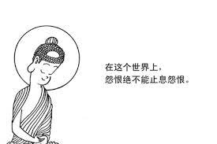

# 【诸法心先导】

近年来，以美国为首的西方诸国对中国充满敌意和仇恨，并采取各种手段污名和围堵中国。这种恶行应该说是这些国家自己内部矛盾的外部映射。美国这些年民众分裂，互相仇视，内斗不休，暴力频繁。就如一个人内心不宁，就会影响其为人处事。一个国家内部矛盾激化，也会影响其国际行为。

中国强大了，他们就把中国当成威胁，想像成敌人。紧张恐惧，怀恨于心。心怀怨恨，言行即随。

【法句经】有几句他们应该好好学习，对他们十分治愈:

诸法心先导，心主心所作，  
若以意恶行，恶语恶身行，  
则苦必随彼，如轮随兽足。  

诸法心先导，心主心所作，  
若以意善行，善语善身行，  
则乐必随彼，如影随身形。

不能以怨恨，止息世间怨，  
唯慈能止怨，乃不易古法。

西方列强及其政客要能学点佛的智慧，这个世界就不会这样不公平和不安宁。

