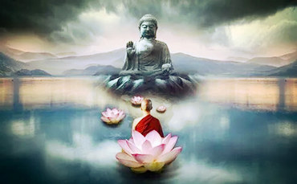

# 【学佛心得】

佛学精深，我以七言，概括五点：

诸行无常有因果，诸法无我有轮回。
凡圣无别同真性，自他皆度共慈悲。

一。无常

无常是佛教的根本，是佛教科学性的体现。

生老病死，成住坏空；宇宙万象，变化无常；

【金刚经】的四句偈是对无常的最佳解释：

“一切有为法，如梦幻泡影，如露亦如电，应作如是观。”

二。因果

诸行虽无常，三世有因果。善有善报，恶有恶报。

因果报应，常不显明，亦需时日。

【传灯录】说，”且善恶之报，有三时焉。“

【二入四行论】讲报冤行， 因为前世恶业，今世才果熟；讲随缘行，因为今生善行，来生才果报。

所以我们既要诸恶莫作，众善奉行，也要安贫乐道，随意随缘。既不可因冤生疑，也不可急功近利。

三。轮回

诸法虽无我，六道有轮回。

【心地观经】说：“有情轮回生六道，犹如车轮无始终。”

【过去现在因果经】说：“贪欲、嗔恚及以愚痴，皆悉缘我根本而生。又此三毒，是诸苦因，犹如种子能生于芽，众生以是轮回三有。”

唯有发慈悲心，行菩提道，除三毒，修六度，才能离生死，出六道，达彼岸，归净土。 

四。平等

【大般若经】说，”上至诸佛，下至旁生，平等平等，无有分别。“

【二入四行论】说， ”含生同一真性“，”无自无他，凡圣等一“，”无有分别，寂然无为“。

真性即是佛性。【涅槃经】说， “一切众生，悉有佛性。如来常住，无有变易。”

对众生，应持无分别心，不论贫富贵贱，皆平等相待。

若有分别心，便染贪嗔痴。摒弃分别心，方得菩提果。

五。慈悲

慈是予乐，悲是拨苦。

【涅槃经】说：“大慈大悲，即为佛性。” 

慈悲是众生佛性之体现，修行之前提。度己度人，必从慈悲开始。

如何把慈悲心落实到日常生活？【无量寿经】讲的最简单明了：“于诸有情，常怀慈忍，和言爱语，劝谕策进。” 

就是说话要和颜悦色，待人要耐心细腻；慈爱容忍，规劝诱导; 晓以事理，鼓励鞭策。

无常，因果，轮回，平等，慈悲，这五个概念紧密联系，一脉相承。前三属于世界观，后二属于人生观。对世界之理解，决定为人处事之言行。

最后以一首七绝总结:

无常深处藏因果，苦因结果即轮回。  
通达彼岸从何始? 平等慈悲智慧随。

