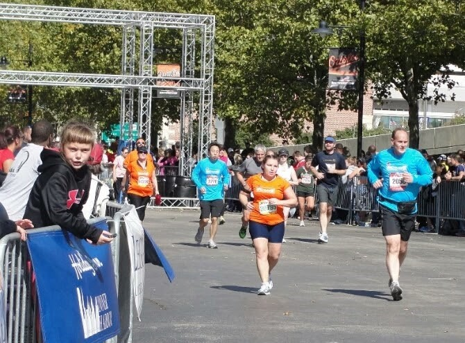

# 【马拉松的挑战】

大家都知道跑马拉松是对人的身体和意志的极度挑战。但是并不是所有人都明白这种挑战不仅仅是在漫长的四十二公里（二十六英里）中。
其实马拉松运动员在站在起跑线之前，就已经经历了无数的挑战，在冲出终点线之后还要面对无数的挑战。

【一】马拉松训练的挑战

马拉松运动员在赛前都要进行四个月的有计划的科学训练。每周跑三到五次不等，从短距离到长距离，从慢速到快速。里程不断增加。
对于业余运动员来说，这四个月不仅是对体力和毅力的挑战，而且还是对日常工作和家庭生活的挑战。
跑步是很费时间的，跑前通常要十几分钟到半小时的准备，跑后要十几分钟到半个多小时的放松。
长程训练，身体疲劳，还要休息恢复。训练过程，常有挫折。不少人在长程跑训练中途都会”撞墙“（这词来自英文”hit the wall“，指体能消耗殆尽，无法继续）。

【二】马拉松比赛前的挑战

海军陆战队马拉松是美国四大马拉松之一。地点在美国首都华盛顿特区。今年(2012年)有来自美国五十个州和世界五十四个国家的三万名运动员报名。
比赛鸣枪是在早上七点五十五分。我一大早四点四十五分就起床，和跑友一起开车半小时到达市区，车库爆满，只好停在附近酒店的车库，然后排长队坐大吧去赛区。
到赛区，还得走十几分钟去寄存包裹。这中间，还得找地方如厕排空。不少运动员情急只好就地在路边树林解决。从起床到起跑线，整整三个小时。起跑前，已经先剥了一层皮。

【三】马拉松赛程的挑战

三万人的马拉松，第一个挑战就是人挤人。跑了大概十五英里，才好转。到那时我开始感觉两个膝盖疲劳，只好把速度降下来。
后面几个英里膝盖实在酸疼，只好走走跑跑。这时就会有消极的想法萌生。一是想为什么要这么受罪。然后就担心膝盖受损留下后遗症。还想以后不再跑全程，干脆改跑半程马拉松。

【四】马拉松跑完的挑战

马拉松的终点线离自己家的啤酒和沙发还有几十英里的距离，而就这几十英里则要花三个多小时。
跑完拿了奖牌，照几张相留影后，还得走一段路去取寄存的包裹，拿了包裹再走一段路去排队坐地铁。
三万人的马拉松，再加观众，总共有十万人参加。大型马拉松也有不方便的地方。做什么都要排队。特别是上厕所，要吗找不到，要吗排长队。
坐地铁要排半小时的队。跑完膝盖酸还得走很多路。回到家后，挑战还没有完。楼梯爬不上去，好不容易爬上去，又下不来。
沙发椅子坐不下去，好不容易坐了下去，又起不来。十分狼狈。打盹睡觉腿还不能弯曲。
 
