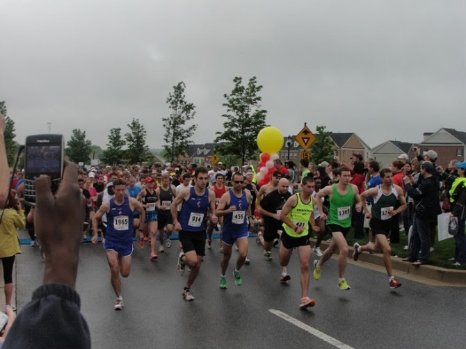
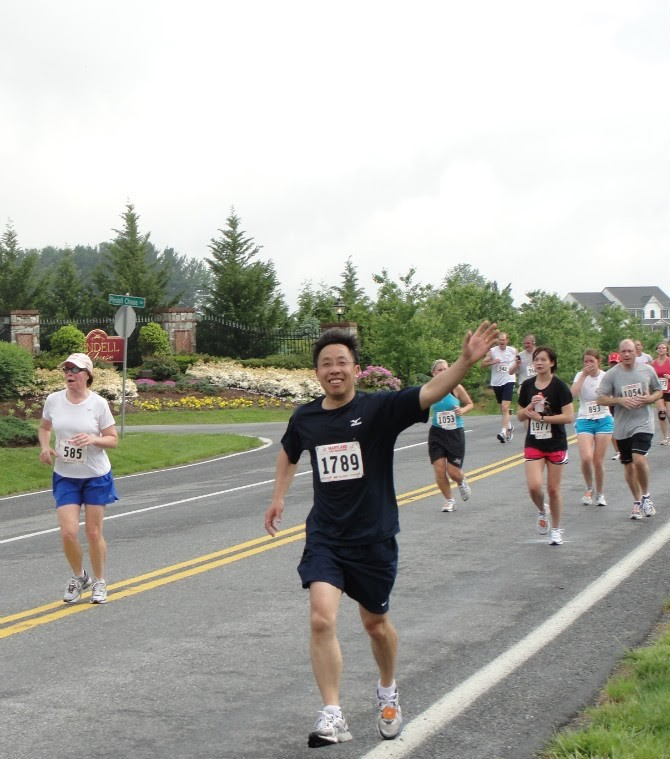
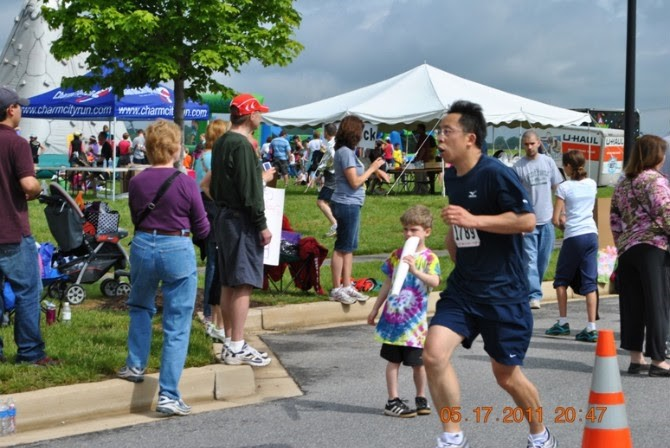

# 【2011年马里兰半马】

今年五月十五日我参加马里兰半程马拉松比赛。这是我的第一个半马比赛，也是我进军全马的一个重要里程碑。

比赛前一天晚比以往提早一个小时睡觉。睡的还不错，就是一直在做梦。做的都是跑步的梦，断断续续的。
梦中赛前换下来的衣服没人拿，只好仍在草地上；还有比赛时忘了穿鞋，赤着脚，干着急。
以为自己赛前不紧张，其实潜意识里还是紧张的。第二天一大早闹钟还没响，就提早半个多小时醒来。
以为自己赛前不激动，其实潜意识里还是激动的。

离鸣枪还有十分钟时，去上厕所，结果队很长，排了一伙儿见没有希望，只好慢跑回到起点等鸣枪了。
排在我后面的是一位美眉，摄影师以为我们是在一起的，就给我们照了合影，我后来到比赛相片网站才知道。
再查一下发现这位女士跑得比我还快，成绩2小时1分21秒。不过她才30岁，有年龄优势。

（图一）赛前偶遇一美眉，留下证据（Proof)

鸣枪前，我观察一下周围，站在我前面的是个男性，站在我左，右和后面的都是女性。
统计一下，两男三女，女运动员占多数，60%。我一直认为女人跑步的比男人多，因为每次看到路上跑步的大多是女性。
后来比赛结束，成绩公布，总共有1662人跑完，其中女性946人，占总数57%，这跟我的土办法统计结果相吻合， 
也证实了我的猜想。看来我当年在克莱登大学的统计硕士学位没有白拿。

（图二）跑在前面的高手们

等到鸣枪，大家都往前冲，我则撒腿朝厕所跑。等我从厕所出来，我所在的2小时20分跑组早已不见了，
我归队后跟上的是2小时40分跑组。接下来就是激动人心的13.1英里。我一直在往前超人，
路途还跟观众不断招手欢呼。到6英里的水站我停下来喝水时，边喝边踢腿伸腰做拉伸运动，
在前面收水杯的志愿者跟我开玩笑说“No dancing”（“这里不允许跳舞”）。

跑到9英里左右经过一朋友家，我朋友带着7岁的女儿和两岁的儿子在门口给我照相，
我就停下来抱着他女儿照了一张，然后又和他坐在推车的小女儿及大女儿又照了一张。
朋友太忙，到现在还没有把相片电邮给我。让我想起自己当年孩子年幼时的辛苦日子。

（图三）八英里的时候还兴高采烈

前十二英里似乎都很顺利，跑得也挺快。跑到最后一英里的时候明显感觉吃力，腿脚有点不听指挥了。
一半是体力到极限，另一半估计是心理作用。人往往在胜利在望时，意志开始放松。
不过最后还是以2小时5分52秒的成绩冲出终点，比预期的2小时20分要快14分钟。1662名运动员中，名列580。

回到家里，我拿着奖牌跟我小儿子炫耀说爸爸拿了金牌，可我儿子既不羡慕也无鼓励，回应说这算什么金牌，
不是跑完的每个人都又一个吗？嗨，孩子长大了，不好哄骗啊。尽管如此，这对我来说是名副其实的金牌。
这辈子，三好生奖状拿过无数张，却从来没有参加过体育比赛，更不用说体育奖状和奖牌了。

（图四）最后1英里非常吃力

我朋友和我开玩笑说，要不是我起跑后一头扎紧厕所，中间停下来又喝水又“跳舞”，还停下来和朋友的女儿照相，
在2小时内跑完是完全可能的。不过，憋着跑，太难受。大自然的召唤，不得不响应。路上留影也是比赛的一种乐趣。
在水站停下来喝水，做拉伸也是为了减轻疲劳，防止损伤。

说来也巧，比赛过程，有一狗在5英里处的一人家里冲出无形电子围墙，跟在跑步人群里，最后跑到终点。
很多人都不知道，以为是哪位带着狗一起跑。这只狗跑得还挺快，到终点是大楷是2小时15分钟。

（图五）这只从家里逃跑出来的狗在做最后冲刺

我在我的年龄组的名次也很巧。40-49岁男子年龄组总共有222人， 我的名次是第111名。111和222，这么巧的数字！

从去年11月的10K比赛，到今年三月的15K比赛，到这次13.1英里半马，循序渐进，不断进步。
接下来四个多月，再接再厉，今年10月份的巴尔的摩全马就胜利在望了。

（图六）我的最后冲刺