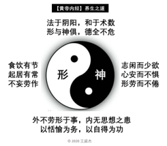

# 【形与神俱 德全不危】

1946年联合国世界卫生组织（WHO）在纽约成立，并在其章程中把健康定义为:

> 不仅是指没有疾病或体不衰弱，而是指生理、心理与社会功能的完好和谐。
>
> Health is a state of complete physical, mental and social well-being and 
> not merely the absence of disease or infirmity。

这种三位一体全方位的健康定义与【黄帝内经】两千年前提出的形， 神， 德整体兼顾的养生之道十分一致。

- 生理 (physical) 指体格，为形;
- 心理 (mental) 指精神，为神;
- 社会 (social) 指品行，为德。

那么，我们如何学以致用呢? 我总结的养生五行，简明实用，与你分享:

- 充足的睡眠 (形) -> 起居有常
- 平衡的饮食 (形) -> 饮食有节
- 适度的活动 (形) -> 不妄劳作 (形劳而不倦) (工作，社交，运动) 
- 阳光的心态 (神) -> 心安不惧
- 慈善的品行 (德) -> 德全不危 (志闲而少欲)  (信仰，道德，人生观)

【黄帝内经】金句：

> 食饮有节，起居有常，不妄作劳。
>
> 志闲而少欲，心安而不惧，形劳而不倦。
>
> 美其食，任其服，乐其俗，高下不相慕。
>
> 外不劳形于事，内无思想之患，以恬愉为务，以自得为功。

