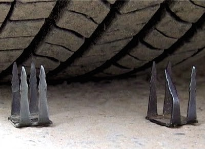

# 【钉子路口】

你知道丁字路口的英文怎么说吗？你要是能不假思索，脱口而出，我就服你了。

昨天我在小区散步，前方开来一辆小车停在我边上。一个貌似印度裔的老先生从车窗探出头来，递出一张纸，指着中间的一行字问我如何走。我一看，这不就是我住的那条街， 往前开，遇到丁字路口左拐既是。我正要回答，发现丁字路口的英文不知道是什么。情急之下就告诉客人“It is not that far。Keep going until you hit the nail then turn left。”  老先生大眼圆瞪，做愕然状。我才明白可能是“hit the nail” （扎到钉子） 把他给吓住了。

我镇定片刻，才想起丁字路口的英文应该是T Section。大写英文字母T长得就像中文丁，字亭亭玉立。唯一区别就是T是赤足，丁则穿高跟鞋。另外我还把钉子误作丁字了，就像花木兰身穿灰甲替爹从军。

旅居海外就是这样，洋文不地道，中文还退步。

