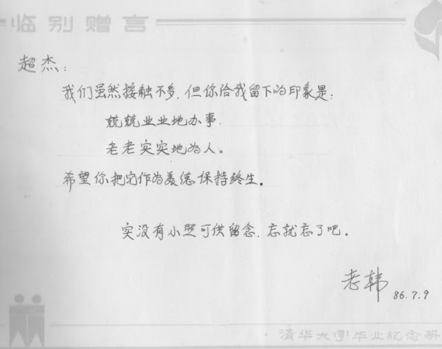

# 【兢兢业业地办事 • 老老实实地为人】

人其实是很渺小的  
人的能力是很有限的  
人的一辈子是很短暂的  
人能做的事是很少的

一天只有24个小时  

9个小时睡觉休息（别忘了入睡前和起床后还要洗漱）  
9个小时上班挣钱（包括上下班在路上的时间）  
3个小时吃喝 （一日三餐，包括买菜，煮饭和清洗）  
1个小时拉撒 

就剩下2小时空余时间  
短短2个小时能做什么?

能照顾好自己, 父母, 配偶和子女就很不错了。  
若有空余, 照顾兄弟姐妹。  
再有空余, 亲朋好友。  
不得了了。

不要听人瞎说你有几亿个脑细胞  
你才用了几个，潜力无穷

不要学那些成功人士  
他们身家千万上亿  
并不是因为他们动用了千万个脑细胞

他们的成功只是利用了  
成千上万人的脑细胞  
和百万千万人的钱包而已

你很普通  
你很平常

你体力有限  
你精力有限  
你脑力有限  
你能力有限  

归根结底  
你时间有限

在这短短2个小时  
请照顾好自己和家人  
请善待你遇到的每一个人

不要异想天开  
不要胡思乱想  
不要眼高手低  
不要头脑发热

请你

兢兢业业地办事  
老老实实地为人

注：图片是三十年前大学辅导员给我的毕业留言。

