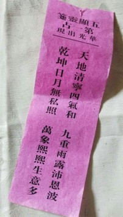

# 【平安胜万钱】

上次打电话回家, 母亲说在五显宫替我抽签, 抽到了第一签【华光出现】, 特别吉祥。
这里的华光指华光菩萨, 也叫五显大帝。

> 五显灵签 ●  第一占 ● 华光出现 
>
> 天地清宁四气和, 九重雨露沛恩波。  
> 乾坤日月无私照, 万象熙熙生意多。

五显宫在老家也叫蒲头宫, 始建于明朝, 是道教的宫宇。宫前有一棵榕树, 已有千年历史。
家乡穆阳古镇虽然不大, 但历史悠久, 人文发达。儒, 释, 道, 基督四教, 汉畲两族及百家诸姓, 互相尊重, 和睦共处。

我第一次去五显宫是在幼小时陪我奶奶去那里拜访她的好友爱莲姑。那时的五显宫很小, 就一个道姑住在里面, 
土墙青瓦, 幽静古朴。爱莲姑还留我们吃午饭。米饭素菜,十分香甜。

这些年五显宫经过扩建装修, 变得金碧辉煌。 加上游人熙攘, 香火弥漫, 已经失去道家清静自然的本色, 十分遗憾。

今仿唐朝诗人孟郊的五律【游子吟】写五绝一首, 以抒游子之情, 书生之怀。

慈母手中签, 游子爱心连。  
半百知天命, 平安胜万钱。

