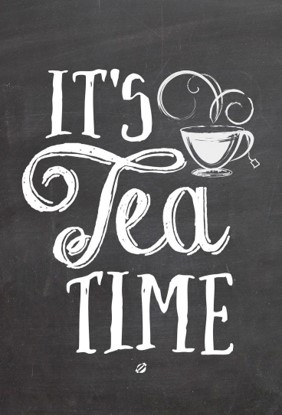

# 【Tea and Time】

Tea and time have something in common. They both begin with the letter "T". 
There is a reason for that. Under that commonality also lies a lesson of life.

To enjoy tea, we need to take time.

First of all, even before the steeping starts, we observe the tea leaves. Leaves from different 
types of tea come in different shapes, texture and colors. The shapes are typically from the delicate hand rolling.
 The majority of the workers in a tea garden are women. Imagine how those beautiful girls and ladies 
 pluck the leaves on a sunny spring morning. After the leaves are dried, they hand roll them to 
 form a certain shape and sort them out at the end. Tea is no longer mere leaves but a form of art from beautiful hands.

Second, you pour hot water into the cup. You don't just sit and wait (and get bored and even impatient). 
Watch the leaves unfold and dance up and down slowly. This "agony of the leaves" is necessary 
for the flavors and nutrients to be released.

Steeping is also about timing. Not too long, not too short. The timing depends on our individual preference in taste.

Finally, we don't gulp a cup of tea as we do with a can of soda. We sip. Before we sip, 
we observe the color and the uprising mist of the liquid. We smell the aroma. 
These are all part of the enjoyment of tea.

It all takes time. All the good things in life take time to brew and to enjoy.

Time is the most precious thing. It is also the most constant thing as well. 
We can't get more of it by rushing it. We could potentially lose it if 
we rush - not only time but also all the great things in life that must be enjoyed with and over time.

A Chinese proverb says it all, "Hurry and impatience prevents the enjoyment of hot tofu."

You may ask, what about the need for speed and convenience?

Yes, they are sometimes our friends. They are the propellers of civilization and evolution 
from nomadic to agricultural to industrial society. Mankind invented automobiles, 
aircraft and spacecrafts to move from A to B faster. Fast foods have become a part of our 
diet in the past decades as more and more families have two working parents and more and 
more people are into sports, travel and adventures. The faster pace of living demands speed and convenience.

But there is a limit. Overdose of speed and convenience can and have already hurt our quality of life.
 Recent years have seen increased health problems such as obesity and cancer. More people and families 
 are suffering from stress of all kinds. Our physical and psychological well being does not improve 
 even though economically we are better off.

It may be time to slow down a little bit and to get back to the basics of life. 
Tea can help in many ways with its powerful healing power and the lesson it 
teaches us about time and timing.

