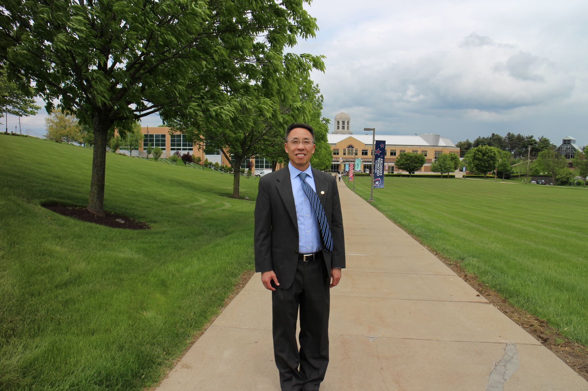

# 【RMU Doctoral Application Personal Statement】

I have been working in the information technology field for over two decades and have held various positions with increasing responsibilities from software engineer, system engineer, and chief engineer to technical lead, project manager, scrum master, and VP of product development. I have worked in both the private sector such as telecommunication, software product development, banking and financial industries and in the public sector supporting federal government agencies including IRS, NARA, SSA, FDA, and FAA. While my work mostly relates to addressing business issues with practical solutions, I am always interested in theoretical inquiries and philosophical thinking. One key aspect of my profession is to apply lessons learned from one domain area to another, one client to another. This requires the skills of generalization and abstract thinking. Some areas of my interests include systems thinking, leadership development and organizational culture. These interests propelled me to pursue a part-time professional MBA degree from Loyola University Maryland in 2008. I finished my MBA program and obtained the degree in 2014.
 
I recently accepted a job offer as a principal systems engineer from MITRE and started my new career on Monday March 21, 2016. Different from my previous employer Lockheed Martin which is a for-profit publicly traded large corporation, MITRE is a not for profit organization and is focused on conducting objective researches on critical national issues ranging from homeland security to cyber security, from defense to healthcare, and providing unbiased advisory to the federal government agencies without conflicts of interests. Instead of implementing solutions and supporting operational systems which have been the major focus of my career with Lockheed Martin in the past ten years, MITRE’s primary mission is to conduct research and development on critical national matters and to advise federal government agencies in defining strategies, selecting vendors and validating solutions. This is a paradigm shift in my career. I will have to deal with more abstract and high level issues and matters. I will have to do more writings, perform more analysis. I will have to do more presentations. I realize that I need to upgrade my research skills in order to excel in my new position and to better serve the government sponsors. Thanks to a former colleague at Lockheed, current colleague at MITRE, current student in the RMU doctoral program, Fred Robinson, I was invited to attend the information session held at Washington Center and also attended the follow-on session at MITRE the following day.  I got to meet Dr. Rota, Dr. Kohun, and Dr. Paulett. I was truly impressed by their enthusiasm about the program and their commitment to the students' success.  A doctoral degree is no longer an abstract goal in my dream. It is attainable and it will be both fun and fulfilling at RMU thanks to the warmth and care they have shown to me and other interested professionals.  
 
I had a Bachelor of Engineering degree in Management Information System from Tsinghua University, a nationally top-rated university in Beijing, China with a strong tradition in science and technology. I also had a Master of Art degree in Economics and a Master of Science degree in Statistics both from the University of Toledo. While these academic studies provide a strong foundation for my pursuit of the doctoral degree, I know that I need to improve the skills of conducting rigorous research both at academic and applied level. I need help from a program that can not only refresh and reinforce what I have already learned but more importantly also teach me research methodology and academic inquiry skills. From my interaction with the three faculty members, I am convinced that they possess the knowledge and techniques and they can guide me through the process. I also take comfort knowing that all faculty members of the program are available all the time, willing and happy to help us. This personal touch is especially valuable for professionals like me who have to balance work and family while pursuing academic degrees. The above national average of the graduation rate of RMU program is a testament of the value of this unique approach.
 
I believe this doctoral program will prepare me for future challenges and opportunities. The cohort, executive style, in-person, on premise program not only accommodates the special needs of working professionals, but also takes advantage of the collective and diversified experiences and wisdom of professionals from all walks of lives. I appreciate the opportunity to be reviewed and considered as a candidate for this great program and am looking forward to the journey at RMU very soon.

