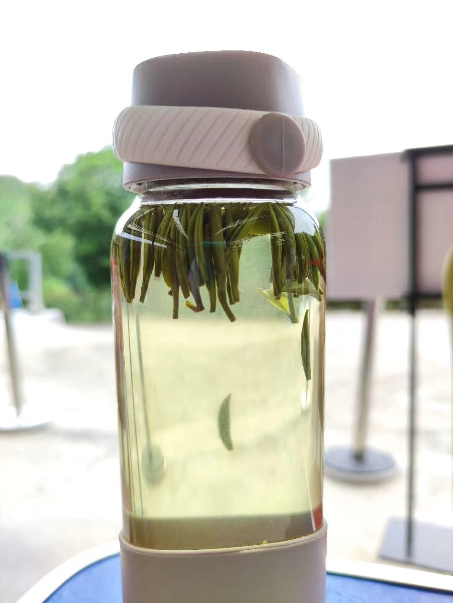

# 古典诗词

## 五绝

### 01 - 如是我闻

（一）
五眼谁为首？金砖你最萌!  
莫学他霸道，发展利苍生。

（二）
入道有多途，无分社与资。  
黑白非对立，灰里蕴真如。

 注：

- “入道多途”出自禅宗初祖达摩的【二入四行论】。
- 汉语成语有“殊途同归”。
- 邓小平有“白猫黑猫论”。
- 西方谚语也有“条条大路通罗马（All roads lead to Rome)”。

### 02 -  【五绝 • 茶】

浮沉自在游，深浅见春秋。  
冷热随冬夏，淡浓禅意留。

注：

每句前面加两字就成七绝：

芽叶浮沉自在游，色泽深浅见春秋。 

清汤冷热随冬夏，香气淡浓禅意留。

### 03 - 闲居

### 04 - 旅居

### 05 - 中秋

### 06 - 父亲节

### 07 - 不亦乐乎

### 08 - 花与雪

### 09 - 赞格律诗

### 10- 加勒比的黄昏

### 11 - 孤帆远影

### 12 - 有感

### 13 - 裁员

### 14 - 读博

### 15 - 无题

### 15 - 贺崔大鹏马拉松BQ

### 16 - 知“足”常跑

### 17 - 情诗

### 18 - 天涯芳草

### 19 - 裸跑

### 20 - 天涯芳草

### 21 - 春

### 22 梦