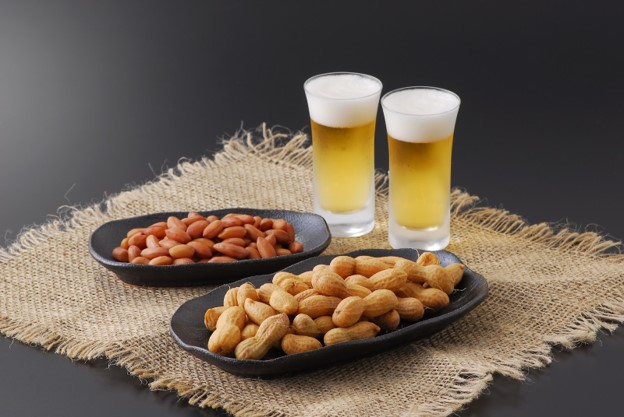

# 【博士班四君子】

同窗四君子，共读三春秋。  
东西两文化，五行一文章。  
德国蹄膀脆，韩国烧烤香。  
都道学习苦，同饮百疲消。

注：博士班四君子，一个美籍德国后裔，一个美籍韩国人，一个美籍马拉西亚人，一个美籍华人，代表东西方两种文化。
我们合作发表了一篇文章，在2019年斯洛文尼亚国际会议上获最佳论文奖。在宾州读书时，我们常去匹兹堡一家德国餐馆。
德国烤蹄膀和德国生啤是我们最爱。常去的另一家是比利时餐馆，它的布鲁塞尔青口（Mussels from Brussels）
和比利时啤酒是我们必点的。四人中两人居住马里兰州，两人居住弗吉尼亚州。我们定期在马里兰州的一家韩国餐馆小聚，吃韩国烤肉，喝韩国烧酒。

