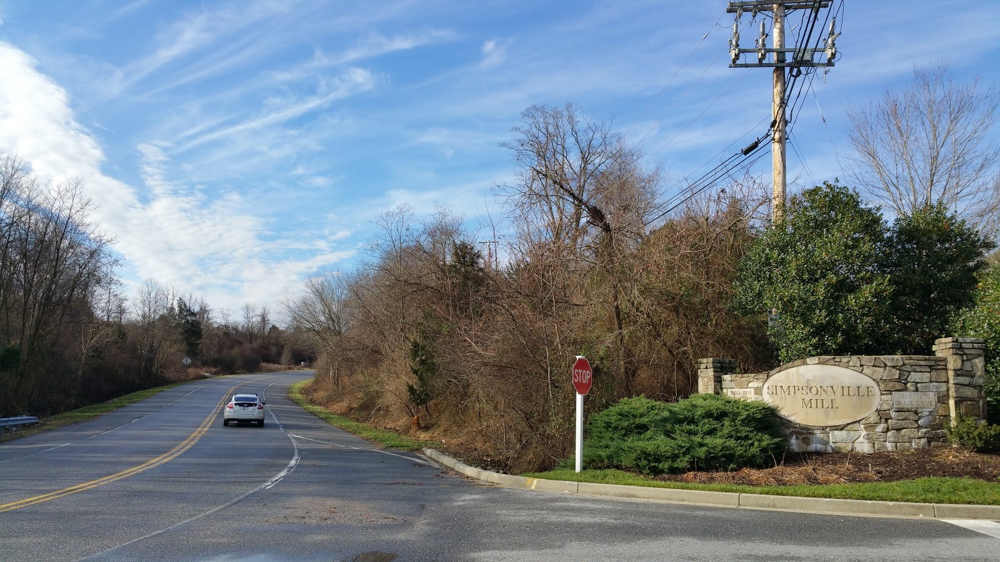

# 【迎接猴年重跑鬼见愁 • 新韵】

三年未上鬼见愁, 岁末重登胆气豪。  
山顶树高花落尽, 天穹云淡雁当头。  
路长坡陡强筋骨, 日暖风轻解旅愁。  
回首当年撒野处, 草丛依旧笑愚猴。

注：

- Grace Drive 这条一英里长的斜坡是我2011年和2012年训练马拉松时常跑的路径。
我管它叫鬼见愁, 一是它又长又陡具有挑战性, 二是在这条路上有过一次意外(由于大自然的召唤)。
- 2012年跑完第二个马拉松后, 膝盖不适, 就再也没有回来过。
今天受知足常跑跑群激励, 为迎接2016猴年, 重跑旧路，重温旧梦。
- 那天群众问撒野详情, 猴哥吱吱唔唔, 羞于启齿, 还好群主解围, 回答大家 “猴哥大闹天宫” 。
真是一言以蔽之。我惊叹领导英明的同时, 暗问: how do you know? (猴肚又闹) 

