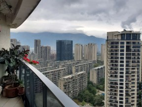
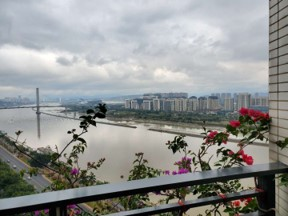

# 【冬日思友 • 新韵】

去年今日此楼中，闽水幽悠梅艳红。  
云厚如棉拥大地，楼高似剑探苍穹。  
白茶啤酒芬芳异，东圣西哲智慧融。  
北美榕城山海阻，归情隐趣道心通。

又: 

【五绝 • 凌霄阁】

去年梅独艳，今日果同香。   
有意人遥远，无风水静长。

【七绝 凌霄阁 • 新韵】

日上东窗觅客踪，云集楼角慕花容。    
江边弱柳丝方绿，前度刘郎意正浓。

附一：缪锐萍【次韵超杰去年今日此门中 • 新韵】

时光忽觉又一冬，门里金兰梅妒红。   
释道有别终不异，身心无染鉴天穹。   
西河东逝天涯远，北雁南回春意融。  
隐趣归情难了却，山呼水应信屏通。

附二: 缪锐萍【凌霄阁美照有感】

东日尚晴天，红梅映眼前。  
凌霄观自在，云水意如莲。

