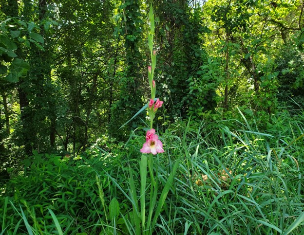

【后院奇葩 • 新韵】

幽林一片绿，野草半枝红。  
无染身心净，怀柔戒忍融。  
拈花佛法妙，触景我执空。  
青帝行菩道，四时禅意浓。

注：
- 戒忍取自佛教修行的六度(也叫六波罗蜜): 布施，持戒，忍辱，精进，禅定，般若。般若空谈易，戒忍实修难。
- 拈花微笑是佛教典故，讲佛陀借花传法，惟独迦叶明白。迦叶因此成为禅宗鼻祖。后来达摩把禅宗传入中国，成为中国禅宗初祖。
- 青帝为古代春神，负责花草树木。唐末农民起义领袖黄巢的【题菊花】写 "他年我若为青帝，报与桃花一处开。"
- 菩道，指弘扬佛法，普渡众生之菩提道，菩萨道。

朋友提示，这枝野花是剑兰。百度一下，大吃一惊。原来剑兰还是名花，与玫瑰、康乃馨、扶郎花一起被誉为“世界四大切花”。

今天花又开几朵，借机每句添两字，五律变七律，不知是画蛇添足，还是锦上添花?

【后院奇葩 • 新韵】

默默幽林枝叶绿，如如野草剑兰红。  
一尘不染身心净，几度怀柔戒忍功。  
无语拈花佛法妙，多情触景我执空。  
若非青帝行菩道，谁赐禅机四季中?  

