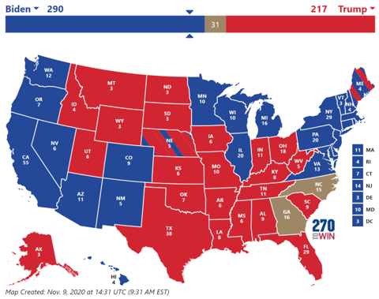

# 【2020年美国选举】

【五绝】

争权双党斗，维利亿民奔。   
成败一张嘴，得失几代人。

注: 美国政治透明，但是依然水深，看不明，更说不清。只好简单化，用20字概括，与2020年对应。

【五律】

争权双党斗，维利亿民奔。  
成败一张嘴，得失几代人。  
红蓝拼火海，摇摆定乾坤。  
民主自由好，为何邦裂分?

注：
- 五绝改为五律，20字加20字，刚好与2020年相呼应。
- 亿民跟：今年有超过1.5亿选民投票，创历史新高。
- 红蓝如火海：红色代表共和党和共和党得胜的州，火的颜色；蓝色代表民主党和民主党得胜的州，海的颜色。火海亦指激烈战场。美国五十个州涂上红蓝颜色，拼成一张貌似火海的地图。拼有两意，拼图和拼搏。
- 摇摆：美国50州，其中有12州历史上在两党之间摇摆，因而最终决定谁输谁赢。

【五律第二版】

争权双党斗，维利亿民跟。  
成败一张嘴，得失几代人。  
红蓝拼火海，摇摆定乾坤。  
左右行相悖，富贫邦裂分。

注：
- 左右：民主党代表左派， 共和党代表右派，两种不同理念。
- 民主党内又细分建制派，进步派，和激进派；
- 共和党内又细分基督保守派，建制派，温和派，自由派，和茶党。

