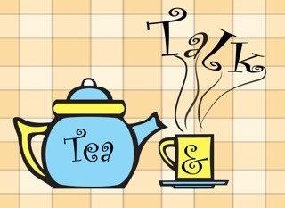

# 【Tea and Talk】

The word "Talk" begins with "T" or "Tea" for the matter at hand. It is not just a coincidence. 
There is a connection between the two. But before I go on to explain the subtle link between 
these two beautiful ingredients of life, let me first "tea" up the topic by talking about talk.

We talk every day. At home, we talk to our spouse, we talk to our children. 
At work, we talk to our colleagues, we talk to our customers. In addition to traditional
face to face talks, we talk virtually through phone, email, and text messaging. 
We not only talk to each other, we talk to ourselves too as we reflect on everyday events,
joys, and troubles.

Like foods and drinks, talk is an important part of our daily life. 
The most distinguishing characteristic that 

separates human beings from the rest is that we are social and live in a society. 
Our survival as well as our happiness and triumph are so much dependent upon the interaction with others and talk is the most used form of interactions we have with each other.

Let's evaluate how effective we are at talking.

I find we are great at opening a talk. We say "how are you?" everyday to everyone, to our neighbors, 
to our co-workers and even to strangers. But I also find that we are not that good at
talking when it comes to the real meaning of talk.

When we say "how are you?" we don't really mean it. We don't look at the person in the eyes and wait 
patiently to listen to his or her response. We don't really care about the answer. Even when we do, 
we don’t have time to pause and listen.

We don't talk much to our spouse, to our children and to our parents. When we do talk to them,
we tend to rush the conversation because we are stressed from our long commutes and 
challenging jobs in addition to mundane day to day chores.

Many of us are sons or daughters as well as parents. We know we should call and talk to our parents on a regular basis. 
But many of us make the calls when we are on the road driving or waiting at the checkout 
line in a grocery store.

Not to mention our poor record of talking quality when it comes to challenging situations 
such as talking to mediate conflicts, disputes and differences in ideas.

Along with unhealthy fast foods, talks have become hasty and unfulfilled.

Tea comes to rescue.

Discovering the many health benefits of tea, more and more people are turning to the green leaves 
for the health of our body, mind and spirit. For the health of our human relationship, 
let's add tea to our talk too.

Tea can calm our temperament down and warm our heart up. Tea can slow down our pace 
and even help us pause when we attempt to rush. Only when we are calm and warm, 
we are able to enjoy the conversation and bring joy to others.

People from Eastern cultures generally are not as expressive as those from Western cultures. 
For example, they hardly show their passion for their loved ones in sentences like 
"I love you." That does not mean they talk less. They actually talk more. 
How can you say less and talk more? Isn't it contradictory? Well, the answer lies in the Tao of tea.

Next time before you pick up the phone and call someone; or when you and your friends get together, 
make a cup or a pot of hot and aromatic tea first. Let the rising mist, the unfolding leaves and 
the soothing liquid  kick off the talk. Infuse the magic leaves into the interactions gradually and 
take the time to brew the conversation slowly. You will be amazed by the results of
 a talk infused with tea through time.

Tea, talk and time are the most powerful trio that works in tandem to 
enrich, enhance and enlighten our lives.

