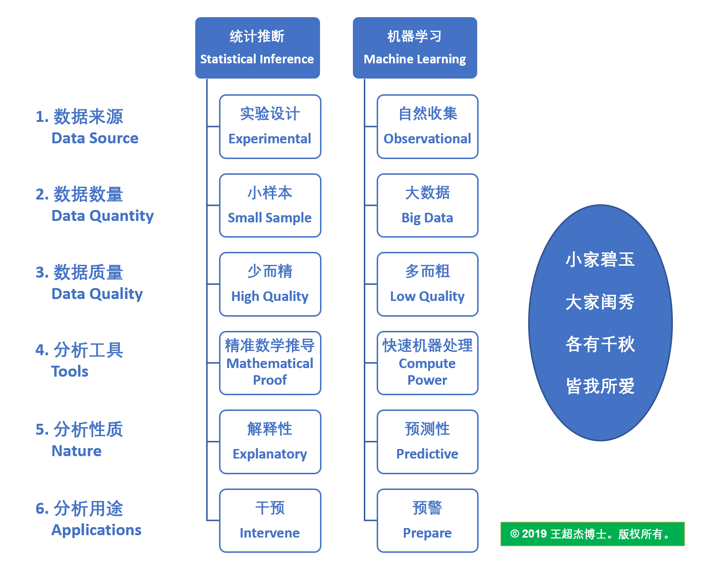

# 【统计推断 vs 机器学习】

俗话说西瓜大的甜，饺子小的香。小样本和大数据两者各有千秋。 我们不能小看小样本，也不能夸大大数据。就如小家碧玉和大家闺秀一样各有魅力，都讨人喜欢。

基于小样本的统计推断是统计学的核心。统计学源于应用数学，至今已有三百多年的历史。

基于大数据的机器学习则是伴随电子计算机的发明而出现，至今也有大半个世纪的历史。
过去十年由于计算机的存储空间和计算能力的指数增长和电子数据的海啸般积累推动了机器学习和人工智能的迅猛发展。

数据科学家既要懂统计学又要懂计算机科学。根据多年工作经验和学习心得冶炼升华形成的这一张图，从六个维度比较统计推断和机器学习，让你一目了然。

