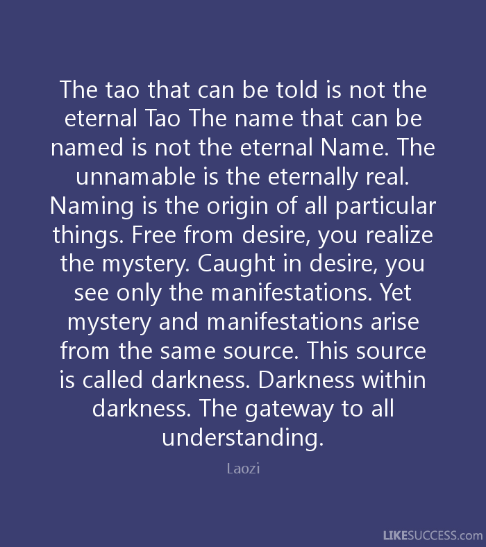

### The Whole
A system can be simply defined as a whole. A system is a whole. Period.

Any additional words or sentences will break the whole. 
The moment we start describing the individual parts within the whole, the relationship and interactions between the parts,  
the relationship and interactions between the parts and the whole, and the relationship and the interactions between the whole and its surroundings, 
the whole shatters and its existence disappears.

The Tao Te Ching（道德经), the classic teachings of the Taoism written 2500 years ago,  
begins with a very short but profound sentence:

> "The tao that can be told is not the eternal Tao" (道可道，非常道).

In Taoism, the Tao is the Way, the Ultimate Reality, or the Ultimate Truth.

In modern concept, the Tao can be thought of the System. 
A system can be a concrete thing as big as the Universe, the Earth, or as small as a human being, a tree, or an ant. 
It can be an abstract thing such as a school of thoughts, a religion, a culture, or a society.

The Tao as the System is a whole. It can not be fully described in words. 
It can not be completely communicated in bits and bytes. 
It has to be experienced. Even the human experience has the limitation of being able to "see" the whole.

Peter Senge concluded his best selling book "The Fifth Discipline: The Art and Practice of The Learning Organization" 
with a short chapter titled "Indivisible Whole" in which he told the story of American astronaut Rusty Schweickart and 
his experience of looking at the Earth from far out in the space.

Rusty Schweickart described his experience:

> “Up there you go around every hour and a half, 
> time after time after time. As you eat breakfast you look out the window and there’s the Mediterranean area, 
> and Greece, and Rome, and North Africa, and the Sinai. And you realize in one glance that what you’re seeing is 
> what was the whole history of man for years- the cradle of civilization.
> And you think of all the history you can imagine looking at the scene.
> ......
> nd that identity – that you identify with Houston, and then you identify with Los Angeles and Phoenix and New Orleans and everything. 
> And the next thing you recognize in yourself, is you’re identifying with North Africa. 
> You look forward to that, you anticipate it. And there it is. 
> That whole process begins to shift what it is you identify with. 
> You begin to recognize that your identity is with the whole thing. And that makes a change.
> 
> You look down there and you can imagine how many borders and boundaries you crossed again and again and again. 
> And you don’t even see ‘em. You know there are thousands of people killing each other over some imaginary line that you can’t see. 
> From where you see it, the thing is a whole, and it’s so beautiful. 
>a nd you wish you could take one from each side in hand and say, “Look at it from this perspective. Look at that. What’s important?”
>......

Peter Senge concluded that:

> Floating in the space, Rusty discovered the first principles of systems thinking. 
> But he discovered them in a way that few of us ever do - not at a rational or intellectual level but at a level of direct experience.

So, the whole is indivisible, indescribable and has to be experienced.

