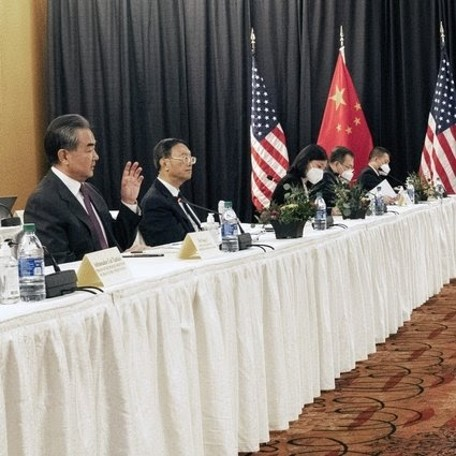

【智慧与智能之较量】

今天把中美谈判一个多小时的视频看完。中方表现十分出色。杨委员和王外长不亢不悲，大智大勇。
他们既有备而来，又临阵发挥。翻译官也是头脑敏捷，话语铿锵。蛟龙镇虎，海内外华人为此扬眉吐气是很自然的。

中美之争表面上看是经济，科技，军事，及制度之争，然而究其深处则是文化之争。
文化多样并互相包容，世界才丰富多彩，和谐平安。文化对立并歧视不容，则纷争四起，杀气腾腾。

这次教量，充分体现了东方智慧和西方智能之别。智慧和智能本是人性之两面，阴阳互补，才有和谐。
中美唯有合作，互相学习，取长补短，世界才能共赢。

我认为中方的强烈反击和美方开场白用多少时间没有关系。我想中方是事先充分就准备好的。
美方在会议前制裁中国官员，访日韩造舆论，等等行径是其中因素。美国国务卿的开场白也被认为是无理挑衅。
另外我想中国也想利用这个难得机会教训一下美国。从来都是美国人给全世界上课。这次，全世界人看中国人给美国人上课。

中方刺激美国痛点后布林肯的回应软弱无力。苏利文搬出土星项目更是牛头不对马嘴。
也反映美国把实力科技当作一切。让我感觉武夫缺德，土豪无识。

当下的所有美国人不论龄多大，他们的生活经验中，美国一直是世界最强大最繁荣的国家。
如里根说的:"美国是山顶上的一座闪亮的城市"。在美国人眼里，他们就是世界的领导者和看护人。
他们的眼睛被这种荣耀挡住，看不到其他国家和人民的多元多样化的生活方式，思维方式和治理方式。
同时他们对其他民族的苦难和挣扎也缺乏悲悯和同情。
这和他们对美国的少数族(黑人，西班牙裔，印第安土著)的压迫和无情是一致的。
美国是发达国家中唯一没有全民医保的。其中一个深层原因就是种族问题。富足的白人不愿意为贫穷的少数族买单。

过去半个世纪的全球化，中国的崛起。美国国内少数族裔人口的增加，要求更公正，平等的待遇和机会。
他们一下子不适应。还想用老一套的做法来统治世界，治理国家。

