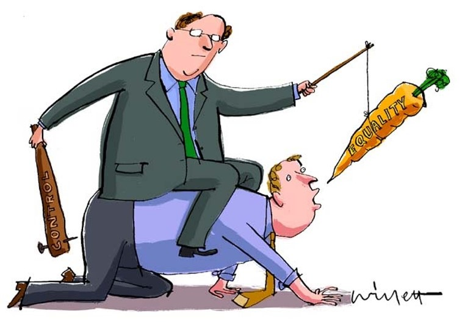

# 【美国的形象】

圣经记载上帝按照自己的形象用泥土创造了人类。

美国自从一战以来发展壮大而成为全球经济强权和军事霸主，似乎也是按照自己的形象来拿捏世界诸国的。

那么，美国是一个什么样的形象呢？

简言之，美国是一个两级对立的国家：富人和穷人；强者和弱者；殖民和土著; 白人和黑人；共和党和民主党；资本家和劳工；华尔街和主街; 政客和平民; 青壮年和老年; 保守派和自由派; 宗教和科学; 有机食品和垃圾食品。不胜枚举，不一而足。总之，这是一块分裂的土地。这里缺乏阴阳和谐，更多的是零一对立。

再看看世界: 北越南越；北韩南韩；北美拉美；大陆台湾。哪里有分裂的痕迹，哪里就有美国的指纹。

那么，美国是靠什么拿捏世界的呢?

简言之，就是萝卜加棍棒(carrot and stick)。一手用号称放之四海而皆准的民主，自由，和人权来利诱，另一手用遍布五洲数百个军事基地的军舰，飞机，和炮弹来威逼。

胡萝卜好歹可以充饥，民主，自由，和人权则貌似水中月，镜中花，和画中饼，令人垂涎，其实是咬了伤牙，吞了致命的硬石块。

阿富汗人民过去二十年来所受的灾难，眼下美军溃逃的混乱，和今后重建的困境，给全球敲了警钟。

包括美国人民在内的世界人民，应当三思，不可不察。

