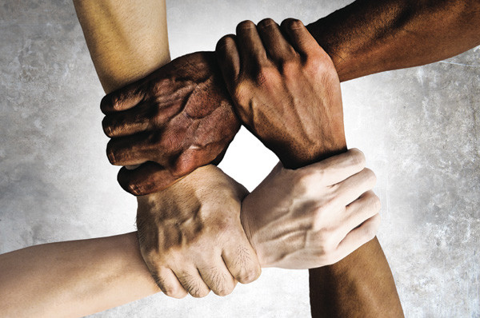

# 【极简世界模型】

地球就三种人，白人，黑人，和黄人。

长期以来，白人骑在黑人背上，黄人在边上伺候。

有一天，黑人受够了，黄人胆大了。他们要求白人下地，大家一起走。

白人不干，就闹起来。

注：已故统计学家乔治·伯克斯（George Box）曾经说过：

> 所有模型都是错的，只是有的有用而已。
>
> All models are wrong，but some are useful。 
